# Grain extension authentication plan

Status: implemented; real-provider and cross-platform acceptance pending
Last updated: 2026-08-24
Depends on: Extension Platform Phase 4 network/secrets and Phase 5 distribution

## 1. Outcome

A scripted extension can declare one or more third-party OAuth connections. The
user connects or disconnects each account through Grain-owned UI. Grain performs
Authorization Code with PKCE, stores tokens outside extension-readable state,
refreshes on demand, and injects an access token only into an approved outbound
request. No token crosses into extension JavaScript.

This is third-party **authorization** for an extension. It is not Grain account
login, publisher authentication, store signing, or the existing extension-to-host
WebSocket authentication.

## 2. Goals and non-goals

### Goals

- Safe delegated access to OAuth 2.0 APIs from tier-B scripted extensions.
- Raycast-class connect/status/disconnect UX with less credential exposure.
- Exact manifest declaration, permission-diff review, and per-extension
  isolation.
- Cross-platform behavior with zero idle listener and no background refresh
  thread.
- A generic provider contract proven against multiple real providers before it
  is frozen.
- Explicit cleanup on cancellation, timeout, disable, uninstall, and app exit.

### Non-goals for v1

- Grain user accounts or extension-store publisher login.
- Client Credentials, Resource Owner Password, or implicit grants.
- Confidential clients or secrets embedded in extension packages.
- Hosted redirect relay, token broker, or provider-secret proxy.
- OAuth device flow, SAML, passkeys, cookie scraping, or browser automation.
- Exposing access, refresh, or ID tokens to extension code.
- Sharing one account connection across unrelated extensions.
- Multi-account UI; the persisted key is forward-compatible with it.
- Tier-A packs (no code/capabilities) or distributed tier-C companions.

## 3. Design invariants

1. **Rust is the credential boundary.** Token material enters Rust from the
   provider and leaves Rust only on an approved HTTPS request.
2. **The manifest is the policy.** Runtime code cannot choose a client id,
   endpoint, redirect method, scope, injection host, or auth id dynamically.
3. **Two independent grants are required.** `auth:<id>` permits use of a named
   connection; `net:<host>` permits the destination. Neither implies the other.
4. **Interactive means visible confirmation.** A worker request can cause Grain
   to offer a connection sheet, never silently launch a browser.
5. **No resident engine.** Refresh occurs just before a request. Callback
   receivers exist only for an active flow. No polling or refresh daemon runs at
   idle.
6. **Scope increases are permission increases.** They disable an update until
   approved and require reauthorization before the new scope is usable.
7. **Fail closed.** Missing secure storage, unverifiable callback state, endpoint
   drift, malformed token responses, and refresh ambiguity never fall back to
   plaintext or token disclosure.

## 4. Author contract

### 4.1 Manifest declaration

Authentication declarations live under `contributes.authentication`; the
matching capability remains in top-level `permissions`.

```json
{
  "permissions": [
    "auth:github",
    "net:api.github.com"
  ],
  "contributes": {
    "authentication": [
      {
        "id": "github",
        "type": "oauth2-pkce",
        "providerName": "GitHub",
        "clientId": "public-client-id",
        "authorizationEndpoint": "https://github.com/login/oauth/authorize",
        "tokenEndpoint": "https://github.com/login/oauth/access_token",
        "scopes": ["read:user"],
        "redirectMethods": ["loopback"],
        "apiHosts": ["api.github.com"],
        "authorizationParameters": {
          "prompt": "select_account"
        }
      }
    ]
  }
}
```

Proposed v1 validation:

- `id` uses the same conservative id grammar as other manifest contribution ids
  and is unique inside the extension.
- `type` is exactly `oauth2-pkce`.
- `clientId`, provider name, endpoints, scopes, and `apiHosts` are non-empty and
  bounded in count/length.
- Endpoints are absolute HTTPS URLs with no user info, query, fragment, wildcard,
  or embedded credential. Authorization and token endpoints may use different
  hosts because real providers do.
- `apiHosts` contains exact DNS hosts only and every entry also appears as a
  `net:<host>` permission.
- A matching `auth:<id>` permission is mandatory.
- `redirectMethods` is an ordered subset of host-supported values. V1 starts
  with `loopback`; `app` is enabled only after the cross-platform packaging gate.
- `authorizationParameters` is a bounded string map. Grain rejects reserved
  security keys including `client_id`, `redirect_uri`, `response_type`, `state`,
  `code_challenge`, `code_challenge_method`, and `scope`.
- Client secret fields are unknown-and-fatal for an auth declaration rather than
  silently ignored.
- Token endpoint auth is `none`; only standard form-encoded public-client
  exchange/refresh is supported in v1.

The signed registry review briefing must show client id, authorization/token
hosts, scopes, API hosts, redirect methods, and changes from the previous
version. A change to any of those fields is an auth permission diff even if the
string `auth:github` did not change.

### 4.2 Host API

```ts
type AuthState =
  | { state: "disconnected" }
  | { state: "connected"; scopes: string[]; expiresAt?: string }
  | { state: "needsReauthorization"; reason: string };

grain.auth.status("github"): Promise<AuthState>;
grain.auth.connect("github"): Promise<AuthState>;
grain.auth.disconnect("github"): Promise<void>;

grain.net.fetch("https://api.github.com/user", {
  auth: "github",
  headers: { "Accept": "application/vnd.github+json" }
});
```

Rules:

- `auth.status` returns non-secret state only. It does not wake a browser or
  refresh a token.
- `auth.connect` always enters a Grain-owned confirmation UI showing extension,
  provider, endpoints, and scopes. Cancel is a normal typed result.
- `auth.disconnect` requires Grain-owned confirmation, removes local tokens,
  emits a connection-state event, and attempts provider revocation only when a
  reviewed revocation endpoint is part of a later contract. Local disconnect
  must not depend on remote availability.
- `net.fetch.auth` is a declaration id, never a token or arbitrary secret key.
- The destination must pass `net:<host>` and also be listed in that auth
  declaration's `apiHosts`.
- Grain owns the `Authorization` header whenever `auth` is present and rejects
  an extension-supplied conflicting header.
- V1 injects standard `Authorization: Bearer <access-token>` only. Providers
  requiring query-string tokens, cookies, request signing, or arbitrary token
  response scripting remain unsupported rather than widening the boundary.

## 5. Runtime architecture

```mermaid
sequenceDiagram
    participant E as Extension worker
    participant H as Grain auth host (Rust)
    participant U as Grain-owned UI
    participant B as System browser
    participant P as OAuth provider
    participant V as OS credential vault

    E->>H: auth.connect(auth id)
    H->>U: Confirm provider, scopes, extension
    U->>H: User approves
    H->>H: Generate state + PKCE S256 + callback
    H->>B: Open authorization URL
    B->>P: User signs in and consents
    P-->>H: Authorization code + state
    H->>P: Exchange code + verifier
    P-->>H: Access/refresh token set
    H->>V: Store token set under extension/auth/connection
    H-->>E: Connected metadata only
    E->>H: net.fetch(url, auth id)
    H->>V: Read one token set
    H->>P: Refresh if near expiry, then API request
    H-->>E: Bounded API response, never token
```



### 5.1 Components

Keep the implementation narrow and attached to existing owners:

| Area | Responsibility |
|---|---|
| `grain-sdk::manifest` | Auth declarations, strict validation, permission and diff shape |
| `grain-core` auth records | Non-secret connection metadata and lifecycle serialization |
| `src-tauri/src/grain_auth.rs` | PKCE, pending flows, callback correlation, exchange, refresh, vault adapter |
| `host_api.rs` | `auth.*` dispatch plus authenticated `net.fetch` injection |
| `grain_commands.rs` | Grain-owned connect/disconnect/status commands for settings UI |
| Extension settings UI | Connection row, scope/endpoints detail, connect/reconnect/disconnect actions |
| Store/review tooling | Auth declaration summary, diff, risk flags, provider acceptance checks |

Do not add an always-running auth service or worker. `grain_auth.rs` owns a small
map only while flows or refreshes are active. Pending-flow and per-connection
single-flight entries are removed on every success/error/cancel/timeout path.

### 5.2 Pending authorization flow

Each flow snapshots the verified manifest declaration and contains:

- random flow id and at least 256-bit `state`;
- 43–128 character PKCE verifier held in zeroizing memory;
- S256 challenge;
- exact extension id, auth id, manifest fingerprint, redirect URI, and start
  time;
- one cancellation handle and one result sender.

The record has a five-minute maximum lifetime. Starting another flow for the
same extension/auth id cancels and cleans the old one. Disable, uninstall, app
exit, or manifest reload also cancels it. A callback consumes the record exactly
once before token exchange, preventing replay.

### 5.3 Callback methods

#### Loopback (v1 default)

- Bind an ephemeral port on literal `127.0.0.1` before creating the
  authorization URL. Evaluate dual-stack `[::1]` during the spike; do not bind
  wildcard interfaces.
- Use an unguessable path in addition to state.
- Accept one bounded HTTP request, require the expected method/path/Host, parse
  only `code`, `state`, and standard OAuth error fields, return a small static
  success/failure page, then close.
- Race callback, cancellation, and five-minute timeout. Cleanup is unconditional.
- The redirect URI used for exchange must be byte-for-byte the one used for
  authorization.

#### App scheme (compatibility gate)

If the provider matrix shows material loopback gaps, add a statically registered
`com.grain.app:/oauth/callback`-style scheme using Tauri deep linking. Integrate
it with Grain's existing single-instance behavior and validate callbacks in
Rust. Scheme/path alone proves nothing; only a matching live flow, state, and
PKCE verifier can complete authorization.

Do not add a Grain-hosted HTTPS redirect in this plan.

### 5.4 Token exchange and refresh

- Use Grain's shared `reqwest` infrastructure with an auth-specific strict
  client policy: HTTPS only, short connect/overall timeout, small response cap,
  no ambient credentials, no cookies, and redirects disabled unless a future
  declaration explicitly and safely models them.
- Send standard `application/x-www-form-urlencoded` requests.
- Parse a bounded standard response: `access_token`, `token_type`, `expires_in`,
  optional `refresh_token`, and returned `scope`. Ignore no security error; map
  provider text to redacted typed errors.
- Require a bearer token type case-insensitively in v1.
- Compare granted scopes with requested scopes. Fewer scopes produce a clear
  unusable/limited result; undeclared extra scopes are recorded for display but
  never turn into Grain permissions.
- Refresh just before an authenticated fetch when expiry is within a small
  skew window. Unknown expiry is accepted but a 401 is not treated as proof that
  refresh is safe.
- One per-connection single-flight prevents concurrent refresh reuse. If the
  provider returns a new refresh token, persist the new token set atomically
  before releasing waiters. If it omits one, retain the previous refresh token.
- On `invalid_grant`, mark `needsReauthorization`, remove unusable access
  material, and stop automatic retries.
- At most one API retry is allowed after a refresh initiated by an explicit
  standards-compliant `invalid_token` response. Never retry non-idempotent
  requests automatically unless no bytes could have reached the server.

### 5.5 Credential vault

Introduce a narrow `AuthVault` interface, not a general secrets engine:

```rust
trait AuthVault {
    fn put(&self, key: &AuthKey, token_set: &SecretTokenSet) -> Result<()>;
    fn get(&self, key: &AuthKey) -> Result<Option<SecretTokenSet>>;
    fn delete(&self, key: &AuthKey) -> Result<()>;
}
```

The implementation spike must compare native OS storage on Windows, macOS, and
Linux and document package size, idle RAM, blocking behavior, Linux desktop
availability, portable-mode behavior, and uninstall cleanup. Expected backing
stores are Windows credential protection, macOS Keychain, and Secret Service on
Linux. Use `spawn_blocking` only around calls proven blocking; do not keep a
vault daemon or token cache alive.

Plain metadata may include extension id, auth id, connection id, provider label,
granted scopes, expiry, status, and vault key. It must never contain access,
refresh, ID, authorization, or verifier material. Token values use zeroizing
buffers where practical and all `Debug`/error implementations redact them.

If secure storage is unavailable, auth fails closed with a remediable error. It
must not fall back to `grain.secrets.json`, extension settings, environment
variables, or extension storage. Portable mode remains machine-bound for OAuth
connections; exports never include tokens.

### 5.6 Lifecycle

| Event | Required behavior |
|---|---|
| Extension disabled | Cancel active flows; revoke runtime token; keep vault entry inaccessible so re-enable is not forced login |
| Extension re-enabled | Status becomes available after grants are restored; no automatic browser flow |
| Permission/auth declaration changes | Install disabled; cancel flows; block old connection until diff approval; require reauth for scope/client/endpoint changes |
| Extension reload | Cancel pending flow tied to old manifest fingerprint; keep completed connection only if declaration fingerprint is unchanged |
| Disconnect | Delete local token atomically; clear metadata; emit state change; best-effort remote revoke only if supported |
| Uninstall | Cancel flows, destroy worker/surfaces, delete all vault keys and metadata in the existing uninstall transaction |
| App exit | Cancel flows, stop listeners, drop in-memory token material; persisted vault remains |
| Vault entry missing/corrupt | Mark `needsReauthorization`; never reconstruct from other stores |

## 6. Permission and user experience

### 6.1 Permission sheet

An auth line must say, in plain language:

> Connect **GitHub** for this extension. Grain will request `read:user`. Sign-in
> happens in your browser. The extension can use the connection only when
> talking to `api.github.com`; it cannot read the token.

Show the authorization and token domains in details. Store review should flag
broad scopes, identity/admin/write scopes, an endpoint/client-id change, auth
combined with transcript or screen capture, and auth combined with native tier.
Provider OAuth consent does not replace Grain consent; they describe different
trust boundaries.

### 6.2 Connection UI

The extension settings section gets a host-rendered connection row:

- provider and extension identity;
- disconnected / connecting / connected / needs reconnection;
- requested and granted scopes;
- expiry only when useful, not a live countdown;
- Connect, Reconnect, and Disconnect actions;
- a details disclosure for endpoints and data handling;
- typed, redacted recovery guidance.

Never start interactive auth during install, enable, app startup, background
activation, or a silent `status` call. A request from an extension must land on
the Grain confirmation first. Visual acceptance uses the real Tauri app and
user screenshots/confirmation; no browser harness or mock Tauri UI is allowed.

## 7. Threat model and controls

| Threat | Control |
|---|---|
| Extension steals another extension's connection | Connection key derives from authenticated channel identity; payload cannot supply extension id; isolation tests use A's token against B |
| Extension reads its own bearer/refresh token | No token-returning API; Rust-only vault and request injection; redact diagnostics |
| Authorization code intercepted | PKCE S256 with per-flow verifier; code single-use; short flow TTL |
| Callback forged/replayed | High-entropy state + random path + exact pending-flow and manifest fingerprint; consume once |
| OAuth mix-up | Provider endpoints are snapshotted from one declaration; verify issuer when supported; do not accept callback-supplied endpoints |
| Malicious endpoint or redirect | Exact HTTPS manifest endpoints; no token-endpoint redirects; signed review diff; no dynamic URL |
| Scope escalation on update | Auth declaration fingerprint participates in permission diff; update remains disabled; reauthorization required |
| Token sent to wrong API host | Both exact `net:<host>` and auth `apiHosts` checks; recheck every redirect; host owns Authorization header |
| Refresh race loses rotated token | Per-connection single-flight and atomic replacement; retain old refresh token only when response omits a replacement |
| Browser opens without user intent | Grain-owned confirmation; no startup/background interactive flow |
| Loopback listener persists or is exposed | Bind loopback only, after user approval; one request/timeout; unconditional cleanup; no idle listener |
| Token leaks through logs/export/crash text | Secret wrapper/redacted `Debug`; sanitize provider errors; token-pattern negative tests; exports contain metadata only |
| Uninstall leaves credentials | Vault deletion is inside uninstall transaction and verified independently |
| Local malware/user-account compromise | Out of scope; OS vault reduces at-rest disclosure but cannot protect a compromised user session |

## 8. Phased implementation

Each phase ends with graph-assisted change review, Rust/TypeScript checks, tests,
and a focused commit. UI phases also end with exact real-Tauri launch commands
and user visual confirmation.

### Phase 0 — compatibility and secure-storage gate

- Prototype `AuthVault` round trips on Windows, macOS, and Linux without wiring
  extensions.
- Measure dependency/binary cost, idle RAM, first read/write latency, failure
  behavior, and portable-mode behavior.
- Test loopback PKCE registration/exchange against GitHub, Google, and one
  rotating-refresh provider. Record required parameters and whether dynamic
  loopback ports work.
- Decide whether app-scheme support is required in v1.
- Produce no public SDK until both gates are answered.

Exit: a short decision record selects vault backend and callback methods; no
token can land in plaintext.

### Phase 1 — manifest and permission contract

- Add strict auth declaration types and validation to `grain-sdk`.
- Add `auth:<id>` capability resolution, labels, risk combinations, doctor
  output, registry briefing, and full auth-declaration diffing.
- Add SDK types and typed errors, but keep methods unavailable.
- Unit-test every reserved field, URL edge, duplicate, missing permission/host,
  scope diff, and tier restriction.

Exit: malformed or escalated declarations cannot install/enable unnoticed.

### Phase 2 — vault and token lifecycle core

- Land the selected `AuthVault` adapter and non-secret record schema.
- Implement token response parsing, expiry skew, single-flight refresh, atomic
  rotation, disconnect, purge, and redaction.
- Use a local mock token server for failure/rotation/concurrency tests; no UI.

Exit: lifecycle tests pass with no extension host API and no resident task.

### Phase 3 — interactive PKCE and callback

- Implement state/verifier generation and RFC 7636 known-vector tests.
- Implement ephemeral loopback receiver, cancellation, timeout, one-shot
  callback, and external-browser open.
- Add app-scheme callback only if Phase 0 selected it.
- Add Grain-owned connection sheet and settings connection row.
- Emit non-secret auth-state events to the relevant extension/settings UI.

Exit: a checked developer extension connects in the real Tauri app on all three
platforms; cancel/timeout/replay leave zero listeners or pending records.

### Phase 4 — authenticated network proxy

- Add `auth.status/connect/disconnect` dispatch with authenticated identity.
- Add `net.fetch.auth`, dual grant validation, vault lookup, on-demand refresh,
  host-owned bearer injection, and bounded error mapping.
- Prove extension A cannot use B's auth id and that tokens never appear in worker
  responses, activity logs, developer panel, or errors.

Exit: the acceptance extension calls a real provider API without ever observing
the token.

### Phase 5 — distribution and lifecycle integration

- Wire auth declaration diffing into install/update review and store risk lanes.
- Wire disable/reload/uninstall/app-exit cleanup into existing extension
  transactions.
- Add author documentation, provider registration instructions, errors, and a
  complete checked example.
- Add permission/card/settings UX and accessibility/i18n strings.

Exit: install, connect, update-with-scope-change, reconnect, disable/enable,
disconnect, and uninstall work end to end.

### Phase 6 — hardening and freeze

- Run the negative test matrix below on Windows/macOS/Linux.
- Measure idle RAM before/after connecting and after flow cleanup; target no
  persistent worker/listener and negligible metadata-only overhead.
- Review against RFC 8252 and RFC 9700, then freeze `grainApi` auth v1.
- Promote provider presets only after two independent real extensions repeat the
  same boilerplate.

Exit: security review has no unresolved token exposure or cleanup issue and API
v1 documentation matches implementation.

## 9. Verification matrix

### Pure/contract tests

- RFC 7636 S256 known vector; verifier length/entropy.
- Manifest URL, scope, count/length, reserved-key, tier, permission, and host
  validation.
- Auth declaration fingerprint and permission-diff behavior.
- Redacted `Debug`, serialization, typed error, and diagnostic snapshots.

### Callback tests

- Correct callback; denial; wrong/missing state; wrong path; duplicate/replay;
  oversized request; malformed encoding; callback after timeout/cancel/disable;
  two extensions authorizing concurrently.
- Listener binds loopback only and is gone after every terminal path.
- App-scheme fake argument and second-instance delivery if that method ships.

### Token tests

- Initial exchange; missing/invalid token type; bounded malformed response;
  expiry skew; refresh with and without rotated refresh token; `invalid_grant`;
  ten concurrent calls produce one refresh; vault unavailable/corrupt/missing.
- No token substring in settings JSON, extensions JSON, extension storage,
  stdout/log capture, error JSON, developer activity, exports, or worker frames.

### Network/isolation tests

- Missing `auth:<id>`; missing `net:<host>`; host not in `apiHosts`; extension A
  attempts B's connection; extension-supplied Authorization conflict; redirect
  crosses host; token endpoint redirects; request timeout/size limits remain.
- No automatic replay of a non-idempotent request after an ambiguous failure.

### Lifecycle and performance

- Disable/enable, manifest reload, permission update, disconnect, uninstall, app
  exit, and crash-restart metadata reconciliation.
- Worker/token counts return to baseline; pending-flow map and listener count are
  zero; idle RSS returns to pre-flow noise band.
- Real-app manual visual review on all supported platforms; no browser UI
  automation or alternate visual harness.

## 10. Rollout and compatibility

- Guard the unfinished API behind developer mode until Phase 5 acceptance.
- Store packages cannot declare auth until the signed review pipeline understands
  the full declaration fingerprint.
- Existing manual API-key extensions continue using write-only `secret` settings
  and `net.fetch.secret`; no migration is forced.
- A provider that requires a confidential client secret is documented as
  unsupported. Authors may offer a PAT field as a separate explicit fallback;
  Grain never labels it OAuth.
- If a future hosted broker is approved, it becomes a new redirect/token-exchange
  method with a separate trust disclosure. It must not silently change existing
  local-only declarations.

## 11. Confirmed defaults

Confirmed on 2026-08-24:

1. **Secure-store failure:** recommended — fail closed when the OS credential
   vault is unavailable, including Linux sessions without Secret Service. Do not
   fall back to the existing plaintext credential file.
2. **Provider compatibility:** recommended — v1 supports only public-client PKCE
   providers. Do not operate a Grain-hosted client-secret proxy yet; keep PAT
   settings as the explicit fallback.
3. **Account cardinality:** recommended — one active connection per auth
   declaration in v1, while persisting a `connection_id` so multi-account can be
   added without a storage migration.

## 12. Definition of done

Authentication v1 is done only when a store-installable scripted extension can
connect, call, refresh, reconnect, disconnect, update scopes, disable/re-enable,
and uninstall on Windows/macOS/Linux; no extension-visible value or diagnostic
contains token material; no callback listener or task survives its flow; the
idle-RAM measurement returns to baseline; and the user has visually approved the
real Tauri connection experience.
