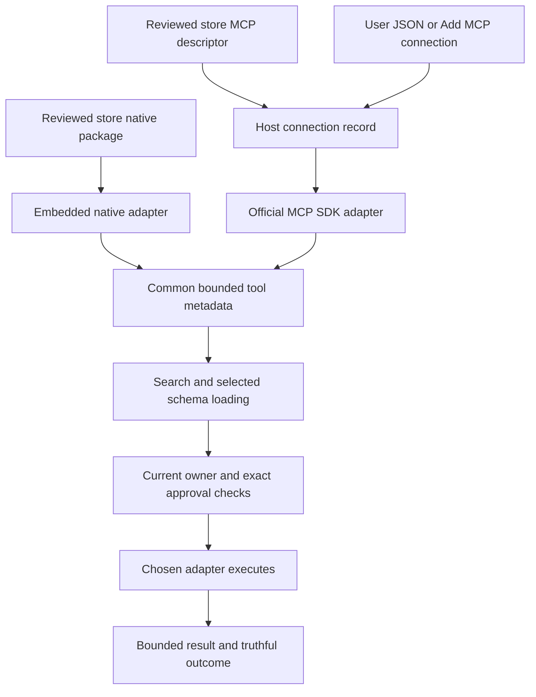

# Extension ecosystem: delivery scope and blast-radius audit

**Date:** 3 October 2026. **Source baseline:** `093cf635`, branch `extensions/tool-only-retirement`. **Status:** planning and source audit; no product changes, deployment, deletion or new acceptance results. This is an initial ecosystem assessment, not the final security audit or a frozen public specification.

Companions: [forward execution order](MCP-EXTENSION-REUSE-EXECUTION-PLAN.md), [product requirements and R0–R6 gates](MCP-EXTENSION-PLAN.md), [progress and test ledger](MCP-EXTENSION-PROGRESS.md), [maintained real-app harness](AGENT-TEST-HARNESS.md).

**Local registry clarification:** the [focused repository/publishing audit](LOCAL-EXTENSION-REGISTRY-AUDIT.md) resolves the source-access limitation using `grain-extensions/`, a separate checkout of `Punit-Dethe/Grain-Extention` at `af6e244…`. The correct remote is accessible; the previous 404 names the app's different bootstrap repository. Source and read-only GitHub metadata establish incomplete CI, failed publish runs, no releases, legacy catalog entries and missing release protections. E4 now has concrete requirements rather than an inaccessible-source prerequisite. No nested repository files or GitHub settings changed; existing dirty state is preserved, with no new acceptance Pass.

## 1. What this changes in the plan

The tested runtime is a foundation for an extension platform. It is not yet the complete developer and user product. Public authoring, distribution, custom connections and management must be designed together before Grain promises a stable extension contract. Earlier B6's single “freeze the contract” item understated that work.

The user confirms the tools-only boundary and asks for this broader assessment before production. Keep the existing native worker, MCP SDK, OAuth library, vault ownership and execution checks. Continue retiring access at validation and dispatch boundaries. **Physical removal of obsolete capabilities, wrappers or the external extension repository remains on hold.** Do not delete a repository because its old submissions are incompatible.

Use two ways of acquiring integrations:

- **Store:** install a reviewed native Grain tool extension, or a reviewed descriptor for an existing MCP server.
- **Custom MCP:** configure a server directly, without authoring, packaging, publishing or maintaining a Grain extension repository.

Both feed the same host-owned discovery, account, approval and lifecycle policies. A custom connection has no store verification badge. A store descriptor does not make a mutable remote server immutable or grant it extra authority.

This amendment supersedes contradictory broad-capability authoring instructions in the older Extension Platform/V1/2.0 documents. It does not waive existing release gates or authorize new capabilities. Native here means Grain's embedded tool implementation; the old manifest's `Tier::Native` means a companion executable and remains rejected.

## 2. Inspection scope and limits

Graph-first exploration covered the task overview, architecture and two semantic searches. The graph had no useful indexed results for SDK/CLI/publishing/configuration ownership, so relevant source and existing audits were inspected directly. Missing graph nodes do not establish a small blast radius. The following findings distinguish observed source behavior, proposed design and unresolved verification.

The audit covers this application's SDK/CLI/checker, package/catalog producer and consumer, developer MCP catalog, management views and maintained acceptance records. It does not certify a shipped binary or external publishing CI.

**Repository identity resolved:** `crates/grain-core/src/trust.rs` names `https://github.com/Punit-Dethe/grain-extensions/releases/download/v1/` as its bootstrap; that lookup returned 404. The user identified the local `grain-extensions/` checkout, whose accessible remote is `Punit-Dethe/Grain-Extention` and whose signed roots instead name a raw GitHub base URL. The [focused follow-up](LOCAL-EXTENSION-REGISTRY-AUDIT.md) maps workflows, current submissions, legacy artifacts, actual missing protections and failed release status. Source access is resolved; production key custody, corrected full serving paths and successful protected publishing remain uncertified. This discrepancy is not evidence of deletion. No registry file or administration setting was changed.

**Production exposure prerequisite:** hosted MCP commands explicitly require Extension Developer Mode. This branch also contains an Extensions navigation route and a native extension host started with the application. The user's intention to keep the unfinished platform out of production is a release requirement; source presence does not prove what a shipped artifact exposes. Verify ordinary release-build navigation, direct Tauri/IPC access, startup and distribution before lifting the gate. Do not rely solely on hiding a page.

## 3. Current state and disposition

Paths below are repository-relative inspection anchors, not assertions that every retained branch is reachable. Earlier focused runtime audits remain the evidence for actual execution behavior.

| Area / inspected anchor | Observed state | Planned disposition |
|---|---|---|
| `crates/grain-sdk/src/authoring.rs` | The `grain` API already contains tools, logging, own storage, brokered network and host-owned authentication metadata. It contains no screen/selection/Space/prompt API. | Keep the small surface; settle exact arguments, results, errors, cancellation and own-service configuration before public versioning. |
| `crates/grain-ext-cli/src/lib.rs` | `init/dev/doctor/pack/submit` exist; init emits a tool-only embedded project and permitted capability union. It also reflects the complete internal `DaemonEvent` into `grain.d.ts`. | Refine the existing CLI; stop advertising internal events to tool authors. Add a separate MCP descriptor path rather than forcing a JS runtime. |
| SDK declarations, CLI `entry_source`, `src/app/extension-runtime.ts` | Declarations accept plain title/body results; the scaffold returns an `ok` envelope; runtime accepts plain or tagged results and supplies an additional idempotency context argument. | Audit and reconcile these author-visible shapes. Compile and execute generated examples; a working JavaScript hello is not complete TypeScript contract parity. No runtime fix is claimed by this audit. |
| `crates/grain-sdk/src/lib.rs`, `event.rs`, `protocol.rs` | The shared leaf crate contains internal daemon/pill transport types as well as authoring/distribution types. | Separate public exports/generated author types from internal wire types. Do not delete internal ASR/pill contracts merely to shrink the author SDK. A module boundary may suffice; a new crate is not automatically necessary. |
| `crates/grain-sdk/src/manifest.rs` | Broad historical fields/tier names remain; `validate_tool_only` rejects retired declarations, event activation, contributed settings, contextual actions and executable companions. | Keep refusal/migration parsing; introduce a small explicit tool/descriptor contract with a versioned compatibility adapter. Unknown authority-bearing fields must not silently become allowed. |
| `crates/grain-extension-checks/src/lib.rs`, `crates/grain-core/src/pack.rs`, `install.rs`, `extensions.rs` | Doctor, pack, developer and installed validation enforce the tools-only boundary. Legacy diagnostics/types are still present. | Reuse validators and transactional ownership; make schema/version decisions consistent at init, doctor, pack, CI, import, update and dispatch. Improve stale diagnostics without reopening old features. |
| `crates/grain-ext-cli/src/lib.rs::submit_project` | Submissions write pinned source repo/tag/commit metadata and a README into a registry checkout. This is a source-pointer workflow, not direct unsigned upload. | Retain the reviewed source workflow where appropriate. Add descriptor/display metadata, structured serialization and ownership checks. Audit escaping, traversal, IDs and tag/commit agreement. |
| `crates/grain-registry-tools/src/main.rs`, SDK `distribution.rs` | Producer and catalog still collect/hash README and media, carry tiers/legacy `extends`, and publish signed records. | Version metadata and producer/consumer migration together. Replace README-as-description with a defined listing document; preserve hashes, rollback and revocation. |
| `crates/grain-core/src/trust.rs`, `seed/`, `src-tauri/src/grain_store.rs` | Signed roots/index/revocations, artifact hashes, offline rules and bounded lazy content loading exist. | Keep these controls. Verify production key custody, root rotation, catalog bootstrap and incompatible-client behavior; a new format must not weaken verification. |
| `src/app/pages/ExtensionsPage.tsx`, `src/app/extensions/extensionRuntime.ts` | Detail content displays README; retained routing/types still describe older contributions. Settings contributions are refused at the manifest boundary. | Redesign the information model around tools, account, own configuration, provenance and listing content. Type presence alone is not proof that an old control is active. |
| `src-tauri/src/grain_mcp.rs` | Static six-provider development catalog; short-lived HTTPS SDK clients; provider-ID settings/vault keys; 128-tool per-provider discovery limit. | Generalize to explicitly owned connection records. Arbitrary user JSON endpoints and store-installable MCP descriptors are not established as supported by these catalog tests. |
| Agent / `capability_agent.rs` / `action_exec.rs` / `execution.rs` | Selective metadata search/loading, exact approvals, generation checks and honest uncertain results exist and have focused tests. | Preserve the execution boundary; later measure retrieval/task effectiveness at scale separately from its mechanical correctness. |
| `tests/agent-harness/` and focused audit records | Real app, isolated profiles, controlled native/MCP providers, live/model opt-ins and cleanup evidence exist. | Extend this harness by module. Keep production-logic tests separate; do not add a second visual app or speculative testing engine. |

**Documentation risk:** locally present `docs/Extension Platform/SPEC.md` still calls its older broad contract normative; that directory's README/distribution plan and the older Extensions 2.0 plan describe retired powers. The three Extension Platform files are ignored and absent from the Git index in this checkout; they are preserved, not newly committed as thousands of lines of obsolete specification. This amendment and the tracked Extensions 2.0 plan now establish the supersession boundary. Redirect/rewrite published author-facing documentation and examples in E3, preserving migration references. A newcomer must not implement an obsolete contract because its header says “current.”

## 4. Reference check and what to borrow

Primary sources were checked on 3 October. Popularity was used to find established references, not to infer safety or choose a framework. API star snapshots: Goose 54,884; OpenCode 211,530; Kilo 27,475. These are dated counts, not a ranking of all hosts. Goose's repository/docs now use AAIF; older Block documentation URLs failed in this session.

| Reference and reproducible snapshot | Relevant finding | Grain decision |
|---|---|---|
| [Goose configuration guide](https://goose-docs.ai/docs/getting-started/using-extensions/), [pinned guide](https://github.com/aaif-goose/goose/blob/591edd47cf2cfea4957d720c607cf2a4def8673d/documentation/docs/getting-started/using-extensions.md), [adapter enum](https://github.com/aaif-goose/goose/blob/591edd47cf2cfea4957d720c607cf2a4def8673d/crates/goose/src/agents/extension.rs) | Directory and custom server paths coexist; configurations distinguish transports/built-ins and can reference stored preregistration secrets. | Borrow separate acquisition and secret references. Do not copy OS-control, prompt injection, automatic enablement or local subprocess privileges. |
| [OpenCode V2 MCP guide](https://opencode.ai/v2/docs/mcp-servers/); repository snapshot `907b3bc518fa48e90e8ec24dd327d13eee71c36c` ([adapter](https://github.com/anomalyco/opencode/blob/907b3bc518fa48e90e8ec24dd327d13eee71c36c/packages/opencode/src/mcp/index.ts)) | Named JSONC servers, explicit auth/logout and separate credentials. Same-name project overrides replace a whole object. V2 syntax differs from older documentation. | Borrow understandable management; specify Grain identity/import precedence explicitly. Do not copy project auto-start, broad protocol features, Code Mode or long execution defaults. Live V2 docs are distinct evidence from the pinned repository snapshot. |
| [Kilo configuration/management](https://github.com/Kilo-Org/kilocode/blob/76bcfd40be616a72f4697b3041565f322245b462/packages/kilo-docs/pages/automate/mcp/using-in-kilo-code.md) | UI and file configuration, enable/disable/delete and auth/logout/debug. CLI and editor variants have differing examples. | Borrow common UI/config operations. Avoid plaintext-secret examples; do not treat one host's JSON as the protocol's universal schema. |
| [VS Code MCP management](https://code.visualstudio.com/docs/agent-customization/mcp-servers) | Gallery and manual server configuration; input/variable references; explicit trust behavior. Workspace trust can allow configured servers to start, including after edits. | Borrow discovery plus custom configuration and useful diagnostics. Grain should require review of material connection changes and retain demand-driven lifetime. |
| [MCP authorization, 2026-07-28](https://modelcontextprotocol.io/specification/2026-07-28/basic/authorization) | HTTP authorization separates resource discovery, client registration, scopes and tokens. Registration supports metadata documents, preregistration and compatibility DCR. | Continue official SDK handling with Grain-owned vault/issuer/resource/generation checks. No universal Grain author API key is implied. Public HTTPS client metadata hosting remains a prerequisite. |
| [MCP Registry overview/security scope](https://modelcontextprotocol.io/registry/about), [pinned server metadata](https://github.com/modelcontextprotocol/registry/blob/bf4e88cbe8d1a635c06144ccea1d24cb52fa6186/docs/reference/server-json/generic-server-json.md), [publisher authorization](https://github.com/modelcontextprotocol/registry/blob/bf4e88cbe8d1a635c06144ccea1d24cb52fa6186/docs/reference/api/registry-authorization.md) | Registry metadata points to packages/remotes; namespace authentication is separate from code scanning and downstream curation. | Optional future descriptor import/reference. Do not replace Grain's signed, reviewed catalog with raw upstream metadata or operate another registry service merely to add custom endpoints. |
| [Anthropic tool search](https://platform.claude.com/docs/en/agents-and-tools/tool-use/tool-search-tool) | Deferred schema loading is a documented pattern; client-side search is also possible. | Use this as an evaluation reference, not a promise of the vendor's savings in Grain. Keep discovery portable across model providers; no code-execution feature is required. |

These sources support reuse of protocol/auth libraries and small host-specific integration. They do not settle Grain's public schema, marketplace trust wording, description filename, settings design or release quality. Those are product decisions requiring Grain tests. No new framework/library replacement is selected by this pass.

## 5. Distinguish the interfaces and credentials

| Term | Owner and purpose | Public contract |
|---|---|---|
| Author API/SDK | Native tool author's functions, typed inputs/results and minimal host services | Small versioned interface; no developer account or universal API key needed to write a local extension. |
| MCP server interface | Server developer's standard MCP implementation | Use an ordinary MCP SDK. Grain consumes supported tools through a descriptor or custom connection; it need not inject its JS SDK into the server. |
| Service API key / OAuth grant | User's account on Linear, GitHub or another service | Connection-scoped OS-vault credential. Never include the value in a package, listing, export, evidence or worker response. |
| OAuth client registration | Grain/application registration with a particular authorization server | Public client ID is not a user token. Any confidential secret has separate vault ownership and issuer binding. Desktop packages cannot safely conceal a shared confidential client secret; see [RFC 8252 §8.5](https://www.rfc-editor.org/rfc/rfc8252#section-8.5). |
| Developer control token | Existing local CLI-to-Grain development channel | Local scoped pairing/control credential, not authority for all services or a marketplace identity. Keep its current boundary and cleanup. |
| Publisher identity / catalog signing | Submission ownership and Grain's reviewed release | Separate GitHub/namespace proof, reviewer decision and protected signing keys. An author's manifest cannot award its own trust badge. |

API keys, OAuth, development pairing and publication solve different problems. Do not combine them into a new global Grain authentication service.

## 6. Provisional common architecture

This is an ownership map, not a new engine. Prefer typed data and existing inline boundaries. Acquisition source, adapter kind, transport, instance/account and trust are distinct fields, not more runtime tiers.

### Identity and update semantics

Define one stable opaque connection ID per configured instance, separate from its editable display name, publisher/package ID and endpoint. Each instance has one active account; two independently configured MCP instances may point at the same service without sharing grants. Native multi-account UX is a separate scope decision, not silently included.

Bind runtime tickets/approvals to the current definition/source digest, configuration generation, resource/issuer/client identity and account generation. Renaming a label should not silently change accounts. Changing an endpoint, credential reference, scope or relevant definition must invalidate old approvals and require the appropriate re-review; it must never move old secrets to the new server. A store update cannot replace a custom connection merely because their names match.

Determine before freezing the schema: migration from six hard-coded provider IDs; default account behavior; duplicate aliases/case normalization; storage/secret ownership; descriptor version versus live MCP tool digest; supported schema dialects/results; trust changes; uninstall versus logout; update/rollback; absent or incompatible servers. Preserve archive/refusal paths for old installations without reactivating them.

### Native author surface

Start with the existing tools API, own storage, bounded logs, declared network access and host-mediated account metadata. Confirm which are necessary rather than adding convenience APIs. Tool handlers receive explicit validated arguments, never ambient screen/selection/application context. Where a task needs context, the Agent obtains it and supplies only task-relevant arguments through its normal policy.

Define success, provider error, unavailable-before-dispatch, cancellation and uncertain-after-dispatch outcomes. Do not claim rollback or safe replay of writes. Decide supported structured results and idempotency context deliberately; align declarations, scaffold, bridge, Rust validator and author documentation. Arbitrary rendered UI, prompt changes, hooks into recording/core settings and new companion executables remain excluded.

### MCP descriptor surface

A store MCP entry normally needs metadata plus a connection/setup descriptor, not a wrapper server or synthetic JavaScript tools. Live tool schemas come from the MCP server within Grain's bounds; static descriptor review cannot freeze that server's future behavior. Package identity and reviewed content remain verifiable, while current tools/scopes/account are independently checked.

Remote HTTPS is the first transport. General local stdio is a separate future process-security milestone: command/argument boundaries, explicit launch consent, environment/secrets, process-tree ownership, timeout/crash cleanup and OS-specific evidence. JSON import must not execute `npx`, a shell command or an install script. Do not advertise stdio support before that milestone.

## 7. Custom MCP configuration and authentication

Custom remote configuration should be included before freezing the public platform contract. It can be implemented after the narrow authentication improvements; it must not be forgotten until a post-release redesign. Support private/unlisted servers without requiring a public catalog entry. Their networking rules still need an explicit product decision.

Recommended first workflow: **Add MCP → URL or import JSON → validate and show a preview → explicitly save/enable → connect or provide a vaulted service secret when needed → harmless connection test → make tools discoverable.** Saving, enabling, authenticating and executing are separate decisions. The test must not invoke an arbitrary tool. Enabling alone starts no resident client or worker and creates no automatic sign-in loop.

Define a bounded versioned Grain JSON schema, with nonsecret fields and opaque secret references. Prefer one persisted connection model used by UI and file import. Initially use explicit import/export and editing; do not add an always-running watcher or multiple overlapping sources of truth. Unknown versions/fields, duplicate IDs, malformed JSON and forbidden fields get actionable diagnostics and leave the old configuration intact. Export omits vault values. If ongoing editable-file support is later added, specify atomic writes, invalid-edit rollback, deletion, precedence and conflict behavior first.

There is no single industry JSON schema: Goose uses YAML, OpenCode V2 has `mcp.servers`, Kilo uses its own variants and VS Code accepts named formats. Optional imports should identify the source/version, normalize only supported fields and preview omissions; never accept arbitrary commands just because another client's file contains them.

The common connection layer must cover no-auth, HTTP MCP OAuth and explicitly configured API-key/header credentials. Require bounded allowed headers/secret injection rules; reject credentials embedded in URLs and prevent redirect leakage. Do not use “OAuth off” as a catch-all bypass. Reuse the SDK for compliant MCP authorization, with explicit preregistration or metadata-document fallback where appropriate. Providers may still require their own registration, app review or consent; do not promise universal one-click sign-in.

Before allowing arbitrary endpoints, extend the current catalog-only security model: URL normalization/userinfo rejection, TLS, metadata discovery/issuer/resource validation, DNS/private/loopback/link-local rules, redirect policy and credential destinations. Decide explicit support for local/private HTTPS separately from public endpoints; do not copy the harness's localhost TLS exception into production. Test redirects and changed metadata, not only the initial URL. Reject any configuration route to screen/context/prompts, sampling/elicitation, dynamic UI or unsolicited provider commands outside the chosen compatibility profile.

Classify account-required, reauthorization-required, temporary network failure, unsupported registration, vault unavailable and disabled separately. A stored credential is not a health guarantee. Temporary failures must not discard a usable account; repeated background login is unacceptable. On normal token expiry, refresh should happen within the owned operation when supported. Reconnect is appropriate when the grant is revoked, lacks renewal support or renewal is refused; controlled refresh evidence does not close live Linear expiry check 12.

## 8. Store, detail pages, settings and content

The store is discovery and installation. The installed/connections view is management. Show source (store/custom/developer), implementation (native/MCP), current enablement, account state and explicit diagnostics. A custom connection appears here without fabricated publisher reviews, screenshots or popularity. Exact labels/layout remain a later UI design decision requiring real-app visual approval.

Retiring extension-owned settings does **not** remove necessary host controls: enable/disable, Connect/Reconnect, disconnect or switch account where supported, harmless test, edit connection, review changed permissions, update and uninstall/remove. Explain whether removal deletes configuration/credentials and whether shared package data remains. Disable cancels availability and active owned work without pretending the user logged out. Cancelled sign-in must not destroy a previously usable account.

For optional service configuration, distinguish a tenant/workspace/calendar or nonsecret preference from a Grain prompt/shortcut/core setting. If a schema is needed, use a small host-rendered per-instance configuration contract with bounds/defaults/secret references and approval invalidation. Do not restore `contributes.settings` wholesale or accept author HTML/settings pages. No empty settings page is required for an extension with nothing to configure.

**Listing document direction:** use a defined `DESCRIPTION.md` for user-facing detail text, plus a manifest/catalog short summary. README remains developer/source documentation. The filename is a Grain product convention, not an MCP standard or a claim that every other marketplace avoids README. Final schema field names are not frozen here.

Carry the description/media content hashes through submission → reviewed source → publisher → signed index → bounded verified fetch → renderer. Fix both producer and consumer; changing a UI heading is insufficient. Specify old-client handling and explicit legacy mapping so a renamed field cannot silently lose detail text. New submissions must not depend on implicit README-as-description fallback.

Keep images in declared project assets and publish content-addressed blobs. Define relative references, MIME/decoded-dimension limits, byte/count quotas and allowed animation; forbid traversal/symlinks escaping the source root and unverified remote image tracking. Retain lazy loading and release decoded content on close. Verify Markdown sanitization, external-link behavior, raw HTML/script/embedded image handling, accessible alt text, missing/corrupt media and offline behavior. Description text and tool metadata remain untrusted content, never host instructions or permission grants.

## 9. CLI, repository and publishing work

### CLI and author documentation

Keep the useful existing commands. Define two explicit project paths: native tool implementation and MCP connection descriptor. An existing MCP server should not need a fake TS worker, duplicated commands or bundled auth implementation to enter the store. Custom end users do not need `grain-ext` at all to connect.

Generate only public types from one contract; separate internal daemon/pill/event types. Add typed manifest/schema help, supported API version, tool argument/result examples and explicit errors for retired fields. Ensure `init` output builds, type-checks, doctors, packs, loads in the real app and survives restart/update. MCP descriptor authoring should validate a descriptor without installing or executing a server. Pin generator/toolchain/lockfile inputs for reproducible reviewed builds; document supported versions and upgrades.

Extend `submit` with structured serialization, versioned submission validation, description/assets, namespace/repository ownership, exact commit verification and categories limited to supported integration types. Do not let a README, tag, popularity count or author-supplied label award verification. Do not add obsolete activation/Space/prompt commands under new names.

### External repository and release pipeline

The [local/remote inventory](LOCAL-EXTENSION-REGISTRY-AUDIT.md) now covers workflows, examples, source pointers, docs, catalog/assets and release/governance metadata. Use its REG-01–REG-12 findings to choose and verify the migration; refresh the dirty-source/remote-settings snapshot before implementation. Prefer reworking the repository's role as a reviewed catalog over deleting history. Archive incompatible entries and reject new legacy submissions; preserve tombstones, ownership and rollback/revocation data as required. Source access no longer blocks planning. Publishing certification requires functioning canonical packaging, protected review/build/signing, served signed assets and actual controlled acceptance, not merely a reachable repository.

Use an immutable submission/source commit; build/check untrusted contributions without publishing/signing secrets. Review source and descriptor endpoint/permissions, then have a protected release job sign exact accepted artifacts/metadata. Verify PR code never gains signing authority through workflow changes, dependencies or privileged triggers. Define publisher transfer, namespace squatting/reserved `grain.*`, withdrawn versions, incident revocation, compromised endpoint/account and audit trail. Production signing keys/rotation/recovery require an actual documented owner and verified process.

Run the same contract validator in author doctor, registry CI and application consumption. Release compatibility fixtures cover old/new catalog versions, unsupported API/kind, signatures/hashes, revoked/frozen/rollback catalogs, interrupted installs/updates and offline behavior. Retain transactional save-before-activation, parked developer/install ownership and stale approval refusal. Catalog schema migration, bootstrap URLs and app rollout are one coordinated change.

Official MCP Registry namespace publication can be a supplementary metadata source, not Grain's reviewed-package trust authority. Do not add a hosted gateway, background registry sync, analytics service or publisher API-key platform solely for this release. Decide whether popularity fields are needed and preserve truthful provenance; they are not security signals.

## 10. Later tool discovery and effectiveness measurement

The existing selective search/loader must be retained. The later work evaluates whether it finds the correct tools as the ecosystem grows; current lifecycle/schema/approval tests do not prove retrieval quality.

Define a held-out task corpus across native, curated MCP and custom MCP connections: exact names, paraphrases, ambiguous service names, multiple accounts, similar read/write names, no matching tool, multilingual requests, adversarial descriptions and multi-step dependencies. Record expected acceptable candidates, exact account/owner, necessary parameters and authorized effects. Use disposable provider objects only.

Measure each stage independently: directory bytes/model tokens; candidate recall at a declared limit; irrelevant/disabled candidates; selected schema count/bytes; correct tool/account selection; argument validity; successful task completion; wrong or duplicate dispatch; cold/warm latency; network requests; idle/active RAM and resource disposal. Report repeated-run distributions and actual model/version/provider, with failures attributable to retrieval, reasoning, budget, auth, transport or provider behavior. Keep `AGENT-BUDGET-01` visible; do not disguise unfinished tasks by increasing budgets or replaying completed writes.

Use the existing one/two/three/five-extension ladder and bounded catalogs near supported limits. The production MCP limit is currently **128 tools per provider**; synthetic larger aggregate metadata can test search logic without claiming live support for oversized providers. Any limit change gets a separate memory/compatibility review. A 1,000-tool vendor example is not authorization to lift Grain's bounds.

Compare the simple existing tiered path against a small bounded baseline before adding embeddings, vector databases, another agent or code execution. Agree quality/resource targets before tuning and keep the held-out set separate. Test freshness after tool-list/account/config/package changes and namespace collisions across native/MCP/custom sources. Search finds definitions; it does not enable disabled tools or authorize calls. Host-owned automatic-read policy remains a separate audited behavior, not acceptance of a server's `readOnlyHint`.

## 11. Delivery order: complete one block before the next

The lanes below expand B6/B7; they do not replace accepted B1–B5 evidence or the R0–R6 release gates. Each implementation slice still follows tests → focused audit/fixes → final repeated affected tests → recorded acceptance. Planning/research of dependencies may overlap; implementation acceptance remains attributable.

| Lane | Deliverable / dependency | Acceptance needed before advancing |
|---|---|---|
| E0 — Ecosystem assessment | This source map, references, local/remote registry inventory, open exposure questions and amended forward plan | Planning record complete within stated limits; no product test Pass. Publishing/key/serving certification stays open. |
| E1 — Provisional contract and ownership | Small public native API; MCP descriptor; stable connection/account/source identity; result/error/config/version model; migration examples. Use the completed repository inventory when settling publishing changes. | Reviewed contract matrix and negative cases. Explicit out-of-scope capabilities. No public freeze yet. |
| E2 — Common MCP connection model | Replace hard-coded-only identity with host-owned instances, store descriptors and custom remote JSON/UI data boundary. Reuse accepted auth libraries and ownership rules. | Import/duplicate/edit/account isolation/change invalidation/developer-off checks; no auto-launch/login; focused security audit. UI polish can wait, functional real-app acceptance cannot. |
| E3 — Public SDK and CLI | Align types/runtime/scaffolds; native and MCP descriptor workflows; DESCRIPTION/assets; doctor/pack/submit parity. Depends on E1 and E2 shape. | Generated-project compilation plus real-app dev/install/update; rejection of old capabilities; no internal type export; structured submission round trips. |
| E4 — Publishing/catalog migration | Rework the identified registry, resolving REG-01–REG-12: canonical packaging, missing CI/helper/CLI alignment, protected review/build/signing, provenance, served signed assets and catalog rollout. Depends on E3. | Real disposable source submission → review/build → signed test catalog → install/update/revoke; CI secret isolation, enforced governance and key/process review. |
| E5 — Management/store experience | Store plus custom connections, host lifecycle/auth/settings controls, defined detail content/media and clear states. Depends on E2/E4. | Real-app flows for both acquisition paths, offline/corrupt/change/cancel behavior, bounded resources and user visual approval. UI 2.0 work remains on `ui/grain-2.0`. |
| E6 — Remaining Agent and recovery modules | Original B6 automatic-read policy, bounded metadata reuse/freshness, auth continuation, orphan/crash reconciliation. Implement as separate small modules using the settled connection identity. | Preserve exact approval/account/result certainty, before/after dispatch cases, failed resume, crash/restart and cleanup; focused audits for each module. |
| E7 — Discovery measurements and reference integrations | Held-out scale/model evaluation, one-to-five native/MCP/custom ladder; minimal official reference descriptors/native examples after infrastructure acceptance. | Two model-provider paths, task/selection/resource evidence, actual supported accounts/scopes. Mark descriptor review versus remote-provider certification separately. |
| E8 — Release certification | Public contract freeze, compatibility matrix, release-build exposure policy, platform/resource/upgrade/security evidence and staged enablement. Depends on accepted E1–E7 and R0–R6 evidence. | No unresolved release-critical findings, needed live/provider checks accepted, signed-pipeline confidence and real-app UX approval. No automatic prod release from test counts. |

**Immediate continuation after this planning pass:** finish the already scoped B5 authentication recovery/status unit; implement metadata registration only after the controlled public HTTPS client document prerequisite and provider compatibility are ready. E1 can be prepared without waiting for hosting, but do not freeze or distribute a final author SDK ahead of E2–E5. Do not start all lanes simultaneously or silently expand the current authentication patch into a store rewrite.

The previous “about eight remaining groups” was a runtime-oriented grouping, not a complete count of release-ready deliverables. E1–E8 expose the broader delivery work; auth units and release gates remain separately tracked. Do not quote a completion percentage or deadline until repository, schema and compatibility decisions are settled. Physical legacy-code removal stays a later confidence-based decision, not a prerequisite to writing a safe small author contract.

## 12. Testing and release evidence

The existing ledger remains **52 baseline Pass / 1 Deferred (12)**, with separate **forward criterion 54 Pass**. The maintained inventory remains **89 IDs / 74 self-contained / 70 runner self-tests**. This document creates proposed acceptance suites, not executable scenarios, new Pass counts or another manual batch. Do not confuse inventory size, numbered acceptance requirements and whole-product release gates.

| Proposed suite | What it must prove | Existing evidence to retain |
|---|---|---|
| Public author contract | Generated TypeScript builds; supported result/error forms; forbidden APIs absent/rejected; versions upgrade/refuse predictably | CLI packaging/developer and native boundary suites |
| Custom/store MCP instances | Same endpoint with distinct connections/accounts; rename/edit/remove/import/export; secret-free config; no implicit enablement | MCP auth, issuer binding, provider independence, shutdown and configuration suites |
| Descriptor/install/catalog | Both kinds validated consistently; protected source-to-signature chain; update/revoke/rollback/offline and interrupted mutation | Installation, packaging, registry and signed-store suites |
| Description/config UI | DESCRIPTION/media provenance, Markdown safety/asset bounds, honest auth states, optional own settings, no retired controls | Real-app store/core regressions plus later human visual approval |
| Agent continuation/discovery | Selection quality separate from mechanical safety; current identities after login/list/config changes; lost write reply not repeated | Selected-tools, workflow/interruption, conformance and native/MCP uncertainty suites |
| Release/resource/platform | Demand-driven runtimes, repeated-operation working sets/handles, migration/recovery, real accounts and release-only exposure | Existing cleanup oracles, future profiling and provider/platform certification |

Reuse the harness. Add only fixtures/assertions required by an implemented lane; keep separate IDs and evidence for distinct failure stages. Share one stable build/setup and affected regression batch where this does not share accounts unsafely or obscure failures. Use no personal credentials for controlled tests. Human work remains finite sign-in/consent and ordinary-app/visual observations that automation cannot replace, with three to five concrete procedures per handoff.

All seven R0–R6 gates remain open. Live Linear actual expiry/refresh **12 remains Deferred**; controlled renewal is not substituted for it. The known standalone conformance-initialization limitation, retained input findings, production orphan reconciliation and three policy-blocked interrupted-run scratch cleanups (`run-FCSQDD`, `run-t1ux8t`, `run-uZZ7J8`) remain recorded, with no deletion workaround or acceptance credit. Resolve or explicitly assess their release impact in the relevant lane; do not erase them because another run passed.

## 13. Decisions still needed before the final public specification

1. Accepted registry migration addressing the now-observed workflow/governance/serving gaps; final publishing ownership, release-build exposure and production signing-key process.
2. Canonical Grain connection JSON/version/import compatibility; explicit private/local HTTPS policy; stdio remains separately scoped.
3. Exact native handler inputs/results/errors/idempotency context, minimal own configuration, migration and public/internal SDK boundary.
4. MCP descriptor format, identity versus live schema freshness, trust wording, endpoint/provider changes and old-client catalog migration.
5. Store/custom management information model, DESCRIPTION/assets contract and later real-app visual approval.
6. Supported provider/auth/protocol/schema/platform matrix, measured discovery/resource thresholds and handling of deferred live expiry.

The audit establishes why these decisions belong before public contract freeze. The local clarification resolves source access and supplies concrete CI findings; it does not certify a successful secure release or future features. Official reference integrations and final physical cleanup follow accepted infrastructure, rather than standing in for it.
