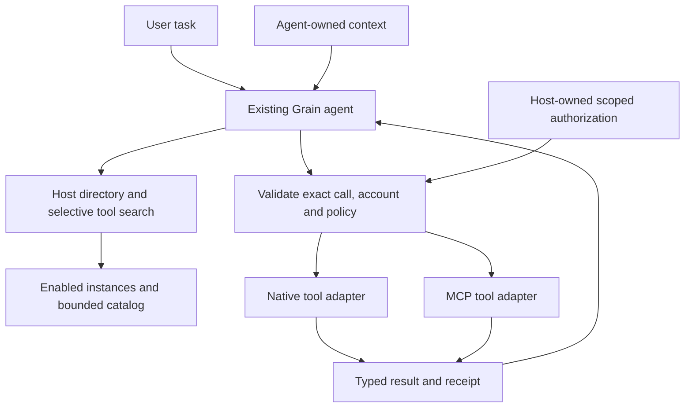
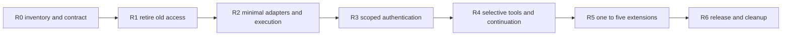

# Tool-only native and MCP extensions: revised execution plan

**Revised:** 27 September 2026. **Status:** execution resumed; retirement enforcement and migration foundation implemented on `extensions/tool-only-retirement`. Release gates remain open.

This document replaces the execution plan dated 26 September in this same file. The user's scope correction is authoritative: extensions supply tools/functions through either a native Grain adapter or an MCP adapter. They no longer extend Grain's internal features. Retirement is a settled product decision, not a backlog for restoration.

The 27 September implementation closes retired host access first. Previously paused MCP outcome/discovery/cleanup changes were reviewed against this reduced scope, retained and re-tested. The evidence below describes this implementation slice; it does not certify the full extension release.

## Current execution evidence — 27 September 2026

Branch: `extensions/tool-only-retirement`. No implementation commits go to `main`.

| Area | Implemented | Remaining gate |
|---|---|---|
| R0 contract | Native means a tool adapter; SDK grants restricted to exact-host network, namespaced storage and scoped auth. Agent prompt rules also refused. | New versioned adapter contract, identity/account generations, baseline RAM/latency measurements |
| R1 enforcement | All public SDK trust validators reject mixed retired features; host dispatch rejects retired RPC even with historical or `All` grants; event feed is pill-only. Runtime load, spawn and exact action invocation revalidate. Signed installs validate bounded JSON and signed id/version/tier/permissions before staging. | Full production-path restart/late-completion fixtures, external catalog filtering and remaining compatibility tombstones |
| R1 migration | Persistent quarantine disables packages, clears obsolete grants/slot ownership and parked dev enablement. Before host startup, edited extension prompt entries are archived atomically, then removed from active selection. Repeating/interrupted archive migration is safe. Artifacts and user storage survive. | Real-app interrupted restart/upgrade/rollback verification and stale approval/catalog generation audit |
| R1 hooks | No daemon activation subscriber, startup workers, active extension prompt contributions, transcript transforms, session stages, shortcuts or whole-request hand-off. Recommendation Lab generator refuses creation; existing lab data retains cleanup support. | Remove remaining unreachable implementations and external first-party-as-extension catalog registrations after ownership review |
| Authoring | New CLI projects declare one exact tool through `grain.actions`, with no activation/shortcut. Generated SDK API/types omit retired host services. Developer/checker fixtures certify refusal of companions and sessions. | Update historical examples/docs for the reduced runtime API; no promise of arbitrary executable containment |
| Retained R2 foundation | One whole-operation MCP deadline, bounded pages/tools/metadata/cursors, typed text/JSON results, dispatch-aware outcomes and owned HTTP cancellation/cleanup. | Raw JSON transport-body bounds, account/config generation races, full native parity, complete cancellation/disable policy and R2 gate |

**Paused-diff disposition:** retain/adapt `execution.rs`, `action_exec.rs`, MCP implementation, cancellable SDK HTTP wrapper and actual-SDK protocol tests; retain the Windows test runner and Common Controls manifest as test infrastructure. The direct SSE crate uses the version already in the lockfile. Drop any interpretation that these changes preserve broad extension privileges. No agent capture expansion, provider expansion or broad extension engine was added.

**Deterministic verification (Windows/MSVC):** core 209 unit + 4 integration tests; SDK 72; extension CLI 9; extension checker 23; backend host API 16, event auth 8, extension-related 48, developer loader 4, MCP 19 and action executor 4. Filtered backend groups overlap and are not a unique-test total. Registry tools compile and their zero-test target is reported as such. Frontend TypeScript/production build and backend library check pass. The MCP tests use the production dispatch conversion and actual pinned SDK over local protocol fixtures, including a lost write response (one call, no replay), hanging HTTP/SSE cleanup, pagination loops, changed schema/disable before dispatch, unsupported results and 100 sequential connection closures. Live provider/account certification and manual real-app UX are **not** performed.

Reproduce from repository root (PowerShell; `rtk` was unavailable on this machine):

```powershell
cargo test -p grain-core -p grain-sdk -p grain-extension-checks -p grain-ext-cli -p grain-registry-tools --locked --offline
$env:CARGO_TARGET_X86_64_PC_WINDOWS_MSVC_RUNNER = "powershell.exe -NoProfile -File $PWD/scripts/run-rust-test.ps1"
# Repeat with host_api::, events_auth::, extension_, dev_extensions::, action_exec::
cargo test --manifest-path src-tauri/Cargo.toml --lib --locked --offline grain_mcp::
cargo check --manifest-path src-tauri/Cargo.toml --lib --locked --offline
bun run build
```

The runner embeds Common Controls v6 only in the generated Tauri lib-test executable using installed Windows SDK `mt.exe`. It does not change registry settings or application binaries. Backend checks retain existing context/upstream warnings; no Handy source is modified. The unrelated pre-existing `src/app/bindings.ts` changes are excluded from these commits.

**Next:** finish R1 external catalog filtering, compatibility cleanup and real-app migration/late-completion evidence before provider expansion. R2–R6 stay incomplete; authentication certification, selective schema hydration, approval continuation and the one/two/three/five-extension ladder still need execution. The checklists below remain release criteria, not claims inferred from this slice.

### R1 follow-up: runtime, controls and migration checkpoint

The production worker shim now exposes only `actions`, namespaced storage, exact-host networking, scoped auth, log support and identity/capability metadata. Retired capture/OS/doc/settings/LLM/semantic/session/event/whole-request registration APIs and injected activation context are removed. Only explicit `action` calls reach handlers; unrecognized call/event frames are ignored or refused. Registration copies own functions into a prototype-free map. Socket close rejects outstanding host requests, clears queued frames and refuses new requests.

Worker death/kill messages carry the worker token as generation identity. Rust refuses stale death reports and filters queued spawns against current ownership; the supervisor refuses stale kill/error callbacks and replaces a different live token explicitly. These guards cover the tested worker-replacement cases; they do not yet certify every concurrent supervisor creation/teardown interleaving or MCP account generation race.

The extension management commands for application capture/picking and setting mutation are now retirement tombstones. Setting schema/sections and shortcut status return no contributions. Core Snippets/Context/Agent toggles cannot be changed through extension enablement. Existing core UI writes its own settings independently. Cards and approval requests no longer advertise prompt/recommendation/semantic/auto-send access; tool/account/permission approval remains. Retired settings/shortcut components, core-feature extension shelves and their catalogue fetching/listeners are removed. The obsolete Recommendation Lab runtime and its positive whole-request tests are deleted; cleanup identity/path support survives. This is functional retirement in existing screens, with no UI redesign or upstream source change.

Startup also archives exact custom extension binding records in `retired-extension-bindings.json`, then removes only the reserved `ext:` binding namespace. Core bindings survive. Registry checkpoint `tool_only_migration_version = 1` is persisted only after quarantine, archival and settings persistence; validation runs every startup even after that checkpoint. Corrupt archives fail without overwrite, repeated archival deduplicates, and a failed checkpoint write remains retryable in the same process. Existing prompt and binding archives are inert recovery data, not import routes that restore retired execution.

**Fresh evidence:** core 212 unit + 4 integration tests, SDK 72, CLI 9, checker 23; backend extension host 26, imported update security 5, host API 16, event auth 8, MCP 19; complete frontend suite 100 tests in 13 files. Changed frontend lint, TypeScript/production build and backend library check pass. Worker tests execute the production wire shim in Node VM with a protocol test socket; they do not render an alternate app, mock Tauri UI or use browser/computer automation. Manual real-app visual confirmation remains required. Existing context/upstream warnings remain, and unrelated generated bindings are excluded.

**Research recheck:** [MCP architecture](https://modelcontextprotocol.io/specification/2026-07-28/architecture) keeps orchestration, conversation aggregation and client boundaries with the host; [Goose adapter definitions](https://github.com/aaif-goose/goose/blob/04ed836c8cde23e540cc77d256992e00be99298b/crates/goose/src/agents/extension.rs) inform native/MCP separation; [VS Code connection ownership](https://github.com/microsoft/vscode/blob/a460613c57b4c1eb2bc8edc97be694e05ae286b2/src/vs/workbench/contrib/mcp/common/mcpServerConnection.ts) informs owned lifecycle cleanup. The concrete tool-only API removal and migration checkpoint are Grain choices, not protocol mandates.

**Still open in R1:** full real-app restart/upgrade/rollback evidence, external catalogue compatibility filtering, stale approval/catalog generation audit, every supervisor teardown race, and remaining broad-platform implementation/tombstone cleanup after ownership checks. R2 transport-body limits/native parity, R3 account certification, R4 selective hydration/continuation and the R5 integration ladder remain open. No gate is completed merely by deleting old positive tests.

### R1 lifecycle follow-up: supervisor and request ownership

Each scripted supervisor now gets a monotonic generation and a distinct `extension-host-<generation>` window label. Rust injects the generation before page scripts run; readiness and initialization failure identify it. Late/duplicate readiness cannot flush replacement queues, a cancelled creation closure cannot create an obsolete window, and delayed close targets only its original label. The existing capability file matches that label namespace with the same permission set. No background service or general extension engine is added.

Spawn/queue/stop bookkeeping uses the existing supervisor gate. Concurrent cold requests reuse the current worker token instead of replacing it and leaking credentials. Stop removes queued source immediately. Creation/scheduling failure and unexpected window destruction retire the generation and remove scripted workers by exact token; companion identities are excluded. Listener registration handles page closure during an await. Shutdown unregisters listeners, clears callbacks, terminates workers and revokes Blob URLs. Partial initialization failure reports its generation after cleanup.

Tool calls retain the token returned by the wake operation, wait only for that generation, recheck action approval after the cold-start await and refuse replacement dispatch. Startup failure releases the owning worker promptly. Pending registration and frame enqueue occur under the worker registry lock. A drop guard removes pending entries on future cancellation, deadline, channel failure and completion. Incoming results carry the authenticated socket token into correlation: an old socket cannot resolve the same call number in a replacement. Idle victim snapshots also carry tokens. Separate same-generation idle/busy races, heap-observer/strike attribution, account/config generations and all manifest/approval interleavings are not yet certified.

The CLI's generated hello handler now returns the executor's documented `{ok: {title, body}}` envelope. Its previous bare result was incompatible with the parser. This is Grain's native-adapter contract, not an MCP result-schema requirement.

**Verification:** frontend 106 tests in 14 files (six production supervisor tests), extension host 32, event auth eight, host API 16, action executor four, MCP 19 and CLI nine pass. Changed frontend lint, TypeScript/production build and backend library check pass; four existing context/upstream warnings remain. Focused coverage includes stale readiness, generation-scoped failure snapshots, stale socket replies, refused replacement dispatch and dropped-future cleanup. A disposable CLI project was generated, bundled with the repository's esbuild and called through the production worker shim to verify its executor result envelope. Prior retirement/migration evidence remains applicable. Protocol unit tests do not certify real-window lifecycle, live providers/accounts or visual behavior.

**Reference recheck:** [VS Code connection ownership](https://raw.githubusercontent.com/microsoft/vscode/a460613c57b4c1eb2bc8edc97be694e05ae286b2/src/vs/workbench/contrib/mcp/common/mcpServerConnection.ts) disposes a handler whose asynchronous creation finishes after its owner is disposed. [MCP lifecycle guidance](https://modelcontextprotocol.io/specification/2025-11-25/basic/lifecycle) specifies initialization, operation, shutdown and bounded waiting; [Goose's extension model](https://raw.githubusercontent.com/aaif-goose/goose/04ed836c8cde23e540cc77d256992e00be99298b/crates/goose/src/agents/extension.rs) supplies native/MCP separation and typed setup errors. Grain's labels, tokens and queue locking are implementation choices informed by these sources. The historical lifecycle URL is intentional: the 2026-07-28 lifecycle URL currently redirects to versioning.

### Authentication ownership follow-up: R1/R2 races and R3 foundation

Grain owns OAuth and credential storage; neither the model nor an extension receives tokens. The pinned `rmcp 3.1.4` SDK remains responsible for registration, PKCE, audience/resource binding, token exchange and refresh. Grain now serializes login/discovery/calls per catalog provider, reads the latest vault grant for each short-lived client and retains no idle SDK client or background authentication service. Unrelated providers have separate gates. This conservative execution policy also prevents competing clients from refreshing the same rotating token.

Each operation captures a provider generation before waiting. Connect, disconnect, enable/disable, client changes and developer-mode shutdown invalidate old work and approvals even when the tool definitions are identical. A guarded synchronous commit inside the vault's blocking task shares its lock with generation invalidation: logout follows an already-started write, while an obsolete queued write cannot resurrect credentials afterward. Blocking vault tasks retain the operation lease until they actually finish, so dropping an async caller cannot let a new refresh race its detached write. Login's drop guard invalidates its generation even if the caller's future is dropped; failed cleanup cannot invalidate a replacement. Dispatched cancellation preserves uncertain write outcomes and never retries the call. Vault writes enforce the same 128 KiB limit as reads.

Login has one five-minute deadline covering the gate, discovery, registration, browser callback and exchange. Cancellation/window closure releases its listener; dynamic registration uses an ephemeral loopback port, while pre-registered clients retain their documented fixed redirect. Callback validation requires complete headers, the exact path, one matching Host, state, unambiguous parameters and an exact issuer when supplied/required. Issuer validation applies before interpreting **error** callbacks too. The SDK session API uses the same discovered metadata snapshot rather than triggering another discovery. Synthesized legacy OAuth endpoints are refused. Hosted metadata must identify an issuer, explicitly advertise S256 and use HTTPS for authorization/token/registration/issuer URLs without embedded credentials or fragments. The SDK's permissive missing-PKCE fallback does not override Grain's current-spec policy. The browser response says the callback was received, not that token exchange succeeded.

Public pre-registered clients can supply a client ID without a secret; saving an empty secret removes an earlier secret. Providers that require a confidential-client secret still need one. Changing client credentials disables the provider and clears the old grant before writing its replacement secret. A stored pre-registered client ID must match current configuration, and the configured secret is restored for later SDK refresh requests. Settings expose Cancel sign-in, track simultaneous providers independently, label vault status as **credentials stored** and label the Test result as **discovery passed**. Neither label certifies an Agent continuation or live account compatibility.

**Evidence:** 33 MCP tests pass (the previous 19 plus 14 callback/ownership/OAuth tests). Local HTTP tests use the actual pinned SDK and verify public-client PKCE/resource parameters, rejection before exchange, one refresh across two short-lived clients, preservation on transient refresh failure, callback listener release, stale approvals/commits, replacement-safe cleanup, async-owner drop, blocking-write lease ownership, HTTPS/PKCE metadata policy, and unknown outcomes after cancelling a recorded write. Action executor four, capability three and extension host 32 tests also pass. Frontend 106 tests in 14 files, changed-file lint/format, TypeScript, production build and backend library check pass; four existing context/upstream check warnings remain. Memory stores and bounded local protocol fixtures replace external accounts only in tests; these are not UI harnesses or production credential stores. Real-window behavior, OS-vault failure modes and live accounts remain unverified.

**Open R3 gates:** the vault still supports one configured account per catalog provider; instance/endpoint/client/account key migration and multi-account UX are not implemented. Grain has no published Client ID Metadata Document (CIMD), so it must not pretend a fabricated URL is a usable client identity. Pre-registration and advertised DCR remain the current modes. Published CIMD hosting/ownership, challenge-driven scope upgrades, rejected-grant recovery UX, token redaction across SDK diagnostics, callback/metadata/body byte budgets, OS-vault fault tests and live server certification remain release work. Six catalog entries are candidates, not six certified integrations. Deterministic passing tests do not close these gates.

### Authentication reference recheck (27 September 2026)

| Primary reference | Observed pattern | Grain decision |
|---|---|---|
| [MCP authorization specification](https://modelcontextprotocol.io/specification/2026-07-28/basic/authorization), [client registration](https://modelcontextprotocol.io/specification/2026-07-28/basic/authorization/client-registration), [security requirements](https://modelcontextprotocol.io/specification/2026-07-28/basic/authorization/security-considerations) | HTTP authorization uses metadata discovery, PKCE, resource binding and issuer validation; pre-registration/CIMD/DCR differ. Stdio credentials are a separate path. Hosted authorization requires HTTPS and explicit PKCE support. | Host-owned SDK OAuth plus strict hosted-metadata policy. Do not classify every 401 as OAuth or claim universal automatic registration. |
| [Pinned Rust SDK OAuth support](https://raw.githubusercontent.com/modelcontextprotocol/rust-sdk/rmcp-v3.1.4/docs/OAUTH_SUPPORT.md) and installed `auth.rs` | The SDK supports registration modes, refresh and issuer-bound credentials; it exposes metadata resolution source and a session API using an existing manager. It tolerates absent PKCE advertisement for older servers. | Preserve the SDK implementation, refuse derived legacy endpoints and missing S256, inject the no-redirect HTTP client, and serialize separate short-lived clients. Session construction preserves one issuer snapshot. |
| [Goose OAuth implementation](https://raw.githubusercontent.com/aaif-goose/goose/main/crates/goose/src/oauth/mod.rs), [credential persistence](https://raw.githubusercontent.com/aaif-goose/goose/main/crates/goose/src/oauth/persist.rs) | Native clients allow optional secrets, secure persistence and explicit published client metadata. | Permit public client IDs; keep secrets in the OS vault. A published Grain CIMD requires a real hosting/product decision. |
| [VS Code MCP host implementation](https://raw.githubusercontent.com/microsoft/vscode/main/src/vs/workbench/api/common/extHostMcp.ts) | Host-managed token acquisition, challenge discovery and bounded auth retry accompany owned connection cancellation. | Keep credentials outside model/tool definitions. Cancel obsolete ownership; do not transplant retries that could repeat uncertain writes. |

These are multiple independent implementations plus the standard, not a claim that popularity establishes correctness. Reported [Goose refresh races](https://github.com/aaif-goose/goose/issues/12016) and [VS Code static-header auth classification](https://github.com/microsoft/vscode/issues/334970) are additional failure reports, not verified universal behavior or proof that those projects are fixed. Grain's local tests supply its own evidence.

### Combined real-app test checklist: retirement, lifecycle and authentication phases

These checks cover the preceding retirement commit and this follow-up. Run the real Tauri app using your existing ASR/model configuration. Agent tool-selection checks require a configured Agent model; record them as blocked if that prerequisite is absent. A greeting written by the model without calling the tool is not an execution success.

```powershell
cd C:\Projects\Grain\grain
bun run dev:asr
```

1. **Core features:** record and paste normal dictation. Open Snippets, Context and Agent; change a core toggle and restart. Expect core behavior/settings to work and persist. The extension recommendation shelves, contributed settings and extension shortcut controls removed in the previous phase must not appear on those core pages. User-authored prompts remain available.
2. **Legacy quarantine/restart:** if your profile contains an old capture/prompt/Space/session/shortcut extension, try enabling it. Expect refusal/unavailable status, no worker activation and no altered core prompt/shortcut. Restart twice; expect it to remain disabled. In the active data directory, `extensions.json` retains `tool_only_migration_version: 1`. If retired entries existed, inspect `retired-extension-prompts.json` and `retired-extension-bindings.json`: exact edited content/custom chords survive, without duplicate archive rows after restart. Fresh profiles need not have archives. Standard Windows data is under `%APPDATA%\com.grain.app`; portable mode uses `Data` beside the executable. Use the actual active profile path. Interrupted upgrade/rollback certification remains separate.
3. **Tool-only consent:** load the disposable project below through Extensions > developer tools > Load unpacked > Choose folder. Approve/enable if prompted. Expect its `Say hello` tool; this fixture requests no network, storage or account permissions. Consent must not request screen/OCR/selection, prompt layers, whole transcripts or semantic model installation. Load-unpacked does not require a submission icon.
4. **Cold/warm/idle calls:** ask Agent `Use Tool Smoke's Say hello tool.` Expect an actual tool call/result containing `Hello from this tool.` Repeat immediately, then wait 150–180 seconds without other tool activity and repeat. Expect warm reuse, an idle worker reap in developer logs and a successful fresh wake. This smoke test does not certify selective schema hydration or the complete continuation gate.
5. **Repeated teardown:** unload Tool Smoke from developer tools, immediately reload its folder, approve if prompted and call it again. Repeat ten times. Expect bounded completion, no obsolete error killing the replacement, no duplicate reply and a responsive app. Use developer debug logs for lifecycle lines. Process/RAM observations are not a certified budget in this phase.
6. **Stop during a call:** replace the fixture handler with the slow version below, rebuild and reload the folder. Start its call, then unload before five seconds pass. Expect pending work to stop/fail, no late success from the unloaded worker and a usable app. Restore the original handler, rebuild/reload and call again; expect success. Repeating during a cold start exercises the readiness/close boundary. User-cancellation UX and write-outcome certainty remain later gates.
7. **Retired package refusal:** in a separate copy of the disposable fixture, add `"activation": ["onStartup"]` or a retired permission such as `"capture"` to `manifest.json`, then choose that folder. Expect explicit rejection before execution. Historical grants do not create a compatibility exception; no extension screen/clipboard inspection should occur.
8. **Existing MCP smoke, if configured:** use the developer provider's Test button, execute one read-only query through Agent, disconnect/disable the provider and retry. Expect discovery/tool names when connected, an unavailable result after disable and no replay. OAuth/account-switch certification remains pending; native checks need no new live-service credentials.
9. **Denied/abandoned sign-in:** from a disconnected provider, start Connect and deny authorization in the browser. Expect a bounded error and no new enabled account. Retry, then use **Cancel sign-in** while waiting. Expect cancellation and an immediately reusable callback port. Simply closing the browser tab cannot notify Grain; Cancel or the whole-flow five-minute timeout must release it. Closing the main app window is a separate cancellation case.
10. **Late callback after cancellation:** start sign-in, cancel in Grain, then finish the old browser authorization if the provider still allows it. Expect an expired/refused callback and no resurrected account after refresh/restart. Start a fresh sign-in and complete it; expect only the new flow to succeed. Repeat with Developer Mode turned off while the old browser is open.
11. **Public/confidential client setup:** only with a provider registration that explicitly supports a public native client, save its client ID with an empty secret. Expect Save to work, PKCE login to succeed if the server supports that registration, and no secret required by Grain itself. For a provider requiring a secret, use its documented registration and secret. Switching credentials must disable the old grant. Server rejection of an unsupported registration is a compatibility failure to record, not evidence that Grain should invent credentials.
12. **Vault/restart/refresh:** complete login, restart Grain and run Test plus one read-only Agent call. Repeat after the provider's access token has expired, using its documented lifetime. Expect the configured client credentials to support refresh, no duplicate login, and no lost account following a transient network failure. The **credentials stored** badge alone is not a pass. Record OS-vault failures without posting credential contents.
13. **Stale account approval:** leave an MCP confirmation pending, disconnect and reconnect (to another account if available), then approve the old confirmation. Expect refusal with no execution under the replacement account even if tool names/schemas are identical. Ask again and approve a freshly prepared call. Repeat with disable/re-enable and with client configuration changed. Use a harmless read/test operation; no production write is needed.
14. **Provider independence:** connect two supported dynamic-registration providers while both browser flows are open. Complete one and cancel the other; expect only the completed provider enabled and usable. Run read-only tools on both configured providers and disable one; expect the other to remain usable. Pre-registered providers sharing the fixed redirect port may explicitly refuse simultaneous login; retry serially rather than treating that refusal as successful authentication.
15. **Shutdown during MCP work:** start a slow read-only MCP call, disable its provider or Developer Mode, and expect bounded cancellation/cleanup and a usable app. Re-enable and ask again; expect a fresh call. Do not infer that a remote write was undone merely because Grain cancelled its response; deterministic write-ambiguity coverage exists in the local protocol tests.

**Manual status:** all 15 checks are awaiting the user's real-app verification. The original eight remain numbered unchanged. The user is away from the computer; implementation and non-visual verification continue without waiting for these checks. Add subsequent phase checks here rather than scattering them across chat messages.

Create the disposable project in another PowerShell terminal. This uses the real CLI and the repository's installed esbuild, without installing an additional runtime or alternate UI:

```powershell
$grainRepo = 'C:\Projects\Grain\grain'
Set-Location $grainRepo
cargo build -p grain-ext-cli --locked --offline
$grainMetadata = cargo metadata --format-version 1 --no-deps --locked --offline | ConvertFrom-Json
$grainExtExe = Join-Path $grainMetadata.target_directory 'debug\grain-ext.exe'
$grainSmokeRoot = Join-Path $env:TMP ('grain-tool-smoke-' + [guid]::NewGuid())
New-Item -ItemType Directory -Path $grainSmokeRoot | Out-Null
Push-Location $grainSmokeRoot
& $grainExtExe init 'Tool Smoke' --id com.example.tool-smoke
Set-Location .\tool-smoke
& "$grainRepo\node_modules\.bin\esbuild.cmd" src/main.ts --bundle --format=iife --platform=browser --target=es2020 --outfile=dist/main.js --sourcemap
Pop-Location
Write-Output (Join-Path $grainSmokeRoot 'tool-smoke')
```

For check 6, edit only that project's `src/main.ts`, rerun the esbuild command from its folder and reload through Grain:

```typescript
grain.actions({
  hello: async () => {
    await new Promise((resolve) => setTimeout(resolve, 5000));
    return { ok: { title: "Tool Smoke", body: "Slow hello completed." } };
  },
});
```

Report pass/fail by checklist number, with the exact error, visible result and developer-log timestamps for failures. Repository policy requires user visual confirmation of the real app. External catalogue filtering, remaining legacy developer/store controls, observer/approval races, interrupted migration/rollback, authentication certification, selective schema hydration and the one/two/three/five-extension ladder remain open.

## 1. Product boundary

**The agent understands the task and owns context. Extensions execute tools. Grain owns orchestration, authorization, execution policy and lifecycle.**

- A **native Grain extension** implements tools directly without an MCP server or protocol wrapper. Native describes the integration approach; it does not require a privileged executable.
- An **MCP extension** exposes tools through MCP. Grain manages the client connection and calls.
- Both are extensions, use the same tool identity/execution contract and participate in the same agent workflow.
- Neither gets Grain internals, ambient context access, prompt control or access to other extensions.
- Application/website awareness, screen access, OCR, caret and selection belong to the agent's host-owned boundary. Additional agent context features are not prerequisites or deliverables of this project.

Example: for “reply appropriately to this email,” the agent can use its own permitted context facilities to understand the email. If asked to send a reply, it calls an email extension with explicit recipient, subject and body arguments under host policy. The extension cannot request the screen, current selection or conversation history. If no extension is needed, none starts.

### Capability disposition

| Surface | Decision | Consequence |
|---|---|---|
| Tool descriptors, schemas, function execution and results | Keep | Shared narrow contract across native and MCP |
| Connection/account configuration and authorization | Keep | Host-managed; scoped to instance/account |
| Enable/disable, cancellation, timeouts and cleanup | Keep | Demand-driven ownership |
| OS-specific extension APIs, app launching, shell/process access, clipboard/input hooks | Retire | No legacy API or generic command escape hatch |
| Grain Space, documents/panels/slots and contributed UI/data surfaces | Retire | Tool results use ordinary agent result presentation |
| Prompt packs, layers, priorities and main/context prompt replacement | Retire | No manifest, runtime or migration route activates them |
| Screen images, OCR/screen text, caret, selected text, foreground app/site | Retire at the extension boundary | Context remains agent-owned; no extension capture grants |
| Transcript transforms, recording/session modes and transcript/audio event feeds | Retire from extensions | Tools do not subscribe to or alter dictation |
| Startup/resident activation, general events and extension shortcuts | Retire from this contract | Only explicit discovery/call/auth work starts resources |
| Arbitrary settings contributions and host semantic/LLM services | Retire | Only necessary connection/tool configuration and adapter support remain |
| First-party ASR, dictation, context and user-authored prompts | Preserve independently | Remove extension hooks, not shared core functionality |

The additional removals follow the user's tool-only boundary: an old contribution, permission or activation event does not survive by default. Host-owned connection settings and approval/result UI remain tool infrastructure, not a new extension UI framework.

### Data boundary

A tool receives validated arguments and minimum adapter execution support. No ambient context object, screenshot handle, history/transcript feed, global settings, vault handle or cross-extension handle is attached.

Task-relevant text may be an explicit argument when the user-authorized task requires it. That grants no right to collect more context. No automatic forwarding of screenshots, OCR buffers, selections or application metadata. Sensitive outgoing arguments remain subject to host policy and applicable approval. A provider returning an image is a result-format issue, not permission to capture the user's screen. Initial supported results are text and structured JSON; other blocks receive an explicit compatibility/omission status.

## 2. Corrections to the previous plan

| Old assumption | Replacement |
|---|---|
| Preserve the existing native extension platform | Reuse only proven tool execution, scoped auth and cleanup components |
| Preserve data contributions, shortcuts and settings surfaces | Keep tool metadata/results and necessary connection configuration only |
| Preserve declared native background activity | No resident/background extension mode |
| Begin with MCP outcomes/lifecycle improvements | First close retired access paths and migrate existing installations |
| Preserve older amendments except selected MCP changes | Supersede every conflicting capability, prompt, context, activation and Space decision |
| Rich resources/client interactions are natural extension growth | Evaluate optional tool-protocol features separately; never restore retired host privileges |

The prior [research](MCP-EXTENSION-RESEARCH.md) and [source ledger](MCP-EXTENSION-SOURCES.json) remain evidence for discovery, auth, lifecycle, outcomes and continuation. Recommendations to preserve broad native capabilities are superseded. Older `PLAN.md`, Extension Platform, Extensions V1 and prompt integration documents cannot authorize retired features. Their broader platform recommendations remain superseded.

## 3. Research basis

The earlier review inspected ten open-source projects with dated star counts and pinned commits. This revision rechecked MCP architecture/tools/auth/security and relevant Goose, Codex, VS Code, LibreChat, OpenCode, Cline, GitHub MCP and LangChain adapter sources on 27 September. Popularity informs the reference set, not correctness. Grain's capability retirement is a product decision, not a claim that MCP requires it.

| Decision | Primary evidence and application |
|---|---|
| Host owns orchestration and context isolation | [MCP architecture](https://modelcontextprotocol.io/specification/2026-07-28/architecture): keep conversation/context aggregation with the host; integrations receive necessary inputs |
| Multiple implementations behind one extension abstraction | [Goose definitions](https://github.com/aaif-goose/goose/blob/04ed836c8cde23e540cc77d256992e00be99298b/crates/goose/src/agents/extension.rs): borrow adapter separation, not broader privileges |
| Selective exposure and bounded metadata | [Codex tool search](https://github.com/openai/codex/blob/6e1ab4d294cdf1d2606a91bf1acf6de0f0959c7a/codex-rs/core/src/tools/handlers/tool_search.rs), [catalog cache](https://github.com/openai/codex/blob/6e1ab4d294cdf1d2606a91bf1acf6de0f0959c7a/codex-rs/codex-mcp/src/tool_catalog_cache.rs): defer schemas and protect cache identity/generation |
| Owned lifetime and late-completion protection | [VS Code connection ownership](https://github.com/microsoft/vscode/blob/a460613c57b4c1eb2bc8edc97be694e05ae286b2/src/vs/workbench/contrib/mcp/common/mcpServerConnection.ts), [LibreChat disposal race tests](https://github.com/LibreChat-AI/LibreChat/blob/7b2362d7a7c6148b84850924dc7fa5fc43307923/packages/api/src/mcp/__tests__/MCPConnectionDisposeRace.test.ts), [Cline call tests](https://github.com/cline/cline/blob/29896ec7fa8e2dd98805b56c2dae987d59fc9baa/apps/vscode/src/services/mcp/__tests__/McpHub.callTool.test.ts): test cancellation and teardown races |
| Consistent auth experience, distinct grants | [MCP authorization](https://modelcontextprotocol.io/specification/2026-07-28/basic/authorization), [OpenCode OAuth](https://github.com/anomalyco/opencode/blob/a42f393c850bec0c0f395fb91bf19b1ee8b31666/packages/opencode/src/mcp/oauth-provider.ts), [GitHub host integration](https://github.com/github/github-mcp-server/blob/85598ba6e1256f7ebf4867b95d63b833c4549264/docs/host-integration.md): account/resource isolation and provider-specific registration |
| Execution facts survive result conversion | [MCP tools](https://modelcontextprotocol.io/specification/2026-07-28/server/tools), [LangChain conversion](https://github.com/langchain-ai/langchain-mcp-adapters/blob/52a4535f3eb4b98f386836e4d9b8c4cadf99afca/langchain_mcp_adapters/tools.py): preserve tool errors, typed content and uncertain effects separately |
| An executable needs a real trust boundary | [MCP security guidance](https://modelcontextprotocol.io/docs/2026-07-28/tutorials/security/security_best_practices): reducing Grain's SDK alone cannot constrain arbitrary OS processes |
| Approval resumes the original run | [LangGraph interrupts](https://docs.langchain.com/oss/python/langgraph/interrupts) and prior LibreChat OAuth-resume research: retain call identity and guard replay; do not add a new orchestration framework |

There is no universal industry-standard search algorithm or marketplace architecture. The reduced native contract, migration and budgets below are Grain design choices informed by these references.

## 4. Target architecture



No extension-to-context, prompt, Space or other-extension route exists. Authorized multi-extension workflows pass through the agent and the same dispatch gate.

| Contract | Minimum information |
|---|---|
| Extension instance | Stable ID, adapter kind, enabled state, configuration generation, display metadata and auth binding |
| Tool descriptor | Instance/tool identity, bounded description, authoritative input/output schemas, selected-tool digest and host policy |
| Catalog lookup | Authorized identity, freshness/generation, bounded results and explicit incomplete/unsupported state |
| Prepared call | Run/call IDs, immutable validated arguments, instance/account, descriptor digest, deadline and approval requirement |
| Execution scope | Cancellation/deadline and narrowly scoped adapter dependencies; no general Grain application handle exposed to extension code |
| Result | Execution certainty, text/JSON, cause category, truncation/unsupported flags and receipt where applicable |
| Pending run | Messages/call IDs, offered-tool snapshot, remaining budgets and pending approval/auth decision |

Reuse existing types where appropriate. These responsibilities do not require new services or an engine per row. Native tools can call provider APIs directly through host-brokered endpoint-scoped credentials; MCP tools use the existing official Rust SDK. Neither duplicates policy, approval or agent orchestration. Any adapter configuration storage stays namespaced and bounded, without becoming a Space/document API.

### Native runtime and process scope

Certify a reviewed native provider through existing isolated execution infrastructure only after its reachable APIs satisfy the reduced contract. A Grain-maintained direct implementation is also valid. Native tool support does not require an MCP wrapper.

Do not automatically preserve tier-C companions, unrestricted scripts, Node/OS escape paths or arbitrary local MCP commands. Third-party executable loading is outside the initial release. Future support requires demonstrated containment and installation policy. A manifest allowlist, signature or subprocess boundary alone is not an OS sandbox.

### MCP feature profile

Initial scope: curated remote HTTP providers, tool discovery/calls, required auth/protocol plumbing, bounded text/JSON results and explicitly tested modern/legacy versions. Grain already uses `rmcp` with modern/legacy lifecycle configuration.

Do not import MCP prompts, inject server instructions into main/system prompts, expose Grain roots, provide server-requested sampling or grant context access. Advertising a server capability does not enable it in Grain. Unsupported input/task interactions and unsolicited requests receive an explicit compatibility response without widening access or replaying the action. General resources, subscriptions, long jobs and rich media are outside the initial release. Authorization redirects remain host-owned operations.

## 5. Current code map and paused work

These are inspected starting points; R0 must trace every reachable path before removal.

| Area | Code | Treatment |
|---|---|---|
| Manifest/permissions | `crates/grain-sdk/src/manifest.rs`: `ExtensionManifest`, `Contributes`, `KNOWN_CAPABILITIES`, pack payloads | Versioned tool-only contract; reject retired fields/aliases |
| Registry/persisted effects | `crates/grain-core/src/extensions.rs`: grants, prompt approvals, slots, prompt-pack apply/remove | Migrate without restoring retired behavior |
| Native runtime | `src-tauri/src/extension_host.rs`: prompt collection, startup/resident activation, actions | Retain only reviewed execution/lifecycle paths |
| Host RPC | `src-tauri/src/host_api.rs`: capability map, capture/session/document/LLM/embed/app-launch methods | Enforce allowlist at dispatch, not just in UI/manifests |
| Context/prompt consumers | `context_detect.rs`, `context_screen.rs`, `prompt_stack.rs` and extension callers | Disconnect extension access; preserve core/agent callers |
| Secondary entry points | `extension_shortcuts.rs`, `extension_session.rs`, `extension_companion.rs`, developer reload/lab, settings commands, SDK bindings | No development/import/reload bypass |
| Shared tool path | `capability.rs`, `action_exec.rs`, `agent.rs`, core capability/execution types | Reuse exact-call checks; complete validation and continuation |
| MCP/auth | `grain_mcp.rs`, `grain_auth.rs` | Keep narrow foundations; complete recovery and ownership |

Paused changes include execution outcomes, MCP discovery/results, a cancellable HTTP adapter, protocol fixtures and a Windows test runner. These are candidates for retain/adapt/drop review, not an accepted milestone. Do not commit them with this plan or reset them automatically. Reassess and test any retained changes when implementation resumes; preserve unrelated working-tree changes.

## 6. Delivery order and gates



All checkboxes remain pending. Each phase includes a vertical test through production boundaries. Negative access tests begin with retirement, not final release. Provider registration research can start during R0 but cannot bypass R1.

### R0 — Inventory and freeze the contract

**Purpose:** map all legacy access before building more features.

- [ ] Trace installed/built-in packages, enable/update/import, startup restore, developer reload/lab, worker/companion RPC, cached catalogs and pending calls.
- [ ] Enumerate retired permissions, methods, declarations/aliases, events, controls, slots, grants and persistent contributions. Identify their producer, dispatcher, consumer and migration owner.
- [ ] Separate first-party ASR/context/user settings from extension hooks; locate shared helpers so removal does not delete core behavior.
- [ ] Freeze the reduced manifest/API version and native execution strategy. Unknown executable privileges fail validation; harmless display metadata cannot create capabilities.
- [ ] Define instance/account identity, tool digest, exact approval and result certainty using existing types where appropriate.
- [ ] Classify paused changes as retain/adapt/drop against this scope before resuming them.
- [ ] Capture workers/listeners/tasks, idle memory, discovery requests, schema bytes and representative workflow baselines.

**Gate:** every retired surface has an enforcement/cleanup owner; one native tool and one MCP tool fit the same contract; no implicit legacy grants remain. New agent context features are unnecessary to proceed.

**Change sets:** R0.1 inventory/contract; R0.2 compatibility fixtures and paused-diff review.

### R1 — Retire access and migrate installations

**Purpose:** make old capabilities unreachable, including for already enabled packages.

- [x] Deny retired APIs at host dispatch before relying on UI/SDK removal. Old capability tokens and direct RPC must fail too.
- [ ] Reject retired fields and aliases at import/update/enable/reload/startup. Keep parsing tombstones for precise errors; never silently discard a required feature and run the package with different semantics.
- [ ] Quarantine incompatible legacy packages as disabled with a migration reason. Mixed tool/retired-capability packages require explicit migration and review; no automatic partial activation.
- [ ] Unregister startup/event/session/shortcut handlers, revoke obsolete tokens, stop owned workers/listeners and invalidate pending approvals/catalogs. Disablement must defeat late asynchronous completion.
- [x] Stop prompt layers, priorities, replacements and packs. Remove extension-owned entries from active selection using provenance, restoring a valid first-party/user selection. Preserve ambiguous or edited content in inert recoverable storage rather than deleting or activating it automatically.
- [ ] Release Space/other slots without legacy fallback re-enabling a retired built-in extension. Detach contributions from rendering/routing; preserve user-created content independently.
- [ ] Use a versioned, idempotent migration: snapshot recoverable metadata, disable execution first, then clean up. Interrupted migration restarts before any legacy activation.
- [ ] Remove old extension permission/configuration controls and first-party-as-extension catalog registrations. Core/agent controls remain independent. Frontend overhaul follows repository branch/manual review rules.
- [ ] Remove dead implementations once callers are disconnected and shared-helper ownership is verified. Necessary migration tombstones may remain; working retired APIs may not.

**Gate:** old packs/grants, startup restore, direct RPC, development reload and pending actions cannot reach retired surfaces. Restart/interrupted-migration fixtures preserve the boundary. Core dictation/context still works independently.

**Rollback:** disabling the new tool path must not restore retired grants/hooks. Do not revert to a binary that activates the old registry without a migration-safe procedure.

**Change sets:** R1.1 enforcement; R1.2 migration/teardown; R1.3 consumers and obsolete controls. Finish R1 before expanding providers.

### R2 — Prove minimal native and MCP execution

**Purpose:** list/describe/call/cancel/cleanup with truthful outcomes.

- [ ] Route both adapters through one authoritative dispatch/policy path; no arbitrary extension-to-extension execution.
- [ ] Classify automatic reads through host-reviewed policy and restricted provider scopes. Unknown or consequential effects require exact-call approval; extension annotations and generic execute wrappers cannot grant themselves read-only status.
- [ ] Validate supported schemas completely, including nested types, enums and composition. Bound complexity/reference resolution; no arbitrary remote `$ref` fetches. Keep LLM schema adaptation separate from authoritative validation.
- [ ] Enabling an extension or listing the directory starts no runtime. Cold discovery may start only the selected adapter if necessary, then releases it. No idle polling or resident exemption.
- [ ] Propagate deadlines/cancellation from the owning run. Bound discovery time, pages, tools and bytes; detect repeated cursors/empty-page loops. Bound raw HTTP bodies/SSE events as well as retained parsed output.
- [ ] Revalidate enabled state, account/configuration generation and selected schema before dispatch. Late setup cannot resurrect a disabled/removed instance.
- [ ] Distinguish no dispatch, success, tool error, uncertain post-dispatch outcome and unavailable/unsupported result. Cancellation after dispatch cannot guarantee remote cancellation.
- [ ] Preserve text formatting and typed JSON with explicit truncation/omission. Rendering failure cannot become a claim that execution never happened.
- [ ] Never automatically replay uncertain writes. Local request/idempotency IDs do not prove provider deduplication. Bound safe read retries and respect rate limits.

**Gate:** native and actual-SDK MCP read/write fixtures pass through production dispatch. Failures before send, after a recorded write, during response/SSE and teardown produce accurate outcomes and at most one write dispatch. After 100 operation/disposal cycles, owned handles return to baseline; measure memory separately from allocator noise. Test every claimed modern/legacy transport version.

**Change sets:** R2.1 shared contracts/validation; R2.2 ownership; R2.3 results and fault injection. Paused code is reused only after review.

### R3 — Scoped authentication and recovery

**Purpose:** consistent connect/recover/disconnect behavior with distinct grants.

- [ ] Key credentials by instance, account, issuer/resource, client identity and scopes in the OS vault. Native API and MCP grants stay separate even for the same provider.
- [ ] Preserve SDK protections; support registration modes required by certified providers. Public desktop clients cannot rely on embedded confidential secrets. CIMD/preregistration/DCR follow provider support.
- [ ] Coalesce refresh/login per identity; logout and configuration changes win over late callbacks/refreshes. Avoid one global lock across unrelated providers.
- [ ] Own callback listeners and browser authorization in the host. Redirect ports follow provider registration. Auth must not grant an extension a general URL/app launch API.
- [ ] Distinguish stored credentials, granted scopes and last-known availability. Handle expiry, revocation, missing refresh tokens, insufficient scope, denial and offline states explicitly.
- [ ] Migrate grants without losing the only usable credential or reactivating disabled packages. Native authenticated HTTP remains endpoint-scoped; no tokens in model context/results/logs.

**Gate:** wrong-state/issuer/account, concurrent refresh, logout race, cancellation and callback cleanup fixtures pass. Certify one provider login → restricted read → expiry/recovery → disconnect. Record endpoint, protocol, auth mode, scopes and date; other providers stay uncertified.

**Change sets:** R3.1 identity/vault migration; R3.2 recovery/listener ownership; R3.3 live certification. Linear remains a candidate from prior research, not a promised compatibility result. A GitHub native provider needs its own app/scopes and tool review.

### R4 — Selective tools and a complete agent loop

**Purpose:** expose relevant schemas and complete tasks after approval/auth.

- [ ] Start with a bounded enabled-extension directory and host-owned search/load affordances. No all-schema startup injection and no automatic full catalog exposure after selecting a large extension.
- [ ] Search/rank candidates with explicit coverage/pagination; offer selected schemas under a byte/token budget. Preserve user-selected filters; no hidden mandatory pre-router.
- [ ] Cache metadata separately from runtimes by instance/account/configuration/protocol/catalog generation. Honor applicable freshness/scope, coalesce fetches and bound retained bytes.
- [ ] Reuse fresh descriptors rather than listing the entire catalog before every call. Refresh when stale/invalidated; changed selected tool/account/arguments invalidate approval, unrelated tool changes need not.
- [ ] Preserve real tool-call IDs, messages, offered-tool snapshots and remaining budgets across approval or explicit authorization.
- [ ] Consume approval once, execute the immutable call and append its result to the original run. Denial resumes with a denial result; cancellation ends the run. Resolve multi-call responses without orphaned/duplicate results.
- [ ] Release transports while awaiting the user; expire bounded pending state. Execute sequentially initially; no general durable workflow engine or restart-resume promise.
- [ ] Keep agent context tools in a host-owned namespace inaccessible to extensions. Treat descriptions/results as untrusted data; they cannot override host policy/prompts or grant privileges.

**Gate:** read → approve write → real result → second read → final answer succeeds with both adapters. Denial, duplicate approval, auth interruption, account/schema change and disable are correct. Large-catalog fixtures obey schema/cache budgets and never dispatch fabricated/unoffered identities. Measure retrieval quality, including no-match cases.

**Change sets:** R4.1 bounded catalog/search; R4.2 continuation; R4.3 combined and adversarial workflows.

### R5 — One, two, three and five extensions

Each rung must pass discovery, policy, outcomes and cleanup before progressing.

| Rung | Demonstration | Pass condition |
|---|---|---|
| One native | Reviewed native provider: read and approved write | No MCP dependency or retired APIs; real continuation |
| One MCP | Certified provider: read and approved test write | Actual SDK/auth/lifecycle path; accurate receipts |
| Two | Native + MCP with colliding tool names | Correct instance/account routing; no implicit data sharing |
| Three | Dependency chain with auth interruption/provider failure | Correct resume or truthful partial completion |
| Five | Mixed adapters and catalog sizes | Selective schemas and bounded state; no five idle runtimes |

At each rung include schema drift, disable while pending, cancellation, tool errors, unsupported output, malicious descriptions/results requesting context access, and a write whose response is lost. Completed steps retain receipts when later steps fail. There is no implied cross-service transaction or automatic rollback.

**Gate:** all deterministic retirement/isolation/replay fixtures pass. Evaluate representative workflows with at least two declared tool-capable model/provider combinations. Provisional target: at least 95% completion for healthy prerequisites; publish sample size and all failure categories, with infrastructure failures reported separately. This is a proposed measurement target, not an achieved result.

### R6 — Release and final cleanup

- [ ] Expose only reduced management: enablement, account/connection, necessary tool configuration, availability/recovery and host-owned results.
- [ ] Publish a tested compatibility matrix and bounded redacted diagnostics. No universal provider/protocol-feature claim.
- [ ] Pin applicable conformance/regression suites in CI; report pass/fail/unsupported/skip separately. Live account checks stay separate from deterministic CI.
- [ ] Verify restart, upgrade, disabled state and migration-safe rollback. No flag re-enables retired host integration.
- [ ] Remove remaining unreachable broad-platform code/examples, retaining necessary migration tombstones. Update SDK/docs/bindings in later scoped changes.
- [ ] Review the real Tauri application manually. No visual harness/browser automation; UI 2.0 overhaul stays on its designated branch.

**Gate:** R0–R5 evidence recorded, retired surfaces inaccessible, core behavior preserved and real-app UX accepted. No additional context-capture project is required for release.

## 7. Release-blocking verification

| Scenario | Required evidence |
|---|---|
| Old manifest requests capture/prompt/Space/resident/OS features | Rejected/quarantined at every lifecycle boundary |
| Existing grant or forged direct RPC calls a retired method | Host denies even when UI/manifest checks are bypassed |
| Cached action predates migration/disable | No dispatch or late resurrection |
| Tool output/prompt metadata requests full context | No privileged prompt insertion, permission escalation or automatic context forwarding |
| Tool receives task-derived text | Exact validated arguments only; no ambient handles/history |
| Agent uses existing context | Independent first-party path needs no extension |
| Native code attempts retired access | No reachable API; trust/containment claims match deployment |
| Prompt/slot migration is interrupted | No legacy reactivation; unrelated user content survives |
| Identical tool names/accounts | Stable instance/account isolation |
| Invalid nested input/schema or unoffered tool | Rejected before dispatch |
| Server writes then loses response | Unknown outcome; zero blind replays |
| Approval/auth resume, duplicate delivery or denial | Valid call/result pairing; at most one authorized dispatch |
| Timeout/cancel/disable at await boundaries | Bounded wait, resource release, no late resurrection |
| Oversized raw response or endless pagination | Transport and retained-state limits; explicit incomplete result |
| Five enabled but idle extensions | No workers/listeners held merely because enabled |

During implementation run relevant SDK/core/backend tests, Rust checks and affected frontend type/lint/build checks. Use production dispatch and the actual SDK with deterministic protocol fixtures. Record commit, environment, checks, budgets and limitations for each gate. Previous tests do not prove the new retirement guarantees.

## 8. Scope guard and next implementation unit

**Retired, not deferred:** extension OS/context/screen/OCR/selection/caret access, Grain Space, prompt packs/priorities/replacement, broad host LLM/semantic services, session/transcript hooks, resident activation and custom UI. Do not restore these under a tool wrapper or advanced flag.

**Separate future decisions:** arbitrary local executables/stdio, custom endpoints, optional multi-round tool interactions, long jobs, rich result rendering and durable restart-resume. None may weaken the boundary above. Agent context improvements belong to a separate workstream and are not extension prerequisites.

Implementation has resumed with **R0.1 and R1.1/R1.2 enforcement and migration foundation**. Continue with R1.3 consumer cleanup and complete the remaining R1 evidence before minimal native/MCP execution certification. Reuse only paused changes that pass scope review and fresh tests. Do not resume broad extension-platform development or provider expansion from the previous plan.
