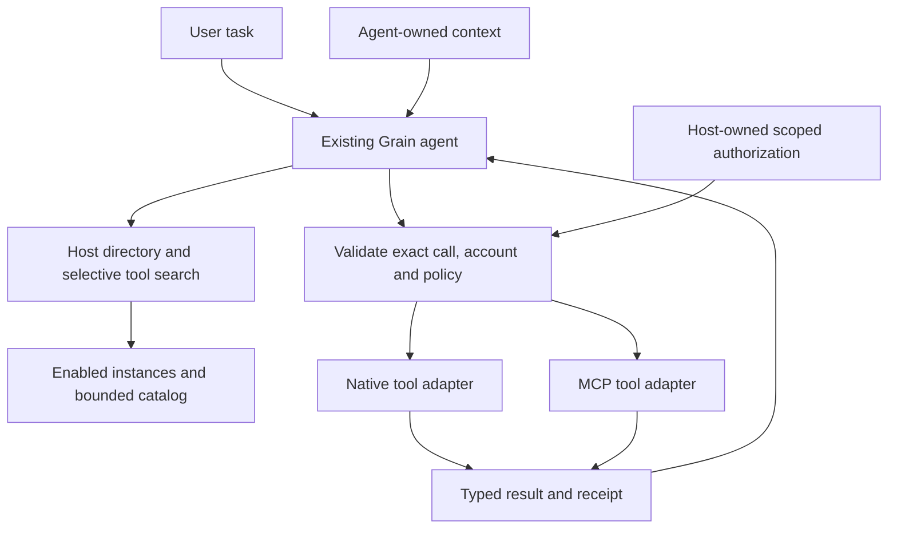

# Tool-only native and MCP extensions: revised execution plan

**Revised:** 27 September 2026. **Status:** planning only; implementation paused.

This document replaces the execution plan dated 26 September in this same file. The user's scope correction is authoritative: extensions supply tools/functions through either a native Grain adapter or an MCP adapter. They no longer extend Grain's internal features. Retirement is a settled product decision, not a backlog for restoration.

Only this planning document changes in this revision. Previously started implementation changes remain uncommitted and require reassessment before implementation resumes. Their existence and earlier test results do not complete any gate below.

## 1. Product boundary

**The agent understands the task and owns context. Extensions execute tools. Grain owns orchestration, authorization, execution policy and lifecycle.**

- A **native Grain extension** implements tools directly without an MCP server or protocol wrapper. Native describes the integration approach; it does not require a privileged executable.
- An **MCP extension** exposes tools through MCP. Grain manages the client connection and calls.
- Both are extensions, use the same tool identity/execution contract and participate in the same agent workflow.
- Neither gets Grain internals, ambient context access, prompt control or access to other extensions.
- Application/website awareness, screen access, OCR, caret and selection belong to the agent's host-owned boundary. Additional agent context features are not prerequisites or deliverables of this project.

Example: for “reply appropriately to this email,” the agent can use its own permitted context facilities to understand the email. If asked to send a reply, it calls an email extension with explicit recipient, subject and body arguments under host policy. The extension cannot request the screen, current selection or conversation history. If no extension is needed, none starts.

### Capability disposition

| Surface | Decision | Consequence |
|---|---|---|
| Tool descriptors, schemas, function execution and results | Keep | Shared narrow contract across native and MCP |
| Connection/account configuration and authorization | Keep | Host-managed; scoped to instance/account |
| Enable/disable, cancellation, timeouts and cleanup | Keep | Demand-driven ownership |
| OS-specific extension APIs, app launching, shell/process access, clipboard/input hooks | Retire | No legacy API or generic command escape hatch |
| Grain Space, documents/panels/slots and contributed UI/data surfaces | Retire | Tool results use ordinary agent result presentation |
| Prompt packs, layers, priorities and main/context prompt replacement | Retire | No manifest, runtime or migration route activates them |
| Screen images, OCR/screen text, caret, selected text, foreground app/site | Retire at the extension boundary | Context remains agent-owned; no extension capture grants |
| Transcript transforms, recording/session modes and transcript/audio event feeds | Retire from extensions | Tools do not subscribe to or alter dictation |
| Startup/resident activation, general events and extension shortcuts | Retire from this contract | Only explicit discovery/call/auth work starts resources |
| Arbitrary settings contributions and host semantic/LLM services | Retire | Only necessary connection/tool configuration and adapter support remain |
| First-party ASR, dictation, context and user-authored prompts | Preserve independently | Remove extension hooks, not shared core functionality |

The additional removals follow the user's tool-only boundary: an old contribution, permission or activation event does not survive by default. Host-owned connection settings and approval/result UI remain tool infrastructure, not a new extension UI framework.

### Data boundary

A tool receives validated arguments and minimum adapter execution support. No ambient context object, screenshot handle, history/transcript feed, global settings, vault handle or cross-extension handle is attached.

Task-relevant text may be an explicit argument when the user-authorized task requires it. That grants no right to collect more context. No automatic forwarding of screenshots, OCR buffers, selections or application metadata. Sensitive outgoing arguments remain subject to host policy and applicable approval. A provider returning an image is a result-format issue, not permission to capture the user's screen. Initial supported results are text and structured JSON; other blocks receive an explicit compatibility/omission status.

## 2. Corrections to the previous plan

| Old assumption | Replacement |
|---|---|
| Preserve the existing native extension platform | Reuse only proven tool execution, scoped auth and cleanup components |
| Preserve data contributions, shortcuts and settings surfaces | Keep tool metadata/results and necessary connection configuration only |
| Preserve declared native background activity | No resident/background extension mode |
| Begin with MCP outcomes/lifecycle improvements | First close retired access paths and migrate existing installations |
| Preserve older amendments except selected MCP changes | Supersede every conflicting capability, prompt, context, activation and Space decision |
| Rich resources/client interactions are natural extension growth | Evaluate optional tool-protocol features separately; never restore retired host privileges |

The prior [research](MCP-EXTENSION-RESEARCH.md) and [source ledger](MCP-EXTENSION-SOURCES.json) remain evidence for discovery, auth, lifecycle, outcomes and continuation. Recommendations to preserve broad native capabilities are superseded. Older `PLAN.md`, Extension Platform, Extensions V1 and prompt integration documents cannot authorize retired features. They remain unchanged in this documentation-only revision.

## 3. Research basis

The earlier review inspected ten open-source projects with dated star counts and pinned commits. This revision rechecked MCP architecture/tools/auth/security and relevant Goose, Codex, VS Code, LibreChat, OpenCode, Cline, GitHub MCP and LangChain adapter sources on 27 September. Popularity informs the reference set, not correctness. Grain's capability retirement is a product decision, not a claim that MCP requires it.

| Decision | Primary evidence and application |
|---|---|
| Host owns orchestration and context isolation | [MCP architecture](https://modelcontextprotocol.io/specification/2026-07-28/architecture): keep conversation/context aggregation with the host; integrations receive necessary inputs |
| Multiple implementations behind one extension abstraction | [Goose definitions](https://github.com/aaif-goose/goose/blob/04ed836c8cde23e540cc77d256992e00be99298b/crates/goose/src/agents/extension.rs): borrow adapter separation, not broader privileges |
| Selective exposure and bounded metadata | [Codex tool search](https://github.com/openai/codex/blob/6e1ab4d294cdf1d2606a91bf1acf6de0f0959c7a/codex-rs/core/src/tools/handlers/tool_search.rs), [catalog cache](https://github.com/openai/codex/blob/6e1ab4d294cdf1d2606a91bf1acf6de0f0959c7a/codex-rs/codex-mcp/src/tool_catalog_cache.rs): defer schemas and protect cache identity/generation |
| Owned lifetime and late-completion protection | [VS Code connection ownership](https://github.com/microsoft/vscode/blob/a460613c57b4c1eb2bc8edc97be694e05ae286b2/src/vs/workbench/contrib/mcp/common/mcpServerConnection.ts), [LibreChat disposal race tests](https://github.com/LibreChat-AI/LibreChat/blob/7b2362d7a7c6148b84850924dc7fa5fc43307923/packages/api/src/mcp/__tests__/MCPConnectionDisposeRace.test.ts), [Cline call tests](https://github.com/cline/cline/blob/29896ec7fa8e2dd98805b56c2dae987d59fc9baa/apps/vscode/src/services/mcp/__tests__/McpHub.callTool.test.ts): test cancellation and teardown races |
| Consistent auth experience, distinct grants | [MCP authorization](https://modelcontextprotocol.io/specification/2026-07-28/basic/authorization), [OpenCode OAuth](https://github.com/anomalyco/opencode/blob/a42f393c850bec0c0f395fb91bf19b1ee8b31666/packages/opencode/src/mcp/oauth-provider.ts), [GitHub host integration](https://github.com/github/github-mcp-server/blob/85598ba6e1256f7ebf4867b95d63b833c4549264/docs/host-integration.md): account/resource isolation and provider-specific registration |
| Execution facts survive result conversion | [MCP tools](https://modelcontextprotocol.io/specification/2026-07-28/server/tools), [LangChain conversion](https://github.com/langchain-ai/langchain-mcp-adapters/blob/52a4535f3eb4b98f386836e4d9b8c4cadf99afca/langchain_mcp_adapters/tools.py): preserve tool errors, typed content and uncertain effects separately |
| An executable needs a real trust boundary | [MCP security guidance](https://modelcontextprotocol.io/docs/2026-07-28/tutorials/security/security_best_practices): reducing Grain's SDK alone cannot constrain arbitrary OS processes |
| Approval resumes the original run | [LangGraph interrupts](https://docs.langchain.com/oss/python/langgraph/interrupts) and prior LibreChat OAuth-resume research: retain call identity and guard replay; do not add a new orchestration framework |

There is no universal industry-standard search algorithm or marketplace architecture. The reduced native contract, migration and budgets below are Grain design choices informed by these references.

## 4. Target architecture

No extension-to-context, prompt, Space or other-extension route exists. Authorized multi-extension workflows pass through the agent and the same dispatch gate.

| Contract | Minimum information |
|---|---|
| Extension instance | Stable ID, adapter kind, enabled state, configuration generation, display metadata and auth binding |
| Tool descriptor | Instance/tool identity, bounded description, authoritative input/output schemas, selected-tool digest and host policy |
| Catalog lookup | Authorized identity, freshness/generation, bounded results and explicit incomplete/unsupported state |
| Prepared call | Run/call IDs, immutable validated arguments, instance/account, descriptor digest, deadline and approval requirement |
| Execution scope | Cancellation/deadline and narrowly scoped adapter dependencies; no general Grain application handle exposed to extension code |
| Result | Execution certainty, text/JSON, cause category, truncation/unsupported flags and receipt where applicable |
| Pending run | Messages/call IDs, offered-tool snapshot, remaining budgets and pending approval/auth decision |

Reuse existing types where appropriate. These responsibilities do not require new services or an engine per row. Native tools can call provider APIs directly through host-brokered endpoint-scoped credentials; MCP tools use the existing official Rust SDK. Neither duplicates policy, approval or agent orchestration. Any adapter configuration storage stays namespaced and bounded, without becoming a Space/document API.

### Native runtime and process scope

Certify a reviewed native provider through existing isolated execution infrastructure only after its reachable APIs satisfy the reduced contract. A Grain-maintained direct implementation is also valid. Native tool support does not require an MCP wrapper.

Do not automatically preserve tier-C companions, unrestricted scripts, Node/OS escape paths or arbitrary local MCP commands. Third-party executable loading is outside the initial release. Future support requires demonstrated containment and installation policy. A manifest allowlist, signature or subprocess boundary alone is not an OS sandbox.

### MCP feature profile

Initial scope: curated remote HTTP providers, tool discovery/calls, required auth/protocol plumbing, bounded text/JSON results and explicitly tested modern/legacy versions. Grain already uses `rmcp` with modern/legacy lifecycle configuration.

Do not import MCP prompts, inject server instructions into main/system prompts, expose Grain roots, provide server-requested sampling or grant context access. Advertising a server capability does not enable it in Grain. Unsupported input/task interactions and unsolicited requests receive an explicit compatibility response without widening access or replaying the action. General resources, subscriptions, long jobs and rich media are outside the initial release. Authorization redirects remain host-owned operations.

## 5. Current code map and paused work

These are inspected starting points; R0 must trace every reachable path before removal.

| Area | Code | Treatment |
|---|---|---|
| Manifest/permissions | `crates/grain-sdk/src/manifest.rs`: `ExtensionManifest`, `Contributes`, `KNOWN_CAPABILITIES`, pack payloads | Versioned tool-only contract; reject retired fields/aliases |
| Registry/persisted effects | `crates/grain-core/src/extensions.rs`: grants, prompt approvals, slots, prompt-pack apply/remove | Migrate without restoring retired behavior |
| Native runtime | `src-tauri/src/extension_host.rs`: prompt collection, startup/resident activation, actions | Retain only reviewed execution/lifecycle paths |
| Host RPC | `src-tauri/src/host_api.rs`: capability map, capture/session/document/LLM/embed/app-launch methods | Enforce allowlist at dispatch, not just in UI/manifests |
| Context/prompt consumers | `context_detect.rs`, `context_screen.rs`, `prompt_stack.rs` and extension callers | Disconnect extension access; preserve core/agent callers |
| Secondary entry points | `extension_shortcuts.rs`, `extension_session.rs`, `extension_companion.rs`, developer reload/lab, settings commands, SDK bindings | No development/import/reload bypass |
| Shared tool path | `capability.rs`, `action_exec.rs`, `agent.rs`, core capability/execution types | Reuse exact-call checks; complete validation and continuation |
| MCP/auth | `grain_mcp.rs`, `grain_auth.rs` | Keep narrow foundations; complete recovery and ownership |

Paused changes include execution outcomes, MCP discovery/results, a cancellable HTTP adapter, protocol fixtures and a Windows test runner. These are candidates for retain/adapt/drop review, not an accepted milestone. Do not commit them with this plan or reset them automatically. Reassess and test any retained changes when implementation resumes; preserve unrelated working-tree changes.

## 6. Delivery order and gates

All checkboxes remain pending. Each phase includes a vertical test through production boundaries. Negative access tests begin with retirement, not final release. Provider registration research can start during R0 but cannot bypass R1.

### R0 — Inventory and freeze the contract

**Purpose:** map all legacy access before building more features.

- [ ] Trace installed/built-in packages, enable/update/import, startup restore, developer reload/lab, worker/companion RPC, cached catalogs and pending calls.
- [ ] Enumerate retired permissions, methods, declarations/aliases, events, controls, slots, grants and persistent contributions. Identify their producer, dispatcher, consumer and migration owner.
- [ ] Separate first-party ASR/context/user settings from extension hooks; locate shared helpers so removal does not delete core behavior.
- [ ] Freeze the reduced manifest/API version and native execution strategy. Unknown executable privileges fail validation; harmless display metadata cannot create capabilities.
- [ ] Define instance/account identity, tool digest, exact approval and result certainty using existing types where appropriate.
- [ ] Classify paused changes as retain/adapt/drop against this scope before resuming them.
- [ ] Capture workers/listeners/tasks, idle memory, discovery requests, schema bytes and representative workflow baselines.

**Gate:** every retired surface has an enforcement/cleanup owner; one native tool and one MCP tool fit the same contract; no implicit legacy grants remain. New agent context features are unnecessary to proceed.

**Change sets:** R0.1 inventory/contract; R0.2 compatibility fixtures and paused-diff review.

### R1 — Retire access and migrate installations

**Purpose:** make old capabilities unreachable, including for already enabled packages.

- [ ] Deny retired APIs at host dispatch before relying on UI/SDK removal. Old capability tokens and direct RPC must fail too.
- [ ] Reject retired fields and aliases at import/update/enable/reload/startup. Keep parsing tombstones for precise errors; never silently discard a required feature and run the package with different semantics.
- [ ] Quarantine incompatible legacy packages as disabled with a migration reason. Mixed tool/retired-capability packages require explicit migration and review; no automatic partial activation.
- [ ] Unregister startup/event/session/shortcut handlers, revoke obsolete tokens, stop owned workers/listeners and invalidate pending approvals/catalogs. Disablement must defeat late asynchronous completion.
- [ ] Stop prompt layers, priorities, replacements and packs. Remove extension-owned entries from active selection using provenance, restoring a valid first-party/user selection. Preserve ambiguous or edited content in inert recoverable storage rather than deleting or activating it automatically.
- [ ] Release Space/other slots without legacy fallback re-enabling a retired built-in extension. Detach contributions from rendering/routing; preserve user-created content independently.
- [ ] Use a versioned, idempotent migration: snapshot recoverable metadata, disable execution first, then clean up. Interrupted migration restarts before any legacy activation.
- [ ] Remove old extension permission/configuration controls and first-party-as-extension catalog registrations. Core/agent controls remain independent. Frontend overhaul follows repository branch/manual review rules.
- [ ] Remove dead implementations once callers are disconnected and shared-helper ownership is verified. Necessary migration tombstones may remain; working retired APIs may not.

**Gate:** old packs/grants, startup restore, direct RPC, development reload and pending actions cannot reach retired surfaces. Restart/interrupted-migration fixtures preserve the boundary. Core dictation/context still works independently.

**Rollback:** disabling the new tool path must not restore retired grants/hooks. Do not revert to a binary that activates the old registry without a migration-safe procedure.

**Change sets:** R1.1 enforcement; R1.2 migration/teardown; R1.3 consumers and obsolete controls. Finish R1 before expanding providers.

### R2 — Prove minimal native and MCP execution

**Purpose:** list/describe/call/cancel/cleanup with truthful outcomes.

- [ ] Route both adapters through one authoritative dispatch/policy path; no arbitrary extension-to-extension execution.
- [ ] Classify automatic reads through host-reviewed policy and restricted provider scopes. Unknown or consequential effects require exact-call approval; extension annotations and generic execute wrappers cannot grant themselves read-only status.
- [ ] Validate supported schemas completely, including nested types, enums and composition. Bound complexity/reference resolution; no arbitrary remote `$ref` fetches. Keep LLM schema adaptation separate from authoritative validation.
- [ ] Enabling an extension or listing the directory starts no runtime. Cold discovery may start only the selected adapter if necessary, then releases it. No idle polling or resident exemption.
- [ ] Propagate deadlines/cancellation from the owning run. Bound discovery time, pages, tools and bytes; detect repeated cursors/empty-page loops. Bound raw HTTP bodies/SSE events as well as retained parsed output.
- [ ] Revalidate enabled state, account/configuration generation and selected schema before dispatch. Late setup cannot resurrect a disabled/removed instance.
- [ ] Distinguish no dispatch, success, tool error, uncertain post-dispatch outcome and unavailable/unsupported result. Cancellation after dispatch cannot guarantee remote cancellation.
- [ ] Preserve text formatting and typed JSON with explicit truncation/omission. Rendering failure cannot become a claim that execution never happened.
- [ ] Never automatically replay uncertain writes. Local request/idempotency IDs do not prove provider deduplication. Bound safe read retries and respect rate limits.

**Gate:** native and actual-SDK MCP read/write fixtures pass through production dispatch. Failures before send, after a recorded write, during response/SSE and teardown produce accurate outcomes and at most one write dispatch. After 100 operation/disposal cycles, owned handles return to baseline; measure memory separately from allocator noise. Test every claimed modern/legacy transport version.

**Change sets:** R2.1 shared contracts/validation; R2.2 ownership; R2.3 results and fault injection. Paused code is reused only after review.

### R3 — Scoped authentication and recovery

**Purpose:** consistent connect/recover/disconnect behavior with distinct grants.

- [ ] Key credentials by instance, account, issuer/resource, client identity and scopes in the OS vault. Native API and MCP grants stay separate even for the same provider.
- [ ] Preserve SDK protections; support registration modes required by certified providers. Public desktop clients cannot rely on embedded confidential secrets. CIMD/preregistration/DCR follow provider support.
- [ ] Coalesce refresh/login per identity; logout and configuration changes win over late callbacks/refreshes. Avoid one global lock across unrelated providers.
- [ ] Own callback listeners and browser authorization in the host. Redirect ports follow provider registration. Auth must not grant an extension a general URL/app launch API.
- [ ] Distinguish stored credentials, granted scopes and last-known availability. Handle expiry, revocation, missing refresh tokens, insufficient scope, denial and offline states explicitly.
- [ ] Migrate grants without losing the only usable credential or reactivating disabled packages. Native authenticated HTTP remains endpoint-scoped; no tokens in model context/results/logs.

**Gate:** wrong-state/issuer/account, concurrent refresh, logout race, cancellation and callback cleanup fixtures pass. Certify one provider login → restricted read → expiry/recovery → disconnect. Record endpoint, protocol, auth mode, scopes and date; other providers stay uncertified.

**Change sets:** R3.1 identity/vault migration; R3.2 recovery/listener ownership; R3.3 live certification. Linear remains a candidate from prior research, not a promised compatibility result. A GitHub native provider needs its own app/scopes and tool review.

### R4 — Selective tools and a complete agent loop

**Purpose:** expose relevant schemas and complete tasks after approval/auth.

- [ ] Start with a bounded enabled-extension directory and host-owned search/load affordances. No all-schema startup injection and no automatic full catalog exposure after selecting a large extension.
- [ ] Search/rank candidates with explicit coverage/pagination; offer selected schemas under a byte/token budget. Preserve user-selected filters; no hidden mandatory pre-router.
- [ ] Cache metadata separately from runtimes by instance/account/configuration/protocol/catalog generation. Honor applicable freshness/scope, coalesce fetches and bound retained bytes.
- [ ] Reuse fresh descriptors rather than listing the entire catalog before every call. Refresh when stale/invalidated; changed selected tool/account/arguments invalidate approval, unrelated tool changes need not.
- [ ] Preserve real tool-call IDs, messages, offered-tool snapshots and remaining budgets across approval or explicit authorization.
- [ ] Consume approval once, execute the immutable call and append its result to the original run. Denial resumes with a denial result; cancellation ends the run. Resolve multi-call responses without orphaned/duplicate results.
- [ ] Release transports while awaiting the user; expire bounded pending state. Execute sequentially initially; no general durable workflow engine or restart-resume promise.
- [ ] Keep agent context tools in a host-owned namespace inaccessible to extensions. Treat descriptions/results as untrusted data; they cannot override host policy/prompts or grant privileges.

**Gate:** read → approve write → real result → second read → final answer succeeds with both adapters. Denial, duplicate approval, auth interruption, account/schema change and disable are correct. Large-catalog fixtures obey schema/cache budgets and never dispatch fabricated/unoffered identities. Measure retrieval quality, including no-match cases.

**Change sets:** R4.1 bounded catalog/search; R4.2 continuation; R4.3 combined and adversarial workflows.

### R5 — One, two, three and five extensions

Each rung must pass discovery, policy, outcomes and cleanup before progressing.

| Rung | Demonstration | Pass condition |
|---|---|---|
| One native | Reviewed native provider: read and approved write | No MCP dependency or retired APIs; real continuation |
| One MCP | Certified provider: read and approved test write | Actual SDK/auth/lifecycle path; accurate receipts |
| Two | Native + MCP with colliding tool names | Correct instance/account routing; no implicit data sharing |
| Three | Dependency chain with auth interruption/provider failure | Correct resume or truthful partial completion |
| Five | Mixed adapters and catalog sizes | Selective schemas and bounded state; no five idle runtimes |

At each rung include schema drift, disable while pending, cancellation, tool errors, unsupported output, malicious descriptions/results requesting context access, and a write whose response is lost. Completed steps retain receipts when later steps fail. There is no implied cross-service transaction or automatic rollback.

**Gate:** all deterministic retirement/isolation/replay fixtures pass. Evaluate representative workflows with at least two declared tool-capable model/provider combinations. Provisional target: at least 95% completion for healthy prerequisites; publish sample size and all failure categories, with infrastructure failures reported separately. This is a proposed measurement target, not an achieved result.

### R6 — Release and final cleanup

- [ ] Expose only reduced management: enablement, account/connection, necessary tool configuration, availability/recovery and host-owned results.
- [ ] Publish a tested compatibility matrix and bounded redacted diagnostics. No universal provider/protocol-feature claim.
- [ ] Pin applicable conformance/regression suites in CI; report pass/fail/unsupported/skip separately. Live account checks stay separate from deterministic CI.
- [ ] Verify restart, upgrade, disabled state and migration-safe rollback. No flag re-enables retired host integration.
- [ ] Remove remaining unreachable broad-platform code/examples, retaining necessary migration tombstones. Update SDK/docs/bindings in later scoped changes.
- [ ] Review the real Tauri application manually. No visual harness/browser automation; UI 2.0 overhaul stays on its designated branch.

**Gate:** R0–R5 evidence recorded, retired surfaces inaccessible, core behavior preserved and real-app UX accepted. No additional context-capture project is required for release.

## 7. Release-blocking verification

| Scenario | Required evidence |
|---|---|
| Old manifest requests capture/prompt/Space/resident/OS features | Rejected/quarantined at every lifecycle boundary |
| Existing grant or forged direct RPC calls a retired method | Host denies even when UI/manifest checks are bypassed |
| Cached action predates migration/disable | No dispatch or late resurrection |
| Tool output/prompt metadata requests full context | No privileged prompt insertion, permission escalation or automatic context forwarding |
| Tool receives task-derived text | Exact validated arguments only; no ambient handles/history |
| Agent uses existing context | Independent first-party path needs no extension |
| Native code attempts retired access | No reachable API; trust/containment claims match deployment |
| Prompt/slot migration is interrupted | No legacy reactivation; unrelated user content survives |
| Identical tool names/accounts | Stable instance/account isolation |
| Invalid nested input/schema or unoffered tool | Rejected before dispatch |
| Server writes then loses response | Unknown outcome; zero blind replays |
| Approval/auth resume, duplicate delivery or denial | Valid call/result pairing; at most one authorized dispatch |
| Timeout/cancel/disable at await boundaries | Bounded wait, resource release, no late resurrection |
| Oversized raw response or endless pagination | Transport and retained-state limits; explicit incomplete result |
| Five enabled but idle extensions | No workers/listeners held merely because enabled |

During implementation run relevant SDK/core/backend tests, Rust checks and affected frontend type/lint/build checks. Use production dispatch and the actual SDK with deterministic protocol fixtures. Record commit, environment, checks, budgets and limitations for each gate. Previous tests do not prove the new retirement guarantees.

## 8. Scope guard and next implementation unit

**Retired, not deferred:** extension OS/context/screen/OCR/selection/caret access, Grain Space, prompt packs/priorities/replacement, broad host LLM/semantic services, session/transcript hooks, resident activation and custom UI. Do not restore these under a tool wrapper or advanced flag.

**Separate future decisions:** arbitrary local executables/stdio, custom endpoints, optional multi-round tool interactions, long jobs, rich result rendering and durable restart-resume. None may weaken the boundary above. Agent context improvements belong to a separate workstream and are not extension prerequisites.

When implementation is explicitly resumed, begin with **R0.1 and R1.1: inventory and block retired host access**, including regression fixtures for every retired path. Then migrate installed state, establish minimal native/MCP execution and reuse only paused changes that pass review. Do not resume broad extension-platform development or provider expansion from the previous plan.
