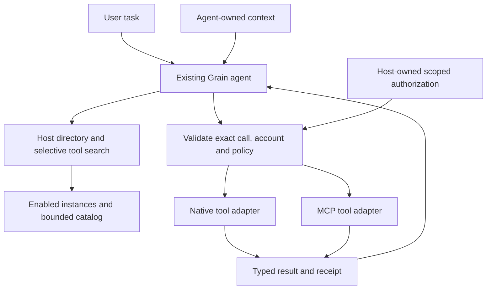
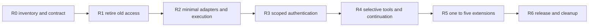

# Tool-only native and MCP extensions: revised execution plan

**Latest issuer implementation checkpoint, 3 October:** [Focused audit](MCP-REGISTRATION-ISSUER-AUDIT.md) accepts additional forward criterion **54**: preregistered client credentials cannot cross authorization-server issuers, even after logout/restart. A separate bounded OS-vault record retains exact client/issuer ownership; Connect and stored-grant use guard before consent/secret use. Explicit Save binds only after validated SDK discovery, preserves prior state on discovery failure and rejects unsafe partial publication. Final eleven-case OAuth regression, fresh repeat, detected negative control, shared Agent/smoke and logic/admission/build checks Pass. Original baseline **52 Pass / 1 Deferred (12)**; inventory **89 IDs / 74 self-contained / 70 self-tests**. No new human batch. Next separate recovery/status unit, then client metadata registration; physical removal and all release gates remain open/on hold as recorded below.

**Forward acceptance procedure 54 — registration issuer ownership (reviewed automated Pass):** with the maintained real app and two owned HTTPS issuers, save confidential credentials at A and complete consent. Keep the MCP resource URL unchanged while changing its advertised authorization server to B. Stored discovery and Connect must refuse, with no B token request and no Connect consent. Disconnect and restart; refusal must persist with the registration still present. Explicitly save B's independently configured secret/client and connect successfully, verifying the actual token request's nonsecret version receipt. Make issuer metadata unavailable; credential Save must fail without changing the existing grant/secret/registration, then restore metadata and reconnect using the old accepted configuration. Explicitly save a public A registration, verify no secret remains, and perform approved reads before and after disconnect/restart/reconnect. Repeat in a fresh profile; deliberately omit issuer rotation and require failure at the exact refusal assertion. Review partial-write logic/admission and independently verify owned processes, scratch and all three vault namespaces disposed. Preserve retained peer metadata in combined-suite inventory checks. This is an additional forward requirement, not a substitute for deferred live Linear expiry 12 or general production/provider certification.

**Earlier library-reuse checkpoint, 3 October:** B5a SDK and B5b native OAuth library reuse are accepted within their scoped regression boundaries; see the [native focused audit](NATIVE-OAUTH-REUSE-AUDIT.md). Standard native OAuth is delegated to exact `oauth2` 5.0.0 with Grain-owned bounded transport/account/vault rules. Next focused units: configured-client issuer ownership/typed recovery and client metadata registration. Baseline **52 Pass / 1 Deferred (12)**; physical retirement remains on hold, all release gates remain open. One new interrupted harness root joins the two existing policy-blocked scratch cleanup exceptions; it supplies no acceptance credit. Older checkpoints below retain historical scope.

**Current user decision, 3 October 2026:** baseline **52 Pass / 1 Deferred (12) / 0 active Pending**. Defer live Linear token expiry/refresh without marking it passed; begin the [forward reuse plan](MCP-EXTENSION-REUSE-EXECUTION-PLAN.md) after the [authentication/lifecycle comparison](MCP-AUTH-LIFECYCLE-REUSE-AUDIT.md). B5a upgrades only the official SDK boundary; B5b native OAuth follows separately. Obsolete-capability and wrapper removal are **on hold** until platform confidence and a separate decision. Tool calling is outside this comparison. All seven release gates remain open; older dated handoffs below are historical.

**Revised:** 2 October 2026. **Branch:** `extensions/tool-only-retirement`. **Status:** testing-only execution; **50 Pass / 3 Pending** (15 human, 35 reviewed automated). All ten B1 requirements, B2 checks 8/20/23/31, B3 checks 10/11/13/14/15 and all baseline B4 checks 46–48 are accepted. The [workflow interruption audit](AGENT-WORKFLOW-INTERRUPTION-AUDIT.md) closes denial, real expiry/restart, Stop, uncertainty and completed-receipt preservation, with controlled and configured-model repeats, detected faults and cleanup. Remaining numbered work: **B2 17 (1) + B3 9/12 (2)**. Historical official tools remain Pass; standalone initialization stays Blocked. Whole B2/B3 and all seven release gates remain open. No SDK/OAuth replacement or new feature starts. Two interrupted-run scratch cleanups remain policy-blocked/Pending with no final acceptance credit. The [provider-independence audit](MCP-PROVIDER-INDEPENDENCE-AUDIT.md) accepts check 14 with repeated controlled account isolation, dynamic-login cancellation and explicit fixed-port conflict recovery. The user selected Linear for the remaining live-account preparation; no live grant or refresh is certified yet.

**Controlled check 12 prerequisite:** the [MCP expiry/refresh audit](MCP-REFRESH-RECOVERY-AUDIT.md) adds actual SDK expiration, rotated-grant restart and refused-refresh recovery coverage. This does not change the **50 Pass / 3 Pending** ledger. Linear resource/issuer metadata is reachable from this machine; the finite isolated live-account path and human consent remain next. No ordinary account grant is copied, and API documentation cannot certify the actual MCP lifetime.

**Accepted check 48:** Eight controlled interruption cases passed their first run and clean repeat; two genuine configured-model adapter cases each passed denial and post-write outage tasks in two fresh profiles. Evidence includes the actual 120-second approval deadline and host restart, blocked changed-argument write retries, pending/active close, displayed completed receipts with unfinished work, and one uncertain MCP write independently verified without replay. Three deliberate faults were detected; 16 affected regression cases and all 49 runner self-tests passed, with cleanup and independent resource inspection passing. The maintained inventory is 78 scenarios. No new manual batch or production implementation change is assigned by this unit; see the [focused audit](AGENT-WORKFLOW-INTERRUPTION-AUDIT.md).

**Agent selected-tools and continuation accepted (2 October):** [Focused audit](AGENT-WORKFLOW-AUDIT.md) accepts **46 and 47** together. Six real-app controlled cases and two genuine-model cases pass twice in fresh profiles. Metadata stays schema-free; incremental tool loading preserves earlier selections, catalog/directory/byte limits are enforced, and both native and MCP read → approved disposable write → verify tasks execute exactly one write. Batched tails, three duplicate approvals per adapter and disabled-owner writes cannot dispatch. Four deliberate faults are detected at their exact assertions; affected authentication/transport/foundation/smoke regressions and cleanup pass. **48 Pass / 5 Pending**, inventory **68 IDs / 44 self-tests**. The user-selected configured model supplied actual calls and final replies; no personal provider objects or keys entered the isolated profile/evidence. Check 48 and whole B4 remain open. No new manual batch or ordinary production Agent/auth/dependency change.

**Forward execution plan (1 October):** [Source audit, code disposition, library reuse and all 25 pending checks](MCP-EXTENSION-REUSE-EXECUTION-PLAN.md) is authoritative for what comes next. It preserves this document's product contract, R0–R6 release gates and full numbered test procedures. Historical handoffs below do not override the forward execution order.

**Maintained progress companion:** [Implementation progress, deviations and grouped user tests](MCP-EXTENSION-PROGRESS.md). Update that report alongside these plans after each implementation slice and when user test results arrive.

**MCP client configuration and stale approval accepted (2 October):** [Focused audit](MCP-CLIENT-CONFIGURATION-AUDIT.md) accepts **11 and 13** together. Empty-secret public and actual confidential registrations, public ID changes, same-ID secret rotation/removal and unsupported missing-secret refusal use real settings/SDK/OS vault paths. Four old confirmations dispatch nothing; ten approved A/B reads and five actual restarts identify the correct account without new login. The full six-case OAuth regression retains account-switch and disable/re-enable evidence; final clean repeat, detected skipped-client-change fault, eight native-auth, two smoke and two short transport/catalog cases pass, cleanup Pass. A harness callback-owner leak was repaired by consuming each delivered URL once while preserving issuer codes for actual late-login refusal. **46 Pass / 7 Pending**, inventory **60 IDs / 38 self-tests**. No new manual batch or ordinary production auth/transport/dependency change. Compile once per stable unit and select affected regressions; real clocks and distinct failure stages remain intact.

**Previous authenticated MCP shutdown accepted (2 October):** [Focused audit](MCP-AUTH-SHUTDOWN-AUDIT.md) accepts **15**. Provider Disable and Developer Mode off across modern/legacy JSON/SSE return honest uncertainty for eight held approved reads, discard late responses, preserve login and refuse eight old confirmations without dispatch. Twenty-four fresh/restart A reads succeed without a new authorization exchange. Real tests exposed legacy-session cleanup trying to reload an invalidated account ticket; an operation-scoped zeroizing owner now permits one bounded DELETE for the exact original session, with no refresh or tool replay. Fourteen combined MCP cases, clean five-case OAuth repeat, eight native-auth, two smoke and two public live cases pass; skipped Disable fails immediately with cleanup Pass. Official tools pass; known initialization stays Blocked. **44 Pass / 9 Pending**, inventory **59 IDs / 36 self-tests**. No new manual batch. Check 13 has shutdown/stale-confirmation evidence but remains Pending for changed-client variants; check 17 still requires eligible live nested evidence.

**Previous authenticated MCP cancellation accepted (2 October):** [Focused audit](MCP-AUTH-CANCELLATION-AUDIT.md) accepts **31**. Four authenticated held-read closes and four pending closes preserve the actual enabled account and scoped grant; late responses never reach the model, and twelve fresh/restart A reads succeed without new authorization. All thirteen combined MCP cases, a clean four-case OAuth repeat, eight native-auth cases and two smoke cases pass; deliberate production disconnect fails the preservation oracle and cleans up. A reproduced 256-entry OAuth evidence-log limit was repaired with bounded capacity and an exhaustion self-test; production limits/clocks are unchanged. **43 Pass / 10 Pending**, inventory **58 IDs / 35 self-tests**. No new manual batch. B2 now needs only eligible live nested-read check 17; whole B2/B3 and release gates remain open.

**Previous MCP OAuth/late-login unit (2 October):** [Focused audit](MCP-AUTH-FIXTURE-AUDIT.md) accepted only **10** after final combined twelve-case and fresh three-case runs, three actual cancellation boundaries, no old-callback account resurrection, fresh B/restart reads, detected wrong-account/abandoned-credential faults and affected regressions. Historical inventory **57 IDs / 34 self-tests**, ledger **42 Pass / 11 Pending**. Actual SDK public registration/PKCE/resource/vault and A/B reads supplied the prerequisite for check **31**; live browser consent/expiry, registration/config variants, independent MCP providers and staged Agent work remained open. One stricter-oracle assumption and the bounded journal/teardown crash were repaired; failed/interrupted evidence and policy-blocked scratch cleanup remain recorded. No new product feature or dependency replacement.

**Previous B2 public live unit (2 October):** [Focused audit](MCP-LIVE-READ-AUDIT.md) accepts 8/20 after two final fresh-profile live runs and a detected missing-evidence fault. A generic-ID HTTP 400 legacy rejection exposed a real negotiation failure; the narrow repair keeps SDK correlation and shared byte/deadline/account budgets, with no tool retry. All nine controlled MCP, eight native-auth and two smoke cases pass; official tool conformance still passes and malformed initialization remains Blocked. **54 IDs / 31 self-tests**, ledger **41 Pass / 12 Pending**. The live suite is explicitly opt-in and limited to fixed public documentation; no personal account or ordinary catalog provider is added. Retention conditions for the debug guard and temporary SDK interoperability shim are documented.

**Historical B2 pinned official conformance unit (2 October, before public live acceptance):** the [focused audit](MCP-CONFORMANCE-AUDIT.md) accepts only named legacy/modern tool calls through the real Agent, with exact approval/result, official wire validation, clean repeats and detected missing-evidence fault. Standalone initialize stays Blocked by the pinned raw fixture's empty discovery reply; the complete entry exits 2, tools subset exits 0. Inventory then: **51 IDs** (48 self-contained plus three external official cases, one Blocked), **28 self-tests**. All eight existing MCP, eight native-auth and two smoke regressions passed with cleanup Pass. Ledger then **39 Pass / 14 Pending**. No SDK/native OAuth replacement, physical retirement or broader feature work started. Retention conditions and earlier cleanup exception remain documented.

**B2 catalog/deadline testing unit (2 October):** the [focused audit](MCP-CATALOG-DEADLINE-AUDIT.md) records 24 separately identified management/Agent catalog-limit combinations, four unchanged 45-second tool-call deadlines and two unchanged 90-second absolute-discovery deadlines. Both full eight-case MCP runs pass with final matching identities, independent cleanup/recovery and detected accepted-catalog fault. Current inventory: **48 maintained scenarios**, eight MCP and 23 self-tests. This controlled unauthenticated peer supports existing checks without supplying live-account/conformance acceptance; **39 Pass / 14 Pending** stays unchanged. A hard interruption exposed a reporting gap: bounded per-case checkpoints were added, and the interrupted run's policy-blocked scratch cleanup remains explicitly Pending. Next B2 work is the guarded pinned official-conformance entry through production wrappers, followed by eligible live/account evidence. No new manual batch or broader feature implementation starts here.

**B2 first unit accepted (2 October):** [Catalog/transport audit](MCP-CATALOG-TRANSPORT-AUDIT.md) accepts 23 using the real app and a guarded unauthenticated HTTPS MCP peer. JSON/SSE modern discovery and legacy handshake, nested wire/result values, selected schemas, mixed/excluded/all-unsupported catalogs, cursor refusal, actual restart and stale disable/schema approvals pass. Both final cases pass twice in fresh profiles; both deliberate corruptions fail; all eight native-auth and both ordinary smoke cases pass, cleanup Pass. Inventory: **42 distinct scenarios**, including two MCP cases. Ledger: **39 Pass / 14 Pending**. Checks 8/17 have controlled supporting evidence and remain Pending for their live requirements; 20/31, conformance and whole B2 remain open. No new manual batch. The fixed peer stores no credential; account persistence/authentication are excluded. The audit retains all early TLS/fixture/oracle/bootstrap failures.

**Historical B1c final numbered unit accepted (2 October, before B2):** [Native refresh/logout audit](NATIVE-AUTH-REFRESH-AUDIT.md) accepts 44: actual approved held refresh cannot authorize an old read after logout/reconnect; an awaited late auth future cannot republish a discarded grant; two reviewed native identities in the same host remain independent, survive restart and preserve the peer after primary removal. The primary concurrency probe uses production auth and erases its result; peer execution retains normal Agent approval. Full eight-case native-auth regression, final fresh-profile repeat, ordinary smoke and deliberate early-release failure have expected verdicts, all cleanup Pass. Inventory is 40 distinct cases. Ledger **38 Pass / 15 Pending**. No new manual batch. Next B2; retained input findings, live providers, production orphan recovery and all release gates remain open.

**Historical B1c partial unit accepted (2 October, before check 44):** [Native schedule audit](NATIVE-AUTH-SCHEDULE-AUDIT.md) accepts 42/43/50/51: six actual developer-reload/disable/disconnect cancellation schedules; A/B stale-approval refusal and verified new reads; cancelled/denied/failed switch persistence; rejected partial consent and actual expiry/reconnect/one-refresh recovery. All seven account cases and final fresh-profile four-case repeat passed; deliberate skipped-cancellation/full-consent faults failed with cleanup Pass. Inventory is 39 distinct cases. No manual batch is needed. Check 44 remains open; no provider-independence or production orphan-reconciliation certificate follows.

**Historical B1b numbered handoff (2 October, before B1c):** [Native binding/owner audit](NATIVE-ACCOUNT-OWNERSHIP-AUDIT.md) accepts 41/45/53 using expired historical credentials, four reviewed declaration changes, actual CLI developer A/B builds, verified account/source results, reload/restart/restoration and exact parked-grant deletion. Two final combined runs and both new negative oracles have expected verdicts and cleanup Pass. The maintained inventory is 35 scenarios. No new manual batch is assigned. Three discarded developer grants still required independent run-vault cleanup; production reconciliation and whole R3 remain open.

**Historical B1b fixture prerequisite (2 October, before numbered acceptance):** [Guarded native account audit](NATIVE-AUTH-FIXTURE-AUDIT.md) records actual permission review, production OAuth/PKCE and Windows vault, approved A/B API reads, stale approval refusal, restart and disconnect cleanup. Two final clean runs passed; wrong-account and abandoned-credential faults failed as expected with cleanup Pass. The maintained harness now has 33 distinct scenarios. This accepts only the fixture prerequisite, with no new numbered-check credit or manual batch. Full declaration/owner checks and B1c cancellation/refresh schedules remain pending.

**B1a accepted (1 October):** [Native foundation audit](NATIVE-FOUNDATION-AUDIT.md) records actual edited-legacy preservation across restart/interrupted checkpoint, typed worker result verification, changed-contract refusal, the reproduced terminal-owner quarantine repair and repeated affected acceptance. Two new maintained scenarios expand the harness to 32 distinct cases. Eight B1 account checks remain; no additional manual test is assigned for this controlled slice. Retained input observations and whole 2D remain open.

**Agent acceptance automation (1 October):** [Persistent Agent test harness](AGENT-TEST-HARNESS.md) and its [maintained usage instructions](../../tests/agent-harness/README.md) cover the implemented reproducible runner, isolated real Tauri/WebView2 host, native lifecycle/Agent scenarios and separate production-logic suites. The user explicitly authorized real-application automation, superseding the old restriction; `AGENTS.md` records that change. Preserve the sequential block audits and distinguish partial automated coverage from full manual acceptance. Controlled MCP, human-assisted account certification and deeper Agent suites remain future harness units.

**Block 2B accepted (1 October):** [Native close/reload audit](NATIVE-LIFECYCLE-AUDIT.md) records the reproduced Windows registry publication failure, bounded atomic-publication repair and synchronized transient shortcut cleanup. The harness includes a ten-pair close/reopen/Escape case and real Windows locking regressions. Repeated developer reload, in-flight replacement and disabled-state behavior passed automated checks; the user now reports the remaining ordinary dictation/pill/Agent observations worked. Check 37 is Pass and 2B is accepted with aggregate user evidence recorded in the progress companion. Continue 2C and 2D in order before the controlled MCP block; no hosted account login is required now.

**Block 2C implementation/audit (1 October):** [Native failure audit](NATIVE-FAILURE-AUDIT.md) records the real source-drift recovery bug and its exact-identity repair, deadlines, error privacy, input refusal, result/wire bounds and token/supervisor cleanup. All 19 real-app cases passed and the six new failure cases repeated; the deliberate outcome fault was detected. Checks 21, 24, 26, 32 and 33 have reviewed automated Pass evidence. The user confirms all three ordinary-app observations and supplied the expected warning and fresh tool result. Check 34 is Pass and 2C is accepted. Continue 2D before MCP/authentication. The numbered ledger is 19 Pass / 34 Pending, with human and automation evidence identified separately.

**Block 2D first unit (1 October):** [Native installation audit](NATIVE-INSTALLATION-AUDIT.md) records real consent Cancel/Allow, exact stale review/call refusal, same-version installed bytes, developer A/B/installed restoration and ten actual host restart transitions per batch. All 24 real-app scenarios passed and the five new cases repeated; deliberate skipped restart failed as required. Checks 19, 38 and 52 have reviewed automated Pass evidence. Ledger: **22 Pass / 31 Pending**. The user confirms the small ordinary-app consent/restart/dictation batch passed; check 40 is Pass and the first 2D unit is accepted. Ledger after that result: 23 Pass / 30 Pending. At that first-unit snapshot CLI packaging, signed-store schedules and native account portions remained separate. The following packaging unit closes the CLI gap; the whole 2D block and all seven phase gates remain open.


**Block 2D packaging unit accepted (1 October):** [Native CLI packaging audit](NATIVE-PACKAGING-AUDIT.md) records actual CLI builds/doctor/pack, same-version replacement, current bytes winning over preserved legacy files and saved installed ownership through overrides/restarts. The focused audit added explicit original-approval refusal after a complete override/restoration cycle. All 25 real-app scenarios passed before that addition; all six final installation cases passed twice afterward, and a deliberate stale-package fault was detected with cleanup Pass. Checks 28 and 39 are reviewed automated Pass; ledger at that packaging snapshot **25 Pass / 28 Pending** (15 human, 10 automated). Check 40 is already user-accepted. The following unit covers signed-store install/offline/download schedules (18/36), while wider registry/native-account portions (49/53) remain separate. Whole 2D and all seven phase gates remain open.

This document replaces the execution plan dated 26 September in this same file. The user's scope correction is authoritative: extensions supply tools/functions through either a native Grain adapter or an MCP adapter. They no longer extend Grain's internal features. Retirement is a settled product decision, not a backlog for restoration.

The 27 September implementation closes retired host access first. Previously paused MCP outcome/discovery/cleanup changes were reviewed against this reduced scope, retained and re-tested. The evidence below describes this implementation slice; it does not certify the full extension release.

**Block 2D signed-store unit accepted (1 October):** [Signed-store audit](NATIVE-STORE-AUDIT.md) records ten actual Store loading/close/reopen cycles, signed test-anchor installation, real consent and Agent greetings, offline controls/backend refusal, corrupt signature/hash refusal, and held downloads superseded by disable/removal. The audit expanded check 36 to assert disabled/removed choices after actual restart and repeat both schedules under a developer override, including preservation/removal of the parked installed owner. All 28 real-app cases passed before that expansion; all three final store cases passed twice afterward. The intentional withheld-close fault is detected with cleanup Pass. Checks 18/36 are reviewed automated Pass; current ledger **27 Pass / 26 Pending** (15 human, 12 automated). Production root rotation, publisher/live accounts and OS vault certification are excluded. Next is remaining 49/53 registry/account recovery prerequisites; whole 2D and all seven phase gates remain open.

**Block 2D registry testing unit accepted (1 October):** [Registry audit](NATIVE-REGISTRY-AUDIT.md) records four damaged startup/recovery fixtures, installed/disabled/quarantined and opaque-pointer preservation, and actual Windows failed-enable/failed-disable publication schedules across real restart. No application features changed. All 30 final real-app cases passed in `run-I1qAql`; the three registry cases repeated in `run-CfCnvH`; deliberate pointer loss failed as expected, all cleanup Pass. Check 49 is reviewed automated Pass, concerning registry/pointer serialization only. Current ledger **28 Pass / 25 Pending** (15 human, 13 automated). Check 53's account fixture portion remains Pending/Blocked. Earlier intermittent Escape failures remain recorded despite final passes. Finish foundation testing first; whole 2D and all seven phase gates remain open.

**Native-input testing follow-up (1 October):** [Investigation record](NATIVE-INPUT-INVESTIGATION.md) distinguishes a reproduced Windows setup denial with zero Escape input from the older accepted-input timeout. The test adapter now records input stages and can use one guarded real owned-header click for activation. Explicit click-path and withheld-key checks retain actual close/no-dispatch assertions. No application source or new platform capability changed; the earlier accepted-input observation and account fixture 53 remain open. The ledger stays 28 Pass / 25 Pending; do not resume feature work from these local passes.

## Testing-first execution order — 1 October correction

The user clarified that testing the existing implementation must finish before further platform improvements. Freeze new extension/Agent product features during this pass. Work through the existing acceptance matrix in focused modules, extend the maintained harness where needed, reproduce/fix actual failures, and audit/retest each module. Missing account/provider/desktop prerequisites remain Pending/Blocked, never Pass. Do not advance feature implementation because only the convenient automatic checks passed. After the foundation testing pass is complete, resume the remaining implementation plan one block at a time, with its own acceptance and audit. The original 53 checks keep their numbers; resource/upgrade and whole-phase gates remain separately explicit.

## Library ownership decision — 1 October 2026

The user paused execution to settle reuse before more testing or implementation. Keep Grain's existing Agent and tool-only native/MCP adapters. Select the official Rust MCP SDK as the protocol implementation, established libraries for standard OAuth/schema/storage operations, and official MCP conformance as additional test infrastructure. Do not introduce a second agent framework, gateway, runtime or orchestration engine for this release. This changes maintenance ownership and future delivery slices, not the extension product boundary or acceptance results.

### Short source check: what comparable hosts actually use

The following are branch snapshots checked on 1 October, not claims about every shipped binary or independently measured reliability. Reference links may advance; implementation dependencies and CI actions must use locked releases/commits.

| Host | Verified implementation | Pattern applicable to Grain |
|---|---|---|
| Goose | Its [workspace manifest](https://github.com/aaif-goose/goose/blob/main/Cargo.toml) declares `rmcp` with a 3.4.1 minimum. The [core manifest](https://github.com/aaif-goose/goose/blob/main/crates/goose/Cargo.toml) enables SDK client/auth transports and uses `oauth2`. Its [HTTP adapter](https://github.com/aaif-goose/goose/blob/main/crates/goose/src/agents/extension_manager/streamable_http.rs) uses SDK authorization/transport, with a [host credential store](https://github.com/aaif-goose/goose/blob/main/crates/goose/src/oauth/persist.rs). | Use the official Rust protocol library plus an application-owned adapter. Borrow explicit tool ownership and cache invalidation from its [extension manager](https://github.com/aaif-goose/goose/blob/main/crates/goose/src/agents/extension_manager/mod.rs); do not import its wider platform capabilities. |
| OpenCode | Its [manifest](https://github.com/anomalyco/opencode/blob/dev/packages/opencode/package.json) selects the official TypeScript MCP SDK and AI SDK provider packages. Its [MCP client](https://github.com/anomalyco/opencode/blob/dev/packages/opencode/src/mcp/index.ts) and [OAuth provider](https://github.com/anomalyco/opencode/blob/dev/packages/opencode/src/mcp/oauth-provider.ts) retain application connection/auth ownership. | Distinguish authorization required from missing client registration; close failed connection attempts and bind stored credentials to the configured server. Its file-based storage is not Grain's vault policy. |
| Cline | Its [core manifest](https://github.com/cline/cline/blob/main/sdk/packages/core/package.json) depends on the official TypeScript MCP SDK; the [VS Code MCP hub](https://github.com/cline/cline/blob/main/apps/vscode/src/services/mcp/McpHub.ts) owns connections, refresh scheduling and disposal. | Reuse the SDK while testing configuration churn and stale catalog publication in the host. Its resident connection/watch infrastructure is not a requirement for Grain. |
| Rig | Its [native MCP adapter](https://github.com/0xPlaygrounds/rig/blob/main/crates/rig-rmcp/src/native.rs) wraps an existing `rmcp` server sink and translates tool calls/results. | A Rust LLM adapter remains a possible later reuse opportunity; this wrapper does not replace Grain's credential, approval or native-package boundaries. No Rig dependency is selected now. |

### Selected stack and responsibility split

| Responsibility | Selected component | Grain still owns |
|---|---|---|
| MCP wire, negotiation and MCP OAuth | Official [`rmcp`](https://github.com/modelcontextprotocol/rust-sdk); current lockfile 3.1.4, selected upgrade candidate [3.5.0](https://github.com/modelcontextprotocol/rust-sdk/releases/tag/rmcp-v3.5.0) | Exact identity/approval, supported capability profile, connection lifetime and bounded network policy. Preserve client/auth/HTTP-only feature selection; no roots, sampling, prompts, apps or local-process support is added. |
| Native API OAuth building blocks | [`oauth2` 5.0](https://docs.rs/oauth2/5.0.0/oauth2/), planned for R3 after the native baseline is accepted | Provider declarations, callback ownership, issuer/account/scopes, vault publication, cancellation and bounded/redacted responses. Use the library for authorization-code/PKCE/exchange/refresh building blocks, not a second MCP auth manager. Native API and MCP grants remain distinct. |
| Authoritative JSON Schema validation | Existing `jsonschema = 0.58.1`, default features off | Complexity limits, offline reference policy, supported dialects and privacy of errors. Do not handwrite another schema evaluator. |
| HTTPS and async execution | Existing `reqwest` and Tokio | Deadlines, byte limits, credential destination policy and cleanup. Keep the current app 0.12/MCP 0.13 HTTP boundary until separately verified; no unrelated HTTP migration is bundled. |
| Secret persistence | Existing `keyring` OS-vault integration | Account/instance keys, disconnect generations, transactional activation and reconciliation. Do not replace it with a framework's default token file. |
| Protocol acceptance | Official [MCP conformance](https://github.com/modelcontextprotocol/conformance), testing only | A guarded adapter exercising Grain's production MCP wrappers, frozen applicable requirements, required-check coverage and explicit unsupported/skip reports. SDK conformance alone does not certify Grain. |
| Agent execution, tool discovery and native extensions | Existing Grain contracts and maintained `tests/agent-harness/` | Selective schema exposure, approvals, uncertain outcomes, worker/package ownership, real-app tests and live-account certification. No new search service or durable workflow engine is needed. |

`rmcp` 3.5.0 offers an [optional credential refresh guard](https://github.com/modelcontextprotocol/rust-sdk/blob/rmcp-v3.5.0/crates/rmcp/src/transport/auth.rs). Its default provides no cross-client coordination. Connect that hook to Grain's credential identity if it replaces duplicated coordination safely; retain the existing per-provider serialization until overlapping refresh and logout tests prove equivalent ownership. Upgrading does not automatically fix account races.

### Bounded delivery order

The [detailed forward plan](MCP-EXTENSION-REUSE-EXECUTION-PLAN.md#7-execution-blocks-and-acceptance-order) replaces the earlier ambiguous order that could place the SDK upgrade before completion of the 25 pending checks.

1. **Documentation now (B0):** source/evidence audit, disposition and test mapping only. No product changes, new verdicts or completed phase gates.
2. **Existing foundation acceptance (B1–B4):** finish all 25 pending objectives on the current implementation: native migration/contract/accounts (10), MCP transport/tools (5), MCP auth (7), and Agent workflows (3). Extend guarded real-app fixtures and integrate conformance against the current production boundary. Fix demonstrated failures and audit/retest each unit. Missing prerequisites remain Pending/Blocked; no provider expansion or dependency replacement bypasses them.
3. **R2 SDK ownership refactor (B5a):** map custom code to upstream behavior, lock the reviewed SDK candidate, and remove only duplication proven equivalent for bounds/cancellation/outcomes. Repeat affected MCP/auth/Agent acceptance on the final implementation. Preserve host identity and uncertain-write protections.
4. **R3 native OAuth refactor (B5b):** replace standard OAuth operations with `oauth2`; retain bounded/redacted HTTP, callback/vault/account publication and migration behavior. Repeat native account/owner/workflow acceptance and affected real-provider certification.
5. **Physical retirement (B5c):** remove exclusive obsolete implementations/wiring after tracing shared callers. Preserve first-party capabilities, migration archives and refusal tombstones; audit/retest each deletion unit.
6. **Remaining R0–R6 capabilities and release (B6–B7):** finish reduced contract, reviewed read policy, metadata freshness, auth continuation and recovery in separate accepted/audited modules, then native-plus-MCP and one-to-five-extension workflows, resources, compatibility and release gates. Publish measured evidence rather than universal compatibility claims.

Success is fewer generic behaviors maintained in Grain, unchanged tool-only boundaries and demonstrated behavior through the production adapters. Do not retain an old custom implementation beside its replacement as a second production path. Do not remove host guards on the strength of an upstream feature name or a green SDK benchmark. No migration-time or RAM saving is claimed without measurement.

Kit, `mcp-agent`, `mcp-use`, ToolHive, Goose-as-a-runtime and `mcp-proxy` are not selected dependencies for this release. They remain targeted references. Reopen a gateway/runtime decision only for a concrete requirement such as managed local MCP execution or enterprise aggregation. Reopen Rig only when measured provider-adapter maintenance and a focused compatibility prototype justify replacing that layer. Generic retries, hedging, mirroring and caching cannot be applied to uncertain writes without a verified provider deduplication contract.

## Current execution evidence — 27 September 2026

Branch: `extensions/tool-only-retirement`. No implementation commits go to `main`.

| Area | Implemented | Remaining gate |
|---|---|---|
| R0 contract | Native means a tool adapter; SDK grants restricted to exact-host network, namespaced storage and scoped auth. Agent prompt rules also refused. | New versioned adapter contract, identity/account generations, baseline RAM/latency measurements |
| R1 enforcement | All public SDK trust validators reject mixed retired features; host dispatch rejects retired RPC even with historical or `All` grants; event feed is pill-only. Runtime load, spawn and exact action invocation revalidate. Signed installs validate bounded JSON and signed id/version/tier/permissions before staging. | Full production-path restart/late-completion fixtures and remaining compatibility tombstones |
| R1 migration | Persistent quarantine disables packages, clears obsolete grants/slot ownership and parked dev enablement. Before host startup, edited extension prompt entries are archived atomically, then removed from active selection. Repeating/interrupted archive migration is safe. Artifacts and user storage survive. | Real-app interrupted restart/upgrade/rollback verification and stale approval/catalog generation audit |
| R1 hooks | No daemon activation subscriber, startup workers, active extension prompt contributions, transcript transforms, session stages, shortcuts or whole-request hand-off. Recommendation Lab generator refuses creation; existing lab data retains cleanup support. | Remove remaining unreachable implementations and external first-party-as-extension catalog registrations after ownership review |
| Authoring | New CLI projects declare one exact tool through `grain.actions`, with no activation/shortcut. Generated SDK API/types omit retired host services. Developer/checker fixtures certify refusal of companions and sessions. | Update historical examples/docs for the reduced runtime API; no promise of arbitrary executable containment |
| Retained R2 foundation | Whole-operation MCP deadlines, bounded raw/catalog bytes, per-tool schema isolation, native validation and synchronous registry-to-queue admission, host-owned replacement/restore generations, warm worker source identity, Agent conversation/confirmation cancellation ownership, typed results and owned cleanup. | Real-app cancellation certification, native account generations, full execution policy and complete outcome certification |

**Paused-diff disposition:** retain/adapt `execution.rs`, `action_exec.rs`, MCP implementation, cancellable SDK HTTP wrapper and actual-SDK protocol tests; retain the Windows test runner and Common Controls manifest as test infrastructure. The direct SSE crate uses the version already in the lockfile. Drop any interpretation that these changes preserve broad extension privileges. No agent capture expansion, provider expansion or broad extension engine was added.

**Deterministic verification (Windows/MSVC):** core 209 unit + 4 integration tests; SDK 72; extension CLI 9; extension checker 23; backend host API 16, event auth 8, extension-related 48, developer loader 4, MCP 19 and action executor 4. Filtered backend groups overlap and are not a unique-test total. Registry tools compile and their zero-test target is reported as such. Frontend TypeScript/production build and backend library check pass. The MCP tests use the production dispatch conversion and actual pinned SDK over local protocol fixtures, including a lost write response (one call, no replay), hanging HTTP/SSE cleanup, pagination loops, changed schema/disable before dispatch, unsupported results and 100 sequential connection closures. Live provider/account certification and manual real-app UX are **not** performed.

Reproduce from repository root (PowerShell; `rtk` was unavailable on this machine):

```powershell
cargo test -p grain-core -p grain-sdk -p grain-extension-checks -p grain-ext-cli -p grain-registry-tools --locked --offline
$env:CARGO_TARGET_X86_64_PC_WINDOWS_MSVC_RUNNER = "powershell.exe -NoProfile -File $PWD/scripts/run-rust-test.ps1"
# Repeat with host_api::, events_auth::, extension_, dev_extensions::, action_exec::
cargo test --manifest-path src-tauri/Cargo.toml --lib --locked --offline grain_mcp::
cargo check --manifest-path src-tauri/Cargo.toml --lib --locked --offline
bun run build
```

The runner embeds Common Controls v6 only in the generated Tauri lib-test executable using installed Windows SDK `mt.exe`. It does not change registry settings or application binaries. Backend checks retain existing context/upstream warnings; no Handy source is modified. The unrelated pre-existing `src/app/bindings.ts` changes are excluded from these commits.

**Next:** finish R1 external catalog filtering, compatibility cleanup and real-app migration/late-completion evidence before provider expansion. R2–R6 stay incomplete; authentication certification, selective schema hydration, approval continuation and the one/two/three/five-extension ladder still need execution. The checklists below remain release criteria, not claims inferred from this slice.

### R1 follow-up: runtime, controls and migration checkpoint

The production worker shim now exposes only `actions`, namespaced storage, exact-host networking, scoped auth, log support and identity/capability metadata. Retired capture/OS/doc/settings/LLM/semantic/session/event/whole-request registration APIs and injected activation context are removed. Only explicit `action` calls reach handlers; unrecognized call/event frames are ignored or refused. Registration copies own functions into a prototype-free map. Socket close rejects outstanding host requests, clears queued frames and refuses new requests.

Worker death/kill messages carry the worker token as generation identity. Rust refuses stale death reports and filters queued spawns against current ownership; the supervisor refuses stale kill/error callbacks and replaces a different live token explicitly. These guards cover the tested worker-replacement cases; they do not yet certify every concurrent supervisor creation/teardown interleaving or MCP account generation race.

The extension management commands for application capture/picking and setting mutation are now retirement tombstones. Setting schema/sections and shortcut status return no contributions. Core Snippets/Context/Agent toggles cannot be changed through extension enablement. Existing core UI writes its own settings independently. Cards and approval requests no longer advertise prompt/recommendation/semantic/auto-send access; tool/account/permission approval remains. Retired settings/shortcut components, core-feature extension shelves and their catalogue fetching/listeners are removed. The obsolete Recommendation Lab runtime and its positive whole-request tests are deleted; cleanup identity/path support survives. This is functional retirement in existing screens, with no UI redesign or upstream source change.

Startup also archives exact custom extension binding records in `retired-extension-bindings.json`, then removes only the reserved `ext:` binding namespace. Core bindings survive. Registry checkpoint `tool_only_migration_version = 1` is persisted only after quarantine, archival and settings persistence; validation runs every startup even after that checkpoint. Corrupt archives fail without overwrite, repeated archival deduplicates, and a failed checkpoint write remains retryable in the same process. Existing prompt and binding archives are inert recovery data, not import routes that restore retired execution.

**Fresh evidence:** core 212 unit + 4 integration tests, SDK 72, CLI 9, checker 23; backend extension host 26, imported update security 5, host API 16, event auth 8, MCP 19; complete frontend suite 100 tests in 13 files. Changed frontend lint, TypeScript/production build and backend library check pass. Worker tests execute the production wire shim in Node VM with a protocol test socket; they do not render an alternate app, mock Tauri UI or use browser/computer automation. Manual real-app visual confirmation remains required. Existing context/upstream warnings remain, and unrelated generated bindings are excluded.

**Research recheck:** [MCP architecture](https://modelcontextprotocol.io/specification/2026-07-28/architecture) keeps orchestration, conversation aggregation and client boundaries with the host; [Goose adapter definitions](https://github.com/aaif-goose/goose/blob/04ed836c8cde23e540cc77d256992e00be99298b/crates/goose/src/agents/extension.rs) inform native/MCP separation; [VS Code connection ownership](https://github.com/microsoft/vscode/blob/a460613c57b4c1eb2bc8edc97be694e05ae286b2/src/vs/workbench/contrib/mcp/common/mcpServerConnection.ts) informs owned lifecycle cleanup. The concrete tool-only API removal and migration checkpoint are Grain choices, not protocol mandates.

**Still open in R1:** full real-app restart/upgrade/rollback evidence, external catalogue compatibility filtering, stale approval/catalog generation audit, every supervisor teardown race, and remaining broad-platform implementation/tombstone cleanup after ownership checks. R2 transport-body limits/native parity, R3 account certification, R4 selective hydration/continuation and the R5 integration ladder remain open. No gate is completed merely by deleting old positive tests.

### R1 lifecycle follow-up: supervisor and request ownership

Each scripted supervisor now gets a monotonic generation and a distinct `extension-host-<generation>` window label. Rust injects the generation before page scripts run; readiness and initialization failure identify it. Late/duplicate readiness cannot flush replacement queues, a cancelled creation closure cannot create an obsolete window, and delayed close targets only its original label. The existing capability file matches that label namespace with the same permission set. No background service or general extension engine is added.

Spawn/queue/stop bookkeeping uses the existing supervisor gate. Concurrent cold requests reuse the current worker token instead of replacing it and leaking credentials. Stop removes queued source immediately. Creation/scheduling failure and unexpected window destruction retire the generation and remove scripted workers by exact token; companion identities are excluded. Listener registration handles page closure during an await. Shutdown unregisters listeners, clears callbacks, terminates workers and revokes Blob URLs. Partial initialization failure reports its generation after cleanup.

Tool calls retain the token returned by the wake operation, wait only for that generation, recheck action approval after the cold-start await and refuse replacement dispatch. Startup failure releases the owning worker promptly. Pending registration and frame enqueue occur under the worker registry lock. A drop guard removes pending entries on future cancellation, deadline, channel failure and completion. Incoming results carry the authenticated socket token into correlation: an old socket cannot resolve the same call number in a replacement. Idle victim snapshots also carry tokens. Separate same-generation idle/busy races, heap-observer/strike attribution, account/config generations and all manifest/approval interleavings are not yet certified.

The CLI's generated hello handler now returns the executor's documented `{ok: {title, body}}` envelope. Its previous bare result was incompatible with the parser. This is Grain's native-adapter contract, not an MCP result-schema requirement.

**Verification:** frontend 106 tests in 14 files (six production supervisor tests), extension host 32, event auth eight, host API 16, action executor four, MCP 19 and CLI nine pass. Changed frontend lint, TypeScript/production build and backend library check pass; four existing context/upstream warnings remain. Focused coverage includes stale readiness, generation-scoped failure snapshots, stale socket replies, refused replacement dispatch and dropped-future cleanup. A disposable CLI project was generated, bundled with the repository's esbuild and called through the production worker shim to verify its executor result envelope. Prior retirement/migration evidence remains applicable. Protocol unit tests do not certify real-window lifecycle, live providers/accounts or visual behavior.

**Reference recheck:** [VS Code connection ownership](https://raw.githubusercontent.com/microsoft/vscode/a460613c57b4c1eb2bc8edc97be694e05ae286b2/src/vs/workbench/contrib/mcp/common/mcpServerConnection.ts) disposes a handler whose asynchronous creation finishes after its owner is disposed. [MCP lifecycle guidance](https://modelcontextprotocol.io/specification/2025-11-25/basic/lifecycle) specifies initialization, operation, shutdown and bounded waiting; [Goose's extension model](https://raw.githubusercontent.com/aaif-goose/goose/04ed836c8cde23e540cc77d256992e00be99298b/crates/goose/src/agents/extension.rs) supplies native/MCP separation and typed setup errors. Grain's labels, tokens and queue locking are implementation choices informed by these sources. The historical lifecycle URL is intentional: the 2026-07-28 lifecycle URL currently redirects to versioning.

### Authentication ownership follow-up: R1/R2 races and R3 foundation

Grain owns OAuth and credential storage; neither the model nor an extension receives tokens. The pinned `rmcp 3.1.4` SDK remains responsible for registration, PKCE, audience/resource binding, token exchange and refresh. Grain now serializes login/discovery/calls per catalog provider, reads the latest vault grant for each short-lived client and retains no idle SDK client or background authentication service. Unrelated providers have separate gates. This conservative execution policy also prevents competing clients from refreshing the same rotating token.

Each operation captures a provider generation before waiting. Connect, disconnect, enable/disable, client changes and developer-mode shutdown invalidate old work and approvals even when the tool definitions are identical. A guarded synchronous commit inside the vault's blocking task shares its lock with generation invalidation: logout follows an already-started write, while an obsolete queued write cannot resurrect credentials afterward. Blocking vault tasks retain the operation lease until they actually finish, so dropping an async caller cannot let a new refresh race its detached write. Login's drop guard invalidates its generation even if the caller's future is dropped; failed cleanup cannot invalidate a replacement. Dispatched cancellation preserves uncertain write outcomes and never retries the call. Vault writes enforce the same 128 KiB limit as reads.

Login has one five-minute deadline covering the gate, discovery, registration, browser callback and exchange. Cancellation/window closure releases its listener; dynamic registration uses an ephemeral loopback port, while pre-registered clients retain their documented fixed redirect. Callback validation requires complete headers, the exact path, one matching Host, state, unambiguous parameters and an exact issuer when supplied/required. Issuer validation applies before interpreting **error** callbacks too. The SDK session API uses the same discovered metadata snapshot rather than triggering another discovery. Synthesized legacy OAuth endpoints are refused. Hosted metadata must identify an issuer, explicitly advertise S256 and use HTTPS for authorization/token/registration/issuer URLs without embedded credentials or fragments. The SDK's permissive missing-PKCE fallback does not override Grain's current-spec policy. The browser response says the callback was received, not that token exchange succeeded.

Public pre-registered clients can supply a client ID without a secret; saving an empty secret removes an earlier secret. Providers that require a confidential-client secret still need one. Changing client credentials disables the provider and clears the old grant before writing its replacement secret. A stored pre-registered client ID must match current configuration, and the configured secret is restored for later SDK refresh requests. Settings expose Cancel sign-in, track simultaneous providers independently, label vault status as **credentials stored** and label the Test result as **discovery passed**. Neither label certifies an Agent continuation or live account compatibility.

**Evidence:** 33 MCP tests pass (the previous 19 plus 14 callback/ownership/OAuth tests). Local HTTP tests use the actual pinned SDK and verify public-client PKCE/resource parameters, rejection before exchange, one refresh across two short-lived clients, preservation on transient refresh failure, callback listener release, stale approvals/commits, replacement-safe cleanup, async-owner drop, blocking-write lease ownership, HTTPS/PKCE metadata policy, and unknown outcomes after cancelling a recorded write. Action executor four, capability three and extension host 32 tests also pass. Frontend 106 tests in 14 files, changed-file lint/format, TypeScript, production build and backend library check pass; four existing context/upstream check warnings remain. Memory stores and bounded local protocol fixtures replace external accounts only in tests; these are not UI harnesses or production credential stores. Real-window behavior, OS-vault failure modes and live accounts remain unverified.

**Open R3 gates:** the vault still supports one configured account per catalog provider; instance/endpoint/client/account key migration and multi-account UX are not implemented. Grain has no published Client ID Metadata Document (CIMD), so it must not pretend a fabricated URL is a usable client identity. Pre-registration and advertised DCR remain the current modes. Published CIMD hosting/ownership, challenge-driven scope upgrades, rejected-grant recovery UX, token redaction across SDK diagnostics, callback/metadata/body byte budgets, OS-vault fault tests and live server certification remain release work. Six catalog entries are candidates, not six certified integrations. Deterministic passing tests do not close these gates.

### Authentication reference recheck (27 September 2026)

| Primary reference | Observed pattern | Grain decision |
|---|---|---|
| [MCP authorization specification](https://modelcontextprotocol.io/specification/2026-07-28/basic/authorization), [client registration](https://modelcontextprotocol.io/specification/2026-07-28/basic/authorization/client-registration), [security requirements](https://modelcontextprotocol.io/specification/2026-07-28/basic/authorization/security-considerations) | HTTP authorization uses metadata discovery, PKCE, resource binding and issuer validation; pre-registration/CIMD/DCR differ. Stdio credentials are a separate path. Hosted authorization requires HTTPS and explicit PKCE support. | Host-owned SDK OAuth plus strict hosted-metadata policy. Do not classify every 401 as OAuth or claim universal automatic registration. |
| [Pinned Rust SDK OAuth support](https://raw.githubusercontent.com/modelcontextprotocol/rust-sdk/rmcp-v3.1.4/docs/OAUTH_SUPPORT.md) and installed `auth.rs` | The SDK supports registration modes, refresh and issuer-bound credentials; it exposes metadata resolution source and a session API using an existing manager. It tolerates absent PKCE advertisement for older servers. | Preserve the SDK implementation, refuse derived legacy endpoints and missing S256, inject the no-redirect HTTP client, and serialize separate short-lived clients. Session construction preserves one issuer snapshot. |
| [Goose OAuth implementation](https://raw.githubusercontent.com/aaif-goose/goose/main/crates/goose/src/oauth/mod.rs), [credential persistence](https://raw.githubusercontent.com/aaif-goose/goose/main/crates/goose/src/oauth/persist.rs) | Native clients allow optional secrets, secure persistence and explicit published client metadata. | Permit public client IDs; keep secrets in the OS vault. A published Grain CIMD requires a real hosting/product decision. |
| [VS Code MCP host implementation](https://raw.githubusercontent.com/microsoft/vscode/main/src/vs/workbench/api/common/extHostMcp.ts) | Host-managed token acquisition, challenge discovery and bounded auth retry accompany owned connection cancellation. | Keep credentials outside model/tool definitions. Cancel obsolete ownership; do not transplant retries that could repeat uncertain writes. |

These are multiple independent implementations plus the standard, not a claim that popularity establishes correctness. Reported [Goose refresh races](https://github.com/aaif-goose/goose/issues/12016) and [VS Code static-header auth classification](https://github.com/microsoft/vscode/issues/334970) are additional failure reports, not verified universal behavior or proof that those projects are fixed. Grain's local tests supply its own evidence.

### R1 catalog consumers and R2 schema validation follow-up — 27 September

**Implemented:** one SDK catalog policy now gates browse/detail projection, cover selection, direct store downloads and core staging. It accepts embedded scripted tool adapters, only supported `storage`/`auth`/exact-host network grants, empty host-surface contributions and empty or exclusively `tools` categories. Retired built-in identities remain blocked even when old metadata omitted capabilities. The downloaded manifest, signed identity, permissions and artifact hash still undergo independent authoritative checks. Recommendation Lab buttons/state/invocations are removed from Developer tools; existing backend refusal/cleanup tombstones remain for historical data.

**Store evidence:** the immutable signed transcript-transform fixture still verifies cryptographically but yields no visible card and cannot open even a local network connection during direct installation. A separate synthetic eligible entry exercises real HTTP download, hash verification, installation held disabled and corrupted-blob rejection. The old fixture server that ran forever on a fixed port and skipped when busy has been replaced with scoped ephemeral listeners. Closing the store still drops its parsed index. These tests do not certify a newly signed published tool artifact or the real UI.

**Implemented R2 slice:** `grain_core::tool_schema` uses pinned `jsonschema = 0.58.1` with default features disabled and an explicit offline resolver. Discovery compiles/validates schemas before exposure; model arguments are validated before confirmation; the current selected tool's schema validates arguments again immediately before dispatch. Nested types, required/extra properties, arrays, enums, numeric/string bounds, composition and conditionals use the library's evaluator. Validation never coerces arguments. Error feedback includes a bounded escaped schema-rule path, never the rejected value, dynamic argument key or the library's raw error. Local actual-SDK protocol tests prove invalid nested arguments and malformed schemas produce zero `tools/call` requests, and valid corrected arguments execute exactly once. Catalog pages are compiled once, with only a cross-page name-collision check after pagination.

**Explicit profile:** 64 KiB encoded schema/argument limit counted without allocating a second serialization, depth 32, 4096 JSON nodes and bounded local-reference expansion. Unmarked schemas use draft 2020-12; explicit 2019-09 and draft 7 dialects are accepted. `format` is an annotation. Acyclic, unencoded local JSON Pointer references are supported. External/file references, recursive/dynamic references, resource scopes/anchors, custom vocabulary/dialects and embedded dialect switches are refused. Regex uses the linear-time engine, at most 16 expanded patterns and 64 KiB compilation/cache limits per pattern; unsupported look-around/backreferences fail compilation. This is a bounded compatibility profile, **not full JSON Schema or universal MCP conformance**. A rejected schema currently fails provider discovery; per-tool isolation/compatibility reporting remains an R2 gate. No new background service or retained validator cache was added; library binary/RAM impact and adversarial CPU budgets still need release measurement.

**Research and decisions:** the [MCP tool contract](https://modelcontextprotocol.io/specification/2026-07-28/server/tools) defines input schemas and credential-dependent catalogs; [Goose's extension model](https://raw.githubusercontent.com/aaif-goose/goose/main/crates/goose/src/agents/extension.rs) and [VS Code's MCP types](https://raw.githubusercontent.com/microsoft/vscode/main/src/vs/workbench/contrib/mcp/common/mcpTypes.ts) provide independent host/provider separation references. The [JSON Schema validation vocabulary](https://json-schema.org/draft/2020-12/json-schema-validation) supplies assertion semantics. The [jsonschema implementation](https://github.com/Stranger6667/jsonschema), [offline options](https://docs.rs/jsonschema/latest/jsonschema/struct.ValidationOptions.html) and [regex resource controls](https://docs.rs/jsonschema/latest/jsonschema/struct.PatternOptions.html) support using a maintained evaluator with bounded offline configuration instead of writing another evaluator. Verified crates.io and local downloaded source identify version 0.58.1; the README's earlier version example was not treated as current. Default resolver/TLS features are absent in Cargo's feature tree. The new dependency requires `zmij >= 1.0.23`; lockfile dependency changes are scoped to its resolution.

**SDK discovery:** inspection of pinned `rmcp 3.1.4` shows `streamable_http_client.rs` already filters invalid `x-mcp-header` annotations and records the projections, and `transport/common/mcp_headers.rs` implements them. Grain's cancellable wrapper forwards SDK headers. Preserve this SDK behavior; do not duplicate or claim a missing header implementation based on assumption. Live/header certification remains in the protocol compatibility matrix.

**Validation for this follow-up:** core 221 unit + 4 integration tests; SDK 73; extension CLI 9; extension checker 23; registry zero-test target compiles. Backend MCP 36, store 5 passing with 1 deliberately ignored network test, capability 3 and action executor 4. Frontend 106 tests, TypeScript/production build, scoped ESLint/Prettier and Rust formatting pass. Core library Clippy with warnings denied and backend library check pass; the backend retains four existing context/Handy warnings (two in test builds). The dependency-triggered native source rebuild used the repository launcher's existing Windows short-target workaround after a junction-path failure; no ASR/upstream source or build-policy changes were made. No real-app, live-provider or new signed-publication certification is claimed. Graph review was used first; stale/unindexed schema nodes and deleted fixture functions required source review plus production-path tests. The pre-existing generated `bindings.ts` formatting diff remains excluded.

**Remaining:** R1 observer/approval/catalog-generation, store freshness and interrupted-migration/rollback audits; R2 raw transport-body bounds, per-tool isolation, authoritative execution-policy/native parity and cancellation certainty; R3 live OAuth/vault/account certification; R4 selective hydration/continuation; R5 one/two/three/five-provider ladder; R6 real-app/release acceptance. The catalog consumer and nested-schema slices do not mark these complete. Next executable work starts with the remaining R1 lifecycle/approval races before expanding the provider ladder.

### R1 store ownership and native approval follow-up — 27 September

**Implemented:** backend installs require a current successfully refreshed catalog, with the existing signed-expiry/clock-skew policy checked before HTTP and again immediately before the bounded synchronous install. Offline/cache/seed views never authorize installation. A small ownership mutex serializes synchronous commits; a watch revision cancels obsolete HTTP futures on close or replacement. Refresh/download operations have one 30-second network deadline, with no new background worker. A late refresh cannot reload the closed catalog, write caches or lower the current index floor. Cached/seed fallback observes that floor. Signed revocation responses cannot lower the resident revocation version. Clock expiry during revocation retrieval also prevents a refresh becoming installable.

Native declaration consent remains its existing persistent action fingerprint. The separate prepared-call identity now streams the manifest (including source) plus enablement sequence, grants, installed version/artifact and auth-declaration approval into SHA-256. Both discovery and execution revalidation use that identity. A pending call predating disable/re-enable, a different source/manifest or changed grants fails the existing exact-call check. This does not yet certify developer override restoration, account ownership, every index/dispatch interleaving or native write cancellation certainty. Conservative whole-manifest invalidation remains until R4 selected-tool identity work.

**Primary-source research:** [TUF specification](https://theupdateframework.github.io/specification/latest/) separates signed metadata from freshness and rollback protections. [python-tuf's updater](https://raw.githubusercontent.com/theupdateframework/python-tuf/develop/tuf/ngclient/updater.py) owns refresh state and verifies downloaded target data; [AWS tough](https://raw.githubusercontent.com/awslabs/tough/develop/tough/src/lib.rs) checks trusted metadata expiry when a target is read. [VS Code's MCP types](https://raw.githubusercontent.com/microsoft/vscode/main/src/vs/workbench/contrib/mcp/common/mcpTypes.ts) use launch identity and catalog nonces to invalidate stale definitions. The [MCP tools contract](https://modelcontextprotocol.io/specification/2026-07-28/server/tools) distinguishes credential-dependent catalogs. Grain adopts use-time checks and operation ownership; its minisign catalog is **not a complete TUF implementation**. Crash-atomic metadata pairs, durable root/revocation floors across key rotation, root-spec transitions and interrupted-cache-write tests remain explicit follow-up work.

**Verification:** core 223 unit + 4 integration tests; backend store 8 passing + 1 intentionally ignored live-network test; action executor 4, capability 3 and extension host 32 passing. Store tests use actual scoped HTTP sockets: valid/corrupted artifacts; offline/expired/unsupported/closed rejection before HTTP; expiry/revocation before installation; close/replacement during downloads and refresh; actual 30-second hanging-refresh timeout and socket release; signed refresh eligibility, expiry during refresh, and index/revocation floor preservation. Core fixtures exercise the real registry disable/re-enable and prepared-call revalidation. Core library Clippy with warnings denied, backend library check, scoped formatting and diff checks pass. Existing backend warnings remain. No frontend changes, real-app approval, new signed tool publication or live provider certification is claimed. Graph review lacks several source edges, so source inspection and production-boundary fixtures supplement it. The pre-existing `src/app/bindings.ts` diff remains excluded.

**Next implementation:** finish R1 generation/observer and interrupted-migration audits, then R2 raw MCP response bounds and native execution-policy/outcome parity. R3 identity/vault and live authentication certification remains open. Continue into R4 selective schemas and approval/auth continuation, R5 the native/MCP one-to-five ladder and R6 release cleanup/real-app acceptance.

### R2 raw response bounds and native execution certainty — 27 September

The production Streamable HTTP client now bounds raw bodies before JSON decoding or SSE parsing: **2 MiB per JSON reply, 16 KiB per HTTP error body, 512 KiB per complete SSE response and 8 MiB across the short-lived service**. The aggregate budget is shared by discovery, calls and resumed GET requests. SSE accounting includes comments, separators and unfinished lines. Declared excessive lengths fail before body consumption; chunked bodies are counted as they arrive. Accessed content-type/session/auth-challenge headers are limited to 8 KiB each; this is not a total HTTP-header allocation budget. Response ownership still follows the existing cancellation/deadline wrapper, with no new background engine or dependency.

The adapter implements the pinned SDK's HTTP binding because its default JSON/error paths decode/read the complete body before Grain's catalog/result checks. Protocol negotiation, correlation, session handling and OAuth remain in the SDK; the existing SSE parser is reused rather than forked. It preserves JSON/SSE media types, accepted notifications, session expiry, typed authentication challenges and valid JSON-RPC errors on non-success HTTP statuses. Scope challenges use the SDK's public parser. The pinned SDK already bounds OAuth HTTP response bodies; this slice does not replace OAuth or certify live providers. The stricter whole-SSE-response limit is Grain's supported profile and can refuse otherwise valid large streams. Wire limits give finite input bounds, not a measured decoded-memory budget.

Native execution now carries prepared approval identity through cold startup and checks it before wake and again after readiness. The existing registry lock records successful frame enqueue as the dispatch boundary. Failure before enqueue is `NotDispatched`; a timeout, teardown or unusable reply after enqueue preserves an uncertain outcome and never triggers replay. Received malformed results report `ResultUnavailable`; explicit worker errors report `ToolReportedError`, retain the warning that partial effects may have occurred, and expose only a fixed coarse error message. Worker text cannot determine dispatch certainty or leak its raw error through this conversion. Atomic approval-to-enqueue admission and complete native input/cancellation policy remain open.

**Fresh verification:** 42 MCP protocol/auth/fault tests, 33 native host tests and 4 action executor tests pass. Actual SDK/socket fixtures cover oversized declared/chunked JSON, SSE data/comments, oversized HTTP errors, aggregate paginated padding, ordinary SSE, resumed GET headers/limits and the correlated legacy handshake. Oversized discovery makes zero tool calls; a rejected reply after a simulated write makes exactly one call and yields an unknown outcome. Native queue fixtures cover absent/stale/closed workers, cancellation, timeout, explicit errors and malformed replies, with pending-entry cleanup and no replay. Backend library check, Clippy and scoped formatting/diff checks pass; existing backend warnings remain. No frontend/Handy changes, real-app testing, live account certification or RAM baseline is claimed. The pre-existing generated bindings diff remains excluded.

**Research references:** the [current MCP transport specification](https://modelcontextprotocol.io/specification/2026-07-28/basic/transports) and [Streamable HTTP binding](https://modelcontextprotocol.io/specification/2026-07-28/basic/transports/streamable-http); the pinned [Rust SDK HTTP implementation](https://github.com/modelcontextprotocol/rust-sdk/blob/rmcp-v3.1.4/crates/rmcp/src/transport/common/reqwest/streamable_http_client.rs) and [SSE helper](https://github.com/modelcontextprotocol/rust-sdk/blob/rmcp-v3.1.4/crates/rmcp/src/transport/common/client_side_sse.rs); the [TypeScript SDK's stream ownership](https://github.com/modelcontextprotocol/typescript-sdk/blob/main/packages/client/src/client/streamableHttp.ts); and [Goose's extension adapter definitions](https://github.com/aaif-goose/goose/blob/main/crates/goose/src/agents/extension.rs). These inform protocol compatibility and ownership; Grain's exact byte budgets and conservative native dispatch outcomes are host policy, not universal MCP requirements.

**Next:** finish R2 per-tool schema isolation and authoritative native input/admission policy, alongside R1 observer/generation and interrupted-migration audits. R3 vault/account/live-provider certification, R4 selective hydration and continuation, R5 the one-to-five integration ladder and R6 release acceptance remain open. Manual checks 20–21 below cover this slice.

### R2 schema isolation and installed native argument checks — 27 September

MCP discovery now excludes individual decoded tools whose input schema falls outside Grain's supported offline profile. Valid tools remain usable across pages; an entirely unsupported catalog returns an empty supported set. The same accepted definitions determine discovery and time-of-use confirmation identity. An excluded tool cannot be dispatched, and a previously accepted tool becoming unsupported invalidates its old confirmation. Name collisions, invalid names, incomplete pagination and resource-limit failures still reject discovery as a whole. Tool count and metadata budgets include all decoded definitions before Grain's filtering, including rejected schemas. The SDK can independently exclude invalid header-projection definitions before Grain sees the page; raw service byte limits still apply. Invalid response envelopes or schemas that cannot deserialize into the SDK's `Tool` type remain whole-response failures, not individually recoverable tools.

Native calls now validate arguments against the **same installed manifest snapshot used to check declaration approval and exact prepared-call identity**, before waking a worker and again after readiness. Model parsing and this host check share parameter rules: text/entity strings, numeric values, required nonblank text, unknown-key refusal and optional-null omission. Both use the existing 64 KiB encoded-JSON, 4096-node and 32-depth boundary; native values are bounded before cloning. Unknown argument keys/values are not echoed through rejection messages. The parser retains its owned value instead of allocating an extra copy. Invalid inputs report `NotDispatched`/`InvalidArgument`; no schema engine, persistent validator cache, new service or dependency is added.

**Fresh verification:** core **224 unit + 4 integration tests**, MCP **45**, native host **34**, action executor **4** and capability **3** pass. Core Clippy with warnings denied, backend library check/Clippy and scoped formatting/diff checks pass. The mixed-catalog socket fixture proves one supported call and zero calls for an excluded tool; other fixtures cover empty supported sets, rejected-definition duplicates/count limits and stale digests. Native snapshot/queue fixtures cover required/wrong-type/extra/oversized inputs, optional-null normalization, changed source/parameters, disabled/re-enabled ownership and one valid queue/reply. The graph reports broad downstream impact from shared argument helpers and incomplete test edges; the full core suite and actual host/SDK boundary fixtures supplement source review. No frontend/Handy changes, manual testing or live-provider certification is claimed; unrelated generated bindings remain excluded.

**Research recheck:** the [MCP tool contract](https://modelcontextprotocol.io/specification/2026-07-28/server/tools) explicitly isolates invalid `x-mcp-header` definitions and requires input validation; the [pinned Rust SDK](https://github.com/modelcontextprotocol/rust-sdk/blob/rmcp-v3.1.4/crates/rmcp/src/transport/streamable_http_client.rs) implements header-definition filtering. [VS Code's tool contribution](https://github.com/microsoft/vscode/blob/main/src/vs/workbench/contrib/mcp/common/mcpLanguageModelToolContribution.ts) keeps invocation and confirmation with the host; [Goose's adapters](https://github.com/aaif-goose/goose/blob/main/crates/goose/src/agents/extension.rs) separate native/built-in and protocol-backed extensions; the [Java MCP SDK](https://java.sdk.modelcontextprotocol.io/latest/server/) validates tool input against declarations before handlers. Grain extends individual exclusion to its supported schema profile and adds independent native host validation; these choices are not a claim that every client implements the same policy.

**Remaining:** validation/identity and enqueue are separate operations, so fully atomic native admission is still open. R2 also retains cancellation/disable policy and complete outcome certification; R0's versioned contract must reconcile authoring result types with the runtime envelope. R1 observer/generation and interrupted-migration audits, R3 vault/live accounts, R4 selective hydration/continuation, R5 integration ladder and R6 release acceptance remain open. Manual checks 22–23 below cover this slice.

### R2 native admission and cancellation ownership — 27 September

Native validation and enqueue now share one registry read lock, ordered **registry → workers → pending calls**. Enabled state, declaration approval, exact prepared identity and arguments are checked before a single synchronous frame enqueue. File loading happens before this lock; reply waiting happens after it. Disable/remove must therefore precede admission or follow an already queued call. There is no await, filesystem access or runtime startup inside the admission lock.

Each scripted worker retains the manifest/source and registry digest used at spawn, including its granted capabilities. Admission checks that digest as well as the worker token. A fresh call cannot execute on an outdated warm worker merely because its token still matches. Such refusal retires the old worker before dispatch; a subsequent fresh request can wake current source. This does not close the separate generation problem where unloading a development override restores a parked registry identity verbatim.

A native request owns cleanup from wake through reply validation. Dropping its future, timing out, losing transport, failing startup or failing admission retires only its worker token, using existing token revocation, queue removal, pending-reply drainage and supervisor cleanup. A current successful reply disarms cleanup. The conservative policy retires the **shared worker**, so other calls already running on that worker can also lose their reply and have uncertain outcomes. This is not per-call cooperative cancellation and cannot undo external effects. No new cancellation protocol or background service is introduced.

Before enqueue, refusal remains `NotDispatched`; after enqueue, a lost reply remains an unknown outcome with no automatic replay. A received reply whose declaration/enablement changed is `ResultUnavailable` with `ResponseReceived`, rather than a success or a claim that execution never occurred. The retired transform failure counter no longer handles tool failures/cancellation or disables an extension after three such calls; heap resource-policy accounting remains separate. Explicit disable now stops runtime/account ownership even when persisting the in-memory disable fails, then reports that persistence error.

**Fresh verification:** core **225 unit + 4 integration tests**; backend MCP **45**, native host **36**, action executor **4** and capability **3** pass. Core Clippy with warnings denied, backend library check/Clippy and scoped formatting/diff checks pass. Fixtures exercise actual registry locks and queue correlation, disabled/re-enabled/removed records, replacement tokens, stale warm source identity, disable after enqueue/response, timeout and actual task abortion. They verify pending cleanup, at most one queued call and replacement survival. Backend test groups run serially because the Windows manifest runner mutates the test executable. Graph review reports broad shared-registry impact and incomplete test edges; these production-boundary fixtures supplement source inspection. No frontend/Handy changes, real-window verification or live-provider certification is claimed; unrelated generated bindings remain excluded.

**Research recheck:** [MCP cancellation](https://modelcontextprotocol.io/specification/2026-07-28/basic/patterns/cancellation) describes cancellation races, resource release and ignoring late results; [MCP transports](https://modelcontextprotocol.io/specification/2026-07-28/basic/transports) separates transport ownership from protocol behavior. The [TypeScript SDK HTTP client](https://github.com/modelcontextprotocol/typescript-sdk/blob/main/packages/client/src/client/streamableHttp.ts) ties POST/stream ownership to the request signal. [VS Code connection ownership](https://github.com/microsoft/vscode/blob/main/src/vs/workbench/contrib/mcp/common/mcpServerConnection.ts) disposes asynchronous connection work that outlives its owner; [Goose adapters](https://github.com/aaif-goose/goose/blob/main/crates/goose/src/agents/extension.rs) keep native and MCP extension forms distinct. Grain's admission lock, worker digest and shared-worker retirement policy are implementation choices informed by these sources, not MCP mandates.

**Remaining:** wire and certify cancellation from the actual Agent run/confirmation command; the tested dropped-future primitive alone does not prove the Agent Stop button cancels an executing tool. Close development-restore/account generations and observer/reaper ownership races. Full native response budgets/whole-operation deadlines, execution policy and outcome certification remain R2 work; the direct disable-command persistence-failure UX still needs fault evidence. R0–R6 gates remain open. Manual checks **24–26** cover this slice.

### R1/R2 native replacement and restoration identity — 27 September

An installed record restored after a development override previously regained its old `toggle_seq` and exact-call digest. Identical developer reloads or reinstalls could also reuse that identity. A pending confirmation could therefore become valid again without any declaration/source change. Native exact-call identity now includes a **host-assigned execution generation**, independently of toggle order and persistent declaration consent.

The registry assigns a fresh generation on load, effective install/update, development load/reload, enabled-state changes and installed-copy restoration. A checked process-wide atomic sequence avoids identity reuse even if the registry is reconstructed in the same process; exhaustion fails before the affected mutation rather than wrapping. The field is skipped in both serialization and deserialization, and caller-supplied values are replaced at admission to the registry. Workers and pending calls are process-local, so this is deliberately not a persistent restart-resume contract or an account identity. Memory cost is one `u64` per record plus one process counter; no map, listener, task or service is added.

Restoration preserves the installed record's settings, grants, enablement and toggle order while renewing execution identity. Updating only a parked installed copy preserves the effective development instance's identity; restoring it later renews identity. An identical effective update conservatively expires pending exact calls, while unchanged declaration approval remains intact. Persistence failure does not roll back the changed in-memory generation or disabled state. The existing warm-worker digest check prevents a newly prepared call from using a worker with an older registry identity.

**Fresh evidence:** core **228 unit + 4 integration tests** pass; backend native host **36**, action executor **4**, capability **3**, developer loader **4**, imported-update security **5** and MCP **45** pass (**97 targeted backend tests**). Core Clippy with warnings denied, backend library check/Clippy and scoped formatting/diff checks pass. Registry fixtures cover identical replacements, same-path reload, restore/reinstall, parked updates, caller/disk generation refusal, registry reconstruction and failed persistence. Production queue fixtures prove zero frames for old confirmations and for fresh confirmations against an old worker, followed by one successful fresh-generation call with no replay. A disposable real CLI project was bundled and packaged using the existing esbuild and a local 512-pixel fixture icon; no app profile was installed or modified. The initial misspelled imported-test filter matched zero tests; the corrected `imported_update_security_tests::` group passed all five. Graph test edges are incomplete, so registry/queue fixtures and the full core suite supplement its impact report. No frontend, Handy, live account or manual real-window certification is claimed; pre-existing bindings remain excluded.

**Research recheck:** [VS Code's MCP service](https://github.com/microsoft/vscode/blob/main/src/vs/workbench/contrib/mcp/common/mcpService.ts) stops a connection whose definition changed and disposes removed servers. [VS Code connection ownership](https://github.com/microsoft/vscode/blob/main/src/vs/workbench/contrib/mcp/common/mcpServerConnection.ts) refuses to retain asynchronous setup after owner disposal. [Goose's extension manager](https://github.com/aaif-goose/goose/blob/main/crates/goose/src/agents/extension_manager/mod.rs) retains a resolved configuration snapshot for its created client and a separate versioned tools cache. [MCP cancellation](https://modelcontextprotocol.io/specification/2026-07-28/basic/patterns/cancellation) requires handling cancellation/completion races and ignoring late cancelled replies. These support host ownership and invalidation; Grain's process-local generation and its conservative unchanged-replacement invalidation are implementation choices, not protocol requirements.

**Next/open:** propagate actual Agent-run cancellation to executing confirmation commands; audit stale registry writers/setup completion, worker observer/reaper ownership and native account changes. The new generation prevents old approvals/workers becoming current again; it does not by itself compare-and-swap an older command's enablement/grant snapshot or certify every teardown interleaving. R2 whole-operation native deadlines/result budgets and full outcome policy, R3 vault/account/live-provider gates, R4 selective hydration/continuation and R5–R6 remain open. Manual checks **27–28** cover this slice; all phase gates remain open.

### R2 Agent conversation and confirmation cancellation — 28 September

Previously, closing the Agent discarded a pending confirmation but left model/tool work and an approved confirmation command running. Both `agent_run` (including conversational yes/no) and `agent_confirm_action` now use one generation-scoped owner in the existing Agent state. Its lock holds the active abort handle and the displayed confirmation token together. Concurrent commands are refused while one run owns execution; no background task, queue, new dependency or global execution engine is introduced. The abort handle exists only while the command is running.

The existing session teardown hooks now abort these commands on fresh summon, input cancellation and destruction of the owning panel. Global Escape cancels immediately before scheduling window close; its delayed closure checks the summon generation so it cannot close a newer session. Ordinary dictation still retains its existing Escape priority. A completed turn may leave one displayed confirmation awaiting the user, but close discards it. Cancelled/dropped work cannot publish a late token, wrong/duplicate tokens cannot consume the current confirmation, and an old run's cleanup cannot clear a replacement run. Admission remains occupied until the cancelled inner future has dropped, preventing a new run from reusing a native worker while its previous owner is still retiring it.

Cancelling the outer future invokes the existing native worker owner cleanup and actual MCP service Drop/HTTP cancellation. No automatic retry is added. The Agent command returns a fixed cancellation notice that an executing tool may already have had effects; it does not manufacture a successful result or a claim of zero execution. Cancellation racing with a ready reply suppresses that reply. Native teardown still retires the shared worker, so other calls on it can lose their result. Dropped MCP work signals transport cleanup; this is distinct from the normal completion path's bounded service join and does not promise remote rollback.

**Fresh verification:** Agent **9**, native host **37**, MCP **46**, action executor **4** and capability **3** pass (**99 targeted backend tests**). Backend library check/Clippy and scoped formatting/diff checks pass; existing context/Handy warnings remain. Four new Agent tests exercise cancellation before polling, ready/late replies, overlap refusal, unfinished/finished-owner cleanup, exact-token consumption and pending confirmation lifetime. Native queue fixtures use the same Agent owner to cancel a dispatched waiter and preserve replacement tokens. Local actual-SDK JSON/SSE fixtures record one write, cancel through the Agent owner, verify service Drop signals HTTP teardown and observe zero replay. They do not certify physical window events, every provider-side effect or idle RAM. The prior core suite remains 228 unit + 4 integration tests; no core code changed in this slice. Graph review has incomplete test/flow edges; explicit source tracing and these boundary fixtures supplement it. No frontend/Handy changes, alternate UI, live account testing or manual visual certification is claimed; pre-existing bindings remain excluded.

**Research recheck:** [VS Code's MCP tool implementation](https://github.com/microsoft/vscode/blob/main/src/vs/workbench/contrib/mcp/common/mcpLanguageModelToolContribution.ts) passes the invocation cancellation token into the actual tool call. The [TypeScript SDK HTTP transport](https://github.com/modelcontextprotocol/typescript-sdk/blob/main/packages/client/src/client/streamableHttp.ts) owns POST/SSE teardown with its request signal and suppresses intentional-abort reconnects. [Goose's extension manager](https://github.com/aaif-goose/goose/blob/main/crates/goose/src/agents/extension_manager/mod.rs) uses session/tool-call ownership and cancellation support; [MCP cancellation guidance](https://modelcontextprotocol.io/specification/2026-07-28/basic/patterns/cancellation) requires resource release and handling late completion without claiming rollback. Grain's single-run admission policy and exact pending-token ownership are local choices informed by these sources.

**Next/open:** verify actual close/Escape/re-summon behavior in checks **29–31**; no separate Stop button was added. The tool-free Quick Agent helper/paste path is outside this change, and cancellation cannot interrupt already-running synchronous work or guarantee remote undo. Full Agent approval/auth continuation with original tool-call IDs/results and receipts remains R4; this change does not resume the model after approval or retain execution receipts across closing a session. Stale registry writers, observer/reaper ownership, native account generations, whole-operation native deadlines/result limits, live auth certification and R5–R6 remain open. All seven phase gates remain open.

### R2 native operation deadline and response budgets — 28 September

Native action execution now starts one absolute **20-second operation budget** before initial validation. Validation, wake and reply consume that budget; readiness retains its shorter three-second ceiling. Admission checks the absolute deadline under the worker lock immediately before enqueue, including time spent waiting for registry/worker locks and serializing the frame. Reply waiting uses only the remaining duration. A received result is checked again before delivery. Expiry before enqueue remains `NotDispatched`; expiry after enqueue remains an unknown outcome; a received but overdue result is `ResultUnavailable`. No automatic replay is introduced, and the existing exact-token owner performs cleanup.

This is a cooperative deadline: synchronous filesystem reads, pack parsing and lock acquisition cannot be preempted by a Tokio timer. They consume elapsed time, and an overdue operation cannot enqueue or deliver success afterward, but this does **not** promise a strict 20-second wall-clock return under stalled local I/O. Moving/certifying that blocking work remains part of R2. Normal async readiness/reply waiting is bounded. Deadlines cover the native invocation, not the preceding model request or user confirmation wait.

The shared event WebSocket now enforces **512 KiB per incoming frame and complete message**, including fragmented messages, before JSON decoding and before authentication. This applies to native workers, developer control and pill clients because they share the listener; outgoing daemon events are unaffected by this inbound policy. An over-limit worker socket follows existing disconnect cleanup. Native successful JSON replies additionally pass the existing value audit: **64 KiB encoded JSON, 4096 nodes and depth 32**, counting escaped bytes without allocating a second serialized copy. Over-budget received values become `ResultUnavailable`; a raw transport rejection after dispatch remains unknown. Existing result-envelope interpretation and smaller displayed-text bounds remain in force. These limits do not certify queue concurrency, decoded peak RAM, RPC fan-out or total connection retention.

**Evidence:** actual TCP/WebSocket fixtures accept ordinary messages and reject oversized frames and individually valid fragments whose aggregate exceeds the limit. Actual registry/queue fixtures refuse expired admission with zero frames and no pending entry. A one-dispatch oversized result yields `ResultUnavailable`, cleans pending correlation and does not replay; value fixtures exercise exact encoded-byte boundaries, escaping, node count and depth. Existing native owner/cancellation fixtures still pass. Manual checks **32–34** cover timeout, decoded result refusal and raw socket refusal/recovery.

### R1 idle removal and memory observer ownership — 28 September

Idle selection remains a cheap snapshot, but removal now rechecks the exact worker token, residence, last activity and pending calls under the same worker lock used by enqueue. Successful user-call enqueue updates last activity. Maintenance samples and arbitrary incoming socket traffic do not renew idle ownership: otherwise the existing 30-second sampler kept otherwise unused workers alive forever. A pending sample is protected while it finishes but does not reset the idle clock. A worker selected before a new call cannot be removed while that call is pending or newly active; stale selections cannot remove a replacement token. The existing supervisor performs termination and cleanup after removal; no new reaper, thread or service is added.

Heap sampling now captures **worker token and host execution generation**. The request uses that token, and late readings can reset/increment strikes only for that worker. Strike increments saturate. Resource-policy disable compares the sampled execution generation and acquires an exact worker-token guard under the registry write lock, ordered registry -> workers. The guard remains held through the in-memory disable and is dropped before persistence. Reinstall, reload, development restoration, disable/re-enable and worker-only replacement therefore refuse stale samples at the mutation boundary. Cleanup targets the sampled token, including persistence failure. Ordinary tool errors remain outside this resource policy. This narrows observer ownership; it does not close unrelated stale setup/registry-writer races or make approximate Chromium heap values a process-RSS measurement.

**Fresh combined verification:** core **230 unit + 4 integration tests**; native host **41**, event socket **5**, MCP **46**, Agent **9**, action executor **4** and capability **3** pass (**342 tests** total). Core Clippy with warnings denied, backend library check/Clippy and scoped formatting/diff checks pass; existing unrelated backend warnings remain. Graph review reports incomplete test edges and shared-registry risk; source review and production-boundary fixtures supplement it. Fixtures cover four maintenance samples without idle renewal, busy/activity/replacement changes between idle selection and removal, stale strike/reset attempts, guarded worker-only replacement refusal, reinstall/re-enable/restore generation refusal, and persistence failure without rolling back the in-memory disable. No frontend/Handy changes, manual verification, live-provider certification or RAM baseline is claimed. The pre-existing generated bindings diff remains excluded. Manual check **35** covers real idle recovery and replacement behavior.

**Multi-source research recheck:** [MCP cancellation and timeout requirements](https://modelcontextprotocol.io/specification/2026-07-28/basic/patterns/cancellation) recommend maximum deadlines and account for cancellation races. [VS Code connection ownership](https://github.com/microsoft/vscode/blob/main/src/vs/workbench/contrib/mcp/common/mcpServerConnection.ts) guards asynchronous completion against disposed owners; [Goose extension management](https://github.com/aaif-goose/goose/blob/main/crates/goose/src/agents/extension_manager/mod.rs) carries timeout/configuration ownership and invalidates tool metadata on replacement. The pinned [Tungstenite 0.24 transport](https://github.com/snapview/tungstenite-rs/blob/v0.24.0/src/protocol/mod.rs) separately limits frames and assembled messages. Grain's 20-second/512-KiB/64-KiB policy and registry/worker lock choices are local implementation decisions, not universal MCP requirements.

**Next connected work:** close remaining R1 stale setup/registry writers and R2 account/concurrency/execution-policy gaps; then implement R4 bounded selective schema hydration and real approval/auth continuation. R3 account/vault/live-provider certification, R5 the integration ladder and R6 release acceptance remain open. All seven phase gates remain open; the two slices above do not certify whole phases.

### R1 stale registry/setup ownership and R2 native concurrency — 28 September

Registry writes now support a short-lived **record revision** containing the effective execution generation, parked installed generation and, where an installed record is absent, a removal epoch. Grant, manual import, development registration/reload and verified-store installation compare that revision under the registry write lock. A disable, replacement, uninstall, restoration or quarantine after preparation refuses the stale write instead of restoring its snapshot. Store installation captures the revision **before the artifact download** and rechecks before staging and at registry commit. A removal intent also invalidates a late first install, including an absent installed copy beneath a development override. Present unrelated records do not invalidate each other; vacant writes conservatively refuse after any removal. One runtime-only epoch avoids accumulating per-id tombstones, and none of these generations is serialized or provides restart-resume.

Native cold startup rechecks the prepared revision and enabled generation while holding the registry read lock through worker/token publication and supervisor spawn admission, ordered registry -> supervisor -> workers. Preparation and companion-launch I/O remain outside that boundary. Existing generation-scoped main-thread supervisor creation handles late readiness/close. Reload and development replacement retire only the old execution's worker token, including a failed development-registration persistence attempt that already changed memory. A newer worker cannot be killed by that cleanup. Reload reports a restart only when spawn admission succeeds; removing the last worker also retires its empty supervisor. Registry saves and the migration checkpoint share a small synchronous persistence mutex to prevent concurrent temporary-file writers. No new background service or resident runtime is introduced.

**Native limits now implemented:** at most **8 active native action invocations**, **8 live native workers**, **4 pending calls per worker** (maintenance included), **8 outgoing frames per socket** and **4 active worker-originated host RPC tasks per socket**. Active-operation permits are released on return, error or future drop. Pending-call/queue exhaustion refuses before enqueue, leaves no pending correlation and preserves another call already using that worker. The active-operation/queue refusal is classified as `NotDispatched`/`RateLimited`; a cold startup refused at the live-worker ceiling currently reports unavailable. None is automatically retried. Completed socket tasks are reaped before admitting new work; overflowing the host-RPC task cap closes the socket before starting the extra task. Tasks belong to that socket's `JoinSet`, so teardown aborts unfinished async host work.

The outgoing queue is bounded by frame count. Worker host-RPC response encoding separately stops at **512 KiB** before building an oversized wire string. Encoding/queue failure detaches the exact worker connection; it cannot become a successful tool receipt. A separate watch signal makes shutdown reliable when the outgoing queue is full and cannot accept a close frame. All socket writes on this shared listener, including welcome/developer/pill writes, use a **2-second cooperative deadline**; worker writes also observe the shutdown signal while awaiting the sink. A partial write is closed and never replayed. Slow pill consumers now disconnect on queue saturation; ordinary pill/developer behavior requires real-app regression verification.

**Fresh verification:** core **237 unit + 4 integration**, native host **45**, event socket **8**, store **8**, imported-update **5**, developer-project **4**, MCP **46**, Agent **9**, action executor **4** and capability **3** pass (**373 tests**, with one separate live-store test ignored). Fourteen new tests cover stale writer/publication refusal, vacant/removal and parked-state ownership, a two-writer race with exactly one winner, 100 concurrent save attempts, failed persistence, exact pre-staging refusal, operation/pending/queue capacity, duplicate connection refusal, reliable full-queue shutdown, stalled writer cancellation, socket-owned task release and response encoding. The existing actual HTTP download fixture now also changes registry state while the response is pending. The socket-write/task fixtures exercise production helpers with pending futures; they do not pretend to certify physical WebViews or every TCP buffering schedule. Core Clippy with warnings denied, backend library check/Clippy and scoped formatting/diff checks pass with existing unrelated backend warnings. Graph review has incomplete flow/test edges; source tracing and these fixtures supplement it. No frontend/Handy changes, live-provider authentication, real-window acceptance or measured RAM baseline is claimed; existing generated bindings remain excluded.

**Research informing this slice:** [VS Code connection ownership](https://github.com/microsoft/vscode/blob/main/src/vs/workbench/contrib/mcp/common/mcpServerConnection.ts) guards late asynchronous handlers with disposal ownership. [Goose extension management](https://github.com/aaif-goose/goose/blob/main/crates/goose/src/agents/extension_manager/mod.rs) uses configuration snapshots, a bounded notification channel and tool-cache invalidation on replacement; it does not prove Grain's registry races are solved. The pinned [Rust MCP SDK service](https://github.com/modelcontextprotocol/rust-sdk/blob/rmcp-v3.1.4/crates/rmcp/src/service.rs) provides channel/request ownership patterns. [Tokio bounded mpsc](https://docs.rs/tokio/latest/tokio/sync/mpsc/index.html), [JoinSet](https://docs.rs/tokio/latest/tokio/task/struct.JoinSet.html) and [watch receivers](https://docs.rs/tokio/latest/tokio/sync/watch/struct.Receiver.html) support bounded queues, task ownership and shutdown notification. [MCP cancellation](https://modelcontextprotocol.io/specification/2026-07-28/basic/patterns/cancellation) distinguishes cancellation from guaranteed undo. Grain's revision structure, lock order, deadlines and numeric ceilings are local policies informed by those sources, not MCP-mandated or universally adopted limits.

**Still open:** registry compare-and-swap is not an atomic artifact/filesystem transaction. Overlapping manual-import replacement/rollback or same-version store staging can still overwrite artifacts; hash validation refuses mismatches but does not repair files. An older permissions sheet is not yet bound to the artifact it displayed: the new grant revision protects command preparation through commit only. Native authentication cancellation remains keyed by extension id, so account generations and late auth cleanup still need R3 work. Other disable/unload/developer-mode command interleavings require audit. Timers and task aborts cannot interrupt synchronous filesystem/lock work or undo an external effect. This slice bounds native concurrency and retained wire work, not total decoded allocations, CPU throughput, all authenticated clients, pill event bytes or MCP concurrency. No process-wide RAM guarantee or arbitrary native-binary certification follows from it.

**Next executable units:** finish R1 artifact/approval ownership and remaining mutation/cleanup races; close R2 native account, blocking-work and adapter execution-policy gaps. Then proceed with R4 selective schema hydration and real approval/auth continuation while R3 identity/vault/provider certification continues. R5's integration ladder and R6's acceptance remain open. Manual checks **36–37** are appended below; all seven phase gates remain open.

### R1 artifact publication and package-bound permission approval — 28 September

**Published artifacts:** manual imports and verified store installs now use `<id>/<version>/<sha256>/pack.grainpack.json`. Each attempt owns a unique temporary staging directory, writes and flushes its complete file, then publishes by directory rename. A same-hash winner is reused only after bounded hash verification. Different bytes at the same version occupy separate directories. Neither a losing registry writer nor a persistence error deletes or restores a published artifact. Normal errors clean up only the attempt's private staging directory; no resident service or background collector is added.

Loading follows the registry's recorded hash before considering older layouts. Existing flat manual imports and version-directory store installs remain readable only when their hash, id, version and tool-only profile match. A corrupt current artifact cannot be hidden by a legacy copy. Missing hashes require reimport/reinstallation. Development projects remain mutable authoring inputs; changing their declared id now requires unloading and adding the project again. Their bytes are validated and bound to review, without claiming filesystem immutability.

**Consent and activation:** the backend supplies an opaque review digest over the complete package, registry record and effective execution generation, plus the name from the reviewed manifest. The permission parser requires those fields. Allow sends that digest back; the backend validates it against the currently loaded package, clamps grants to declared permissions, requires every requested permission and recomputes tool/account approvals. Grant and enable now share one revision-checked registry mutation and persistence attempt. There is no second frontend enable command, pending-approval map or retained listener. Duplicate approval and changes to code, grants, auth declarations, registry ownership or installation invalidate the review. Ordinary enable also checks its prepared revision. Explicit disable invalidates a prepared review even when the record was already disabled. Quarantined and slot-bearing records cannot use this activation path.

The frontend changes are limited to consent data flow and authoritative naming; no layout or style redesign is included. The required Tauri parameter and generated binding change are included. The pre-existing binding whitespace changes and unrelated regenerated comments remain outside this commit. This is package-installation consent, not the R4 exact-call/Agent continuation gate or a claim that remote MCP authentication is certified.

**Failure semantics and remaining work:** registry persistence still follows the in-memory mutation. On a save error, memory may contain the new record while a restart restores the older persisted record; both now retain complete artifacts. This is not a two-file ACID transaction or a power-loss/cross-process registry guarantee. Published orphan/old artifacts and staging directories left by an abrupt process exit need an ownership-aware retention/recovery policy in R6. Existing purge paths do not yet reclaim the new hash directories; do not treat this phase as complete disk cleanup. Corrupt published content is refused rather than automatically repaired. No filesystem ACL/symlink-attacker containment claim follows from content addressing. Presentation icon-cache ownership, mutable development-file interleavings, remaining disable/unload cleanup races, id-keyed native auth cancellation, revocation-cache races and synchronous I/O/lock cancellation remain open. A preserved enabled import may retire an outdated warm worker on its next admission and refuse that first request; a fresh request must recover without replay.

**Fresh verification:** core **242 unit + 4 integration**, native host **47**, imported-update/approval **8**, developer-project **4**, store **8**, MCP **46**, Agent **9**, action executor **4**, capability **3** and event socket **8** pass: **383 Rust regression tests**. The changed consent parser suite passes **26 frontend tests**, giving **409 regression tests**; the explicit ignored binding-generator check also passes. One live-store test remains intentionally ignored. Core Clippy with warnings denied, backend library check/Clippy, frontend TypeScript, affected-file lint, production build and scoped formatting/diff checks pass; existing unrelated backend warnings remain. Fixtures cover concurrent same-version publication with shared/distinct hashes, corrupt destinations, private staging cleanup, a losing registry writer, failed persistence/restart ownership, legacy lookup and shadowing, complete review identity, partial/extra grants, stale/duplicate approval and an explicit disable during review. Graph review reports shared-registry risk and incomplete flow/test edges; direct source inspection and production-boundary fixtures supplement it. These checks do not certify real WebViews, live accounts, allocator/RAM baselines or manual visual acceptance.

**Multi-source research:** [VS Code installation](https://github.com/microsoft/vscode/blob/main/src/vs/platform/extensionManagement/node/extensionManagementService.ts) uses owned temporary extraction locations and handles concurrent publication winners. [Nix store objects](https://nix.dev/manual/nix/2.28/store/store-object.html) provide a reference for immutable published data, without implying Grain implements Nix's store or garbage collector. [Goose extension management](https://github.com/aaif-goose/goose/blob/main/crates/goose/src/agents/extension_manager/mod.rs) compares configuration snapshots and invalidates tool metadata on replacement. [MCP tool safety](https://modelcontextprotocol.io/specification/2026-07-28/server/tools) supports visible inputs and sensitive-operation confirmation; it does not mandate package installation or consent-digest formats. [tempfile ownership](https://docs.rs/tempfile/latest/tempfile/struct.TempDir.html) provides unique staging with normal-scope cleanup, while explicitly distinguishing abrupt process exit and cleanup errors. Grain's path layout, streaming review hash and registry compare-and-swap are local policies informed by these sources, not a universal industry requirement.

**Next executable units:** finish R1 mutation/cleanup and interrupted-migration recovery evidence, then R2 native account/blocking-work and adapter-policy gaps. Continue R3 identity/vault work and R4 bounded selective hydration/real approval-auth continuation without waiting for optional manual checks. R5 integration and R6 release acceptance remain open. Manual checks **38–40** cover this slice; no whole phase is declared complete.

### R3 native sign-in ownership and credential declaration binding — 28 September

**Native connect lifetime:** a scope-owned pending guard now covers listener creation, browser callback, code exchange, credential publication and status completion. Future drop, failure, cancellation or timeout removes only that run's entry; an older guard cannot remove a replacement sign-in. One five-minute cooperative budget covers the complete connect attempt after any host confirmation, rather than only the callback wait. The existing map has a local ceiling of **8 pending native connects**; replacing the same extension's attempt consumes its existing slot. No idle listener, polling task or new auth service is added.

The prepared connect captures the registry revision and execution generation before a host-owned extension confirmation. Accepting an old dialog cannot silently recapture a changed installation. Revision checks cover admission, callback completion, exchange completion and credential publication preparation. Cancellation remains available during token exchange. Disconnect cancels the current pending sign-in before requesting vault deletion. Hot reload, load-unpacked replacement, permission changes and manual updates requiring renewed approval cancel only the prior execution generation, including relevant in-memory mutations whose persistence failed. Remaining id-wide disable/unload/quarantine/uninstall cleanup paths still require ownership review.

**Vault publication boundary:** the blocking writer waits for the existing vault mutex, then rechecks the prepared registry revision and pending run before writing. A dropped/replaced/cancelled run cannot publish a queued late credential. The pending-map lock orders cancellation/replacement against a connect write that has actually started. The registry lock is released before OS vault I/O; registry mutation during an already-started write remains an open transaction/account-identity problem. Cooperative timeout, task abort and guard cleanup cannot interrupt an OS vault call already running; pending cleanup/admission may wait for that call. This slice does not certify a hard five-minute wall-clock ceiling under a blocked vault, per-provider vault independence, new-login versus queued deletion, or refresh versus disconnect/account replacement. The existing global refresh mutex and extension-id vault key remain until the R3 account/vault work is complete.

**Credential binding and migration:** exchange and refresh store the host's fingerprint of the complete approved authentication declaration with the token set. Status and access verify it before accepting credentials; access checks again after waiting for refresh and before returning a token. Provider endpoints, client identity, scopes or API-host changes require reauthorization even if the extension id stays the same. Historical unbound credentials remain stored but are not silently assigned to the current provider; they report `needs_reauthorization` and require an explicit reconnect. This conservative migration can require users to sign in again. It does not extract or invent a verified OAuth issuer/account identity, isolate multiple accounts, invalidate prepared tool calls after a same-declaration account switch, or implement the MCP authorization specification for native API adapters. Native and MCP credentials remain separate.

**Fresh verification:** core **242 unit + 4 integration**; backend native OAuth **11**, native host **47**, imported-update/approval **8**, developer-project **4**, host API **16**, event socket **8**, MCP **46**, Agent **9**, action executor **4**, capability **3** and store **8** pass (**410 Rust tests**, one separate live-store test ignored). Eight new OAuth tests cover replacement/generation cleanup, bounded admission, cancel/timeout/future-drop release of actual loopback listeners, cancellation while a real HTTP token response is incomplete, queued blocking publication after owner drop, changed registry revisions, historical/configuration token binding, and real HTTP exchange/refresh binding. Publication fixtures inject a write counter into the production authorization helper; they do not access or certify the OS credential vault. Backend library check/Clippy, scoped Rust formatting and diff checks pass with existing unrelated warnings. Graph review lacks several ownership/flow edges, so source tracing and these fixtures supplement it. No frontend, bindings, SDK or Handy changes, browser automation, live-provider/real-dialog certification or RAM measurements are claimed. The pre-existing binding whitespace diff remains excluded.

**Multi-source research:** [VS Code connection ownership](https://github.com/microsoft/vscode/blob/main/src/vs/workbench/contrib/mcp/common/mcpServerConnection.ts) owns launch cancellation and refuses publication from disposed asynchronous setup. [Goose OAuth](https://github.com/aaif-goose/goose/blob/main/crates/goose/src/oauth/mod.rs) checks configured client/scope changes against stored credentials, bounds callback waiting and supports explicit registration modes; those checks inform this slice without proving Grain's account races are solved. [MCP authorization](https://modelcontextprotocol.io/specification/2026-07-28/basic/authorization) separately requires resource/issuer-bound authorization and confidential token handling for remote HTTP MCP. A local declaration fingerprint is not a substitute for those protocol requirements. [Tokio blocking-task guidance](https://docs.rs/tokio/latest/tokio/task/fn.spawn_blocking.html) explicitly states that started blocking work cannot be aborted; [oneshot ownership](https://docs.rs/tokio/latest/tokio/sync/oneshot/struct.Receiver.html) supplies the cancellation primitive. The eight-connect ceiling, registry checks and migration policy are Grain choices, not universal MCP requirements.

**Next executable units:** establish native account/credential generations for refresh, logout and prepared-call ownership; finish remaining R1 mutation/cleanup and interrupted recovery audits. R4 selective hydration/continuation, R5 integration and R6 acceptance remain open. Manual checks **41–42** are appended; all seven phase gates remain open.

### R3 native account-session ownership and refresh/logout isolation — 28 September

**Account identity:** the registry now stores a non-secret opaque pointer to one native OAuth grant. Each successful code exchange creates a unique session key in the existing native OS-vault service; the credential also carries that session, its own revision and the full approved declaration fingerprint. Login stores the candidate first, then publishes its pointer only if the prepared registry revision and pending sign-in owner remain current. Publication rotates native execution identity without changing enablement, permissions or toggle order. Native approval fingerprints include the session; stale prepared calls fail and a subsequent fresh call retires the obsolete warm worker before waking its replacement. Worker host RPC admission verifies the exact socket token's generation; token access and extension-requested connect/disconnect check that source ownership again against the captured registry generation.

This is a **grant-instance identity**, not a verified provider account id or a multi-account selector. It separates successive native logins and installed/development owners. A development override cannot inherit the installed account; only reloading the same project directory carries that project's session forward. Unloading restores the parked installed account, while uninstall captures only the removed installed owner under the registry mutation lock. Installed update/import carries the prior pointer, but changed authentication declarations remain blocked by the stored binding and require reconnect. Native credentials remain separate from MCP grants. Registry JSON from older versions defaults to no active session; historical id-only credentials remain stored but require explicit reauthorization rather than guessing which account owns them.

**Logout and refresh:** a reviewed Disconnect captures its registry revision before an extension confirmation. It clears the active pointer and changes execution generation before scheduling OS-vault deletion; a stale dialog cannot disconnect a replacement. Deletion addresses the captured session key, so delayed old cleanup cannot delete a new login's key. Uninstall invalidates registry publication before awaiting vault cleanup and cancels/stops only the removed generation. If logout persistence fails after mutation, in-memory disconnection remains authoritative, deletion is still attempted and the persistence error is returned.

Refresh snapshots the account/registry before reading a token, checks ownership after awaits, and uses a short-lived per-session mutex to coalesce callers. Unrelated sessions do not share a provider-network refresh mutex. The existing vault mutex protects OS storage reads/writes; refresh compares the captured credential revision/session with the current vault record before writing and checks the registry after the potentially blocking read. Deleted, replaced or superseded credentials cannot authorize that publication. A refresh response without `scope` preserves the previous granted scopes; omitted refresh tokens retain the previous refresh token. The refresh-lock pool admits at most **8 distinct active sessions**, removes entries when their last owner drops, and retains no idle account locks or background service.

**Cleanup and recovery:** after successful pointer persistence, superseded session and legacy credentials receive best-effort deletion. A cancelled/stale candidate that never became active is also cleaned up. A candidate whose in-memory publication succeeded but persistence failed is preserved, along with the old credential, for recovery; deleting the only usable grant would be unsafe. Cleanup failure produces a fixed redacted warning. A retry/reconciliation policy for vault failures, orphaned crash candidates and interrupted registry persistence is still required; there is no durable deletion queue or ACID transaction between the registry and OS vault.

**Fresh verification:** core **246 unit + 4 integration**; backend native OAuth **16**, native host **48**, imported-update/approval **8**, developer-project **4**, host API **16**, event socket **8**, MCP **46**, Agent **9**, action executor **4**, capability **3** and store **8** pass (**420 Rust tests**, one separate live-store check ignored). New production-boundary fixtures cover real HTTP refresh responses held across logout/account replacement with zero stale publications, deleted/revised credentials, cancelled candidate publication, account/worker matching, exact socket replacement ownership, registry persistence/refusal, installed/dev grant separation, native approval invalidation and 100 refresh-owner release cycles. Vault writes are injected at the authorization boundary; these fixtures do not access or certify the actual OS vault. Backend library check/Clippy, core Clippy with warnings denied, scoped Rust formatting and diff checks pass with existing unrelated backend warnings. Graph review reports broad registry impact and incomplete flow/test edges; source tracing and direct boundary fixtures supplement it. No frontend/bindings/SDK/Handy changes, live provider, real dialog, RAM measurements or browser automation are claimed. The pre-existing bindings whitespace diff remains excluded.

**Multi-source research:** [Codex OAuth persistence](https://github.com/openai/codex/blob/main/codex-rs/rmcp-client/src/oauth.rs) orders deletion with a per-server refresh credential lock and checks credential ownership before persisting refreshed state. [Goose OAuth](https://github.com/aaif-goose/goose/blob/main/crates/goose/src/oauth/mod.rs) preserves earlier granted scopes when refresh omits scope. [Pinned rmcp 3.1.4 authorization](https://github.com/modelcontextprotocol/rust-sdk/blob/rmcp-v3.1.4/crates/rmcp/src/transport/auth.rs) supplies SDK-owned authorization state and refresh-token retention; [RFC 6749 section 6](https://www.rfc-editor.org/rfc/rfc6749#section-6) defines omitted refresh scope in terms of the previous grant. [VS Code connection ownership](https://github.com/microsoft/vscode/blob/main/src/vs/workbench/contrib/mcp/common/mcpServerConnection.ts) informs refusal of obsolete asynchronous owners. [MCP authorization](https://modelcontextprotocol.io/specification/2026-07-28/basic/authorization) still separately requires MCP resource/issuer protections; this native session mechanism does not replace them. The opaque pointer, candidate publication, bounded lock pool and reconnect policy are Grain implementation decisions informed by these sources, not universal protocol requirements.

**Limits and next executable units:** started OS-vault work remains non-abortable under [Tokio's blocking-task contract](https://docs.rs/tokio/latest/tokio/task/fn.spawn_blocking.html); the global vault mutex can delay unrelated storage access, and a pending-map publication lock can delay cancellation while a vault write already runs. No hard five-minute wall-clock bound under a stuck vault is certified. Registry checks cannot undo a provider request already dispatched; there remains a small check-to-send interval, and unknown writes are never automatically replayed. Exact account-switch, blocking-work and lifecycle outcome certification remain open alongside verified issuer/resource/client/scopes identity, secure crash reconciliation and live native/MCP provider acceptance. Next finish R1 mutation/cleanup recovery evidence and R2 execution-policy/outcome gaps, then R4 bounded schema hydration and real approval/auth continuation. R5 integration and R6 release acceptance remain open. Manual checks **43–45** are appended; all **7** phase gates remain open.

### R4 selective schema loading and R2/R4 approval continuation — 28 September

Two implementation units now run through the existing Agent loop. **Discovery/hydration:** the model starts with host-owned `search_tools` and `load_extension`, plus inert enabled-extension metadata. Search returns at most eight bounded metadata records, an exact-match-first lexical ranking, total matches and a next offset. Empty-query paging can browse the selected extension's entire supported catalog. Loading requires one to eight exact tool IDs; omitting IDs only browses metadata. Later requests can add tools from the same unchanged extension. Publication is atomic under a **32 KiB serialized definition budget**, including both host affordances, across the task. Nested MCP schemas retain their constraints. Search never exposes schema bodies, and same-round loading cannot authorize calls absent from that round's offered definitions. Directory context explicitly reports its 100-extension cap and omitted coverage; extensions outside that directory are unavailable in the task.

**Approval/continuation:** the host retains the original bounded tool transcript, selected schema snapshots, real call IDs and remaining eight-hop/24-call budgets. A confirmation consumes the exact prepared call once through the existing revalidation/executor path, adds its actual outcome to that original call ID, then resumes the remaining task. Denial adds an unexecuted result and continues permitted work. Calls following a withheld call in the same batch receive explicit unexecuted results; only the withheld ID remains unresolved until approval or denial. Duplicate IDs, batches above eight calls, oversized arguments and frames that exceed the transcript budget fail before adapter dispatch. A declined or non-successful approved tool cannot be requested again within that task, even with different arguments/IDs; another verification tool remains possible. This conservative rule also covers stale approval and uncertain/unsupported replies. No automatic read classification or replay policy is introduced.

Retained transcript accounting is capped at **256 KiB of string bytes plus fixed per-entry overhead**, with **16 KiB model result previews**, UTF-8-safe truncation markers and reserved space for every admitted call's result. These are not measurements of total heap usage, encoded provider messages or model tokens, and they do not bound the LLM provider's raw response transport. A pending confirmation expires after two minutes with one owned timer; consume, replacement, cancellation and abandoned runs release transcript/schema state and abort that timer. Transports are not retained while the user decides. Pending calls are not persisted or resumed after restart. A completed action's host receipt survives a subsequent model failure or another confirmation; there is no cross-provider rollback.

**Fresh verification:** core **249 unit + 4 integration tests** pass; backend Agent **15**, capability **5**, executor **4**, native host **48**, native auth **16**, MCP **46**, imported-update **8**, developer-project **4**, host RPC **16**, event socket **8** and store **8** pass (**431 tests**, with one separate live-store test ignored). Core Clippy with warnings denied, backend library check/Clippy and scoped formatting/diff checks pass with existing unrelated backend warnings. New deterministic tests drive the production Agent loop with scripted model/adapter boundary responses and use the real host preparation/confirmation store. They cover original-ID results, skipped batch calls, continued schemas/budgets, refusal/uncertainty retry blocking, duplicate tokens, expiry/cancel/drop cleanup, result truncation and receipt survival. The continuation fixture supplies the executor outcome at that boundary; actual native queues and actual-SDK MCP/socket tests are separate regression evidence, not a live end-to-end read/write certification. A mistaken `grain_ext::` filter matched zero tests and was replaced with `host_api::`; zero-match runs are not counted. Graph change/review queries report incomplete flow/test edges, so source tracing and deterministic tests supplement them. No frontend/Handy changes, real-window testing, live OAuth certification or measured memory/retrieval-quality result is claimed; pre-existing generated bindings remain excluded.

**Fresh multi-source research:** [Anthropic's deferred tool search](https://www.anthropic.com/engineering/advanced-tool-use), [Codex's tool-search handler](https://github.com/openai/codex/blob/main/codex-rs/core/src/tools/handlers/tool_search.rs) and [GitHub Copilot CLI tool search](https://docs.github.com/en/copilot/concepts/agents/copilot-cli/tool-search) support retrieving candidates before exposing selected definitions. Grain uses a small deterministic lexical heuristic, not Codex's BM25 implementation or a demonstrated relevance score. [Goose's Agent confirmation handling](https://github.com/aaif-goose/goose/blob/main/crates/goose/src/agents/agent.rs) and [OpenCode's session processor](https://github.com/anomalyco/opencode/blob/dev/packages/opencode/src/session/processor.ts) inform session/request ownership and exact tool-call result correlation. The [MCP tool contract](https://modelcontextprotocol.io/specification/2026-07-28/server/tools) keeps annotations untrusted and tools subject to host policy. Grain's byte limits, sequential batch withholding and non-success retry block are explicit host decisions; they are not universal MCP mandates or protocol certification.

**Next:** close R1 interrupted mutation/migration recovery and R2 host-reviewed read policy/outcome gaps, alongside R3 vault/crash reconciliation. R4 still needs bounded generation-aware metadata caching/freshness, explicit authentication interruption handling, relevance measurements and real-model/native/MCP combined workflow evidence. Every search/load currently performs fresh selected-adapter discovery and releases its runtime; there is no descriptor cache. The whole-catalog digest remains conservative: unrelated catalog changes can invalidate a selection. R5 one-to-five acceptance and R6 release work remain open. Manual checks **46–48** are appended; all **7** whole-phase gates remain open.

### R1 registry recovery and R3 transactional native account publication — 28 September

**Registry recovery:** loading no longer replaces malformed JSON with an empty installed set. Invalid JSON/UTF-8, unreadable or oversized state, unsupported future migration checkpoints and mismatched record-map identities refuse loading while preserving the source file. Only an absent registry initializes a fresh set; unresolved existing links are refused too. The existing app setup logs a registry-load error and leaves registry-dependent extension operations unavailable; the first-party startup path is unchanged. This is a fail-closed preservation boundary, not an automatic metadata-repair UI or a complete real-window startup certification.

Registry input and encoded saves have an **8 MiB limit**. Saves stream pretty JSON through a small buffered writer into a private, randomly named, owned temporary file in the destination directory, flush/sync it, then atomically replace the committed file using the already-locked `tempfile` dependency. There is no second full serialized registry allocation. Failed encoding/write/replacement drops only that operation's temporary file and preserves the committed destination. Existing migration archives share the owned atomic writer; unrelated `.pending` artifacts are never deleted or adopted automatically. No idle task, database, journal engine or dependency is added. This improves normal saves and process-interruption boundaries; it does not certify directory-entry durability under power loss, multiple app processes writing one profile, or a hard decoded-heap/RAM bound.

**Native account publication:** a new candidate credential is stored under its unique session key before publication. The registry serializes login publication with existing save ownership, holds a tentative pointer/generation under its write lock, streams the save, and exposes that pointer only after successful file replacement. Failure restores the previous pointer/generation before releasing the lock. The OAuth path then retires only the unreachable candidate; successful publication retires the prior and legacy credentials after the registry/pending locks are released. This corrects the previous behavior where a failed registry save could leave the new account active in memory despite returning a sign-in error. It uses no whole-registry clone for login and retains no credential in registry state. Existing logout remains memory-first: live calls are invalidated even if its save fails, and vault deletion is still attempted.

**Fresh verification:** core **253 unit + 4 integration tests**; backend native auth **19**, native host **48**, Agent **15**, executor **4**, capability **5**, MCP **46**, imported-update **8**, developer-project **4**, host RPC **16**, event socket **8** and store **8** pass (**438 tests**, with one separate live-store test ignored). Core Clippy with warnings denied, backend library check/Clippy and scoped formatting/diff checks pass with existing unrelated warnings. Four new core fixtures cover refusal without overwriting, encoded/input limits, owned staging cleanup, and account-switch persistence/rollback/restart. Three backend fixtures run the production pointer-publication helper against the real temporary registry and an injected credential-retirement boundary: failure, commit-before-cleanup, cancellation and a superseding account. They do not access or certify the real OS vault. The previous corrupt-file test now expects preservation/refusal instead of silent reset. Graph entry/search/impact/refactor and change/review queries have incomplete dependency/test edges; source tracing and the full core/affected backend tests supplement them. No frontend/Handy changes, real-app acceptance, live OAuth certification or measured memory baseline is claimed; pre-existing generated bindings remain excluded.

**Fresh multi-source research:** [Goose's permission persistence](https://github.com/aaif-goose/goose/blob/main/crates/goose/src/config/permission.rs) refuses corrupt policy state and uses a synced owned temporary file for replacement; [`tempfile` persistence](https://docs.rs/tempfile/latest/tempfile/struct.NamedTempFile.html) provides owned cleanup/replacement, and [Serde's streamed JSON writer](https://docs.rs/serde_json/latest/serde_json/fn.to_writer_pretty.html) avoids a serialized in-memory copy. [SQLite's atomic-commit explanation](https://www.sqlite.org/atomiccommit.html) distinguishes replacement/flush from complete crash/power-loss durability; Grain does not claim a database transaction spanning JSON and the OS vault. The exact account-pointer rollback and cleanup order above are Grain host decisions informed by these ownership/persistence patterns.

The policy recheck also inspected [Codex's MCP call approval modes](https://github.com/openai/codex/blob/main/codex-rs/core/src/mcp_tool_call.rs), [VS Code's MCP tool contribution](https://github.com/microsoft/vscode/blob/main/src/vs/workbench/contrib/mcp/common/mcpLanguageModelToolContribution.ts), [Goose's explicit per-tool permission manager](https://github.com/aaif-goose/goose/blob/main/crates/goose/src/config/permission.rs), and the [MCP tool contract](https://modelcontextprotocol.io/specification/2026-07-28/server/tools). Clients use different combinations of annotations, settings and host policy; this is not a single universal automatic-read standard. Grain's reduced scope still requires host-reviewed classification and restricted provider scopes. Untrusted native declarations/MCP hints remain unable to grant themselves automatic reads; no read bypass or unreviewed provider allowlist is introduced in this slice.

**Remaining:** a crash before candidate-pointer publication may leave an orphan vault credential; a crash after publication may leave an old one. They are not automatically adopted, but secure enumeration/reconciliation/revocation is still R3 work. Cleanup is best-effort; preserving an old credential does not guarantee that its issuer has kept it valid. Stalled filesystem/vault work can delay cancellation; no hard storage deadline is certified. If both logout persistence and credential deletion fail, restart-safe logout is not guaranteed and the error must be surfaced. R1 still needs broader interrupted mutation/migration evidence and real-app recovery acceptance. R2 read classification, R3 verified issuer/resource/client/scopes and live providers, R4 auth interruption/cache/freshness, R5 combined workflows and R6 acceptance remain open. Manual checks **49–50** are appended; all **7** whole-phase gates remain open.

### R3 native grant validation and credential storage limits — 29 September

**Before publication:** native authorization-code exchange and refresh now validate the complete successful response before producing a credential for vault storage. Successful responses must declare a supported Bearer token type and carry a nonempty credential conforming to the Bearer header grammar. Empty/malformed refresh credentials are refused. Returned scopes use OAuth's ASCII space-separated grammar, are deduplicated in first-seen order, and have a **256 distinct-scope limit** within the existing **64 KiB HTTP response limit**. Every declared scope must be present before publication; missing scopes fail with a reauthorization error rather than replacing the selected grant with one that cannot satisfy its declaration. Omitted scope preserves the requested scopes at login or the previous grant's scopes at refresh. Omitted refresh token preserves the previous refresh credential. Missing expiry remains unknown; explicit zero or arithmetic-overflow lifetimes are refused. Unknown response fields remain ignored.

**Availability and storage:** a stored expired/near-expiry credential without a usable refresh token now reports `needs_reauthorization`; one with a usable refresh token retains the `expired` recovery state. Stored malformed Bearer credentials cannot be released for authenticated requests. The final access boundary checks locally recorded expiry again after asynchronous refresh/vault work, so an expired credential is not returned to native HTTP execution. This introduces no background refresh, polling, automatic login, replay or new runtime. It does not validate opaque-token issuer/audience claims, guarantee provider-side validity, or certify the host clock/short-lifetime transport-delay behavior.

Native vault writes now stream JSON into one zeroizing buffer with a **64 KiB encoded limit**, including escaping and Grain's account metadata. Both initial and refreshed credentials use that writer before calling the vault's write operation. This prevents accepting a stored credential that the read path would subsequently refuse for size. HTTP accumulation also uses a zeroizing owner, covering cancellation and read-error exits. Vault parse errors are deliberately coarse because a deserializer diagnostic can contain an unexpected string from the secret. This is scoped buffer ownership, not an end-to-end claim about every copy held by network/serialization libraries, OS services or allocator behavior.

**Fresh multi-source references:** [OAuth 2.0 sections 3.3, 5.1 and 6](https://www.rfc-editor.org/rfc/rfc6749) define scope syntax, required successful-response fields, scope omission and refresh rotation; [Bearer token usage section 2.1](https://www.rfc-editor.org/rfc/rfc6750) defines the header credential grammar. [VS Code's MCP authentication host](https://github.com/microsoft/vscode/blob/main/src/vs/workbench/api/browser/mainThreadMcp.ts) passes authority/client/resource context into session selection and requires explicit interaction when a session is unavailable. The [current MCP authorization contract](https://modelcontextprotocol.io/specification/2026-07-28/basic/authorization) treats operation scope challenges and step-up authorization separately from a silent refresh. These sources inform Grain's host-owned validation; this slice does not implement MCP step-up or import VS Code's authentication service. [GitHub's scope documentation](https://docs.github.com/en/apps/oauth-apps/building-oauth-apps/scopes-for-oauth-apps) demonstrates partial consent and scope normalization: exact scope containment is deliberately conservative until a provider's equivalence rules are reviewed. [Serde's stream writer](https://docs.rs/serde_json/latest/serde_json/fn.to_writer.html) and [Zeroizing's drop contract](https://docs.rs/zeroize/latest/zeroize/struct.Zeroizing.html) support the bounded owned credential buffer without a dependency change.

**Verification:** native auth **23**, host RPC **16**, native host **48**, MCP **46**, Agent **15**, executor **4** and capability **5** tests pass: **157 fresh affected-backend tests**. Four new tests exercise 25 rejected response variants through each actual HTTP exchange/refresh path (50 attempts), stored credential availability/access refusal, omitted/deduplicated scopes, and exact encoded-size/escaping/parse-redaction boundaries. Existing cancellation, account-switch publication/rollback and logout/late-refresh fixtures remain passing. These tests use loopback provider responses and production helpers; they do not use live accounts, the OS vault, UI automation or a Tauri visual harness. The graph's minimal context/search/impact/change/review queries still have incomplete dependency/test edges, so source tracing and affected execution tests supplement them. Backend library check/Clippy and scoped formatting/diff checks pass with existing unrelated warnings. Core/frontend/Handy code is unchanged; pre-existing generated bindings remain excluded.

**Remaining and failure semantics:** an issuer may rotate/revoke its prior refresh secret before Grain rejects a malformed or insufficient-scope response. Preserving the old local credential does not promise it remains usable; explicit reconnect may be required. Scope information is last-known and opaque-token validity cannot be inferred from local timestamps. Providers with normalized/implicit scopes need a reviewed provider policy rather than a generic string-prefix bypass. Issuer/resource verification, OS-vault limits and crash/orphan reconciliation, live native/MCP certification, explicit agent auth continuation and automatic-read classification remain open. Manual check **51** is appended to the existing 50; all **7** whole-phase gates remain open.

### R1 activation publication and migration checkpoint allocation — 29 September

**Persistence before activation:** normal enablement, reviewed grant-and-enable, enabled installed/developer record replacement, load-unpacked project replacement, and developer unload/restoration now acquire the existing save gate followed by the registry write lock. Readers cannot observe tentative grants, generations, accounts or project pointers during encoding/replacement. A failed save restores the edited owner before unlocking; a failed new enabled installation restores absence. Successful publication keeps the new generation and remains subject to the existing exact-package review and runtime validators. Native/MCP dispatch policy and retired API refusal are unchanged.

Rollback copies only the affected record (including its parked installed owner), that identity's quarantine reason, affected historical slot claims and two scalar counters. It does not clone every installation, copy package bytes, retain transports, or add an idle service, journal or dependency. Developer replacement/restoration preserves the old project and both account pointers on failure rather than silently switching the effective owner. Normal enablement checks toggle-counter exhaustion before changing identity. Already-enabled no-op requests create no record snapshot. The migration checkpoint now tentatively changes one scalar and restores it on save failure instead of cloning the full registry; its existing interrupted-save/retry fixtures remain passing.

**Refusal behavior stays distinct:** explicit disablement and disabled package updates remain memory-first on persistence failure, rotating the live identity and releasing claims. They do not reactivate the prior enabled owner as an error recovery measure. This is intentionally asymmetric with activation. It is also narrower than a transactional registry covering every mutation: uninstall, quarantine, nonactivating metadata edits and other cleanup still need broader interrupted-persistence/restart evidence. Errors must be surfaced; a failed disk save alone cannot guarantee the refusal survives restart. Holding the registry write lock through filesystem publication can delay readers and other writers on slow storage; no hard filesystem deadline, power-loss/directory-entry durability or multiple-process writer guarantee is claimed.

**Fresh reference recheck:** [Goose's permission manager](https://github.com/aaif-goose/goose/blob/main/crates/goose/src/config/permission.rs) updates its in-memory permission map after persisted replacement while holding ownership; it also has a cross-process lock that Grain has not adopted or certified. [Codex's batched config editor](https://github.com/openai/codex/blob/main/codex-rs/core/src/config/edit.rs) applies edits to a local document, then uses atomic persistence and surfaces failure. These are ordering references, not universal MCP lifecycle standards. [`tempfile`'s replacement contract](https://docs.rs/tempfile/latest/tempfile/struct.NamedTempFile.html) separates atomic replacement from filesystem synchronization; [SQLite's commit analysis](https://www.sqlite.org/atomiccommit.html) explains why complete crash/power-loss guarantees require more than renaming a JSON file. Grain reuses its existing bounded synced temporary-file writer and implements the targeted rollback/refusal distinction above as host policy.

**Verification:** core **258 unit + 4 integration tests** and backend native auth **23**, native host **48**, Agent **15**, executor **4**, capability **5**, MCP **46**, imported-update **8**, developer-project **4**, host RPC **16**, event socket **8** and store **8** pass: **447 tests**, with one separate live-store test ignored. Core Clippy with warnings denied, backend library check/Clippy and scoped formatting/diff checks pass with existing unrelated backend warnings. Five new fixtures cover failed enable/grant and retry, absent/installed/parked/quarantined/oversized enabled replacement, developer account switch/restoration and retry, 32 concurrent approval-versus-disable runs, and toggle exhaustion. Restart comparisons use real temporary registry files; historical claim metadata tests do not authorize retired extension surfaces. The previous failed-enabled-replacement fixture now expects the committed owner to survive, while separate failed-disable and disabled-update fixtures retain live invalidation. Graph entry/search/refactor/change/review results have incomplete test/call edges and were supplemented by source tracing and these production-path tests; no code was removed merely because the graph marked it unreferenced. No frontend/Handy or generated-bindings changes are included. Actual UI/OS-vault/provider testing and measured RAM/handle baselines remain pending.

**Next:** continue the remaining R1 interrupted mutation/cleanup and recovery ownership audit; R2 host-reviewed read policy and complete outcome certification, R3 issuer/resource verification and vault reconciliation, R4 explicit authentication continuation/cache/freshness, and R5/R6 acceptance remain open. Manual checks **52–53** are appended; all **7** whole-phase gates remain open.

### Phase count and completion status

There are **7 planned phases (R0–R6), and all 7 still have open acceptance gates**. This counts incomplete phases; seven phases are not untouched. Six delivery phases R1–R6 remain open; R0 also retains contract/baseline acceptance work.

| Phase | Status | Work preventing completion |
|---|---|---|
| R0 | Foundation implemented; gate open | Versioned contract, complete identity mapping and measured baselines |
| R1 | Substantially implemented; gate open | Artifact ownership, damaged-registry preservation and activation rollback implemented; remaining refusal/cleanup persistence, interrupted recovery and real-app retirement verification |
| R2 | Partially implemented | Native concurrency/account invalidation implemented; blocking-I/O/adapter policy, cancellation and complete outcome certification remain |
| R3 | Partially implemented | Native account ownership, transactional login, response validation and bounded credential encoding implemented; verified provider identity, crash/vault reconciliation and live native/MCP OAuth certification remain |
| R4 | Partially implemented | Selected hydration and approval continuation implemented; caching/freshness, auth interruption, relevance and combined real-model/provider certification remain |
| R5 | Pending | Certified one-native/one-MCP/two/three/five-extension workflows |
| R6 | Pending | Final cleanup, compatibility/CI matrix and real-app release acceptance |

Do not infer whole-phase completion from a passing implementation slice. Manual tests may stay pending while independent deterministic work continues.

### Combined real-app test checklist: retirement, lifecycle and authentication phases

These checks cover the preceding retirement commit and this follow-up. Run the real Tauri app using your existing ASR/model configuration. Agent tool-selection checks require a configured Agent model; record them as blocked if that prerequisite is absent. A greeting written by the model without calling the tool is not an execution success.

```powershell
cd C:\Projects\Grain\grain
bun run dev:asr
```

1. **Core features:** record and paste normal dictation. Open Snippets, Context and Agent; change a core toggle and restart. Expect core behavior/settings to work and persist. The extension recommendation shelves, contributed settings and extension shortcut controls removed in the previous phase must not appear on those core pages. User-authored prompts remain available.
2. **Legacy quarantine/restart:** if your profile contains an old capture/prompt/Space/session/shortcut extension, try enabling it. Expect refusal/unavailable status, no worker activation and no altered core prompt/shortcut. Restart twice; expect it to remain disabled. In the active data directory, `extensions.json` retains `tool_only_migration_version: 1`. If retired entries existed, inspect `retired-extension-prompts.json` and `retired-extension-bindings.json`: exact edited content/custom chords survive, without duplicate archive rows after restart. Fresh profiles need not have archives. Standard Windows data is under `%APPDATA%\com.grain.app`; portable mode uses `Data` beside the executable. Use the actual active profile path. Interrupted upgrade/rollback certification remains separate.
3. **Tool-only consent:** load the disposable project below through Extensions > developer tools > Load unpacked > Choose folder. Approve/enable if prompted. Expect its `Say hello` tool; this fixture requests no network, storage or account permissions. Consent must not request screen/OCR/selection, prompt layers, whole transcripts or semantic model installation. Load-unpacked does not require a submission icon.
4. **Cold/warm/idle calls:** ask Agent `Use Tool Smoke's Say hello tool.` Expect an actual tool call/result containing `Hello from this tool.` Repeat immediately, then wait 150–180 seconds without other tool activity and repeat. Expect warm reuse, an idle worker reap in developer logs and a successful fresh wake. This smoke test does not certify selective schema hydration or the complete continuation gate.
5. **Repeated teardown:** unload Tool Smoke from developer tools, immediately reload its folder, approve if prompted and call it again. Repeat ten times. Expect bounded completion, no obsolete error killing the replacement, no duplicate reply and a responsive app. Use developer debug logs for lifecycle lines. Process/RAM observations are not a certified budget in this phase.
6. **Stop during a call:** use a disposable slow handler, rebuild and reload the folder. Start its call, then unload before it finishes. The example below waits five seconds; the prepared remote-desktop fixture waits fifteen seconds to leave time for the UI action. Expect pending work to stop/fail, no late success from the unloaded worker and a usable app. Restore/reload and call again; expect success. Repeating during a cold start exercises the readiness/close boundary. User-cancellation UX and write-outcome certainty remain later gates.
7. **Retired package refusal:** in a separate copy of the disposable fixture, add `"activation": ["onStartup"]` or a retired permission such as `"capture"` to `manifest.json`, then choose that folder. Expect explicit rejection before execution. Historical grants do not create a compatibility exception; no extension screen/clipboard inspection should occur.
8. **Existing MCP smoke, if configured:** use the developer provider's Test button, execute one read-only query through Agent, disconnect/disable the provider and retry. Expect discovery/tool names when connected, an unavailable result after disable and no replay. OAuth/account-switch certification remains pending; native checks need no new live-service credentials.
9. **Denied/abandoned sign-in:** from a disconnected provider, start Connect and deny authorization in the browser. Expect a bounded error and no new enabled account. Retry, then use **Cancel sign-in** while waiting. Expect cancellation and an immediately reusable callback port. Simply closing the browser tab cannot notify Grain; Cancel or the whole-flow five-minute timeout must release it. Closing the main app window is a separate cancellation case.
10. **Late callback after cancellation:** start sign-in, cancel in Grain, then finish the old browser authorization if the provider still allows it. Expect an expired/refused callback and no resurrected account after refresh/restart. Start a fresh sign-in and complete it; expect only the new flow to succeed. Repeat with Developer Mode turned off while the old browser is open.
11. **Public/confidential client setup:** only with a provider registration that explicitly supports a public native client, save its client ID with an empty secret. Expect Save to work, PKCE login to succeed if the server supports that registration, and no secret required by Grain itself. For a provider requiring a secret, use its documented registration and secret. Switching credentials must disable the old grant. Server rejection of an unsupported registration is a compatibility failure to record, not evidence that Grain should invent credentials.
12. **Vault/restart/refresh:** complete login, restart Grain and run Test plus one read-only Agent call. Repeat after the provider's access token has expired, using its documented lifetime. Expect the configured client credentials to support refresh, no duplicate login, and no lost account following a transient network failure. The **credentials stored** badge alone is not a pass. Record OS-vault failures without posting credential contents.
13. **Stale account approval:** leave an MCP confirmation pending, disconnect and reconnect (to another account if available), then approve the old confirmation. Expect refusal with no execution under the replacement account even if tool names/schemas are identical. Ask again and approve a freshly prepared call. Repeat with disable/re-enable and with client configuration changed. Use a harmless read/test operation; no production write is needed.
14. **Provider independence:** connect two supported dynamic-registration providers while both browser flows are open. Complete one and cancel the other; expect only the completed provider enabled and usable. Run read-only tools on both configured providers and disable one; expect the other to remain usable. Pre-registered providers sharing the fixed redirect port may explicitly refuse simultaneous login; retry serially rather than treating that refusal as successful authentication.
15. **Shutdown during MCP work:** start a slow read-only MCP call, disable its provider or Developer Mode, and expect bounded cancellation/cleanup and a usable app. Re-enable and ask again; expect a fresh call. Do not infer that a remote write was undone merely because Grain cancelled its response; deterministic write-ambiguity coverage exists in the local protocol tests.

16. **Tool-only store and developer controls:** open Extensions > Developer. Expect Load unpacked, MCP providers and live diagnostics, with no Recommendation Lab/Core 6/Stress 24 controls. Browse the store and open available tool details; expect no prompt packs, transcript transforms, OS/Space integrations or host-surface extensions. An empty store is valid if the signed published catalog only contains retired entries. Existing quarantined user artifacts remain preserved; this check does not require removing them.
17. **Nested MCP inputs, when a configured provider exposes them:** discover its tools, run a harmless read-only request with valid nested arguments and verify one real result. If a nested-input tool is unavailable or its schema falls outside the documented profile, record this check as blocked with the schema compatibility error. Do not ask the model to perform a production write or regard a refusal as a successful call. Invalid-input refusal with zero requests is covered by deterministic protocol tests; a natural-language request cannot reliably force a model to emit an invalid argument.

18. **Store close/reopen and offline installs:** open the store, close it immediately while loading, and repeat ten times. Reopen and expect the current attempt to determine the displayed catalog; a closed attempt must not resurrect it or leave a request running indefinitely. After a successful refresh, disconnect the network and reopen; cached cards may display offline, but installation must be unavailable. Restore networking and refresh. Test an actual tool installation only if an eligible published tool is available; otherwise record that part as blocked. Deterministic tests cover backend bypass attempts and expiry/revocation during download.
19. **Native stale confirmation:** in disposable Tool Smoke, change the `hello` action's declared risk to `confirm`, rebuild using the commands below and reload. Leave its confirmation pending, disable/re-enable the extension, then approve the old call. Expect refusal and no tool result; ask again and approve the new call to verify recovery. Repeat with a pending call while changing the handler's return text, rebuilding and reloading. The old call must fail even if action names/parameters stayed identical. Restore the fixture afterward. Use this harmless greeting rather than a live write.

20. **Bounded MCP responses and recovery:** run a configured provider's Test plus a harmless read-only Agent call; ordinary JSON/SSE providers should remain usable. If it exposes a safe large read, try that and expect either a bounded usable result or a bounded unavailable/uncertain-result message, with no hang or crash. Then perform a fresh ordinary read to verify recovery. Record the large-read portion as blocked if no suitable tool exists; exact oversized inputs and the legacy handshake are covered by local socket fixtures. Do not create a production write to provoke a limit.
21. **Native reply loss and result classification:** use the disposable slow Tool Smoke handler from check 6. Start a confirmed greeting call, unload while it runs, and expect a message preserving that the dispatched operation may have occurred, with no automatic repeat. Restore/reload and verify a fresh successful call. For error classification, temporarily return `{error: {class: "network", message: "fixture-private-token"}}`, then an array instead of the documented envelope, rebuilding/reloading each time. Expect a tool-reported error and an unavailable-result message respectively; the private marker must not appear in the agent-facing error. Restore the original fixture afterward. These are harmless local greetings, not live writes.

22. **Native parameter contract:** in disposable Tool Smoke's `manifest.json`, add `"params": [{"name":"title","kind":"text"},{"name":"priority","kind":"number","required":false}]` to its `hello` action. Make its handler return `{ok: {title: "Tool Smoke", body: JSON.stringify(args)}}` using `hello: async (args) => ...`. Rebuild/reload and approve the changed declaration. Ask Agent to call it with title `Hello` and priority `2`; expect one actual result containing a string title and numeric priority. Repeat while omitting priority. Leave a confirmation pending, change a parameter declaration, rebuild/reload, then approve the old call; expect refusal, followed by success with a fresh call against the new declaration. Restore the fixture afterward. Invalid values/extra keys/size bypass attempts are deterministic-test coverage; natural language cannot reliably force invalid model arguments.
23. **Mixed MCP schema compatibility:** if a configured provider exposes both supported and unsupported tool schemas, run Test and a harmless supported read. Expect supported tools to remain listed/usable, with excluded definitions identified in developer warnings. Excluded tools must not appear in the model's loaded tool set or run. If the provider has no such mixed catalog, record this check as blocked; local actual-SDK fixtures cover mixed pages, entirely unsupported catalogs and stale confirmation. A malformed response envelope or incomplete/oversized catalog still fails discovery, as documented above.

24. **Native timeout and recovery:** use the harmless slow Tool Smoke handler from check 6, changing its delay to **25,000 ms**, rebuild/reload and confirm a greeting call. Expect a bounded uncertain-outcome message after the 20-second reply budget (allow cold startup), worker retirement in developer logs and no late successful result or automatic replay. Repeat three times; tool timeouts alone must not disable the extension through the retired transform policy. Restore/rebuild/reload and verify a fresh successful greeting. This exercises the deadline, not Agent Stop wiring, and does not prove external effects were undone.
25. **Native disable/reload during execution:** use the disposable slow greeting handler, confirm its call and disable or unload the extension while it runs. Immediately re-enable/reload and issue a fresh call. Expect the old call to lose its result truthfully, no old success after disable, and no late cleanup killing or disabling the replacement. Repeat during cold startup. Restore the original handler afterward. Exact before-enqueue scheduling is covered by registry/queue fixtures; a manual run cannot reliably force that interleaving.
26. **Warm native source identity:** warm Tool Smoke with a successful call, then change its return text and rebuild its `dist/main.js` **without pressing Reload**. Start a fresh Agent request. If the old worker remains warm, expect refusal before dispatch and retirement of that worker; a subsequent fresh request must return the changed text. If an explicit reload already replaced the worker, record that and repeat without reload. The changed declaration/source must never dispatch to the outdated worker. Restore/rebuild/reload the fixture afterward; this is separate from approving a previously pending stale call in check 19.

27. **Unchanged native reload invalidates a pending call:** set disposable Tool Smoke's `hello` risk to `confirm`, rebuild/reload and leave its greeting confirmation pending. Reload the same folder through the existing reload flow (or Load unpacked again) **without changing source, manifest or permissions**, then approve the old confirmation if still visible. Expect refusal/expiry with zero tool execution; a cleared pending confirmation is also valid. Ask again and approve the fresh call; expect one successful greeting. Repeat after a warm call. Restore the fixture afterward. This covers identity changes even when byte-for-byte content stays identical.
28. **Installed → development override → installed restoration:** prepare a harmless Tool Smoke package with `hello` risk `confirm` using the commands below. Unload its development copy, import the package through Grain, approve/enable it and leave an installed-tool confirmation pending. Load the same project's folder as a developer override, then unload the override to restore the installed copy. Approve the original pending call if still visible; expect refusal/expiry, with no resurrection of that old approval. A fresh approved call must succeed against the restored installed copy, preserving its enablement/settings. If packaging/import or a prerequisite prevents this scenario, record the check as blocked rather than manually editing your real registry. Restore the disposable fixture afterward.

For check 28, run in the disposable Tool Smoke folder after changing the declared risk to `confirm`. The CLI's pack command runs its build; the existing repository esbuild can be used without installing fixture dependencies. The fixture icon is local test data:

```powershell
if (-not (Test-Path -LiteralPath '.\icon.png')) {
  Copy-Item -LiteralPath "$grainRepo\src-tauri\icons\icon.png" -Destination '.\icon.png'
}
$identitySmokePreviousPath = $env:PATH
try {
  $env:PATH = "$grainRepo\node_modules\.bin;" + $env:PATH
  & $grainExtExe pack --output ToolSmoke.grainpack
} finally {
  $env:PATH = $identitySmokePreviousPath
}
```

29. **Close Agent during an executing native tool:** use the harmless five-second Tool Smoke greeting, with risk `confirm`. Approve it, then close Agent with its existing × control while the handler is waiting. Expect prompt worker retirement in developer logs, no late success/confirmation and no replay. Reopen Agent and verify a fresh greeting succeeds. Repeat using global Escape when ordinary dictation is not recording, and using a conversational `yes` instead of the approval button. Cancellation may report that effects could already have occurred; it must not claim undo or success. Restore the fixture afterward.
30. **Pending confirmation and model request teardown:** leave a greeting confirmation pending, close Agent and reopen it. The old confirmation must not be available for approval; a fresh request must work. Repeat closing during a slow model response, then immediately summon a new Agent session and ask a different harmless question. Expect no old reply/approval to appear in the new session and no delayed old close to destroy it. If the prior run is still releasing resources, a bounded “already running” refusal is valid; retry after cleanup. A model answer without a tool call does not certify native execution.
31. **Close Agent during MCP work:** if a configured provider offers a safe slow read, execute/approve that read and close Agent while it is waiting. Expect bounded local cleanup, no late result or automatic repeat, preserved account/enablement and a successful freshly requested read after reopening. Repeat before approving a pending MCP confirmation. Record the slow-read portion as blocked if no suitable tool exists. Local JSON/SSE fixtures cover the one-recorded-write case; do not create a live production write to provoke cancellation.

32. **Native absolute timeout:** temporarily make the disposable Tool Smoke greeting wait 25 seconds before returning its normal result, reload and request/approve the exact tool. Measure from invocation/approval, excluding model and confirmation time. Expect timeout around the 20-second native budget under normal local I/O, worker retirement, no late success and no automatic repeat. Cold readiness still fails within its shorter ceiling. Restore the normal handler, reload and verify a fresh greeting succeeds. A dispatched timeout must not claim that effects were undone or execution never happened.
33. **Native decoded-result budget:** temporarily return `{ ok: 'x'.repeat(70 * 1024) }` from the greeting handler. Expect a received-but-unusable result, no successful receipt and no automatic repeat. Restore the handler, reload and verify normal execution. Also repeat with an excessive nested/large-node value if convenient; deterministic fixtures cover those boundaries.
34. **Native raw message limit:** temporarily return `{ ok: 'x'.repeat(600 * 1024) }` from the harmless greeting. Expect socket rejection, exact-worker cleanup and an uncertain dispatched outcome rather than success or blind replay. Restore/reload and verify a fresh greeting. Check ordinary pill recording/actions and developer reload still work because those clients share the inbound listener limit. Do not provoke this using a live external write.
35. **Idle cleanup and replacement recovery:** execute a normal native greeting, leave the worker idle for more than two minutes plus one 30-second reaper interval, then request another greeting. Expect a fresh worker and one result. Repeat issuing harmless greetings near the idle boundary; an executing call must not be killed solely by an earlier idle selection. Reload or disable/re-enable between requests and verify the fresh generation remains usable without stale resource-disable notices. Exact late heap/idle races are covered deterministically; this manual check supplements those fixtures and does not certify deliberate over-budget heap behavior.

36. **Store download versus removal/disable:** if the signed store offers a compatible tool already installed in your disposable profile, start its install/update and disable or uninstall it while the download is still pending. Expect a changed/superseded-operation refusal, no late re-enable/reinstall and preservation of the current choice after restart. Repeat with a development override if available; uninstall concerns its parked installed copy, not the active project. Record this as blocked if no compatible catalog/update or observable pending download is available. Do not edit your real registry or provoke concurrent artifact overwrites to force the schedule; the actual HTTP fixture covers exact interleavings, while filesystem transaction races remain open.
37. **Reload and shared-socket recovery:** warm the harmless native greeting, then rebuild/reload its project repeatedly, including once while its five-second greeting is pending. Expect the old call to lose its result truthfully and a fresh requested call to work; no stale close may destroy the replacement. Disable the tool, reload it and verify it stays disabled with no worker restart; re-enable explicitly before calling again. Repeat normal recording, pill actions and developer reload afterward, checking for dropped connections or stalled responses. Restore the original handler. Full queues, duplicate sockets, capacity refusal and stalled writer shutdown are exercised automatically; this manual check certifies ordinary shared-listener behavior, not a deliberate resource-exhaustion test.

38. **Changed permission review:** using the disposable Tool Smoke project/package, leave an enable-permission sheet pending if that flow requests consent. Change/rebuild its greeting source, or replace/reload/disable its installation through an available management action, then try the old Allow action if still visible. Expect refusal/expiry and no newly granted permissions or activation from that stale review. Open a fresh sheet and verify its displayed name and tools match the replacement. If the UI prevents the interleaving or development loading preapproves the declaration, record that portion as blocked; deterministic fixtures force these schedules. Do not edit your real registry or bypass the main-window command guard.
39. **Same-version package replacement and restart:** package/import the harmless greeting using the check-28 packaging commands, then change only its return text, rebuild/package and reimport while keeping its id/version unchanged. Ask for an actual tool call and expect the new text. A first refusal while an obsolete warm worker retires is valid; a freshly requested call must recover with no automatic replay or old greeting. Restart and call again. Repeat installed → development override → installed restoration and verify the correct installed bytes return. Existing legacy files must not shadow the new hash-owned package. Use a disposable profile; exact simultaneous publication, corruption and failed-save cases are automated rather than requiring manual filesystem tampering.
40. **Single-step consent activation:** import a fresh disposable greeting package whose tool declaration has not been approved. Cancel its first permission sheet and verify it remains off. Enable again, inspect the tool name/declaration and choose Allow once; expect enabled state and one successful freshly requested greeting, with no second enable prompt. Disable/re-enable, restart and repeat an ordinary call. Verify the existing permission-sheet layout, management controls and normal recording/pill behavior in the real app using `bun run dev:asr`; record any visual or runtime regression. No live write or new account is required.

41. **Native credential binding/reconnect:** only with a disposable native authenticated tool and a supported public-client registration, inspect its connection status after upgrading from an older native login. Expect reauthorization required for an unbound credential; its former token must not authorize a read or refresh. Explicitly reconnect, perform one harmless read, restart and repeat. In a disposable project, change its client id, token endpoint, scopes or API hosts, rebuild/reload and review its changed declaration; expect the previous credentials to require another explicit reconnect. Do not edit the OS vault, expose tokens or use a production write. Tool Smoke has no auth, and the current reduced management UI may not expose a native connection flow; record this check as blocked unless an actual native fixture/host confirmation is available. Ordinary MCP credentials are separate and should not be forced to reconnect by this native migration.
42. **Native pending sign-in teardown/replacement:** with that same native fixture, start host-owned Connect, then unload/reload or disable the extension while the browser is awaiting authorization. Complete the old page if possible; expect refusal and no replacement account from that old run. Start a fresh sign-in and verify it remains usable after old cleanup. Repeat a native Disconnect while Connect is pending. Cancellation after callback during a slow token exchange, queued vault-write refusal and exact cleanup timing are covered automatically; do not force them by changing your real registry or intercepting a live token. Record unavailable native UI/registration prerequisites as blocked. This does not certify the still-open refresh/logout or already-started vault-write interleavings.

43. **Native account switch and stale approval:** with the native OAuth fixture/registration required by checks 41–42, connect account A and leave a harmless native call confirmation pending. Disconnect and connect account B, then approve the old call; expect refusal with no dispatch under B. Ask again, approve a fresh call and expect the new worker to use B. Record which account produced the read-only result; identical names/schemas are not evidence of isolation. A tool that itself performs Connect invalidates its old execution identity; do not automatically replay it. The native UI/fixture prerequisite may remain blocked until reduced account management and auth continuation are available.
44. **Native refresh/logout and provider independence:** use the provider's documented expiry and harmless reads; disconnect while an expired-token read is in flight, then reconnect. Expect an old refresh not to restore the logged-out account, and a fresh request to use the replacement grant. Repeat with two registered native fixtures/providers, refreshing one while reading the other; a slow refresh must not impose a shared provider-network lock. OS-vault access may still serialize. The held-response races and eight-lock admission/cleanup are covered automatically; do not edit real vault credentials or intercept tokens to force timing. Live account setup, revocation and blocked-vault behavior remain separate checks.
45. **Installed/development account separation and restart:** when both a disposable installed native OAuth fixture and its load-unpacked copy are available, connect the installed copy, load its development override and verify it requires its own login. Connect the development copy, reload the same directory and verify that grant remains; switch to a different project directory and expect explicit reconnect. Unload the override and verify the installed grant returns. Uninstall the parked installed copy while development is active and verify only the installed connection is removed. Restart and repeat harmless reads; old id-only native grants require reconnect, while existing MCP grants remain separate. Record unavailable fixtures as blocked; do not use production writes or credentials for this check.

46. **Selected discovery and incremental loading:** with a configured tool-capable Agent model and an enabled disposable native/MCP tool fixture, request one tool, then a different tool from that same extension in the same task. Verify metadata search precedes selected schemas, the original tool remains available and unrelated schemas are not offered. With a large supported catalog, browse successive metadata pages, search an exact name and a no-match query, then select a small subset. Expect explicit incomplete directory coverage if more than 100 extensions are enabled, and refusal rather than partial publication when selected definitions exceed 32 KiB. Use existing redacted development evidence; do not expose tokens or prompt contents. Record unavailable catalog fixtures or model tracing as blocked.
47. **Multi-step approval and batch continuation:** using disposable test objects, request a harmless read, an approved test write, then a read that verifies it. After approving the exact write, expect its real receipt and completion of the remaining task, without dictating the task again. If the model emits multiple calls together, calls after the first confirmation must remain unexecuted and may be requested again only after that result. Try a duplicate approval and a stale confirmation after disabling/changing the extension/account; expect no duplicate or stale dispatch. Current native/MCP calls conservatively require confirmation even for reads; repeated read approvals are expected until host-reviewed read policy is implemented. Actual model batch emission is not guaranteed; record whether this path was exercised.
48. **Denial, expiry, cancellation and later failure:** decline a disposable write and verify it is not executed or repeatedly requested with changed arguments; an independent verification/read may continue. Leave another confirmation for more than two minutes, or close/stop the session, then approve the old token: expect refusal and no dispatch. After completing a harmless test write, make the model provider unavailable before remaining steps finish; the displayed reply must retain the completed receipt and identify unfinished steps. An ambiguous provider reply must never trigger an automatic repeat; forcing that timing belongs to deterministic fault fixtures, so record live uncertainty testing as blocked when unavailable. Restart ends pending workflows; there is no restart-resume promise.

49. **Registry preservation and ordinary restart:** restart the real app and verify normal tool installations, disabled/quarantined state and native account pointers remain intact. Invalid/oversized/future-version registry and failed-save cases are exercised automatically in disposable directories. Exercise real startup refusal only if a separately isolated test profile is already available: expect a preserved source file, a registry-load diagnostic and unavailable extension operations, with no automatic empty registry overwrite. Do not damage, delete or change access permissions on the normal profile to force this case. Record isolated-profile/recovery-UX testing as blocked when unavailable; this change does not add a metadata-repair UI.
50. **Failed native account switch and cleanup:** with the disposable OAuth registration required by checks 41–45, connect account A and attempt another login that is cancelled or fails; confirm the prior connection remains the selected account, then restart and perform a harmless read to identify it. Complete a successful switch to B and verify fresh calls use B while A's pending approvals are refused. Registry-save failures, cancelled/superseded pointer publication and exact candidate/prior cleanup are deterministic fixtures; do not edit real vault contents or revoke filesystem access to force timing. If the provider independently invalidates A during a failed switch, expect reauthorization rather than assuming the old credential is usable. Record missing registrations or read fixtures as blocked.
51. **Native partial consent and reconnect status:** with a disposable provider registration, if the provider allows declining a declared scope, decline it and expect a reauthorization error without activating that incomplete grant. A prior selected account stays selected, although issuer-side revocation may make reconnect necessary. Where the provider supports an expiring token without refresh, wait for normal expiry and expect a reconnect state rather than a refreshable connection; reconnect with the declared scopes and confirm a harmless read works. With refresh support, normal expiry should still recover without an extra login and without repeating a write. Malformed responses, oversized encoded credentials, scope grammar and zero-lifetime timing belong to deterministic fixtures; do not edit real credentials to simulate them. Record unsupported consent/expiry controls or absent registrations as blocked. Scope normalization requires reviewed provider-specific policy and is not universal compatibility.

52. **Enable/grant persistence:** use disposable Tool Smoke's installed package from checks 28/40. Cancel initial consent and confirm it remains disabled after restart. Approve a fresh sheet, request an actual harmless greeting, restart and request it again; expect the committed enabled state and reviewed tool to survive. Disable while another greeting confirmation is pending; expect the old call to be refused and the disabled state to persist on an ordinary successful save. Exact failed writes and approval/disable races are automated fixtures, not a request to change real profile permissions or damage its registry.
53. **Developer publication and installed restoration:** with the disposable installed greeting and developer folders from checks 28/39, successfully load folder A, replace it with a second harmless folder B using the same extension id, then unload to restore the installed greeting. Give each handler distinct output, rebuild through the real CLI and verify actual results at each successful step; restart after replacement and restoration to confirm the selected owner persists. Old pending confirmations must be refused after each successful owner change. If the separate OAuth fixtures from check 45 exist, verify the corresponding development/installed accounts too; otherwise record that portion as blocked. Failed-save rollback of paths, parked accounts and historical claims is covered deterministically; do not provoke it in the normal profile. Restore/unload the disposable projects afterward.

**Manual status (30 September 2026):** checks **1, 3, 4, 6, 7, 16, 25 and 27 passed** in the real app; **45** numbered checks remain pending. Block 1's focused audit is accepted. In Block 2A the user observed an uncertain outcome for an interrupted slow call, a successful fresh call on the replacement, refusal of a stale approval and another successful fresh call. Focused worker/approval source review and relevant automated checks passed; a malformed dash in the refusal copy was corrected. Block 2A is accepted for stop/replacement behavior and Block 2B close/repeat cleanup is next. This does not close R1/R2 whole-phase gates, prove an interrupted action had no effects, or certify a complete worker process sandbox. The original eight remain numbered unchanged. Add subsequent phase checks here rather than scattering them across chat messages.

The [progress companion's seven test groups and result ledger](MCP-EXTENSION-PROGRESS.md#user-testing-seven-groups-all-53-checks) retain these exact numbers. Add new checks to both documents; record observed Pass/Fail/Blocked results in that companion without treating automated coverage as manual acceptance.

Create the disposable project in another PowerShell terminal. This uses the real CLI and the repository's installed esbuild, without installing an additional runtime or alternate UI:

```powershell
$grainRepo = 'C:\Projects\Grain\grain'
Set-Location $grainRepo
cargo build -p grain-ext-cli --locked --offline
$grainMetadata = cargo metadata --format-version 1 --no-deps --locked --offline | ConvertFrom-Json
$grainExtExe = Join-Path $grainMetadata.target_directory 'debug\grain-ext.exe'
$grainSmokeRoot = Join-Path $env:TMP ('grain-tool-smoke-' + [guid]::NewGuid())
New-Item -ItemType Directory -Path $grainSmokeRoot | Out-Null
Push-Location $grainSmokeRoot
& $grainExtExe init 'Tool Smoke' --id com.example.tool-smoke
Set-Location .\tool-smoke
& "$grainRepo\node_modules\.bin\esbuild.cmd" src/main.ts --bundle --format=iife --platform=browser --target=es2020 --outfile=dist/main.js --sourcemap
Pop-Location
Write-Output (Join-Path $grainSmokeRoot 'tool-smoke')
```

For check 6, edit only that project's `src/main.ts`, rerun the esbuild command from its folder and reload through Grain:

```typescript
grain.actions({
  hello: async () => {
    await new Promise((resolve) => setTimeout(resolve, 5000));
    return { ok: { title: "Tool Smoke", body: "Slow hello completed." } };
  },
});
```

Report pass/fail by checklist number, with the exact error, visible result and developer-log timestamps for failures. Repository policy requires user visual confirmation of the real app. Observer/approval/catalog-generation races, interrupted migration/rollback, live authentication/schema certification, selective schema hydration and the one/two/three/five-extension ladder remain open.

## 1. Product boundary

**The agent understands the task and owns context. Extensions execute tools. Grain owns orchestration, authorization, execution policy and lifecycle.**

- A **native Grain extension** implements tools directly without an MCP server or protocol wrapper. Native describes the integration approach; it does not require a privileged executable.
- An **MCP extension** exposes tools through MCP. Grain manages the client connection and calls.
- Both are extensions, use the same tool identity/execution contract and participate in the same agent workflow.
- Neither gets Grain internals, ambient context access, prompt control or access to other extensions.
- Application/website awareness, screen access, OCR, caret and selection belong to the agent's host-owned boundary. Additional agent context features are not prerequisites or deliverables of this project.

Example: for “reply appropriately to this email,” the agent can use its own permitted context facilities to understand the email. If asked to send a reply, it calls an email extension with explicit recipient, subject and body arguments under host policy. The extension cannot request the screen, current selection or conversation history. If no extension is needed, none starts.

### Capability disposition

| Surface | Decision | Consequence |
|---|---|---|
| Tool descriptors, schemas, function execution and results | Keep | Shared narrow contract across native and MCP |
| Connection/account configuration and authorization | Keep | Host-managed; scoped to instance/account |
| Enable/disable, cancellation, timeouts and cleanup | Keep | Demand-driven ownership |
| OS-specific extension APIs, app launching, shell/process access, clipboard/input hooks | Retire | No legacy API or generic command escape hatch |
| Grain Space, documents/panels/slots and contributed UI/data surfaces | Retire | Tool results use ordinary agent result presentation |
| Prompt packs, layers, priorities and main/context prompt replacement | Retire | No manifest, runtime or migration route activates them |
| Screen images, OCR/screen text, caret, selected text, foreground app/site | Retire at the extension boundary | Context remains agent-owned; no extension capture grants |
| Transcript transforms, recording/session modes and transcript/audio event feeds | Retire from extensions | Tools do not subscribe to or alter dictation |
| Startup/resident activation, general events and extension shortcuts | Retire from this contract | Only explicit discovery/call/auth work starts resources |
| Arbitrary settings contributions and host semantic/LLM services | Retire | Only necessary connection/tool configuration and adapter support remain |
| First-party ASR, dictation, context and user-authored prompts | Preserve independently | Remove extension hooks, not shared core functionality |

The additional removals follow the user's tool-only boundary: an old contribution, permission or activation event does not survive by default. Host-owned connection settings and approval/result UI remain tool infrastructure, not a new extension UI framework.

### Data boundary

A tool receives validated arguments and minimum adapter execution support. No ambient context object, screenshot handle, history/transcript feed, global settings, vault handle or cross-extension handle is attached.

Task-relevant text may be an explicit argument when the user-authorized task requires it. That grants no right to collect more context. No automatic forwarding of screenshots, OCR buffers, selections or application metadata. Sensitive outgoing arguments remain subject to host policy and applicable approval. A provider returning an image is a result-format issue, not permission to capture the user's screen. Initial supported results are text and structured JSON; other blocks receive an explicit compatibility/omission status.

## 2. Corrections to the previous plan

| Old assumption | Replacement |
|---|---|
| Preserve the existing native extension platform | Reuse only proven tool execution, scoped auth and cleanup components |
| Preserve data contributions, shortcuts and settings surfaces | Keep tool metadata/results and necessary connection configuration only |
| Preserve declared native background activity | No resident/background extension mode |
| Begin with MCP outcomes/lifecycle improvements | First close retired access paths and migrate existing installations |
| Preserve older amendments except selected MCP changes | Supersede every conflicting capability, prompt, context, activation and Space decision |
| Rich resources/client interactions are natural extension growth | Evaluate optional tool-protocol features separately; never restore retired host privileges |

The prior [research](MCP-EXTENSION-RESEARCH.md) and [source ledger](MCP-EXTENSION-SOURCES.json) remain evidence for discovery, auth, lifecycle, outcomes and continuation. Recommendations to preserve broad native capabilities are superseded. Older `PLAN.md`, Extension Platform, Extensions V1 and prompt integration documents cannot authorize retired features. Their broader platform recommendations remain superseded.

## 3. Research basis

The earlier review inspected ten open-source projects with dated star counts and pinned commits. This revision rechecked MCP architecture/tools/auth/security and relevant Goose, Codex, VS Code, LibreChat, OpenCode, Cline, GitHub MCP and LangChain adapter sources on 27 September. Popularity informs the reference set, not correctness. Grain's capability retirement is a product decision, not a claim that MCP requires it.

| Decision | Primary evidence and application |
|---|---|
| Host owns orchestration and context isolation | [MCP architecture](https://modelcontextprotocol.io/specification/2026-07-28/architecture): keep conversation/context aggregation with the host; integrations receive necessary inputs |
| Multiple implementations behind one extension abstraction | [Goose definitions](https://github.com/aaif-goose/goose/blob/04ed836c8cde23e540cc77d256992e00be99298b/crates/goose/src/agents/extension.rs): borrow adapter separation, not broader privileges |
| Selective exposure and bounded metadata | [Codex tool search](https://github.com/openai/codex/blob/6e1ab4d294cdf1d2606a91bf1acf6de0f0959c7a/codex-rs/core/src/tools/handlers/tool_search.rs), [catalog cache](https://github.com/openai/codex/blob/6e1ab4d294cdf1d2606a91bf1acf6de0f0959c7a/codex-rs/codex-mcp/src/tool_catalog_cache.rs): defer schemas and protect cache identity/generation |
| Owned lifetime and late-completion protection | [VS Code connection ownership](https://github.com/microsoft/vscode/blob/a460613c57b4c1eb2bc8edc97be694e05ae286b2/src/vs/workbench/contrib/mcp/common/mcpServerConnection.ts), [LibreChat disposal race tests](https://github.com/LibreChat-AI/LibreChat/blob/7b2362d7a7c6148b84850924dc7fa5fc43307923/packages/api/src/mcp/__tests__/MCPConnectionDisposeRace.test.ts), [Cline call tests](https://github.com/cline/cline/blob/29896ec7fa8e2dd98805b56c2dae987d59fc9baa/apps/vscode/src/services/mcp/__tests__/McpHub.callTool.test.ts): test cancellation and teardown races |
| Consistent auth experience, distinct grants | [MCP authorization](https://modelcontextprotocol.io/specification/2026-07-28/basic/authorization), [OpenCode OAuth](https://github.com/anomalyco/opencode/blob/a42f393c850bec0c0f395fb91bf19b1ee8b31666/packages/opencode/src/mcp/oauth-provider.ts), [GitHub host integration](https://github.com/github/github-mcp-server/blob/85598ba6e1256f7ebf4867b95d63b833c4549264/docs/host-integration.md): account/resource isolation and provider-specific registration |
| Execution facts survive result conversion | [MCP tools](https://modelcontextprotocol.io/specification/2026-07-28/server/tools), [LangChain conversion](https://github.com/langchain-ai/langchain-mcp-adapters/blob/52a4535f3eb4b98f386836e4d9b8c4cadf99afca/langchain_mcp_adapters/tools.py): preserve tool errors, typed content and uncertain effects separately |
| An executable needs a real trust boundary | [MCP security guidance](https://modelcontextprotocol.io/docs/2026-07-28/tutorials/security/security_best_practices): reducing Grain's SDK alone cannot constrain arbitrary OS processes |
| Approval resumes the original run | [LangGraph interrupts](https://docs.langchain.com/oss/python/langgraph/interrupts) and prior LibreChat OAuth-resume research: retain call identity and guard replay; do not add a new orchestration framework |

There is no universal industry-standard search algorithm or marketplace architecture. The reduced native contract, migration and budgets below are Grain design choices informed by these references.

## 4. Target architecture



No extension-to-context, prompt, Space or other-extension route exists. Authorized multi-extension workflows pass through the agent and the same dispatch gate.

| Contract | Minimum information |
|---|---|
| Extension instance | Stable ID, adapter kind, enabled state, configuration generation, display metadata and auth binding |
| Tool descriptor | Instance/tool identity, bounded description, authoritative input/output schemas, selected-tool digest and host policy |
| Catalog lookup | Authorized identity, freshness/generation, bounded results and explicit incomplete/unsupported state |
| Prepared call | Run/call IDs, immutable validated arguments, instance/account, descriptor digest, deadline and approval requirement |
| Execution scope | Cancellation/deadline and narrowly scoped adapter dependencies; no general Grain application handle exposed to extension code |
| Result | Execution certainty, text/JSON, cause category, truncation/unsupported flags and receipt where applicable |
| Pending run | Messages/call IDs, offered-tool snapshot, remaining budgets and pending approval/auth decision |

Reuse existing types where appropriate. These responsibilities do not require new services or an engine per row. Native tools can call provider APIs directly through host-brokered endpoint-scoped credentials; MCP tools use the existing official Rust SDK. Neither duplicates policy, approval or agent orchestration. Any adapter configuration storage stays namespaced and bounded, without becoming a Space/document API.

### Native runtime and process scope

Certify a reviewed native provider through existing isolated execution infrastructure only after its reachable APIs satisfy the reduced contract. A Grain-maintained direct implementation is also valid. Native tool support does not require an MCP wrapper.

Do not automatically preserve tier-C companions, unrestricted scripts, Node/OS escape paths or arbitrary local MCP commands. Third-party executable loading is outside the initial release. Future support requires demonstrated containment and installation policy. A manifest allowlist, signature or subprocess boundary alone is not an OS sandbox.

### MCP feature profile

Initial scope: curated remote HTTP providers, tool discovery/calls, required auth/protocol plumbing, bounded text/JSON results and explicitly tested modern/legacy versions. Grain already uses `rmcp` with modern/legacy lifecycle configuration.

Do not import MCP prompts, inject server instructions into main/system prompts, expose Grain roots, provide server-requested sampling or grant context access. Advertising a server capability does not enable it in Grain. Unsupported input/task interactions and unsolicited requests receive an explicit compatibility response without widening access or replaying the action. General resources, subscriptions, long jobs and rich media are outside the initial release. Authorization redirects remain host-owned operations.

## 5. Current code map and paused work

These are inspected starting points; R0 must trace every reachable path before removal.

| Area | Code | Treatment |
|---|---|---|
| Manifest/permissions | `crates/grain-sdk/src/manifest.rs`: `ExtensionManifest`, `Contributes`, `KNOWN_CAPABILITIES`, pack payloads | Versioned tool-only contract; reject retired fields/aliases |
| Registry/persisted effects | `crates/grain-core/src/extensions.rs`: grants, prompt approvals, slots, prompt-pack apply/remove | Migrate without restoring retired behavior |
| Native runtime | `src-tauri/src/extension_host.rs`: prompt collection, startup/resident activation, actions | Retain only reviewed execution/lifecycle paths |
| Host RPC | `src-tauri/src/host_api.rs`: capability map, capture/session/document/LLM/embed/app-launch methods | Enforce allowlist at dispatch, not just in UI/manifests |
| Context/prompt consumers | `context_detect.rs`, `context_screen.rs`, `prompt_stack.rs` and extension callers | Disconnect extension access; preserve core/agent callers |
| Secondary entry points | `extension_shortcuts.rs`, `extension_session.rs`, `extension_companion.rs`, developer reload/lab, settings commands, SDK bindings | No development/import/reload bypass |
| Shared tool path | `capability.rs`, `action_exec.rs`, `agent.rs`, core capability/execution types | Reuse exact-call checks; complete validation and continuation |
| MCP/auth | `grain_mcp.rs`, `grain_auth.rs` | Keep narrow foundations; complete recovery and ownership |

Paused changes include execution outcomes, MCP discovery/results, a cancellable HTTP adapter, protocol fixtures and a Windows test runner. These are candidates for retain/adapt/drop review, not an accepted milestone. Do not commit them with this plan or reset them automatically. Reassess and test any retained changes when implementation resumes; preserve unrelated working-tree changes.

## 6. Delivery order and gates



Checked items record completed implementation slices; all whole-phase acceptance gates remain open. Each phase includes a vertical test through production boundaries. Negative access tests begin with retirement, not final release. Provider registration research can start during R0 but cannot bypass R1.

### R0 — Inventory and freeze the contract

**Purpose:** map all legacy access before building more features.

- [ ] Trace installed/built-in packages, enable/update/import, startup restore, developer reload/lab, worker/companion RPC, cached catalogs and pending calls.
- [ ] Enumerate retired permissions, methods, declarations/aliases, events, controls, slots, grants and persistent contributions. Identify their producer, dispatcher, consumer and migration owner.
- [ ] Separate first-party ASR/context/user settings from extension hooks; locate shared helpers so removal does not delete core behavior.
- [ ] Freeze the reduced manifest/API version and native execution strategy. Unknown executable privileges fail validation; harmless display metadata cannot create capabilities.
- [ ] Define instance/account identity, tool digest, exact approval and result certainty using existing types where appropriate.
- [ ] Classify paused changes as retain/adapt/drop against this scope before resuming them.
- [ ] Capture workers/listeners/tasks, idle memory, discovery requests, schema bytes and representative workflow baselines.

**Gate:** every retired surface has an enforcement/cleanup owner; one native tool and one MCP tool fit the same contract; no implicit legacy grants remain. New agent context features are unnecessary to proceed.

**Change sets:** R0.1 inventory/contract; R0.2 compatibility fixtures and paused-diff review.

### R1 — Retire access and migrate installations

**Purpose:** make old capabilities unreachable, including for already enabled packages.

- [x] Deny retired APIs at host dispatch before relying on UI/SDK removal. Old capability tokens and direct RPC must fail too.
- [ ] Reject retired fields and aliases at import/update/enable/reload/startup. Keep parsing tombstones for precise errors; never silently discard a required feature and run the package with different semantics.
- [ ] Quarantine incompatible legacy packages as disabled with a migration reason. Mixed tool/retired-capability packages require explicit migration and review; no automatic partial activation.
- [ ] Unregister startup/event/session/shortcut handlers, revoke obsolete tokens, stop owned workers/listeners and invalidate pending approvals/catalogs. Disablement must defeat late asynchronous completion.
- [x] Stop prompt layers, priorities, replacements and packs. Remove extension-owned entries from active selection using provenance, restoring a valid first-party/user selection. Preserve ambiguous or edited content in inert recoverable storage rather than deleting or activating it automatically.
- [ ] Release Space/other slots without legacy fallback re-enabling a retired built-in extension. Detach contributions from rendering/routing; preserve user-created content independently.
- [ ] Use a versioned, idempotent migration: snapshot recoverable metadata, disable execution first, then clean up. Interrupted migration restarts before any legacy activation.
- [ ] Remove old extension permission/configuration controls and first-party-as-extension catalog registrations. Core/agent controls remain independent. Frontend overhaul follows repository branch/manual review rules.
- [ ] Remove dead implementations once callers are disconnected and shared-helper ownership is verified. Necessary migration tombstones may remain; working retired APIs may not.

**Gate:** old packs/grants, startup restore, direct RPC, development reload and pending actions cannot reach retired surfaces. Restart/interrupted-migration fixtures preserve the boundary. Core dictation/context still works independently.

**Rollback:** disabling the new tool path must not restore retired grants/hooks. Do not revert to a binary that activates the old registry without a migration-safe procedure.

**Change sets:** R1.1 enforcement; R1.2 migration/teardown; R1.3 consumers and obsolete controls. Finish R1 before expanding providers.

### R2 — Prove minimal native and MCP execution

**Purpose:** list/describe/call/cancel/cleanup with truthful outcomes.

- [ ] Route both adapters through one authoritative dispatch/policy path; no arbitrary extension-to-extension execution.
- [ ] Classify automatic reads through host-reviewed policy and restricted provider scopes. Unknown or consequential effects require exact-call approval; extension annotations and generic execute wrappers cannot grant themselves read-only status.
- [ ] Validate supported schemas completely, including nested types, enums and composition. Bound complexity/reference resolution; no arbitrary remote `$ref` fetches. Keep LLM schema adaptation separate from authoritative validation.
- [ ] Enabling an extension or listing the directory starts no runtime. Cold discovery may start only the selected adapter if necessary, then releases it. No idle polling or resident exemption.
- [ ] Propagate deadlines/cancellation from the owning run. Bound discovery time, pages, tools and bytes; detect repeated cursors/empty-page loops. Bound raw HTTP bodies/SSE events as well as retained parsed output.
- [ ] Revalidate enabled state, account/configuration generation and selected schema before dispatch. Late setup cannot resurrect a disabled/removed instance.
- [ ] Distinguish no dispatch, success, tool error, uncertain post-dispatch outcome and unavailable/unsupported result. Cancellation after dispatch cannot guarantee remote cancellation.
- [ ] Preserve text formatting and typed JSON with explicit truncation/omission. Rendering failure cannot become a claim that execution never happened.
- [ ] Never automatically replay uncertain writes. Local request/idempotency IDs do not prove provider deduplication. Bound safe read retries and respect rate limits.

**Gate:** native and actual-SDK MCP read/write fixtures pass through production dispatch. Failures before send, after a recorded write, during response/SSE and teardown produce accurate outcomes and at most one write dispatch. After 100 operation/disposal cycles, owned handles return to baseline; measure memory separately from allocator noise. Test every claimed modern/legacy transport version.

**Change sets:** R2.1 shared contracts/validation; R2.2 ownership; R2.3 results and fault injection. Paused code is reused only after review.

### R3 — Scoped authentication and recovery

**Purpose:** consistent connect/recover/disconnect behavior with distinct grants.

- [ ] Key credentials by instance, account, issuer/resource, client identity and scopes in the OS vault. Native API and MCP grants stay separate even for the same provider.
- [ ] Preserve SDK protections; support registration modes required by certified providers. Public desktop clients cannot rely on embedded confidential secrets. CIMD/preregistration/DCR follow provider support.
- [ ] Coalesce refresh/login per identity; logout and configuration changes win over late callbacks/refreshes. Avoid one global lock across unrelated providers.
- [ ] Own callback listeners and browser authorization in the host. Redirect ports follow provider registration. Auth must not grant an extension a general URL/app launch API.
- [ ] Distinguish stored credentials, granted scopes and last-known availability. Handle expiry, revocation, missing refresh tokens, insufficient scope, denial and offline states explicitly.
- [ ] Migrate grants without losing the only usable credential or reactivating disabled packages. Native authenticated HTTP remains endpoint-scoped; no tokens in model context/results/logs.

**Gate:** wrong-state/issuer/account, concurrent refresh, logout race, cancellation and callback cleanup fixtures pass. Certify one provider login → restricted read → expiry/recovery → disconnect. Record endpoint, protocol, auth mode, scopes and date; other providers stay uncertified.

**Change sets:** R3.1 identity/vault migration; R3.2 recovery/listener ownership; R3.3 live certification. Linear remains a candidate from prior research, not a promised compatibility result. A GitHub native provider needs its own app/scopes and tool review.

### R4 — Selective tools and a complete agent loop

**Purpose:** expose relevant schemas and complete tasks after approval/auth.

- [x] Start with a bounded enabled-extension directory and host-owned search/load affordances. No all-schema startup injection and no automatic full catalog exposure after selecting a large extension.
- [x] Search/rank candidates with explicit coverage/pagination; offer selected schemas under a byte/token budget. Preserve user-selected filters; no hidden mandatory pre-router. Byte-budget implementation is covered above; relevance/token measurements remain gate work.
- [ ] Cache metadata separately from runtimes by instance/account/configuration/protocol/catalog generation. Honor applicable freshness/scope, coalesce fetches and bound retained bytes.
- [ ] Reuse fresh descriptors rather than listing the entire catalog before every call. Refresh when stale/invalidated; changed selected tool/account/arguments invalidate approval, unrelated tool changes need not.
- [ ] Preserve real tool-call IDs, messages, offered-tool snapshots and remaining budgets across approval or explicit authorization. Approval is implemented; auth interruption remains open.
- [x] Consume approval once, execute the immutable call and append its result to the original run. Denial resumes with a denial result; cancellation ends the run. Resolve multi-call responses without orphaned/duplicate results. Deterministic continuation evidence is recorded above; real-provider/model acceptance remains open.
- [x] Release transports while awaiting the user; expire bounded pending state. Execute sequentially initially; no general durable workflow engine or restart-resume promise.
- [ ] Keep agent context tools in a host-owned namespace inaccessible to extensions. Treat descriptions/results as untrusted data; they cannot override host policy/prompts or grant privileges.

**Gate:** read → approve write → real result → second read → final answer succeeds with both adapters. Denial, duplicate approval, auth interruption, account/schema change and disable are correct. Large-catalog fixtures obey schema/cache budgets and never dispatch fabricated/unoffered identities. Measure retrieval quality, including no-match cases.

**Change sets:** R4.1 bounded catalog/search; R4.2 continuation; R4.3 combined and adversarial workflows.

### R5 — One, two, three and five extensions

Each rung must pass discovery, policy, outcomes and cleanup before progressing.

| Rung | Demonstration | Pass condition |
|---|---|---|
| One native | Reviewed native provider: read and approved write | No MCP dependency or retired APIs; real continuation |
| One MCP | Certified provider: read and approved test write | Actual SDK/auth/lifecycle path; accurate receipts |
| Two | Native + MCP with colliding tool names | Correct instance/account routing; no implicit data sharing |
| Three | Dependency chain with auth interruption/provider failure | Correct resume or truthful partial completion |
| Five | Mixed adapters and catalog sizes | Selective schemas and bounded state; no five idle runtimes |

At each rung include schema drift, disable while pending, cancellation, tool errors, unsupported output, malicious descriptions/results requesting context access, and a write whose response is lost. Completed steps retain receipts when later steps fail. There is no implied cross-service transaction or automatic rollback.

**Gate:** all deterministic retirement/isolation/replay fixtures pass. Evaluate representative workflows with at least two declared tool-capable model/provider combinations. Provisional target: at least 95% completion for healthy prerequisites; publish sample size and all failure categories, with infrastructure failures reported separately. This is a proposed measurement target, not an achieved result.

### R6 — Release and final cleanup

- [ ] Expose only reduced management: enablement, account/connection, necessary tool configuration, availability/recovery and host-owned results.
- [ ] Publish a tested compatibility matrix and bounded redacted diagnostics. No universal provider/protocol-feature claim.
- [ ] Pin applicable conformance/regression suites in CI; report pass/fail/unsupported/skip separately. Live account checks stay separate from deterministic CI.
- [ ] Verify restart, upgrade, disabled state and migration-safe rollback. No flag re-enables retired host integration.
- [ ] Remove remaining unreachable broad-platform code/examples, retaining necessary migration tombstones. Update SDK/docs/bindings in later scoped changes.
- [ ] Review the real Tauri application manually for visual acceptance. The maintained harness may automate real-application acceptance under the current `AGENTS.md`; no browser-only UI replicas or mock Tauri visual harnesses. UI 2.0 overhaul stays on its designated branch.

**Gate:** R0–R5 evidence recorded, retired surfaces inaccessible, core behavior preserved and real-app UX accepted. No additional context-capture project is required for release.

## 7. Release-blocking verification

| Scenario | Required evidence |
|---|---|
| Old manifest requests capture/prompt/Space/resident/OS features | Rejected/quarantined at every lifecycle boundary |
| Existing grant or forged direct RPC calls a retired method | Host denies even when UI/manifest checks are bypassed |
| Cached action predates migration/disable | No dispatch or late resurrection |
| Tool output/prompt metadata requests full context | No privileged prompt insertion, permission escalation or automatic context forwarding |
| Tool receives task-derived text | Exact validated arguments only; no ambient handles/history |
| Agent uses existing context | Independent first-party path needs no extension |
| Native code attempts retired access | No reachable API; trust/containment claims match deployment |
| Prompt/slot migration is interrupted | No legacy reactivation; unrelated user content survives |
| Identical tool names/accounts | Stable instance/account isolation |
| Invalid nested input/schema or unoffered tool | Rejected before dispatch |
| Server writes then loses response | Unknown outcome; zero blind replays |
| Approval/auth resume, duplicate delivery or denial | Valid call/result pairing; at most one authorized dispatch |
| Timeout/cancel/disable at await boundaries | Bounded wait, resource release, no late resurrection |
| Oversized raw response or endless pagination | Transport and retained-state limits; explicit incomplete result |
| Five enabled but idle extensions | No workers/listeners held merely because enabled |

During implementation run relevant SDK/core/backend tests, Rust checks and affected frontend type/lint/build checks. Use production dispatch and the actual SDK with deterministic protocol fixtures. Record commit, environment, checks, budgets and limitations for each gate. Previous tests do not prove the new retirement guarantees.

## 8. Scope guard and next implementation unit

**Retired, not deferred:** extension OS/context/screen/OCR/selection/caret access, Grain Space, prompt packs/priorities/replacement, broad host LLM/semantic services, session/transcript hooks, resident activation and custom UI. Do not restore these under a tool wrapper or advanced flag.

**Separate future decisions:** arbitrary local executables/stdio, custom endpoints, optional multi-round tool interactions, long jobs, rich result rendering and durable restart-resume. None may weaken the boundary above. Agent context improvements belong to a separate workstream and are not extension prerequisites.

**Current handoff:** All B1 requirements, B2 checks 8/20/23/31, B3 checks 10/11/13/14/15 and all baseline B4 checks 46–48 are accepted. Remaining **3** baseline objectives: **9/12/17**. The [provider-independence audit](MCP-PROVIDER-INDEPENDENCE-AUDIT.md) accepts check 14 after exact account/wire assertions, clean repeats, detected faults and independent cleanup inspection. Next prepare one compatible Linear live-account batch for browser denial/consent, documented MCP expiry/refresh and supported nested harmless reads (9/12/17), with the user's isolated sign-in and actual account/schema/permission prerequisites. The user selected Linear and the model already configured in Grain; no ordinary grant is copied and advertised metadata does not certify issued lifetime or refresh. Share stable setup/builds and select affected regressions while preserving distinct failure stages and unchanged real clocks. Baseline acceptance precedes SDK/native-OAuth replacement, physical cleanup or new features. Official initialization, retained input findings, production vault reconciliation and all seven release gates remain separately open. No manual retest is assigned for accepted check 14; historical handoffs do not override this order.


**B2 bounds/cancellation handoff (2 October):** [Focused audit](MCP-BOUNDS-CANCELLATION-AUDIT.md) adds three separately reported real-app procedures for large-result previews, modern/legacy HTTP/SSE overflow/drop, and approved/pending close with late-reply rejection and fresh recovery. There are 45 maintained runtime scenarios, five MCP, and 22 runner self-tests. Ledger remains **39 Pass / 14 Pending** because controlled evidence does not complete live/account portions of 20/31. Catalog/whole-operation budgets, real deadlines, pinned production-wrapper conformance and eligible live evidence remain B2 work. The [retention/cleanup inventory](AGENT-TEST-HARNESS.md#harness-retention-and-cleanup-inventory) documents what survives as regression support, what is removed each run and when guarded test seams can be retired. Baseline tests/audits still precede platform improvements.
