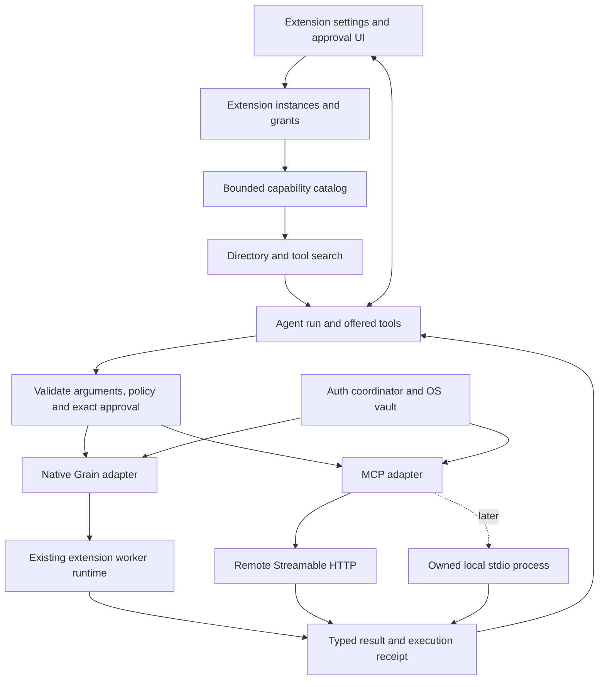

# Grain extensions: research and architecture decisions

Research date: 26 September 2026. Companion: [executable delivery plan](MCP-EXTENSION-PLAN.md). Reproducible repository snapshots and source URLs: [source ledger](MCP-EXTENSION-SOURCES.json).

## Recommendation

Make **native Grain extensions and MCP extensions two adapters behind one extension system**. Preserve Grain's current Rust host, native worker runtime, OS credential vaults, and authoritative execution checks. Strengthen the shared agent workflow and turn the development-only MCP integration into a supported adapter through explicit compatibility gates.

The first release should support native extensions plus curated remote MCP servers. Local subprocess MCP can follow as a separate transport milestone. Enabling an extension should make its capabilities available for discovery; it should not start every runtime, authenticate in the background, or put every schema in the model prompt.

The most urgent correctness issues are approval continuation and uncertain write outcomes. Better retrieval alone will not produce a reliable multi-extension agent while those remain unresolved.

These are Grain-specific recommendations informed by the references below. MCP defines a protocol; it does not prescribe a universal extension marketplace, agent loop, tool-search algorithm, or approval UI.

## Audit scope and confidence

Reviewed `C:\Projects\Grain\grain` at HEAD `01b05a4564a01c926949e1ff0247ec867fa6c040`, including the existing working-tree changes. The review did not modify product code. Existing changes in `src-tauri/Cargo.toml` and `src/app/bindings.ts` were left alone.

Inspected the active capability bridge, MCP connector, agent loop, action executor, native extension host, native auth, core capability types, and Extensions 2.0 amendments. Graph exploration established module boundaries; source inspection established the behavior described here. This is a focused source audit, not a full security audit or a live certification of any provider.

External research combined the current protocol, official provider documentation, and source/test inspection across ten open-source repositories. Selection favored adoption and relevance. Stars are a dated popularity signal, not evidence of correctness or a claim that these are the ten largest projects in the entire ecosystem.

| Project | GitHub stars at research time | Relevant evidence inspected |
|---|---:|---|
| OpenCode | 210,194 | MCP state handling, connection cleanup, OAuth provider |
| VS Code | 193,018 | Cached tools, lazy startup, cancellation and disposable ownership |
| Codex | 126,581 | Deferred tool search and catalog cache identity/invalidation |
| Cline | 69,377 | Reconnect ownership, abort/timeout tests, configuration changes |
| Goose | 54,675 | Multiple extension kinds, tool filtering, OAuth recovery |
| LibreChat | 44,975 | Per-user connection coordination and OAuth/disposal race tests |
| Continue | 36,034 | Connection replacement, cancellation, configuration reconciliation |
| GitHub MCP server | 33,218 | Hosted integration/auth constraints and toolsets |
| MCP Rust SDK | 3,955 | Authorization implementation and current transport support |
| LangChain MCP adapters | 3,654 | Session lifetime options, content conversion, tool errors |

The ledger pins the code snapshots by commit. MCP Inspector was also checked as a debugging tool; its implementation was not audited. Protocol conformance and LangGraph continuation documentation supply additional evidence beyond the repository sample.

## What Grain already gets right

- Native and MCP actions already enter a common task-level capability bridge. There is no need to bolt a second agent onto the app.
- The model starts with an extension directory and a loader, rather than every action schema. Namespaced aliases, authoritative reverse mappings, and per-round offered-tool checks prevent fabricated names from directly executing.
- MCP uses the official Rust SDK, an OS vault, bounded metadata, HTTPS endpoints, and explicit browser authorization. The Tauri lockfile resolves `rmcp` **3.1.4**; the manifest specifies the compatible `3.0.0` range.
- The MCP lifecycle configuration already prefers **2026-07-28** with legacy fallbacks. Adopting the modern protocol from scratch is not the missing work.
- Prepared calls are immutable, confirmation tokens expire, and enabled state is rechecked. Native execution already has an `UnknownOutcome` concept for some write timeouts.
- The native runtime already owns workers and capability tokens and reaps eligible idle workers. Its code-free directory is consistent with Grain's memory goals.

Two previous architectural decisions need an explicit revision. Amendment D in `docs/Extensions 2.0/PLAN.md` deliberately replaced a hidden pre-router with model-selected extension loading. Preserve that model choice and add finer discovery when needed. The section titled “Amendment E — Remote MCP development providers (2026-08-31)” deliberately limited remote MCP to development integration. First-class MCP extensions change that product scope; the old limitation was intentional, not an accidental omission. The same document also contains a different Amendment E dated 2026-09-08 covering visual ownership. That later visual boundary remains intact: extensions provide capabilities/data, and Grain renders the UI.

## Concrete gaps in the current implementation

Source locations are relative to the audited Grain repository; line numbers identify the inspected working tree.

| Priority | Evidence | Practical consequence | Proposed decision |
|---|---|---|---|
| Critical | `agent.rs:2216,2245,2256` returns `outcome_to_reply` after approval | Approving one action returns its receipt without continuing the original model workflow | D5: preserve and resume an agent run |
| Critical | `action_exec.rs:233–256` maps every MCP error to “did not run” | A timeout after dispatch, or failed result conversion after execution, can be misrepresented as no side effect | D6: model execution certainty separately from result handling |
| High | `capability.rs:233` publishes the loaded extension's full tool set; `capability_agent.rs:281` accumulates loaded actions | Deferred extension loading still becomes a large prompt for tool-rich extensions | D2: per-tool selection with a schema budget |
| High | `grain_mcp.rs:757,838` lists tools during loading and again before every call | Redundant requests, repeated auth/setup, and whole-catalog changes invalidate unrelated approved calls | D2/D3: identity-scoped catalog cache and selected-tool revalidation |
| High | `grain_mcp.rs:757` pagination has a tool count cap but no repeated-cursor/page/overall-discovery guard | Empty or repeated pages can keep discovery running despite a per-request timeout | D3: bounded discovery operation |
| High | `capability.rs:437` checks JSON object shape, required names and extra properties | Nested types, enums, ranges and schema composition are not fully validated by this host check | D7: authoritative JSON Schema validation |
| High | `grain_mcp.rs:931` flattens structured output and applies text sanitization | Whitespace and structured data can be lost; single-block truncation may lack a marker; valid non-text results become errors | D7: typed bounded results |
| High | `grain_mcp.rs:285,295` treats a stored token response as connected | UI readiness is not evidence of usable credentials or a reachable server | D4: separate grant, connectivity and availability states |
| High | `grain_mcp.rs:168,339,569` keys credentials by provider and universally requires a preregistered secret | No first-class multiple-account identity; generic public-client setup is too restrictive | D4: identity-aware auth strategies |
| Medium | `grain_mcp.rs:569` uses a fixed loopback port; only same-provider auth is guarded | Two provider logins can collide; listener ownership needs a deliberate policy | D4: one owned login coordinator or provider-supported dynamic ports |
| Medium | `capability.rs:343` classifies native and MCP actions as confirm/write | Even routine reads interrupt the workflow; safe automatic reads need host-reviewed policy | D6: reviewed read policy, conservative unknown tools |
| Scope | `grain_mcp.rs:838` rejects `InputRequired` and task results; only text results are supported | “Modern MCP compatible” is narrower than “supports every optional feature” | D8: publish and test a feature matrix |

These findings do not mean the SDK lacks OAuth issuer protection: stored credentials and callback handling already receive SDK checks. The missing work is application-level account identity, recovery, coordination and truthful state. Likewise, creating a service per operation is not intrinsically wrong for modern stateless HTTP.

## Target architecture



The LLM requests a capability. Grain authenticates, authorizes, validates and routes it. An MCP server receives calls directed to that server; it should not receive other extensions' tools, credentials, or the entire conversation merely because it is installed. Tool metadata and returned content are untrusted data, not authority to alter host policy.

## D1 — One product model, two execution adapters

Introduce a stable `ExtensionInstanceId` independent of provider name, installation and user account. An instance points to either an existing native package or an MCP configuration. Common fields cover identity, provenance, enabled state, grants, policy and discovered capabilities. Preserve supported native actions, authentication, data contributions, shortcuts and host-rendered declarative settings. MCP tool parity does not require identical optional contributions. Do not restore retired extension-authored views, panels or visual APIs.

Use a canonical tool identity such as `(extension_instance, account_binding, remote_tool_name)`. Keep the existing model-safe alias mapping and per-round offer checks. Installation, enablement, authorization, discovery, model exposure and runtime activity must be separate facts. Display them together without compressing them into one misleading “connected” boolean.

**Evidence:** Goose models several extension implementations in [one extension family](https://github.com/aaif-goose/goose/blob/04ed836c8cde23e540cc77d256992e00be99298b/crates/goose/src/agents/extension.rs). OpenCode distinguishes disabled, authentication-needed and failed states in its [MCP integration](https://github.com/anomalyco/opencode/blob/a42f393c850bec0c0f395fb91bf19b1ee8b31666/packages/opencode/src/mcp/index.ts). These support shared management with adapter-specific behavior; they do not require copying either framework.

## D2 — Fetch metadata into the host; expose selected schemas to the model

These are separate operations. MCP `tools/list` enumerates capabilities; it is not a universal semantic-search endpoint. Grain can retrieve and cache many definitions without placing those definitions in an LLM request.

Retain extension selection, then use this flow:

1. A bounded directory describes available extensions without starting their runtimes.
2. The model selects an extension or searches already indexed capabilities.
3. Grain discovers the selected cold catalog, within time, page, byte and schema limits.
4. Small catalogs may load fully if they fit the current schema budget. Large ones return a summary and expose a host `search_tools` interface with extension filtering and pagination.
5. Search results make only selected definitions available on the **next** model request. Preserve the current offered-tool snapshot rule.
6. Search can broaden or select another extension. A miss is not permission to invent a tool, and silent alphabetical truncation is not a complete directory.

Start with Grain's existing lexical retrieval primitives after adapting their corpus and identity model. Do not insert a compulsory hidden top-K pre-router or introduce an embedding service before a measured need. Search all tools of only the selected extension when its metadata is cold; a global search must explain which catalogs it covers.

Proposed tuning defaults, not industry standards: eight selected tools per search and a schema budget of roughly 6,000 tokens or 10% of model context, whichever is smaller. Measure against supported models. Keep discovery capacity separate from the model-exposure limit. At 128 discovered tools, return an explicit incomplete/unsupported state instead of pretending the catalog is complete. Pin tools involved in pending calls; never evict their identities mid-approval.

**Evidence:** [Codex tool search](https://github.com/openai/codex/blob/6e1ab4d294cdf1d2606a91bf1acf6de0f0959c7a/codex-rs/core/src/tools/handlers/tool_search_spec.rs) exposes deferred tools after query-driven selection. [Anthropic's advanced tool-use research](https://www.anthropic.com/engineering/advanced-tool-use) demonstrates deferred definitions and the latency/context tradeoff. [Goose's extension manager](https://github.com/aaif-goose/goose/blob/04ed836c8cde23e540cc77d256992e00be99298b/documentation/docs/mcp/extension-manager-mcp.md) supplies a complementary extension-level activation pattern. Provider-native search features are optional optimizations; Grain's current function-tool protocol can support host-managed search.

## D3 — Lifecycle ownership and metadata caching

Keep the shared HTTP pool. For modern remote MCP, use request-scoped work with explicit owners, deadlines and cancellation. Do not add permanent connections merely to label providers connected. For legacy stateful servers, a short run-scoped connection lease may be worthwhile if profiling demonstrates expensive setup. Cache metadata independently of transport lifetime.

Cache identity must include extension instance, endpoint/configuration generation, auth identity and relevant scopes, negotiated protocol/capabilities and catalog generation. Honor declared cache scope and TTL. Use byte and entry bounds, single-flight discovery, and generation checks so a late fetch cannot overwrite newer state or restore disabled access. Do not share authorization-sensitive catalogs across accounts. Invalidate on disconnect, auth/scope changes, configuration changes and supported catalog-change signals.

Before dispatch, recheck enabled state, account binding, policy and the selected tool's schema digest. Refresh an expired or invalidated catalog first. A fresh matching cached descriptor should avoid listing the whole catalog on every call. If the chosen descriptor changed, revalidate and obtain fresh approval as needed. Do not invalidate an approved call solely because an unrelated tool changed.

Every discovery operation needs a whole-operation deadline, maximum pages/bytes/tools, repeated-cursor detection, cancellation, and an explicit incomplete state. Concurrency and backoff limits belong to a provider/operation budget. Reconnecting a transport does not authorize replaying an uncertain write.

**Evidence:** [Codex's catalog cache](https://github.com/openai/codex/blob/6e1ab4d294cdf1d2606a91bf1acf6de0f0959c7a/codex-rs/codex-mcp/src/tool_catalog_cache.rs) uses bounded caching and generation protection. [VS Code's server abstraction](https://github.com/microsoft/vscode/blob/a460613c57b4c1eb2bc8edc97be694e05ae286b2/src/vs/workbench/contrib/mcp/common/mcpServer.ts) separates cached metadata from startup. [Cline reconnect handling](https://github.com/cline/cline/blob/29896ec7fa8e2dd98805b56c2dae987d59fc9baa/apps/vscode/src/services/mcp/StreamableHttpReconnectHandler.ts) rechecks whether a connection is still wanted. [Continue's manager](https://github.com/continuedev/continue/blob/5522c6f44ca0ac3528b37244818fbfa39b5af470/core/context/mcp/MCPManagerSingleton.ts) reconciles changed/removed configurations. Grain should borrow ownership guarantees, not their exact cache sizes or startup policies.

## D4 — Consistent authentication, distinct provider grants

Expose one authorization coordinator and one user experience while retaining native API and MCP-specific grant strategies. Do not reuse tokens between resource audiences simply because both extensions say “GitHub.” Store grant identity by instance, account, issuer, resource, client identity and granted scopes; keep secrets in the OS vault. Metadata indexes must contain no credentials.

Use SDK-supported discovery, PKCE and issuer/resource validation. Support preregistered identities, Client ID Metadata Documents (CIMD), and legacy DCR according to server support. Grain currently supplies no CIMD URL; deploying a Grain-owned metadata document is concrete product setup, not merely flipping an SDK option. Public clients may have no secret; confidential-client requirements must be handled through a provider-approved integration design.

Coordinate refresh and login per identity, coalesce concurrent work, and use auth generations so logout wins over late refresh responses. Keep refresh failure, revoked grant, unavailable network and insufficient scope distinct. Pause a run for explicit login/step-up, then revalidate before resuming. A cached token should yield “credentials stored” until its use or validation establishes availability. Avoid polling all providers just to paint green status indicators.

Own the callback listener explicitly. Dynamic loopback ports work only where registration/server policy permits; otherwise serialize the fixed-port flow and show an intelligible conflict/cancellation state. Close listeners on success, failure, timeout and shutdown.

**Evidence:** [MCP authorization](https://modelcontextprotocol.io/specification/2026-07-28/basic/authorization) defines discovery, issuer and resource constraints; [client registration](https://modelcontextprotocol.io/specification/2026-07-28/basic/authorization/client-registration) defines registration selection. [OpenCode's OAuth provider](https://github.com/anomalyco/opencode/blob/a42f393c850bec0c0f395fb91bf19b1ee8b31666/packages/opencode/src/mcp/oauth-provider.ts) supports optional client secrets. [LibreChat's OAuth race tests](https://github.com/LibreChat-AI/LibreChat/blob/7b2362d7a7c6148b84850924dc7fa5fc43307923/packages/api/src/mcp/__tests__/MCPOAuthRaceCondition.test.ts) exercise concurrent setup and expiry. [RFC 8252](https://www.rfc-editor.org/info/rfc8252/) explains why a shared secret embedded in a desktop app is not confidential. A secure broker, when actually required by a provider, is a separate service decision with its own scope and operating cost.

### Provider rollout constraints

| Provider | Verified documentation | Grain implication |
|---|---|---|
| Linear | [Official MCP guide](https://linear.app/docs/mcp): OAuth/DCR, bearer options, read-only endpoint | Best first live candidate. Begin with restricted reads, then a disposable test workspace write. |
| Notion | [Official setup](https://developers.notion.com/guides/mcp/get-started-with-mcp): hosted endpoint and interactive OAuth | Second provider tests a distinct auth/catalog implementation. Do not assume unattended token support. |
| Atlassian | [Official server guide](https://atlassian.github.io/atlassian-mcp-server/): v2 recommended, small primary tool set plus discovery, optional paginated all-tools mode | Add a versioned endpoint migration and cache/auth compatibility test. Existing v1 is not simply dead. Nested execute wrappers need policy on their actual target. |
| GitHub | [Host integration](https://github.com/github/github-mcp-server/blob/85598ba6e1256f7ebf4867b95d63b833c4549264/docs/host-integration.md): preregistration, no DCR, documented OAuth/PAT options | Resolve Grain app identity and supported desktop flow before promising consumer onboarding. Scope tokens narrowly. |
| Slack | [Official MCP docs](https://docs.slack.dev/ai/slack-mcp-server/): registered app, no DCR; distribution restrictions and client credentials | Provider approval/distribution is a release dependency, not a connector bug. Do not put Slack on the critical path for the first working build. |
| Google Calendar | [Official configuration](https://developers.google.com/workspace/calendar/api/guides/configure-mcp-server): project and OAuth client/consent setup | Validate the exact desktop redirect and client model, then address app governance before broad rollout. |

“Seamless across MCPs” should mean familiar connection, recovery and disconnect behavior. It cannot mean one grant authorizes unrelated services or every provider accepts identical registration.

## D5 — Approval and authentication must resume the agent

Create an explicit `AgentRun` holding messages, opaque provider tool-call IDs, offered-tool snapshots, selected descriptors, remaining budgets, pending interaction, and a completion ledger. Suggested states: running, waiting-for-approval, waiting-for-auth, completed, cancelled and failed.

On approval, atomically consume the pending decision, revalidate its immutable prepared call, execute once, append the actual tool result to the original conversation and re-enter the model loop. On denial, append a denial result and let the model explain or propose another authorized path. On login completion, revalidate the original intent; authorization completion alone is not approval of a changed write.

Handle multiple calls in an assistant response deliberately: defer later calls with preserved IDs, or return explicit non-execution results according to the provider's message protocol. Do not duplicate an assistant call, leave an unresolved tool-call/result pairing, or regenerate an already approved write. Only independent approved reads should become concurrent initially. Pending interactions must expire and release transport resources.

Start with bounded in-memory continuation for live app sessions. Persist only the minimal pending/dispatch journal needed to avoid presenting uncertain writes as safely repeatable after a crash. General resume-across-restart can be a later explicit feature; the UI must truthfully mark interrupted work until it exists.

**Evidence:** [LangGraph interrupts](https://docs.langchain.com/oss/python/langgraph/interrupts) demonstrates checkpoint-and-resume semantics and warns that resumed code may rerun. [LangChain human-in-the-loop](https://docs.langchain.com/oss/python/langchain/human-in-the-loop) applies decisions to tool execution. [LibreChat's OAuth resume tests](https://github.com/LibreChat-AI/LibreChat/blob/7b2362d7a7c6148b84850924dc7fa5fc43307923/e2e/specs/mock/mcp-oauth-resume.spec.ts) test retained interaction identity during UI/stream resumption. That last source supports pending-interaction behavior, not a claim that its test proves Grain's entire approved-tool loop. Implement the pattern in Grain's existing runner without adding a graph framework.

## D6 — Truthful outcomes, policy and replay safety

Distinguish `NotDispatched`, `Succeeded`, `ToolReportedError`, `UnknownAfterDispatch`, `CancelledBeforeDispatch`, and `ResultUnavailableAfterExecution`. Carry raw cause categories internally, but render useful user messages. A tool reporting an error does not universally prove it made no changes. Unsupported content does not prove the tool did not run.

A timeout or cancellation after dispatch cannot guarantee remote cancellation. Never automatically replay an uncertain write. JSON-RPC request IDs and Grain's local idempotency key do not establish server-side deduplication. Only use automatic write retries where a particular adapter/provider documents and implements the necessary semantics; otherwise offer reconciliation or explicit user-directed recovery.

Keep confirmation for unknown third-party effects. Add host-reviewed read classifications and restricted provider scopes/endpoints where appropriate. A server's `readOnlyHint` is evidence, not a permission grant. Generic “execute tool” wrappers must be judged using their selected operation and arguments. Approval binds tool identity, account, arguments, policy and schema version; changing any relevant component invalidates it.

For multi-extension workflows, retain receipts for each completed step. If a later step fails, report partial completion. There is no general cross-service transaction or safe automatic rollback.

**Evidence:** [MCP tools](https://modelcontextprotocol.io/specification/2026-07-28/server/tools) distinguishes protocol errors, tool results and untrusted annotations. [LangChain's MCP conversion](https://github.com/langchain-ai/langchain-mcp-adapters/blob/52a4535f3eb4b98f386836e4d9b8c4cadf99afca/langchain_mcp_adapters/tools.py) separates execution/result conversion paths. [MCP transport semantics](https://modelcontextprotocol.io/specification/2026-07-28/basic/transports/streamable-http) do not provide business-level exactly-once effects. Grain already has useful native `UnknownOutcome` machinery to extend.

## D7 — Validate schemas and preserve results

Retain schema size/depth bounds, then compile the supported JSON Schema dialect with bounded reference resolution and no arbitrary external fetch. Validate complete arguments at execution time, including nested values, enums and composition. A schema that cannot be safely supported should yield an explicit compatibility state. Do not silently weaken validation to fit a model API's schema subset.

Separate the authoritative input schema from provider-specific model presentation. Keep the original schema, output schema, descriptor provenance and digest. Test each supported LLM's function-schema restrictions, tool-name rules, result pairing and context budget.

Return a typed envelope containing content blocks, structured JSON, tool error status, execution certainty, receipt, and size/truncation information. Preserve whitespace in code/data. For large results, retain a bounded artifact and send an explicit preview plus a retrieval handle where appropriate. Rendering limitations should be reported independently of whether a tool executed. Non-text support may be incremental, but must not become a false failure-to-execute claim.

**Evidence:** The [current MCP schema](https://github.com/modelcontextprotocol/modelcontextprotocol/blob/main/schema/2026-07-28/schema.json) retains object input schemas while allowing richer structured result values. [LangChain adapters](https://github.com/langchain-ai/langchain-mcp-adapters/blob/52a4535f3eb4b98f386836e4d9b8c4cadf99afca/langchain_mcp_adapters/tools.py) preserve typed content/structured artifacts. [Cline call tests](https://github.com/cline/cline/blob/29896ec7fa8e2dd98805b56c2dae987d59fc9baa/apps/vscode/src/services/mcp/__tests__/McpHub.callTool.test.ts) provide practical examples around arguments, abort propagation and timeouts. Specific validator/library selection should follow a compatibility spike against Grain's Rust targets.

## D8 — Versioned compatibility, not a vague “MCP supported” flag

The current stable specification checked for this review is **2026-07-28**. Its per-request protocol/capability model and stateless HTTP differ substantially from the older initialize/session model. Request-scoped SSE remains valid: it must not be confused with the old separate HTTP+SSE transport. Legacy servers remain relevant, and Grain already configures fallback.

Maintain explicit tests for 2026-07-28 and the legacy versions Grain claims. Do not assume all highly starred clients have already adopted the latest lifecycle. Long-lived subscriptions should be opt-in features with resource ownership. `InputRequired` interactions and task support need their own compatibility milestones; do not add deprecated roots/sampling/logging merely to make a modern MVP look complete.

| Surface | Initial production scope | Later, only with dedicated tests |
|---|---|---|
| Extensions | Existing native runtime + curated remote MCP | Custom endpoint distribution and local stdio |
| Protocol | Modern HTTP plus tested legacy fallback | Additional transport/extension combinations |
| Agent | Discovery, tools, approval/auth pause/resume, cancellation | General durable restart-resume and long jobs |
| Results | Text + structured JSON with truthful handling of unsupported blocks | Rich media rendering and resource workflows |
| Server interactions | Clear unsupported status for unimplemented interactions | MRTR/elicitation and tasks when target servers need them |
| LLMs | A small explicit tool-capable model/provider matrix | Broader providers and vendor-native search optimizations |

**Evidence:** [MCP changelog](https://modelcontextprotocol.io/specification/2026-07-28/changelog), [versioning](https://modelcontextprotocol.io/specification/2026-07-28/basic/versioning), [Rust SDK](https://github.com/modelcontextprotocol/rust-sdk/blob/972af863f813ad97be8d9b7dc3207d3b5731adf9/README.md), and [LangChain client's explicit versus per-call sessions](https://github.com/langchain-ai/langchain-mcp-adapters/blob/52a4535f3eb4b98f386836e4d9b8c4cadf99afca/langchain_mcp_adapters/client.py) support choosing lifetime by negotiated capability rather than imposing one connection model.

## D9 — Make reliability demonstrable

Build protocol/auth fixtures through the same connector and executor that production uses. Include failures before and after dispatch; late OAuth, cache and connection completions; repeated pagination cursors; changed schemas; expiry; disconnect; and model hallucinations. Add a conformance client driver for applicable core, authorization and backward-compatibility cases. Record pass/fail/skip explicitly.

Trace by run, extension instance, call ID and attempt. Record discovery cache status, latency, auth transition, schema generation, approval decision and outcome certainty. Redact credentials, authorization codes, raw sensitive arguments and content by default. Provide a bounded diagnostic export and actionable UI errors. A connection retry log must not look like a second successful business action.

Avoid arbitrary-network discovery and executable installation in the first release. If adding custom URLs later, validate OAuth discovery redirects and endpoints against SSRF policy, while intentionally handling legitimate enterprise/private-network configurations. If adding stdio, require explicit installation/trust, pinned package identity, minimum environment, owned child lifetime, cancellation and OS-level containment. A subprocess boundary alone is not a sandbox.

**Evidence:** [MCP conformance](https://github.com/modelcontextprotocol/conformance) supplies scenario-driven testing; [LibreChat disposal-race tests](https://github.com/LibreChat-AI/LibreChat/blob/7b2362d7a7c6148b84850924dc7fa5fc43307923/packages/api/src/mcp/__tests__/MCPConnectionDisposeRace.test.ts) test late async completion; [VS Code connection ownership](https://github.com/microsoft/vscode/blob/a460613c57b4c1eb2bc8edc97be694e05ae286b2/src/vs/workbench/contrib/mcp/common/mcpServerConnection.ts) ties cleanup to cancellation/disposal; [MCP security guidance](https://modelcontextprotocol.io/docs/2026-07-28/tutorials/security/security_best_practices) covers authorization and network trust boundaries. The proposed Grain diagnostics and release thresholds are engineering decisions, not certification provided by those references.

## Baseline actually verified

Executed locally without changing code:

```text
cargo test -p grain-core --locked --offline capability_
36 passed, 0 failed

cargo test -p grain-core --locked --offline --test capability_benchmark -- --nocapture
4 passed, 0 failed
```

The retrieval corpus contained 41 cases: 35 in scope and six no-match. Recall@8 was 100%; top-1 was 91.4%; three no-match cases still returned candidates. The vocabulary-mismatch slice had only four cases and top-1 accuracy of 25%. The scaling fixture had 102 actions. These are useful regression checks, not proof of large-catalog or real-model reliability. The legacy retriever tested here is not the active agent routing policy after Amendment D.

No full Tauri build, live OAuth login, provider write, or real multi-extension LLM scenario was run during this review. Those checks require the implementation and configured test accounts and are explicitly included in the delivery gates.

## Decisions to carry into implementation

Proceed with the remote-first scope and the staged plan. Preserve existing adapter/runtime code where it already meets the contract. Resolve public app identities for providers during the auth milestone, while keeping externally gated integrations out of the first release's critical path. Treat unsupported optional features as visible compatibility boundaries. Expand provider count only after the current stage passes its workflow and failure tests.

The success criterion is a user-visible workflow that discovers the right tools, asks for the right intervention, continues after it, and reports exactly what happened—even when one service fails.
