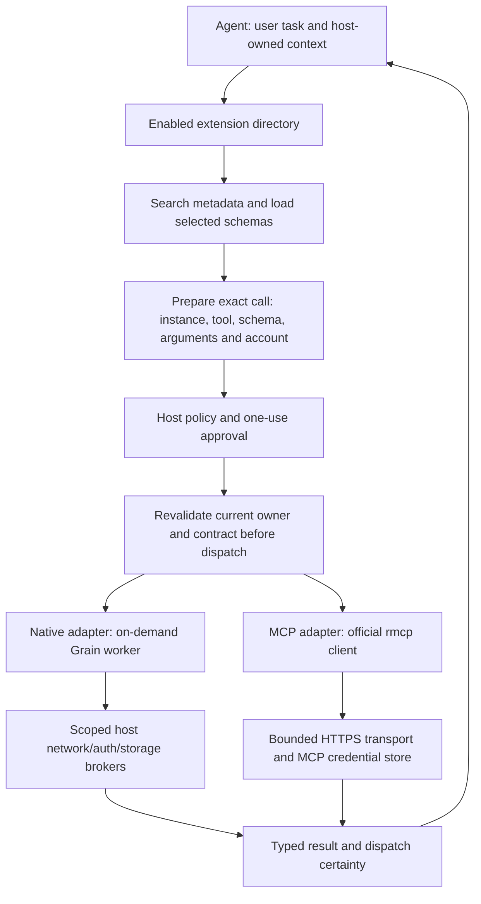

# Extension platform: audit, reuse and execution plan

**Updated:** 2 October 2026. **Branch:** `extensions/tool-only-retirement`. **Status:** testing-only execution; all B1 numbered requirements and B2 mixed-catalog check 23 accepted after focused audits/repeated real-app evidence. Planning snapshot remains `b0afe340`; current ledger **39 Pass / 14 Pending**. B2 byte limits/cancellation/conformance and live prerequisites remain next; B3/B4, retained input findings, production vault reconciliation and release gates remain open.

This is the forward execution order for the existing [extension plan](MCP-EXTENSION-PLAN.md). That document retains the product contract, R0–R6 release gates and full numbered test procedures. The [progress report](MCP-EXTENSION-PROGRESS.md) retains verdicts and evidence. If older chronological handoffs disagree about what comes next, use this document. No existing acceptance requirement is waived.

## 1. Recommendation and constraints

Keep Grain's Agent and both tool adapters. Continue using the official Rust MCP SDK; simplify standard native OAuth with `oauth2` after accepting the current foundation. Use official MCP conformance alongside the real-application Agent harness. Do not replace the application with an agent framework or add a gateway to this release.

This is a targeted reduction of maintenance, not a platform rewrite. Grain already delegates MCP messages, negotiation, transport lifecycle and MCP OAuth to `rmcp`. Most remaining custom code protects application-specific approval, account, package and resource ownership. Another framework would still need that integration.

The user's testing-first direction remains binding: **finish the 25 outstanding acceptance checks and audit their modules before dependency upgrades, OAuth replacement, physical cleanup or new platform features.** Test infrastructure and repairs for reproduced failures are allowed during that pass. An unavailable registration, provider or desktop prerequisite stays Pending/Blocked; it does not permit bypassing its module. A newly discovered missing feature is recorded and handled as a narrowly scoped prerequisite, not used to resume broad development.

After that baseline is accepted, make one library/refactor change at a time and repeat affected acceptance checks. This costs some repeat testing, but makes regressions attributable and respects the requested order. Conformance fixtures should be reusable across both SDK versions; do not build a second protocol stack just to finish the baseline.

Extensions supply tools/functions only. Agent-owned application/screen/selection context does not become an extension API. Native means the existing embedded Grain worker implementation; it does not mean arbitrary executables or unrestricted OS access. Remote HTTPS MCP is the current MCP scope. Local stdio/process MCP, arbitrary endpoints, gateways and wider protocol capabilities require separate future decisions.

## 2. What the audit establishes

This section preserves the source and evidence audit at planning commit `b0afe340`, not a fresh security certification. The graph was queried first; its searches/impact output did not resolve the ownership questions, so relevant production code and maintained audit records were read directly. Absence of graph edges is not evidence that a module has no callers. No application or acceptance suite was run in that planning pass. Subsequent B1a real-app runs/fixes are recorded in the [native foundation audit](NATIVE-FOUNDATION-AUDIT.md): checks 2/22 accepted, 32 distinct harness scenarios and eight B1 account checks pending at that handoff. Subsequent B1b acceptance closes 41/45/53, and B1c partial acceptance closes 42/43/50/51; the subsequent [refresh/logout audit](NATIVE-AUTH-REFRESH-AUDIT.md) closes 44 against controlled providers. All ten numbered B1 requirements are accepted; retained input/release findings remain separate.

| Area | Current state | Meaning for the next work |
|---|---|---|
| Acceptance | **28 Pass / 25 Pending**, out of 53 numbered checks; 15 user-reported and 13 reviewed real-app automated results | Preserve the evidence and numbering. This audit adds zero Pass verdicts. |
| Native foundation | Tool-only boundary, stop/replacement, close/repeat, failures and four installation/persistence audit units accepted | Build on these paths. Remaining migration, typed inputs and account ownership need acceptance. |
| Harness | 30 distinct recorded real-app scenarios; separate production-logic suites | Good reusable base. Existing fixture loading explicitly refuses authentication and nonempty permissions. Native account and MCP real-app fixtures are missing. |
| MCP | Six curated developer providers; actual SDK transport/auth; bounded discovery/results and generation guards | Live provider compatibility is not certified. A credentials badge or a model-written answer is insufficient. |
| Native auth | Host-owned PKCE/code exchange/refresh, vault binding, account publication and cancellation | Standard OAuth operations can later move to a library. The account/vault rules remain Grain's job. |
| Agent | Selective discovery and approval continuation implemented | Full multi-step/model acceptance is pending. Equivalent authentication continuation and metadata caching remain unfinished. |
| Retirement | Public authoring/worker surfaces reduced; validation and dispatch refuse old capabilities | Some unreachable host handlers and obsolete runtime wiring remain physically present. Blocking and physical deletion are different milestones. |
| Release | All **seven R0–R6 whole-phase gates remain open** | No measured memory baseline, live certification or completed one-to-five-extension ladder is implied by the 28 checks. |

Retain the earlier accepted-input Escape timeout as an unresolved observation. The later reproduced Windows foreground refusal sent zero Escape input and is a different event. Passing reruns do not explain the earlier timeout. The harness also has a timing limitation: one negative input fault was detected in roughly eight seconds, while diagnostic collection took roughly 174 seconds. Investigate these as testing/foundation work, not as evidence for a production fix.

## 3. Code disposition: keep, edit, replace and remove

Counts below are physical source lines at planning snapshot `b0afe340`, including comments, blank lines and inline tests; subsequent B1a edits are not included. They are an inventory, **not production LOC, savings estimates or a commitment to delete entire files**. Full paths are relative to the repository root; bare backend filenames are under `src-tauri/src/`. The application-wide ASR/UI/Handy tree is outside this refactor.

| File or group | Lines | Disposition | Reason and acceptance condition |
|---|---:|---|---|
| `src-tauri/src/grain_mcp.rs` | 1,833 | Keep host policy; simplify SDK integration later | Preserve provider identity, metadata policy, vault generation, callback ownership, bounded catalog and truthful outcomes. Move only demonstrably duplicated SDK behavior upstream. |
| `grain_mcp_http.rs` | 155 | Review for partial replacement | Decorates the SDK HTTP trait with immediate cancellation and bounded deletion. New SDK cancellation behavior must pass the same production-wrapper schedules before removing it. |
| `grain_mcp_bounded_http.rs` | 356 | Keep bounds; edit only verified duplication | JSON, error, header and cumulative SSE/wire limits are host requirements. Do not replace a streaming byte cap with a post-allocation size check. |
| `grain_mcp_session.rs` | 227 | Keep ownership semantics | Generation tickets, provider serialization and vault-write commit guards ensure logout wins over old work. An SDK refresh lock is not a substitute for this. |
| `grain_auth.rs` | 2,409 | Replace standard OAuth operations; retain host rules | Later use `oauth2` for authorization URL/PKCE/code exchange/refresh. Keep account keys, scope/grant validation, callback listener, bounded/redacted responses, publication and failed-switch rollback. |
| `action_exec.rs` + `crates/grain-core/src/execution.rs` | 653 + 739 | Keep; review both adapter seams | Shared exact call, one-use confirmation, current-identity revalidation and dispatch certainty remain authoritative. No framework may bypass this gate. |
| `src-tauri/src/agent.rs` | 4,300 | Keep; focused edits only | Preserve run ownership, tool IDs, messages, budgets, receipts, approval continuation and first-party context. Do not rewrite this to acquire MCP support it already has. |
| `extension_host.rs` | 4,746 | Keep worker lifecycle; remove exclusive retired wiring later | Source/generation identity, on-demand start, idle retirement, socket limits and registry overlays stay. Companion/session branches need dependency tracing before deletion. |
| `host_api.rs` | 2,034 | Keep log/storage/net/auth brokers; remove unreachable retired handlers | The early allowlist already refuses legacy capture/semantic/LLM/context calls. Delete exclusive arms/helpers only after proving first-party callers use their own path. |
| `events_auth.rs` + `dev_extensions.rs` | 295 + 255 | Keep; retire obsolete hooks selectively | Worker authentication and developer identity/reload are still required. Remove only handlers made exclusive to retired capabilities. |
| `extension_companion.rs` | 282 | Physical-removal candidate | Old companion process support; rejected tool-only declarations do not make its compiled cleanup/start wiring disappear. Remove all exclusive callers together. |
| `extension_session.rs` | 323 | Physical-removal candidate | Retired extension microphone/session ownership. Shared audio and first-party recording must survive. |
| `extension_shortcuts.rs` | 496 | Remove contributed execution; retain necessary migration temporarily | Old binding namespaces, parsing and teardown may still be needed to preserve/archive user data. Do not erase migration before upgrade acceptance. |
| `extension_lab.rs` | 107 | Physical-removal candidate | Retired generator/lab wiring; check identity and cleanup callers first. |
| `extension_view.rs` | 1,039 | Selective ownership review | Contains host-owned interaction/routing too. Do not delete shared Agent/pill/form/chooser behavior because of the filename. |
| `crates/grain-core/src/extensions.rs` | 3,596 | Keep persistence/identity; reduce legacy paths later | Preserve saved ownership, grants, transactional activation, developer overrides and damaged-state refusal. |
| `crates/grain-core/src/tool_schema.rs` | 463 | Keep library-backed validation | `jsonschema` evaluates schemas; Grain bounds complexity/dialects/references. LLM schema adaptation is not authoritative validation. |
| `crates/grain-sdk/src/manifest.rs` | 3,253 | Reduce authoring contract; retain refusal tombstones | `validate_tool_only` rejects retired tiers/declarations. Legacy parsing must reject old requirements explicitly rather than silently ignoring them. |
| `crates/grain-extension-checks/src/lib.rs` | 1,350 | Keep/update authoring checks | Checker, package loader and runtime must agree about the reduced contract and declared network/auth access. |
| `grain_mcp_auth_tests.rs` + `grain_mcp_protocol_tests.rs` | 362 + 1,066 | Retain host regressions; replace duplicate wire coverage only with mapped conformance | Library adoption does not cover stale account publication, retained bytes or uncertain dispatched outcomes. |
| `grain_agent_harness.rs` + `tests/agent-harness/` | 526 + runner assets | Extend | Add narrowly scoped account/MCP fixtures and evidence mapping; keep the existing permission-free fixture strict. |
| Frontend extension management, worker supervisor and Agent views | Not estimated | Keep; functional edits only when required | Continue Tauri command/event boundaries and real-app testing. No UI overhaul, alternate visual harness or regenerated user bindings in this pass. |

The immediate MCP review surface is **2,571 lines across four modules**. The two HTTP wrappers account for **511** of those lines, but they are not all replaceable. Native auth is a **2,409-line** review surface with mixed generic and product-specific logic. The four named exclusive legacy candidates total **1,208 lines**, before callers and shared ownership are resolved. These numbers must not be added up and presented as guaranteed savings; broad host/core files contain substantial test coverage and unrelated retained responsibilities.

For every removal proposal, record producer → dispatcher → consumer → persistence/migration owner, replacement behavior and exact regression checks. Prefer deleting a complete obsolete path to leaving two production implementations. Preserve minimal deserialization tombstones and inert archives where needed. Never add features to `src-tauri/src/handy/` or remove Agent context as part of extension retirement.

## 4. How native and MCP extensions work together

The common layer is a host-owned tool contract and execution gate, not a shared runtime or shared token store.

1. **Describe an extension.** A native package declares tools and narrow supporting permissions. An MCP entry describes a server/provider and supported connection/auth configuration. The current MCP entries use `mcp.` IDs and are developer-only; they are not ordinary native packages. A later common management projection can present both kinds without merging their registries, grants or installation formats.
2. **Discover only what is needed.** Begin with bounded directory metadata. `search_tools` and `load_extension` select definitions; the model does not receive every schema at startup. Native declarations and MCP `tools/list` normalize into the same offered-tool contract. Discovery does not authorize execution.
3. **Bind an exact call.** Grain attaches extension/instance identity, selected definition, account/configuration generation, immutable arguments, run and call IDs. Current MCP approval identity conservatively includes the whole catalog; finer selected-tool freshness is a later measured change.
4. **Approve and revalidate.** Current policy confirms all extension calls, including reads. Keep that behavior during baseline testing. Provider annotations cannot authorize themselves. A stale source/account/schema/enablement or consumed approval refuses dispatch. MCP selected discovery is revalidated on the actual call path.
5. **Execute through the appropriate adapter.** Native uses the existing worker, with authentication performed by the Rust host. MCP uses SDK services and OAuth through the SDK's credential interface. Both report success, tool error, refusal or uncertain outcome through the same contract. Never automatically repeat a potentially completed write.
6. **Resume and release.** Preserve tool-call/result pairing and completed receipts in the original Agent task. Release transport/worker/listener ownership on stop, disable, replacement and idle cleanup. Do not keep an MCP connection alive merely because an extension is enabled or a confirmation is pending.

MCP OAuth and native API OAuth remain separate grants even for the same provider. Native developer folders and installed owners remain separate identities. The current curated MCP catalog effectively has one selected account per provider entry; arbitrary multi-account MCP instances are not implemented. Do not promise them through a UI label or generic registry type.

An extension cannot ask another extension to execute or retrieve host context. The Agent can explicitly pass task arguments to a tool; that is not a capability to query the screen/transcript independently. Tool descriptions/results remain untrusted data.

## 5. Exactly what is delegated

| Dependency | Decision | Grain retains |
|---|---|---|
| Official `rmcp` | Current backend lockfile: **3.1.4**; manifest accepts compatible 3.x. **3.5.0 is the reviewed upgrade candidate**, to be locked after baseline acceptance. | Provider allowlist/profile, exact approval, deadlines/byte limits, dispatch certainty, callback/vault ownership and host integration. Client/auth/HTTP features only. |
| `oauth2` 5.0 | Later native OAuth building blocks; already present transitively through MCP dependencies | Native account selection, API destination policy, provider scopes, listener lifetime, bounded HTTP adapter, vault formats and publication/recovery. Do not add a second MCP OAuth implementation. |
| Existing `jsonschema = 0.58.1` | Keep offline validation and current pin | Supported schema profile, complexity budgets and private errors. |
| Existing reqwest/Tokio/keyring | Keep | Scoped credential routing, operation lifetimes and OS-vault identity. Preserve the app reqwest 0.12/MCP reqwest 0.13 boundary; no unrelated HTTP migration. |
| Official MCP conformance | Test dependency, pinned to a release/commit with applicable frozen requirements | A test client exercising Grain's production adapter, required coverage reporting and host-specific adversarial tests. No shipping Node service. |
| Existing Agent harness | Extend real-app coverage | Live account consent, genuine-model behavior, ordinary-profile observations and release review remain separately evidenced. |

The newer SDK still does not justify dropping all custom HTTP limits: its reqwest implementation reads JSON bodies with `response.bytes()` and error bodies with `response.text()`, while it explicitly bounds SSE events. Grain additionally limits cumulative operation bytes, JSON/errors/headers and retained output. Preserve those guarantees until an equivalent implementation is demonstrated. [SDK HTTP source, 3.5.0](https://github.com/modelcontextprotocol/rust-sdk/blob/rmcp-v3.5.0/crates/rmcp/src/transport/common/reqwest/streamable_http_client.rs).

The SDK's optional refresh guard has no coordination by default. Wire it only if it safely replaces duplicated refresh work; retain Grain's generation-protected commits so an old callback or vault write cannot undo logout. [SDK auth source, 3.5.0](https://github.com/modelcontextprotocol/rust-sdk/blob/rmcp-v3.5.0/crates/rmcp/src/transport/auth.rs).

`oauth2` supports a custom asynchronous HTTP client. Use that seam to retain response budgets, no-redirect policy and redaction; adopting the library must not introduce unbounded token responses or secret-bearing diagnostics. [oauth2 5.0 documentation](https://docs.rs/oauth2/5.0.0/oauth2/).

Goose provides the closest Rust reference: official SDK plus application-owned extension management and credential persistence. Cline and OpenCode similarly keep application integration around the official TypeScript SDK. These are design references, not evidence that Grain's release works. [Goose core dependencies](https://github.com/aaif-goose/goose/blob/main/crates/goose/Cargo.toml), [Goose extension manager](https://github.com/aaif-goose/goose/blob/main/crates/goose/src/agents/extension_manager/mod.rs), [Cline MCP host](https://github.com/cline/cline/blob/main/apps/vscode/src/services/mcp/McpHub.ts), [OpenCode MCP integration](https://github.com/anomalyco/opencode/blob/dev/packages/opencode/src/mcp/index.ts).

Rig, Kit, `mcp-agent`, `mcp-use`, a Goose runtime and MCP gateways are not dependencies for this delivery. Reconsider a framework only for a measured maintenance problem or a new required capability, with a focused prototype and migration cost; popularity alone is insufficient.

## 6. Disposition of every pending acceptance check

**Retain all 25 objectives. Remove zero acceptance requirements.** Delegation replaces some implementation and wire-fixture maintenance, not proof that Grain combines it correctly. Their full procedures stay in the original plan. This table preserves the 25 objectives pending at planning snapshot `b0afe340`; subsequent B1a acceptance closes 2/22, leaving **23 Pending**. Current verdicts and evidence belong to the progress ledger, not this baseline mapping.

`Harness` means actual isolated Grain through production commands/adapters with controlled services. `Live` means a real supported provider/account or tool-capable model. A fixture proves its tested contract, not compatibility with every provider. Unsupported live prerequisites are reported separately and remain blocked where the numbered procedure requires them.

| Check | Retained objective | Planned evidence | Baseline block |
|---:|---|---|---|
| 2 | Legacy privileges remain off after upgrade/restart; edited prompts/bindings archived once | Harness migration snapshots and interrupted/idempotent restart; human ordinary-upgrade review when applicable | B1 |
| 22 | Native typed/optional arguments survive; changed contract defeats old approval | Harness typed echo/changed schema, recorded dispatch counts | B1 |
| 41 | Native unbound/changed declaration needs reconnect; fresh grant survives restart | Controlled OAuth + real app/vault; supported native registration/read confirmation | B1 |
| 42 | Reload/disable/disconnect beats an old native login callback | Held controlled callbacks, listener cleanup and fresh connect | B1 |
| 43 | Native account B cannot execute account A's approval | Controlled A/B identities and server receipts; live read identifies selected account | B1 |
| 44 | Logout wins over old refresh; other providers remain independent | Controlled refresh barriers and actual vault/publication path | B1 |
| 45 | Installed/developer accounts stay separate and restore correctly | Real packages/folders, restarts and authenticated receipts | B1 |
| 50 | Failed/cancelled native switch preserves prior selection | Controlled denial/failure/publication schedules plus successful A/B switch | B1 |
| 51 | Partial consent refused; expiry without/with refresh classified correctly | Controlled scoped/expiring grants; actual provider consent/expiry where supported | B1 |
| 53 | Folder A/B/installed restoration preserves output, owner and account | Extend existing packaging cases with the separate auth fixture; no credit for output-only coverage | B1 |
| 8 | Configured MCP discovers/reads, then disable refuses it | Controlled real-app MCP plus one supported live safe read | B2 |
| 17 | Nested supported MCP input yields a genuine read result | Controlled typed MCP receipt and suitable live tool if available | B2 |
| 20 | Normal/large MCP reads stay bounded and fresh calls recover | Actual wrapper JSON/SSE/adversarial fixture, retained-byte/cleanup evidence; safe live supplementary read | B2 |
| 23 | Mixed schema catalog retains supported tools and excludes unsupported ones | Controlled supported/unsupported catalog, offered definitions and zero excluded dispatch | B2 |
| 31 | Agent close cancels MCP work/pending approval without deleting account | Controlled slow read and pending approval; live supplementary cancellation only with a safe suitable tool | B2 |
| 9 | Cancel/deny MCP login releases a reusable callback listener | Controlled OAuth and actual browser denial/cancel with one supported provider | B3 |
| 10 | Late cancelled MCP login cannot resurrect connection | Held old callback, fresh login and actual account/vault evidence | B3 |
| 11 | Supported public/confidential registration and config invalidation | Conformance + controlled registration variants; live provider's documented registration mode | B3 |
| 12 | Real MCP grant survives restart and documented expiry/refresh | **Human-assisted real login, read, restart and real expiry/recovery**; fixtures supplement, stored badge does not pass it | B3 |
| 13 | Old MCP account/config/enablement approval refuses replacement | Controlled identity swaps and actual dispatch counts | B3 |
| 14 | MCP providers independent; fixed-port conflict reported truthfully | Two controlled identities/port ownership; two supported entries if live independence is claimed | B3 |
| 15 | Disable/developer-mode shutdown cleans MCP work; fresh enable recovers | Controlled delayed work and resource probes; real-app management actions | B3 |
| 46 | Search/load offers selected schemas, preserves earlier selections and obeys limits | Scripted-model real-app large catalog/no-match/overflow cases; actual tool-capable model trace | B4 |
| 47 | Read → approved disposable write → verify continues once | Server receipts, duplicate/stale approval oracles; live model and disposable test objects through both adapters | B4 |
| 48 | Denial/expiry/Stop prevents dispatch; later failure preserves receipts | Controlled model/provider faults and counters; small ordinary-app/live-model observation | B4 |

Grouping arithmetic: **1 migration + 2 native contract/owner + 7 native-auth + 12 MCP + 3 Agent = 25**. Execution grouping is **B1: 10; B2: 5; B3: 7; B4: 3**. Checks 41–45/50/51 are seven; check 53 is separately counted as native owner. Do not double-count overlapping procedures.

Some conformance coverage can replace duplicated protocol fixtures after a coverage map exists. None of these 25 IDs is solely an upstream wire-protocol assertion. Keep Grain regressions for callback cleanup, credential destination, stale publication, bounds, cancellation and post-dispatch uncertainty even when SDK conformance is green.

## 7. Execution blocks and acceptance order

### B0 — This audit and plan

Completed at `b0afe340`: source disposition, selected ownership, all-25 mapping and synchronized plan/progress links. That planning task included no dependency/app change, provider launch or acceptance verdict. Testing-only execution has now begun with B1a.

### B1 — Finish the existing native foundation (10 baseline checks; all numbered requirements accepted)

Break into small units: **B1a migration/typed inputs (2, 22)**; **B1b account fixture/binding/owner (41, 45, 53)**; **B1c cancellation/switch/refresh (42–44, 50–51)**. Finish the retained input investigation alongside this block.

**B1a accepted:** [migration/typed-input audit](NATIVE-FOUNDATION-AUDIT.md) closes 2/22 after a reproduced terminal-owner quarantine fix, transactional uninstall preservation, repeated actual-app tests and negative oracles. No account prerequisite is certified by those results.

**Historical B1b prerequisite acceptance:** the [guarded account fixture audit](NATIVE-AUTH-FIXTURE-AUDIT.md) records actual A/B reads, PKCE/vault publication, stale approval refusal, restart and independent cleanup. It reproduces and repairs a disconnected worker surviving its account generation. The permission-free fixture remains unchanged in authority. A separate explicitly enabled debug control fixes the owned ID/root, public client, scope, exact localhost HTTPS endpoints and run vault namespace. There is no general token/profile read or permission bypass. Two final clean runs and both negative oracles passed their expected assertions. The broader unit remains open.

**B1b numbered requirements accepted (41/45/53):** the [binding/owner audit](NATIVE-ACCOUNT-OWNERSHIP-AUDIT.md) records expired unbound/id-only refusal, four reviewed declaration changes, fresh grants/restarts, actual CLI developer A/B builds and account/source verification, same-directory reload, stale approval refusal, installed restoration and independent parked-grant deletion counts. Two final combined runs and both new fault oracles have expected results with cleanup Pass. No live-provider/browser certification or production orphan reconciliation follows; three discarded development grants needed independent run-vault cleanup.

**Historical B1c partial acceptance (42/43/50/51, before 44):** the [native schedule audit](NATIVE-AUTH-SCHEDULE-AUDIT.md) records six actual developer-reload/disable/disconnect races, explicit A/B switch refusal, cancelled/denied/failed switch persistence and actual partial-consent/expiry/reconnect/refresh proof. Full affected seven-case account batch and final fresh-profile four-case repeat pass; both fault oracles fail as intended with cleanup Pass. The four new cases take 44,956 ms of scenario time in the final repeat. No objective was dropped. At that handoff, **44 remained next** for held refresh/logout and two distinct native fixture/provider identities; the final numbered acceptance follows below. Single-provider refresh is not provider independence. Live-provider, queued-vault/crash and orphan reconciliation requirements remain separately open.

**B1c final numbered acceptance (44):** the [refresh/logout audit](NATIVE-AUTH-REFRESH-AUDIT.md) records actual approved-read interruption, fresh replacement-account reads/restart, awaited refusal of stale refresh publication after logout, and an Agent-approved second-provider read during a held primary production refresh in the same host. Both independent accounts persist across restart; removing the primary preserves the peer. One fixed debug-only primary auth probe returns no token or tool execution. Complete eight-case regression, final clean-profile repeat and ordinary smoke pass; premature-release oracle fails, all cleanup Pass. Inventory is 40 scenarios and the ledger is **38 Pass / 15 Pending**. No new human batch. All ten numbered B1 requirements are accepted; next B2. Retained input findings, production discarded-grant reconciliation, live providers and all release gates remain open.

Use owned local TLS with scoped trust, or an equivalent isolated test transport boundary that cannot ship active. Do not weaken production HTTPS/redirect/endpoint validation to make fixtures convenient. Verify ordinary builds refuse harness controls. Extend migration snapshots in disposable directories; never damage the user's registry or vault.

**Gate:** full numbered requirements have reviewed evidence or explicit unresolved prerequisites; no partial coverage promoted to Pass. Fix reproduced failures, audit each small unit, run final repeated acceptance and a deliberately failing oracle, retain earlier failures and cleanup reports. Close whole 2D only when account-owner requirements and its final audit are accepted. The earlier input timeout needs a documented investigation/disposition; a clean rerun is insufficient.

### B2 — Certify the current MCP tool/transport path (5 checks)

Keep the locked SDK unchanged during this baseline. Add a controlled remote-style MCP fixture routed through Grain's production discovery/execution and bounded HTTP wrappers. Cover supported nested inputs, mixed catalogs, paging, JSON/SSE overflow, slow operations and late replies. Instrument received call counts, actual fixture writes, account identity and owned transport/listener cleanup.

Add a thin conformance client entry point that invokes these production wrappers. It must not merely instantiate a bare SDK client and bypass Grain. The external fixture URL/context is accepted only under the harness/conformance guard. Pin tooling and selected requirements; record every required scenario/check as Pass, Fail, Unsupported or Skipped. A skipped test or expected-failure baseline may return success, so process exit alone is not acceptance. Do not claim the SDK's own score as Grain's score. [Official conformance usage and requirements](https://github.com/modelcontextprotocol/conformance/blob/main/README.md).

**Gate:** checks 8/17/20/23/31, adversarial no-replay/byte-limit schedules and focused MCP boundary audit accepted. Controlled results and unavailable live tool shapes are distinct. Do not provoke production writes to test lost replies or cancellation.

**B2 first unit accepted (2 October):** [Catalog/transport audit](MCP-CATALOG-TRANSPORT-AUDIT.md) accepts 23 using the real app and a guarded unauthenticated HTTPS MCP peer. JSON/SSE modern discovery and legacy handshake, nested wire/result values, selected schemas, mixed/excluded/all-unsupported catalogs, cursor refusal, actual restart and stale disable/schema approvals pass. Both final cases pass twice in fresh profiles; both deliberate corruptions fail; all eight native-auth and both ordinary smoke cases pass, cleanup Pass. Inventory: **42 distinct scenarios**, including two MCP cases. Ledger: **39 Pass / 14 Pending**. Checks 8/17 have controlled supporting evidence and remain Pending for their live requirements; 20/31, conformance and whole B2 remain open. No new manual batch. The fixed peer stores no credential; account persistence/authentication are excluded. The audit retains all early TLS/fixture/oracle/bootstrap failures.

**B2 bounds/cancellation unit (2 October):** [Focused audit](MCP-BOUNDS-CANCELLATION-AUDIT.md) records three further real-app procedures: UTF-8/structured JSON/SSE preview limits, six separately identified overflow/drop conditions under each lifecycle, and four held approved calls plus two pending-approval closures with late-result rejection and fresh recovery. The maintained inventory is **45 scenarios**, five MCP, with 22 runner self-tests. Ledger stays **39 Pass / 14 Pending** because controlled partial evidence does not complete checks 20/31's live/account requirements. Remaining B2: catalog/whole-operation bounds, real deadlines, guarded pinned conformance and eligible live evidence. Compile once per stable slice; retain independent case/stage failures, serial owned-process runs, audit and clean-profile repeats. [Retention/cleanup inventory](AGENT-TEST-HARNESS.md#harness-retention-and-cleanup-inventory) is maintained alongside the plan. No new platform implementation starts before baseline acceptance.

### B3 — Certify current MCP authentication (7 checks)

Use the same controlled transport and SDK auth path for denial, wrong/late state, supported registration, config replacement, refresh/logout races, port conflict and independent providers. Use SDK conformance for standards cases and Grain fixtures for host ownership.

Select **one** real provider with a documented desktop-compatible registration mode and a harmless read. Try Linear/Notion/Atlassian only if their current registration/endpoint supports it; the existing Linear negotiation error is an unresolved candidate failure, not certification. GitHub/Slack/Calendar client setup remains a prerequisite where required. Do not ask the user to connect all six catalog entries.

**Gate:** checks 9–15 and focused auth audit accepted, with provider/mode/scopes/protocol/date and real expiry evidence for check 12. A normal disconnect clears only the owned account. A library cannot remove provider-specific consent or developer-app registration requirements.

### B4 — Certify current Agent workflows (3 checks)

Extend the scripted model and real-app scenarios for selected loading, typed arguments, batch calls, read/write/read, duplicate approval, denial/TTL/Stop and failure after a completed receipt. Use disposable writes and actual server state. Then run a small genuine-model batch through native and MCP tools; record actual calls, including whether batch emission occurred.

**Gate:** checks 46–48 accepted after focused Agent/dispatch audit and retests. Authentication continuation, automatic-read policy and metadata caching are not secretly included in this baseline. An unimplemented promised behavior is recorded as such; passing the currently supported flow does not close R4.

### Foundation checkpoint — before improving the platform

The ledger must be **53/53 accepted**, with accurate human/controlled provenance and no unresolved required portion labelled Pass. Keep release-only requirements separate: conformance profile, 100-operation disposal/resource evidence, migration recovery, security review and broader provider/scale/model certification are not automatically closed by this count. Record the disposition of retained intermittent observations. If live prerequisites block acceptance, continue independent testing/audits; do not start unrelated feature work.

### B5 — Reduce maintenance, one accepted refactor at a time

**B5a SDK:** compare 3.1.4 to locked 3.5.0 at each adapter seam, capture resource/build baselines, upgrade only the MCP dependency boundary, and review cancellation, session cleanup, auth/redirect/error behavior and retry paths. Remove duplicated code only with equivalent production-wrapper evidence. For uncertain writes, count real provider dispatches; an SDK retry feature is not automatically safe. Repeat B2/B3 and affected B4 cases. Keep old acceptance as historical evidence, but record final-path recertification separately.

**B5b native OAuth:** replace URL/PKCE/exchange/refresh building blocks with `oauth2` plus the bounded host HTTP adapter. Keep vault/account serialization or use an explicit migration with rollback fixtures. Remove the replaced implementation in the same slice; no dual production auth path. Repeat checks 41–45/50/51/53 and native workflow cases. Reconfirm one real native provider and refresh behavior if changed.

**B5c physical retirement:** trace and remove exclusive companion/session/shortcut/lab and retired host RPC branches in small dependency-complete changes. Preserve shared audio/context/UI, refusal tombstones and inert user archives. Repeat migration check 2, negative access checks 7/16, core behavior 1 and affected native lifecycle/install cases. Focused audit and ordinary real-app confirmation follow each removal unit.

**Gate per refactor:** scoped diff, dependency/build/license review, relevant Rust/frontend/CLI checks, repeated affected real-app acceptance, negative oracle and focused audit with all findings resolved or explicitly gated. Store before/after LOC/dependency/idle-resource/latency results; do not claim savings from file counts alone. Once accepted, use one implementation and retain test coverage, not a dormant fallback framework.

### B6 — Complete remaining product capabilities block by block

After accepted baseline and reuse:

1. Freeze/version the reduced authoring contract and publish the native/MCP compatibility profile. Keep one common execution policy; settle any remaining schema/identity/upgrade gaps.
2. Implement host-reviewed automatic-read policy as its own tested/audited unit; unknown or consequential effects still require exact approval.
3. Add bounded metadata reuse and selected-tool freshness; cache descriptors, never idle runtimes or grants. Measure bytes, requests and retrieval behavior before increasing complexity.
4. Add bounded authentication continuation in the Agent, retaining call identity, account freshness, budgets and no uncertain replay. Test pause/login/resume, denial, disconnect and expiry explicitly.
5. Complete orphan credential/artifact reconciliation and interrupted-mutation recovery identified by the existing phase gates.

Each is a separate module with tests → reported observations → focused audit/fixes → repeated acceptance before the next. Add new numbered tests after 53 when they prove new behavior; do not rewrite old Pass records to pretend those features were already accepted.

### B7 — Integration ladder and release

Certify one native and one MCP extension end to end, then the same task using both, including colliding tool names, separate accounts, cancellation, partial completion and lost write reply. Only then run three/five mixed-extension rungs and the two-model-provider workflow measurements in the original R5 gate. Measure actual real-app idle/active RAM, owned processes/listeners/handles, catalog bytes and cold/warm latency. Enabled-but-idle extensions must not retain workers or sessions.

Publish the dated supported provider/protocol/auth/schema matrix, exclusions, conformance coverage and resource results. Wire deterministic suites into CI with scoped secrets and redacted artifacts; keep real-account tests separate. Complete R0–R6 gate evidence, upgrade/rollback checks and real-application review. User visual approval remains required for UI changes; maintained automation may exercise the real app under the current repository policy.

## 8. Harness, user testing and evidence policy

Extend `tests/agent-harness/`, its README and [harness architecture record](AGENT-TEST-HARNESS.md). Every new unit gets a reproducible command, prerequisites, owned fixtures/processes, fixture version, evidence-to-check mapping and cleanup oracle. Do not add browser-only UI mocks or another testing runtime into the shipped app.

Run in this order: focused production logic; controlled production-adapter/conformance tests; isolated real-app acceptance; necessary human-assisted live batch; focused source audit; fixes and final retest. If source review finds an issue after acceptance, reopen the affected result for final-path verification. Do not keep rerunning unrelated suites after a clean scoped change.

Use held responses and observable barriers rather than timing guesses for races. Verify zero dispatch for denied/stale requests and at most one recorded write for uncertain outcomes. Report failure promptly, collect diagnostics under a separate deadline, and terminate only owned processes. Failure must not turn into a scenario retry or a delayed success report. Redact tokens, raw prompts and private results in artifacts.

Human work is reserved for:

- One suitable native registration/account batch: actual consent, identifiable A/B reads and ordinary restart/refresh where required. Controlled fixture coverage comes first.
- One suitable MCP provider batch: login/harmless read, cancellation, restart and documented expiry/refresh. Do not connect every catalog row.
- A small live-model read → approved disposable write → verify batch, with denial/Stop and receipts checked where automation cannot provide the same evidence.
- Ordinary-profile upgrade/core behavior and visual approval when applicable. No deliberate damage or secret manipulation.

Provide at most **three to five concrete procedures per handoff**, including the exact prompt/action, visible result and report fields. Reuse accounts and combine overlapping observations; the 25 pending objectives do not mean 25 manual assignments. The final number of manual procedures depends on fixture coverage and provider support, so no smaller completion count is invented now.

Record commit/binary/source/runner identity, platform, model/provider, controlled versus live evidence, timestamps, required/unsupported checks, dispatch counts, cleanup, failures and audit links. Historical 28 Pass results remain in the ledger; changed implementations require affected recertification, not erasure of history. Documentation-only changes do not need an app build or fresh acceptance run.

## 9. First implementation handoff and completion definition

**All B1 numbered requirements and B2 check 23 are accepted. Next work is B2 byte-limit/slow-call/conformance testing and its focused audit.** Do not upgrade `rmcp`, introduce native `oauth2`, delete legacy modules or start broader Agent features. Use the current implementation to obtain missing evidence and repair demonstrated failures. Remaining baseline checks: **B2 4 + B3 7 + B4 3 = 14**. Controlled 8/17 coverage preserves their live prerequisites; account persistence and cancellation portions are not certified by an unauthenticated peer. No new human batch is assigned by this unit. Live accounts, retained input findings and production orphan reconciliation remain separate release requirements.

This planning audit is complete. Foundation testing, library replacement, physical retirement and release certification are not complete. All seven original whole-phase gates remain open. Continue on `extensions/tool-only-retirement`, commit/push scoped work, preserve unrelated user changes and never push these changes directly to `main`.
