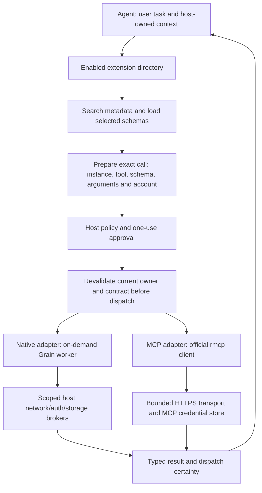

# Extension platform: audit, reuse and execution plan

**Current hosted-generation block, 8 October:** [Scoped audit](EXTENSION-METADATA-GENERATION-AUDIT.md)
records exact root/revocation JSON hashes inside the existing signed catalogue,
connected bootstrap/renewal/review, hosting/capture/publication and app acquisition
checks. Mixed/unbound publications cannot authorize installs; authenticated
negative policy still applies. No new service, signing role or metadata request.
Windows **300 core / 85 SDK / 77 maintainer / 11 backend store / 13 public CLI /
4 publisher / 78 runner / 6 real-app store** checks pass. Scoped strict lint,
real-app build and formatting pass; SDK all-target lint separately retains two
unchanged test warnings. One live-network test remains ignored. The obsolete
unbound-seed CI shell lane is retired; positive signed product coverage remains.
No new Agent scenario/framework/manual batch. E4 remains current for operator
signing/publication custody and actual signed public HTTP/app activation; E5–E8
follow. Foundation **52 Pass / 1 Deferred**, forward **71**, OAuth identity **56
Pending**, inventory **108 / 93 / 81** and parked website stay unchanged.
Earlier dated entries are historical; Linux pinned verification follows below.

**Current atomic app cache block, 8 October:** [Scoped audit](EXTENSION-STORE-CACHE-AUDIT.md)
records one bounded six-piece cache, reuse of the existing atomic writer,
monotonic/exact signed version identity, persistence failure refusal and restored
restart floors with no resident idle catalogue. Corrupt cache acquisition stays
disabled; independently valid signed policy/floors are retained. Windows **299
core / 11 backend store / 6 real-app store** checks, strict core lint, build and
formatting pass, including actual sharing-lock refusal and genuine signed
same-version replacement. One existing live-network test remains ignored.
No harness source/scenario/framework or manual batch. Verified [Linux checkpoint](https://github.com/Punit-Dethe/Grain-Extention/actions/runs/37674003172)
passes **5 cache / 11 trust / 77 maintainer / 4 publisher / 79 CLI checks**;
downloaded evidence matches both source pins and all retained verdicts.
E4 remains current for
hosted generation contract, operator signing/publication custody and actual
signed HTTP/app activation; E5–E8 follow. Foundation **52 Pass / 1 Deferred**,
forward **71**, OAuth identity **56 Pending**, inventory **108 / 93 / 81** and
parked website remain unchanged. Older dated sections are historical.

**Previous app freshness block, 8 October:** [Scoped audit](EXTENSION-STORE-FRESHNESS-AUDIT.md)
records the corrected signed-seed GitHub host, pending root adoption only after
verified fresh catalogue/revocations, mandatory authenticated fresh revocation
responses and root/revocation expiry checks before download and final native/MCP
commit. Cached signed kill switches remain enforced offline. Windows **294 core /
76 maintainer / 11 backend store / 6 real-app store / 78 runner tests** pass;
strict scoped Clippy, real-app build and formatting pass. One existing live
store-network test is ignored. The first native desktop run correctly refused a
fixture's missing revocations; a signed empty list repairs the existing fixture,
then both complete suites pass. No new scenario/framework or manual batch.
E4 remains current. Next address atomic durable cache selection/write failure,
restart floors and metadata-generation identity, then authorized signed public
activation/HTTP/app acceptance. E5–E8 follow. Foundation **52 Pass / 1 Deferred**,
forward **71**, permanent OAuth identity **56 Pending**, inventory **108 / 93 / 81**
and parked website remain unchanged. Existing lower dated sections are history.

**Previous first-publication/workflow block, 7 October:**
[Audit](EXTENSION-FIRST-PUBLICATION-AUDIT.md) records the clean initial Git gate,
manual current-contract source build and already-signed publication workflows.
The initial route preserves current seed trust/policy, requires fresh empty
metadata with next versions, verifies exact committed bytes, omits fabricated
previous proof and refuses an already-established publication base. The publisher
runs pinned trusted code, never author builds/signing keys, and uses a single
expected-base conditional push with remote confirmation and no ambiguous retry.
Windows **76 Rust / 4 publisher / 9 core trust / 12 real CLI checks** pass,
alongside locked build, scoped strict Clippy, rustfmt and scoped audit. Verified
[Linux checkpoint](https://github.com/Punit-Dethe/Grain-Extention/actions/runs/37662540187)
passes **77 Rust / 4 publisher / 9 core trust / 79 CLI checks**; all 67 retained
and 12 shared verdicts match downloaded evidence. The actual native/MCP source
builder [checkpoint](https://github.com/Punit-Dethe/Grain-Extention/actions/runs/37662540836)
also passes with both exact producer pins. No live catalogue/main activation,
new manual batch or Agent harness framework. E4 remains current for actual signed
activation and HTTP/app coherence; E5–E8 follow. Existing product acceptance
counts and deferred live expiry are unchanged. Earlier dated sections below are
historical and do not override the current clean-break scope.

**Previous clean-break block, 7 October:** [Cleanup/bootstrap audit](EXTENSION-CLEAN-BREAK-AUDIT.md)
records physical removal of E4i/E4j archive/migration commands, consumers,
legacy bindings/reservations and their exclusive fixtures/tests. The new
`bootstrap-serving-tree` creates an empty signed catalogue from current app
trust without reading old registry data. Windows **72 maintainer / 9 core trust /
8 public CLI checks**, locked build/strict Clippy and scoped audit pass. Linux
[checkpoint 37561458613](https://github.com/Punit-Dethe/Grain-Extention/actions/runs/37561458613)
passes **73 maintainer / 9 core trust / 67 CLI checks**. Source pins and all
59 retained verdicts plus eight Windows/Linux shared verdicts are independently
verified. Next implement the clean first-publication GitHub gate
(no previous legacy bundle), then current hosted/app coherence and publishing.
Five E4–E8 stages retain work; no new manual batch or Agent harness framework.
Other exclusive old paths may be retired in their own coherent blocks.

## Current policy: unreleased platform, clean break — 7 October

The user confirms Grain is **before pre-alpha, unpublished to users, with no
deployed consumers**. This supersedes earlier old-extension/settings migration,
carry-forward, archive preservation and physical-removal hold requirements in
this document and linked historical audits. Breaking old Grain contracts is
allowed. Provider/protocol interoperability and current security are still needed.

1. Stop extending E4i/E4j legacy capture/migration. Their completed test results
   remain historical evidence; they are not shipping requirements or gates.
2. Remove compatibility-only archive consumers, sticky legacy bindings, old
   version reservations, first-migration handoffs and their exclusive tests/CLI
   documentation in a coherent cleanup block. First trace callers to retain
   current signing, source review, hosting integrity and ordinary publication.
   Do not replace this with another migration framework or archive scheme.
3. Initialize the new tool-only catalogue directly with app/hosted trust metadata
   that agrees. No old-extension upgrade, old settings migration, historical
   addressed-route retention or inherited legacy versions need acceptance.
4. Keep the current security, authentication, cancellation, cleanup, result and
   source/build/signature checks. Keep explicit publisher authorization/key custody
   appropriate to the new platform; do not treat historical continuity as security.
5. Continue E4 publishing, E5 management UI, E6 Agent modules, E7 measured
   integration and E8 eventual release readiness with the smaller scope. Retire
   exclusive old capability paths when useful, preserving Agent-owned context,
   dictation/audio and required shared brokers. Preserve unrelated working edits.

This is a **scope correction**, not new implementation/test acceptance. Already
built compatibility-only code is cleanup debt, not a platform requirement.
No runtime deletion, settings reset or catalogue activation occurs in this
documentation update. Earlier dated handoffs/counts below are historical; apply
this policy whenever they conflict. Five E4–E8 stages retain work, with legacy
migration and upgrade preservation removed from their required scope.

**E4j migration implementation, 7 October:** [Migration audit](EXTENSION-LEGACY-MIGRATION-AUDIT.md)
records the connected archive verifier, genuine-key empty-baseline signer,
sticky signed version reservations through store/update/renewal/hosting, and
distinct first Git migration handoff. The actual legacy archive still preserves
all 109 files; active old versions remain retired. Windows **95 maintainer /
9 core trust / 25 public CLI checks**, build/strict Clippy and scoped audit pass.
[Pinned Linux checkpoint](https://github.com/Punit-Dethe/Grain-Extention/actions/runs/37525774777)
passes **96 maintainer / 9 core trust / 85 CLI checks**. Exact source, all 60
earlier Linux verdicts, all 12 earlier archive verdicts and all 109 identical
archive files are independently verified. No production key was accessed and
no production baseline was signed, approved or activated. E4 remains open for protected
signing/authorization, conditional GitHub activation, operational controls and
actual hosted-client coherence; **five E4–E8 stages retain work**. No new manual
batch or Agent harness expansion; existing foundation/forward/inventory counts,
parked website and physical-removal hold are unchanged.

**Current E4i legacy history preservation — 7 October:** [Archive audit](EXTENSION-LEGACY-HISTORY-AUDIT.md)
accepts the bounded manifest-pinned historical capture implementation:
**80/80 Windows maintainer tests, 9/9 core trust tests, 12/12 actual public CLI
verdicts**, build/strict Clippy/format and focused audit Pass. The real pinned
legacy history yields **18 signed proofs / 27 content variants / 8 conflicted
version identities / 37 assets**; all **109 proof/asset files** match exact Git
source bytes. One early missing asset is recovered from a later pinned commit
with its original signed hash/size and explicit source record. Retired `builtin`
is recognized only in an authenticated archival view, never active SDK admission.
No fake revocations, keys, activation, capability reapproval or physical removal.
[Pinned Linux checkpoint 37516026483](https://github.com/Punit-Dethe/Grain-Extention/actions/runs/37516026483)
passes **81/81 maintainer / 9/9 core trust / 72 actual CLI checks**. Exact source
`ae79f10a3af5ec823ec23726cafa44245faa39db`, all 60 earlier verdicts and all 109
archive files are independently checked; receipt is identical across platforms.
Next E4: protected archive reauthentication/reservation enforcement in the complete
migration/hosting contract, genuinely reviewed/signed six-document baseline,
authorized conditional GitHub activation, actual hosted client coherence and
operational protection/key controls. E4 remains open; five E4–E8 stages retain
work. No new Agent scenario or manual test batch; website stays parked and
foundation/forward/inventory counts are unchanged. Earlier checkpoints below
are historical.

**Current E4h committed publication capture — 6 October:** [Capture audit](EXTENSION-GITHUB-CAPTURE-AUDIT.md)
records exact raw-Git reconstruction, empty-directory recovery, authenticated
previous history and reuse in the conditional publication gate. Windows **69/69
full maintainer tests and 12 actual CLI verdicts**, strict Clippy/format/build and
focused audit pass. Actual app-pinned capture succeeds independently of dirty
checkout bytes; the actual incomplete legacy baseline deliberately refuses.
Source `ee558607e7f6a8999bc659ac09ab51eed3416d5a` is pushed; pinned read-only Linux
[checkpoint 37502693151](https://github.com/Punit-Dethe/Grain-Extention/actions/runs/37502693151)
passes **70/70 full maintainer tests and 60 actual CLI verdicts**; downloaded source,
eight-file real-root capture and all 50 prior verdicts are independently checked.
Next E4: inventory and protect earlier four-document legacy proof/version identities
without inventing historical revocations; establish a genuinely reviewed/signed
complete migration baseline, then scoped authorized conditional GitHub activation,
actual hosted client coherence and operational controls. New capture does not
close that first migration or enable production publishing. Legacy files/workflow
and physical-removal hold remain intact. Five E4–E8 stages retain work; optional
website stays parked and foundation/forward/inventory counts are unchanged.

**Current E4g GitHub publication handoff — 6 October:** [Publication audit](EXTENSION-GITHUB-PUBLICATION-AUDIT.md)
records the no-secret commit-binding gate, exact base/candidate parent and signed
history retention, plus explicit-lease handoff tested against a disposable Git
remote. Windows **62/62 full maintainer tests**, four actual CLI admission checks,
locked build/strict Clippy/format and scoped review pass. Source
`7557c0d722e8ab1a23afe62c2710c65b3b5a298e` is pushed; pinned read-only Linux
[checkpoint 37450479331](https://github.com/Punit-Dethe/Grain-Extention/actions/runs/37450479331)
passes **63/63 full maintainer tests and 50 actual CLI verdicts**, with downloaded
source identity and all 46 earlier precise verdicts independently checked.
This checkpoint prepares and verifies a handoff; protected remote execution is
separate. Next E4: protected first history migration/capture and authenticated
conditional GitHub activation, actual hosted client coherence, independent
review/key custody and operational renewal/revocation. Keep the legacy publisher
and held files intact. GitHub remains confirmed; optional website work is parked.
E5–E8 follow; five stages retain work. No new Agent harness source/scenario or
human batch, baseline/forward/inventory inflation, public OAuth activation or
obsolete-code deletion.

**Current E4f renewal block — 6 October:** The user reconfirmed **GitHub as the
registry host** and asked to park optional website work. [Renewal audit](EXTENSION-METADATA-RENEWAL-AUDIT.md)
records a narrow command that renews signed catalogue/revocation expiry without
changing extensions, rules, roots, future fields or addressed bytes, then feeds
the existing locked promotion/archive path. Final **54 Windows / 55 Linux full
maintainer Rust tests**, **7 Windows / 46 Linux actual CLI verdicts**, locked
build/strict Clippy/format and scoped audit pass. Linux CI `37425315653` accepts
the exact pinned source; its failed bookkeeping candidate earns no acceptance.
No Agent harness expansion or manual batch.
Public OAuth identity remains disabled/full 56 Pending; the website PR remains
open/unmerged. E4 hosted GitHub coherence/activation, protected earlier history,
independent review/key custody and renewal/revocation operations remain; E5–E8
follow. Five stages retain work, with acceptance/deferred/inventory counts and
physical-removal hold unchanged. Earlier Vercel registry recommendations are
superseded; no host migration is being performed.

**Current hosting decision — 6 October:** The user permits provisional use of the
existing Vercel website. [Host decision and transition procedure](EXTENSION-HOSTING-DECISION.md)
separates GitHub source/review/build evidence, the candidate public OAuth document
at `usegrain.vercel.app/oauth/client.json`, and a recommended separate static
registry staging deployment. The reviewed website branch/PR is pushed, local
checks pass and actual Vercel preview deployment succeeds, but preview SSO and
canonical 404 leave public acceptance Pending. No Grain client identity, signed
registry base, production deployment or trust key changes. E4 still requires
actual publication coordination/coherence, old history/migration and protected
approval/key/renewal operations; E5–E8 follow. Five stages retain work; baseline,
forward/deferred/full-56 counts and inventory are unchanged. Earlier hosting
prohibitions are superseded only within this provisional authorization.

**Current checkpoint — 6 October, E4e archive-complete handoff:** [Audit/evidence](EXTENSION-HOSTING-BUNDLE-AUDIT.md) accepts bounded static hosting-bundle preparation and independent receipt-pinned verification of exact selected state plus signed historical asset proofs. **21 Windows / 22 Linux affected Rust / 39 CLI verdicts per platform**, locked build/format/strict Clippy and scoped audit Pass. No new Agent harness or desktop/user batch. Local withdrawn-content preparation is closed; actual canonical hosting/conditional activation, protected migration of earlier history, real independent approval/protections/key custody and renewal/revocation remain E4 gates. Do not invent an official host, flatten signed routes, merge the draft into the incomplete legacy publisher or activate production from these local tests. Existing root/base URLs, user edits, physical-removal hold and no-release decision remain. **Five E4–E8 stages retain work**, with baseline/forward/deferred/full-56/inventory unchanged. Earlier dated checkpoint entries are historical.

**Current checkpoint — 6 October, E4d historical reservation/export:** [Audit/evidence](EXTENSION-SERVING-HISTORY-EXPORT-AUDIT.md) records append-only retained signed-catalogue identity checks and independently pinned complete snapshot export. **15 affected Windows Rust / 25 CLI verdicts**, successful pinned Linux **16 Rust / 25 CLI verdicts**, locked build/format/strict Clippy and scoped audit pass. No new Agent harness/desktop batch. The E4c immediate-base history limitation is resolved within the protected local store; bootstrap/migration completeness and bounded archival remain explicit deployment limits. Next coherent E4 work: conditional hosted activation/coherent metadata and retained historical hashes, protected prior-history migration, real protected review/governance/key custody and renewal/revocation. No invented hosting identity, legacy publisher activation, public freeze, physical removal or new user tests. **Five E4–E8 stages retain work**; baseline/deferred expiry/public-hosting/forward counts and inventory remain unchanged. Earlier entries are historical.

**Current checkpoint — 6 October, E4c local serving:** [Audit and exact evidence](EXTENSION-SERVING-PROMOTION-AUDIT.md) verifies complete signed snapshot assembly, strict fresh metadata/asset admission and serialized local pointer promotion against the exact base. **36 Windows Rust**, final **10 affected repeats / 16 CLI verdicts**, and successful pinned Linux **11 Rust / 16 CLI verdicts** pass. This is product CLI code; no additional Agent harness, desktop batch or user tests. Next finish one coherent E4 hosting/history and release-governance unit: snapshot-consistent serving and historical hashes/version identities, hosting-specific conditional promotion, protected positive human review/key custody and renewal/revocation procedures. Local file locks do not establish distributed coordination or live approval. Keep the draft unmerged/incomplete legacy publisher inactive in this branch; no main/admin/key changes or held physical deletion. E5 management/store, E6 runtime modules, E7 measurements and E8 certification retain their order. **Five E4–E8 stages retain work**; forward **71**, baseline **52 Pass / 1 Deferred (12)**, full **56 Pending**, inventory **108 / 93 / 81** unchanged. Previous dated checkpoints are historical.

**Current checkpoint — 6 October, E4b3 remote source/review:** [Audit and exact evidence](EXTENSION-SOURCE-REVIEW-BUILD-AUDIT.md) verifies real pinned native/MCP source/build handoff, fresh preparation and both genuine CI attestation paths. Schema-2 signing now independently queries actual merged GitHub source/latest reviewer state after provenance and before keys. **26 focused Rust / 20 CLI verdicts** and scoped repeats/checks pass. The registry draft PR remains unmerged; positive protected human-review-to-signing acceptance remains Pending. No schema-1 approval bypass, harness expansion, production activation or physical deletion. Next develop one coherent E4 complete signed serving-tree/serialized promotion boundary with focused component checks and existing real-store acceptance at integration; then close workflow/protection/key custody and renewal/revocation gates before production. Keep E5 store/management, E6 MCP entry UX, E7 discovery measurements and E8 final certification in their planned order. **Five E4–E8 stages retain work**. Baseline **52 Pass / 1 Deferred (12)**, public hosting **56 Pending**, forward **71** and inventory **108 / 93 / 81** stay unchanged; no new user batch. Earlier checkpoint descriptions below are historical.

**Current E4b3 genuine CI checkpoint, 6 October:** [CI provenance audit](EXTENSION-CI-PROVENANCE-AUDIT.md) closes the missing positive cryptographic handoff for controlled native/MCP data through the actual registry repository and full signer. Pinned read-only preparation and separate maintained OIDC attestation succeed; **24 affected Rust / 13 CLI verdicts**, exact identity negatives and owned cleanup pass. Scoped branch refs are admitted; no new Agent harness or redundant app batch. Next real pinned author-source/build isolation and protected independently derived review policy before complete-path serving/promotion/renewal/revocation. Fixture reviewer/example origins are not production authority; main currently has no effective rules and its legacy publisher is active but was not triggered or edited. Full E4b3/E4 remains gated; forward 71 latest numbered acceptance and five E4–E8 stages remain. Preserve existing edits and the deletion/public-hosting/release holds; retire temporary fixture preparation/branch trigger when real reviewed builds replace it.

**Current E4b3 local boundary, 5 October:** [Reviewed signing audit](EXTENSION-REVIEWED-SIGNING-AUDIT.md) records protected-policy/exact-candidate/official-GitHub-verifier/prior-index gates before bounded minisign key access and a separately generated signed update fragment. **149 Rust / 18 CLI commands (14 refusals)**, final affected checks, scoped audit and owned cleanup pass; no harness expansion or redundant host batch. **Full E4b3 trusted-CI/review/signing acceptance stays Pending**, with forward 71 latest accepted. Next finish pinned isolated author-build/trusted-attestation/review/signing workflow integration in the correct nested registry and genuine positive/negative CI identity evidence; then E4 complete serving/promotion, renewal/revocation and submission enablement. Do not activate the current incomplete publisher, deploy keys/settings, silently lose prior catalogue fields or claim a fragment is a complete hosted registry. Five E4–E8 stages, existing deferred/public-hosting/release gates and physical-removal hold remain.

**Current E4b2 accepted, 5 October:** [Catalogue listing audit](EXTENSION-CATALOGUE-LISTING-AUDIT.md) accepts forward **71** for both-kind unsigned content-addressed candidate staging, optional signed DESCRIPTION/media contract and scoped app consumption. **184 Rust / 81 Node / 6 executable expected verdicts / 6 real-app store cases**, final affected repeats, scoped audit and independent cleanup Pass. No new harness framework or scenario. Next **E4b3 independently verified CI/source/workflow/review policy and signing-only catalogue publication**, preserving the legacy guard until complete-path acceptance. E4 remains open; five E4–E8 stages retain work. MCP card/management UI remains E5. Existing baseline/deferred expiry/public hosting/release/physical-removal holds are unchanged.

**Current E4b1 accepted, 5 October:** [Receiving audit](EXTENSION-PUBLISHING-HANDOFF-AUDIT.md) accepts forward **70** for a read-only local verifier of prepared native/MCP artifacts, DESCRIPTION/media and exact reviewed structured submission against independent receipt/producer pins. **139 Rust / 12 executable expected verdicts**, locked build/Clippy/scoped checks Pass. No application/harness source or scenarios changed. Next **E4b2 catalogue DESCRIPTION/media producer/consumer integration and independently verified CI/review/signing authority**; the local verifier cannot establish provenance or grant trust. E4 remains in progress; five E4–E8 stages retain work. Baseline/deferred expiry/public hosting/release/physical-removal holds remain unchanged. Earlier entries are historical.

**Current E4a accepted, 5 October:** [Publishing preparation audit](EXTENSION-PUBLISHING-PREPARATION-AUDIT.md) accepts forward **69** for shared native packaging and two-kind local pinned-source/listing preparation, with unsigned receipts that confer no review/signing authority. **133 Rust**, real executable positive/parity/refusal checks, build/Clippy/scoped audit Pass. Product maintainer tools changed; no host/harness code or new desktop scenario. Next **E4b trusted review/artifact handoff and DESCRIPTION/media catalogue producer/consumer migration**, then external workflow/serving/update/revocation/governance acceptance. **Five delivery stages E4–E8 remain**; E4 is not complete. Baseline/deferred expiry/public hosting/release/physical-removal holds are unchanged. Earlier entries are historical.

**Current E3b accepted, 5 October:** [Source submission/listing audit](EXTENSION-SUBMISSION-LISTING-AUDIT.md) accepts forward **68** after typed source metadata, mandatory DESCRIPTION/bounded media, shared CLI/maintainer parsing and explicit refusal by the unmigrated publisher. **126 Rust / 81 Node**, generated contract checks, actual CLI/registry positive/tamper checks, **12/12 + 3/3 + fresh 1/1** actual-app checkpoints and independent three-scope cleanup Pass. No new harness source/scenarios. E3's provisional SDK/CLI lane is complete; next **E4 publishing**, then E5 UI, E6 runtime/recovery, E7 measurements and E8 certification: **five delivery stages remain**. Baseline **52 Pass / 1 Deferred (12)**, full **56 Pending**, inventory **108 / 93 / 81** and physical-removal hold remain. Public SDK freeze/publishing/release are still gated. Earlier entries are historical checkpoints.

**Current E2i accepted, 5 October:** [Store activation checkpoint and block audit](STORE-MCP-ACQUISITION-AUDIT.md#e2i-real-app-activation-checkpoint-and-block-audit) accepts forward **66**. Verified store records now share the official-SDK runtime with host source/account/revision and resident signed revocation checks; only explicit Developer Mode consent activates them. **16/16** combined real-app cases and final **3/3** affected repeat Pass; existing owner fault is detected, seven scopes / **47 PID references** independently clean. **75 MCP / 81 Node**, build/types/Clippy and focused source audit Pass. E2's provisional remote connection model is complete; next **E3 SDK/CLI**, then E4 publishing, E5 management/store, E6 runtime/recovery, E7 measurements and E8 certification: **six delivery stages remain**. Baseline **52 Pass / 1 Deferred (12)** and full **56 Pending** remain; inventory **108 / 93 / 81**. No manual batch, physical removal, UI redesign, public freeze or production release. Earlier entries are historical checkpoints.

**Current E2h backend ownership, 5 October:** [Store acquisition/update audit](STORE-MCP-ACQUISITION-AUDIT.md#e2h-verified-update-and-revocation-ownership) records verified exact-revision updates, account rotation/retirement and resident revocation freshness/cancellation through existing adapters. **20 core / 10 store / 75 MCP** tests pass, including a final affected MCP repeat; types/build/Clippy and focused source audit pass. No harness expansion. Store activation remains gated pending the combined real-app acquisition/update/removal/revocation/runtime checkpoint and complete-block audit; that is next, followed by E3 SDK/CLI. E2 is not complete. Baseline **52 Pass / 1 Deferred (12)**, full **56 Pending**, forward accepted verdicts, inventory **105 / 90 / 80**, seven E2–E8 stages and the physical-removal hold remain unchanged.

**Current E2g backend foundation, 5 October:** [Store MCP acquisition audit](STORE-MCP-ACQUISITION-AUDIT.md) records explicit signed artifact kinds, bounded hash/identity admission and atomic source-separated persistence through the existing registry/store path. Focused component/integration checks replace new desktop-harness cases under the [user-approved scheduling amendment](EXTENSION-COMPATIBILITY-CONFIGURATION-AUDIT.md#5-faster-development-without-weaker-acceptance). No harness expansion or new numbered Pass. Store accounts remain inactive pending verified update/revocation integration and one coherent real-app checkpoint/audit; E2 is not complete. Next finish that ownership integration, then advance E3 SDK/CLI. Seven E2–E8 stages, 12 Deferred, 56 Pending and the physical-removal hold remain. Earlier accepted checkpoints retain their original evidence.

**Current E2f checkpoint accepted, 4 October:** [Configured registered-client audit](CUSTOM-MCP-CLIENT-REGISTRATION-AUDIT.md) accepts forward **65** for host/revision-owned public/confidential setup, rotation/logout/reset and client retirement through the existing SDK/vault path. **36/36** broad checkpoint, final-runner **5/5** affected repeat and detected rotation fault have expected verdicts; nine completed scopes / **121 PID references** independently clean. **73 MCP / 13 registry / 80 Node** checks, builds/type checks and scoped checks pass. No additional authentication engine or dependency. **E2 remains in progress**: next verified store descriptor acquisition through shared admission/ownership/runtime. Public client hosting (**56 Pending**) and live Linear expiry (**12 Deferred**) remain separate. Baseline **52 Pass / 1 Deferred**; forward **54/55/57/58/59/60/61/62/63/64/65 Pass**, inventory **105 / 90 / 80**. Seven E2–E8 stages retain work. No manual batch, UI redesign, public freeze/release or physical removal. Earlier checkpoints are history.

**Current E2e checkpoint accepted, 4 October:** [Configured OAuth ownership audit](CUSTOM-MCP-OAUTH-AUDIT.md) accepts forward **64**. Direct DCR sign-in shares the official SDK, bounded destination/callback/vault runtime and exact configured revision/account ownership. Same-endpoint accounts, pending cancellation, real expiry/refresh, logout/retirement and restart are verified. **34/34** broad checkpoint plus final-build affected repeats/negative control pass; **73 MCP / 13 registry / 79 Node** tests, builds/type checks and independent twelve-scope cleanup pass. One interrupted scratch root remains policy-blocked with no acceptance credit; credentials and owned processes/listeners are cleared. No new OAuth engine or dependency. **E2 stays in progress**: next generalize preregistered public/confidential client/issuer setup to configured host accounts, then verified store descriptor acquisition. Public hosting for full **56** still lacks an official identity. Seven E2–E8 stages retain work; baseline **52 Pass / 1 Deferred (12)**, forward **54/55/57/58/59/60/61/62/63/64 Pass**, inventory **103 / 88 / 79**. No manual batch, UI redesign, public freeze, production release or obsolete-code deletion. Earlier dated entries are historical.

**Current E2d checkpoint accepted, 4 October:** [Configured anonymous runtime audit](CUSTOM-MCP-RUNTIME-AUDIT.md) accepts forward **63** for direct records using the existing official-SDK executor, exact guarded enablement, revision/account approvals and edit/disable/remove/developer-off cancellation. OAuth definitions stay inactive. Final fixed-input **31/31** actual-app checkpoint, fresh three-case repeat, exact negative owner oracle and seven-scope independent cleanup pass. **71** normal MCP, **13** registry and **78** Node tests pass; no competing runtime or new dependency is introduced. **E2 remains in progress**, next configured OAuth/vault/current consent and retired-account disposal, then verified store descriptors. Seven E2–E8 stages remain. Baseline **52 Pass / 1 Deferred (12)**, forward **54/55/57/58/59/60/61/62/63 Pass**, full **56 Pending**; inventory **100 / 85 / 78**. No manual batch, release, UI redesign, public freeze or physical removal. Earlier dated checkpoints below are history.

**E2a completed within storage/admission scope, 3 October:** [Custom connection registry audit](CUSTOM-MCP-CONNECTION-REGISTRY-AUDIT.md) accepts forward **60**. Strict name/HTTPS URL/auth JSON needs no extension package; Grain creates persistent configured connection/account IDs, revisions and restart epochs. Atomic/conflict-checked saves preserve old state on failure; label edits retain the account binding, destination/auth changes retire it. Final logic/build/affected real-app/negative/cleanup evidence Pass. **E2 is not complete:** next wire the existing runtime, safe destination/OAuth handling and owned management commands, then verified store descriptors. Seven E2–E8 delivery stages remain. Baseline **52 Pass / 1 Deferred**, forward **54/55/57/58/59/60 Pass**, full **56 Pending**; inventory **93 / 78 / 74** unchanged. No new manual batch, always-alive engine, UI redesign, public freeze or physical deletion.

**E1 provisional contract complete, 3 October:** [Compatibility/configuration audit and checkpoint policy](EXTENSION-COMPATIBILITY-CONFIGURATION-AUDIT.md) accepts forward **59**. Installed and developer native profiles now share bounded validation; catalogue compatibility is checked before download/staging without hiding future tool cards. Configuration, account, version and error ownership rules are settled provisionally. Twelve real-app checkpoint cases, fresh compatibility repeat, detected negative control, 485 workspace tests, twelve normal developer/store tests, 74 Node self-tests and independent cleanup Pass. Next **E2 custom remote MCP acquisition/persistence**, then E3–E8: **seven delivery stages remain**. Baseline **52 Pass / 1 Deferred (12)**; forward **54/55/57/58/59 Pass**, full **56 Pending**. Inventory **93 IDs / 78 self-contained / 74 self-tests**. Public freeze, permanent hosting, release gates and physical-removal hold remain unchanged. Older entries below are history.

**E1b complete within scope, 3 October:** [MCP descriptor/host identity audit](MCP-DESCRIPTOR-IDENTITY-AUDIT.md) accepts forward **58** after strict metadata/identity matrices, catalog key invariants, the full 22-case real-app MCP foundation batch, fresh provider independence/smoke, exact negative control and independent cleanup. The two E1 slices now implemented are native author API isolation (57) and provisional remote metadata/host ownership (58). Remaining E1 work settles compatibility/configuration rules; E2 then wires direct custom MCP and store descriptors to shared persistence/auth/lifecycle. No custom connection route exists yet. Baseline **52 Pass / 1 Deferred (12)**; forward **54/55/57/58 Pass**, full **56 Pending**. Inventory **92 / 77 / 73** unchanged, all eight E1–E8 lanes still retain work. No manual batch, public freeze, website identity or physical deletion. Older checkpoints below are historical.

**E1a complete, E1b next, 3 October:** [Native public author contract and audit](NATIVE-AUTHOR-CONTRACT-AUDIT.md) accepts forward **57** for public-only generated types, handler/result/context parity, strict generated compilation and actual-host result cases. Source review and negative controls found/fixed null/empty result wrapping and optional-undefined typing; affected foundation/failure/smoke checks and independent cleanup pass. This is one E1 slice, not E1 completion or E8 freeze. Next implement provisional MCP descriptor and stable connection/account/source identity/configuration/version/error ownership before E2 runtime/custom import. Baseline **52 Pass / 1 Deferred (12)**; forward **54/55/57 Pass**, full **56 Pending**. Inventory **92 / 77 / 73**. All eight E1–E8 delivery lanes still have work; no new human batch or physical deletion.

**Client metadata controlled integration complete; activation gated, 3 October:** [Focused audit](MCP-CLIENT-METADATA-AUDIT.md) records the minimal official-SDK seam and final thirteen-case auth/fresh metadata/negative-oracle evidence. The fixed-port regression repaired an unintended discovery-before-conflict change without relaxing its oracle. The user confirms experimental sites are not an official Grain website; production `CLIENT_METADATA_URL` remains absent. Baseline **52 Pass / 1 Deferred (12)**, forward **54/55 Pass**; full **56 Pending** for permanent HTTPS hosting and eligible provider acceptance. Inventory **91 IDs / 76 self-contained / 73 self-tests**. One auth activation prerequisite and eight E1–E8 delivery lanes remain; seven release gates are part of certification, not seven extra phases. Keep deletion on hold and no new human batch. Older checkpoints below retain their original scope.

**Recovery/status unit accepted, 3 October:** [Focused audit](MCP-AUTH-STATUS-AUDIT.md) accepts forward **55**, following issuer criterion 54. Typed SDK auth/challenge/store errors produce specific recovery advice; temporary failures preserve grants, stale account failures cannot overwrite replacement status, and actual developer controls refresh/show recovery. Final complete twelve-case auth regression, fresh recovery repeat, negative oracle and shared Agent/smoke Pass; all real expiry clocks remain. Baseline **52 Pass / 1 Deferred (12)**; inventory **90 IDs / 75 self-contained / 70 self-tests**. Next bounded B5 unit is client metadata registration, with Grain-owned public HTTPS metadata and exact redirect inventory as prerequisites. Do not invent a hosted URL, enable an undeployed identity, pull tool-calling work forward, physically remove old capabilities, or treat this scoped acceptance as E1–E8/R0–R6 completion.

**Local registry follow-up, 3 October:** [Source and publishing audit](LOCAL-EXTENSION-REGISTRY-AUDIT.md) inspects `grain-extensions/` and its correct remote, `Punit-Dethe/Grain-Extention` at `af6e244…`. The earlier inaccessible-repository note below describes the pre-clarification lookup of a different bootstrap URL. Source access is resolved; E4 now requires REG-01–REG-12 closure for missing helper/CLI alignment, canonical packaging, source/review/build provenance, governance, complete signed assets/serving and renewal/revocation. Correct remote metadata shows three failed publish runs, no releases and missing branch/environment protections. No nested-repository edit, settings mutation or new test verdict. Keep existing dirty state and the deletion hold; continue the already scoped authentication recovery/status unit independently.

**Ecosystem scope amendment, 3 October:** the [SDK/CLI, publishing, custom MCP and store blast-radius audit](EXTENSION-ECOSYSTEM-BLAST-RADIUS-AUDIT.md) expands B6/B7 into delivery lanes E1–E8. The native author API and CLI scaffold are already narrowed; internal event types, legacy package/catalog concepts, README display, external publishing and hard-coded MCP connection identity still need coordinated work. Add custom remote MCP connections without requiring packages. Do not freeze the public contract until both acquisition paths, author tooling, catalog migration and management are accepted. This is planning-only: **52 baseline Pass / 1 Deferred (12), forward 54 Pass** remain unchanged. External registry lookup is inaccessible (404), not certified or deleted. Physical legacy removal stays on hold. Next bounded implementation remains authentication recovery/status; later discovery quality is planned, not implemented or certified here.

**Configured-client issuer unit accepted, 3 October:** [Audit, implementation, retained candidate failures and final evidence](MCP-REGISTRATION-ISSUER-AUDIT.md). Actual cross-issuer old-secret forwarding is reproduced and fixed with bounded OS-vault registration metadata, exact client/issuer ownership before consent/refresh, explicit metadata-first Save, safe partial publication and retained binding after logout. Final 11-case MCP-auth batch, clean issuer repeat, detected missing rotation, six Agent/two smoke regressions and logic/guard/build checks Pass. Additional forward criterion **54 Pass**; original baseline remains **52 Pass / 1 Deferred (12)**. Inventory **89 IDs / 74 self-contained / 70 self-tests**. No new manual batch. Existing preregistered credentials require one explicit re-save; Linear dynamic registration is unaffected. Next separate unit: classify reconnect-required versus temporary authentication failures and expose actionable status without losing usable grants. Then implement client metadata registration after its public HTTPS document prerequisite is available. B5c removal remains on hold, all seven release gates remain open.

**B5b scoped implementation accepted, 3 October:** native authorization URL/PKCE/exchange/refresh use exact `oauth2` 5.0.0 and the bounded host adapter, with unchanged persisted account formats and ownership checks. [Audit and evidence](NATIVE-OAUTH-REUSE-AUDIT.md): final eight native-auth / ten MCP-auth / six shared Agent cases Pass, 24 normal/24 feature auth tests, 69 self-tests and detected partial-consent fault. No new baseline requirement or human batch. Next configured-client issuer ownership/typed recovery, then metadata registration. B5c remains on hold. A newly interrupted MCP regression root has policy-blocked scratch cleanup and no full-run acceptance; the separate fresh full regression passes.

**Current direction, 3 October:** the user explicitly defers genuine live Linear expiry/refresh **12** and authorizes forward implementation. Ledger **52 Pass / 1 Deferred / 0 active baseline Pending**, 15 human / 37 reviewed automated; no unperformed requirement is passed. The [authentication/lifecycle reuse audit](MCP-AUTH-LIFECYCLE-REUSE-AUDIT.md) compares Goose, Kilo Code, OpenCode and official sources. B5a uses exact official `rmcp` 3.5.0 with existing host wrappers/features; separately accepted B5b native `oauth2` replacement follows. **B5c physical retirement and wrapper removal are on hold** until platform confidence and a separate decision. Tool calling is outside this comparison. Live provider expiry and all seven release gates remain open; older dated counts below are historical snapshots.

**B5a SDK compatibility accepted, 3 October:** exact 3.5.0 and the current `ClientConfig` type are implemented. The [focused audit](MCP-AUTH-LIFECYCLE-REUSE-AUDIT.md#final-evidence-and-scoped-acceptance) records two complete nineteen-case real-app repeats, unchanged dispatch counts, affected Agent/native/public-provider/Linear preflight checks, detected corruption and independent cleanup. Official legacy/modern tool checks pass; the existing standalone initialization fixture stays Blocked. Next B5b native OAuth, then separate registration-issuer ownership/typed recovery and client metadata integration units before broader provider certification. No retired code or wrapper was removed, no tool-calling feature was changed, and check 12 remains Deferred.

**Live browser unit accepted (3 October 2026):** [Focused audit](LINEAR-LIVE-AUTH-AUDIT.md) accepts check **9** from the user's recorded real Linear cancellation/fresh sign-in, immediate callback reuse, exact read grant, discovery, restart and cleanup. Ledger is now **51 Pass / 2 Pending (12/17)**. Remaining order: actual supported harmless/nested Agent read with restart, then an explicitly owned actual-clock live token-expiry/refresh procedure. The observed token lifetime is 86,100 seconds; the completed authentication suite removed its grant, so no expiry proof can be inferred later from that run. Do not begin SDK/native-OAuth replacement or broader implementation before these remaining tests. Ordinary Linear issue creation/assignment is user-reported successful; **AGENT-BUDGET-01** is documented for later focused investigation without increasing limits or replaying writes.

**Historical status after check 9, before check 17:** 3 October 2026. **Branch:** `extensions/tool-only-retirement`. **Status:** testing-only execution; **51 Pass / 2 Pending** (15 human, 36 reviewed automated). All ten B1 requirements, B2 checks 8/20/23/31, B3 checks 9/10/11/13/14/15 and all baseline B4 checks 46–48 are accepted. The [workflow interruption audit](AGENT-WORKFLOW-INTERRUPTION-AUDIT.md) closes denial, real expiry/restart, Stop, uncertainty and completed-receipt preservation, with controlled and configured-model repeats, detected faults and cleanup. Remaining numbered work: **B2 17 (1) + B3 12 (1)**. Historical official tools remain Pass; standalone initialization stays Blocked. Whole B2/B3 and all seven release gates remain open. No SDK/OAuth replacement or new feature starts. Two interrupted-run scratch cleanups remain policy-blocked/Pending with no final acceptance credit. The [provider-independence audit](MCP-PROVIDER-INDEPENDENCE-AUDIT.md) accepts check 14 with repeated controlled account isolation, dynamic-login cancellation and explicit fixed-port conflict recovery. The user selected Linear for the remaining live-account preparation; live browser cancellation/consent and grant restoration are reviewed; actual expiry/refresh and nested Agent reads remain pending.

**Controlled check 12 prerequisite:** the [MCP expiry/refresh audit](MCP-REFRESH-RECOVERY-AUDIT.md) adds actual SDK expiration, rotated-grant restart and refused-refresh recovery coverage. This does not change the **50 Pass / 3 Pending** ledger. Linear resource/issuer metadata is reachable from this machine; the finite isolated live-account path and human consent remain next. No ordinary account grant is copied, and API documentation cannot certify the actual MCP lifetime.

**Historical Linear browser-handoff preparation (2 October):** the [focused audit](LINEAR-BROWSER-CONSENT-AUDIT.md) adds explicit human sign-in mode, private native browser handoff, pre-publication read-scope validation, metadata-only grant/lifetime/discovery reporting and bounded terminal/IPC cleanup. Real control guards and existing preflight/regressions are verified; actual browser consent/token exchange remains unrun until the account owner is present. Current inventory **86 IDs / 64 runner self-tests**; ordinary `all` remains **73**. The ledger stays **50 Pass / 3 Pending (9/12/17)**. No tool executes in this authentication-only procedure and no idle grant/profile is retained afterward.

**Linear no-account prerequisite:** the [Linear consent preflight audit](LINEAR-CONSENT-PREFLIGHT-AUDIT.md) records two opt-in real-SDK/live-issuer cancellation cases, fresh-restart repeats, a detected missing-cancellation fault, exact read scope/resource/PKCE and zero retained scoped credentials. Browser consent, granted scope/lifetime and harmless authenticated reads remain the next isolated account unit; no human sign-in is needed yet. The ledger stays **50 Pass / 3 Pending (9/12/17)**; no new platform features start. Current inventory: **84 IDs, 73 self-contained, 60 harness self-tests**.

**Accepted check 48:** Eight controlled interruption cases passed their first run and clean repeat; two genuine configured-model adapter cases each passed denial and post-write outage tasks in two fresh profiles. Evidence includes the actual 120-second approval deadline and host restart, blocked changed-argument write retries, pending/active close, displayed completed receipts with unfinished work, and one uncertain MCP write independently verified without replay. Three deliberate faults were detected; 16 affected regression cases and all 49 runner self-tests passed, with cleanup and independent resource inspection passing. The maintained inventory is 78 scenarios. No new manual batch or production implementation change is assigned by this unit; see the [focused audit](AGENT-WORKFLOW-INTERRUPTION-AUDIT.md).

**Agent selected-tools and continuation accepted (2 October):** [Focused audit](AGENT-WORKFLOW-AUDIT.md) accepts **46 and 47** together. Six real-app controlled cases and two genuine-model cases pass twice in fresh profiles. Metadata stays schema-free; incremental tool loading preserves earlier selections, catalog/directory/byte limits are enforced, and both native and MCP read → approved disposable write → verify tasks execute exactly one write. Batched tails, three duplicate approvals per adapter and disabled-owner writes cannot dispatch. Four deliberate faults are detected at their exact assertions; affected authentication/transport/foundation/smoke regressions and cleanup pass. **48 Pass / 5 Pending**, inventory **68 IDs / 44 self-tests**. The user-selected configured model supplied actual calls and final replies; no personal provider objects or keys entered the isolated profile/evidence. Check 48 and whole B4 remain open. No new manual batch or ordinary production Agent/auth/dependency change.

This is the forward execution order for the existing [extension plan](MCP-EXTENSION-PLAN.md). That document retains the product contract, R0–R6 release gates and full numbered test procedures. The [progress report](MCP-EXTENSION-PROGRESS.md) retains verdicts and evidence. If older chronological handoffs disagree about what comes next, use this document. No existing acceptance requirement is waived.

## 1. Recommendation and constraints

Keep Grain's Agent and both tool adapters. Continue using the official Rust MCP SDK; simplify standard native OAuth with `oauth2` after accepting the current foundation. Use official MCP conformance alongside the real-application Agent harness. Do not replace the application with an agent framework or add a gateway to this release.

This is a targeted reduction of maintenance, not a platform rewrite. Grain already delegates MCP messages, negotiation, transport lifecycle and MCP OAuth to `rmcp`. Most remaining custom code protects application-specific approval, account, package and resource ownership. Another framework would still need that integration.

The original testing-first baseline has **24 of its 25** outstanding requirements accepted. On 3 October the user explicitly deferred its last live expiry requirement and authorized improvement without waiting for that real clock. This is a narrow scheduling exception: check 12 remains Deferred and live authentication release certification stays open. Continue focused tests and audits after each implementation slice; no other requirement is waived. Physical obsolete-code removal remains on hold.

After that baseline is accepted, make one library/refactor change at a time and repeat affected acceptance checks. This costs some repeat testing, but makes regressions attributable and respects the requested order. Conformance fixtures should be reusable across both SDK versions; do not build a second protocol stack just to finish the baseline.

Extensions supply tools/functions only. Agent-owned application/screen/selection context does not become an extension API. Native means the existing embedded Grain worker implementation; it does not mean arbitrary executables or unrestricted OS access. Remote HTTPS MCP is the current implemented MCP scope. User-configured remote endpoints are now a planned delivery lane, with their own identity/network/auth/import review before public contract freeze. Local stdio/process MCP and wider protocol capabilities remain separately scoped; no gateway is selected.

## 2. What the audit establishes

This section preserves the source and evidence audit at planning commit `b0afe340`, not a fresh security certification. The graph was queried first; its searches/impact output did not resolve the ownership questions, so relevant production code and maintained audit records were read directly. Absence of graph edges is not evidence that a module has no callers. No application or acceptance suite was run in that planning pass. Subsequent B1a real-app runs/fixes are recorded in the [native foundation audit](NATIVE-FOUNDATION-AUDIT.md): checks 2/22 accepted, 32 distinct harness scenarios and eight B1 account checks pending at that handoff. Subsequent B1b acceptance closes 41/45/53, and B1c partial acceptance closes 42/43/50/51; the subsequent [refresh/logout audit](NATIVE-AUTH-REFRESH-AUDIT.md) closes 44 against controlled providers. All ten numbered B1 requirements are accepted; retained input/release findings remain separate.

| Area | Current state | Meaning for the next work |
|---|---|---|
| Acceptance | **28 Pass / 25 Pending**, out of 53 numbered checks; 15 user-reported and 13 reviewed real-app automated results | Preserve the evidence and numbering. This audit adds zero Pass verdicts. |
| Native foundation | Tool-only boundary, stop/replacement, close/repeat, failures and four installation/persistence audit units accepted | Build on these paths. Remaining migration, typed inputs and account ownership need acceptance. |
| Harness | 30 distinct recorded real-app scenarios; separate production-logic suites | Good reusable base. Existing fixture loading explicitly refuses authentication and nonempty permissions. Native account and MCP real-app fixtures are missing. |
| MCP | Six curated developer providers; actual SDK transport/auth; bounded discovery/results and generation guards | Live provider compatibility is not certified. A credentials badge or a model-written answer is insufficient. |
| Native auth | Host-owned PKCE/code exchange/refresh, vault binding, account publication and cancellation | Standard OAuth operations can later move to a library. The account/vault rules remain Grain's job. |
| Agent | Selective discovery and approval continuation implemented | Full multi-step/model acceptance is pending. Equivalent authentication continuation and metadata caching remain unfinished. |
| Retirement | Public authoring/worker surfaces reduced; validation and dispatch refuse old capabilities | Some unreachable host handlers and obsolete runtime wiring remain physically present. Blocking and physical deletion are different milestones. |
| Release | All **seven R0–R6 whole-phase gates remain open** | No measured memory baseline, live certification or completed one-to-five-extension ladder is implied by the 28 checks. |

Retain the earlier accepted-input Escape timeout as an unresolved observation. The later reproduced Windows foreground refusal sent zero Escape input and is a different event. Passing reruns do not explain the earlier timeout. The harness also has a timing limitation: one negative input fault was detected in roughly eight seconds, while diagnostic collection took roughly 174 seconds. Investigate these as testing/foundation work, not as evidence for a production fix.

## 3. Code disposition: keep, edit, replace and remove

Counts below are physical source lines at planning snapshot `b0afe340`, including comments, blank lines and inline tests; subsequent B1a edits are not included. They are an inventory, **not production LOC, savings estimates or a commitment to delete entire files**. Full paths are relative to the repository root; bare backend filenames are under `src-tauri/src/`. The application-wide ASR/UI/Handy tree is outside this refactor.

| File or group | Lines | Disposition | Reason and acceptance condition |
|---|---:|---|---|
| `src-tauri/src/grain_mcp.rs` | 1,833 | Keep host policy; simplify SDK integration later | Preserve provider identity, metadata policy, vault generation, callback ownership, bounded catalog and truthful outcomes. Move only demonstrably duplicated SDK behavior upstream. |
| `grain_mcp_http.rs` | 155 | Review for partial replacement | Decorates the SDK HTTP trait with immediate cancellation and bounded deletion. New SDK cancellation behavior must pass the same production-wrapper schedules before removing it. |
| `grain_mcp_bounded_http.rs` | 356 | Keep bounds; edit only verified duplication | JSON, error, header and cumulative SSE/wire limits are host requirements. Do not replace a streaming byte cap with a post-allocation size check. |
| `grain_mcp_session.rs` | 227 | Keep ownership semantics | Generation tickets, provider serialization and vault-write commit guards ensure logout wins over old work. An SDK refresh lock is not a substitute for this. |
| `grain_auth.rs` | 2,409 | Replace standard OAuth operations; retain host rules | Later use `oauth2` for authorization URL/PKCE/code exchange/refresh. Keep account keys, scope/grant validation, callback listener, bounded/redacted responses, publication and failed-switch rollback. |
| `action_exec.rs` + `crates/grain-core/src/execution.rs` | 653 + 739 | Keep; review both adapter seams | Shared exact call, one-use confirmation, current-identity revalidation and dispatch certainty remain authoritative. No framework may bypass this gate. |
| `src-tauri/src/agent.rs` | 4,300 | Keep; focused edits only | Preserve run ownership, tool IDs, messages, budgets, receipts, approval continuation and first-party context. Do not rewrite this to acquire MCP support it already has. |
| `extension_host.rs` | 4,746 | Keep worker lifecycle; remove exclusive retired wiring later | Source/generation identity, on-demand start, idle retirement, socket limits and registry overlays stay. Companion/session branches need dependency tracing before deletion. |
| `host_api.rs` | 2,034 | Keep log/storage/net/auth brokers; remove unreachable retired handlers | The early allowlist already refuses legacy capture/semantic/LLM/context calls. Delete exclusive arms/helpers only after proving first-party callers use their own path. |
| `events_auth.rs` + `dev_extensions.rs` | 295 + 255 | Keep; retire obsolete hooks selectively | Worker authentication and developer identity/reload are still required. Remove only handlers made exclusive to retired capabilities. |
| `extension_companion.rs` | 282 | Physical-removal candidate | Old companion process support; rejected tool-only declarations do not make its compiled cleanup/start wiring disappear. Remove all exclusive callers together. |
| `extension_session.rs` | 323 | Physical-removal candidate | Retired extension microphone/session ownership. Shared audio and first-party recording must survive. |
| `extension_shortcuts.rs` | 496 | Remove contributed execution; retain necessary migration temporarily | Old binding namespaces, parsing and teardown may still be needed to preserve/archive user data. Do not erase migration before upgrade acceptance. |
| `extension_lab.rs` | 107 | Physical-removal candidate | Retired generator/lab wiring; check identity and cleanup callers first. |
| `extension_view.rs` | 1,039 | Selective ownership review | Contains host-owned interaction/routing too. Do not delete shared Agent/pill/form/chooser behavior because of the filename. |
| `crates/grain-core/src/extensions.rs` | 3,596 | Keep persistence/identity; reduce legacy paths later | Preserve saved ownership, grants, transactional activation, developer overrides and damaged-state refusal. |
| `crates/grain-core/src/tool_schema.rs` | 463 | Keep library-backed validation | `jsonschema` evaluates schemas; Grain bounds complexity/dialects/references. LLM schema adaptation is not authoritative validation. |
| `crates/grain-sdk/src/manifest.rs` | 3,253 | Reduce authoring contract; retain refusal tombstones | `validate_tool_only` rejects retired tiers/declarations. Legacy parsing must reject old requirements explicitly rather than silently ignoring them. |
| `crates/grain-extension-checks/src/lib.rs` | 1,350 | Keep/update authoring checks | Checker, package loader and runtime must agree about the reduced contract and declared network/auth access. |
| `grain_mcp_auth_tests.rs` + `grain_mcp_protocol_tests.rs` | 362 + 1,066 | Retain host regressions; replace duplicate wire coverage only with mapped conformance | Library adoption does not cover stale account publication, retained bytes or uncertain dispatched outcomes. |
| `grain_agent_harness.rs` + `tests/agent-harness/` | 526 + runner assets | Extend | Add narrowly scoped account/MCP fixtures and evidence mapping; keep the existing permission-free fixture strict. |
| Frontend extension management, worker supervisor and Agent views | Not estimated | Keep; functional edits only when required | Continue Tauri command/event boundaries and real-app testing. No UI overhaul, alternate visual harness or regenerated user bindings in this pass. |

The immediate MCP review surface is **2,571 lines across four modules**. The two HTTP wrappers account for **511** of those lines, but they are not all replaceable. Native auth is a **2,409-line** review surface with mixed generic and product-specific logic. The four named exclusive legacy candidates total **1,208 lines**, before callers and shared ownership are resolved. These numbers must not be added up and presented as guaranteed savings; broad host/core files contain substantial test coverage and unrelated retained responsibilities.

For every removal proposal, record producer → dispatcher → consumer → persistence/migration owner, replacement behavior and exact regression checks. Prefer deleting a complete obsolete path to leaving two production implementations. Preserve minimal deserialization tombstones and inert archives where needed. Never add features to `src-tauri/src/handy/` or remove Agent context as part of extension retirement.

## 4. How native and MCP extensions work together

The common layer is a host-owned tool contract and execution gate, not a shared runtime or shared token store.

1. **Describe an extension.** A native package declares tools and narrow supporting permissions. An MCP entry describes a server/provider and supported connection/auth configuration. The current MCP entries use `mcp.` IDs and are developer-only; they are not ordinary native packages. A later common management projection can present both kinds without merging their registries, grants or installation formats.
2. **Discover only what is needed.** Begin with bounded directory metadata. `search_tools` and `load_extension` select definitions; the model does not receive every schema at startup. Native declarations and MCP `tools/list` normalize into the same offered-tool contract. Discovery does not authorize execution.
3. **Bind an exact call.** Grain attaches extension/instance identity, selected definition, account/configuration generation, immutable arguments, run and call IDs. Current MCP approval identity conservatively includes the whole catalog; finer selected-tool freshness is a later measured change.
4. **Approve and revalidate.** Current policy confirms all extension calls, including reads. Keep that behavior during baseline testing. Provider annotations cannot authorize themselves. A stale source/account/schema/enablement or consumed approval refuses dispatch. MCP selected discovery is revalidated on the actual call path.
5. **Execute through the appropriate adapter.** Native uses the existing worker, with authentication performed by the Rust host. MCP uses SDK services and OAuth through the SDK's credential interface. Both report success, tool error, refusal or uncertain outcome through the same contract. Never automatically repeat a potentially completed write.
6. **Resume and release.** Preserve tool-call/result pairing and completed receipts in the original Agent task. Release transport/worker/listener ownership on stop, disable, replacement and idle cleanup. Do not keep an MCP connection alive merely because an extension is enabled or a confirmation is pending.

MCP OAuth and native API OAuth remain separate grants even for the same provider. Native developer folders and installed owners remain separate identities. The current curated MCP catalog effectively has one selected account per provider entry; arbitrary multi-account MCP instances are not implemented. Do not promise them through a UI label or generic registry type.

An extension cannot ask another extension to execute or retrieve host context. The Agent can explicitly pass task arguments to a tool; that is not a capability to query the screen/transcript independently. Tool descriptions/results remain untrusted data.

## 5. Exactly what is delegated

| Dependency | Decision | Grain retains |
|---|---|---|
| Official `rmcp` | Current backend lockfile: **3.1.4**; manifest accepts compatible 3.x. **3.5.0 is the reviewed upgrade candidate**, to be locked after baseline acceptance. | Provider allowlist/profile, exact approval, deadlines/byte limits, dispatch certainty, callback/vault ownership and host integration. Client/auth/HTTP features only. |
| `oauth2` 5.0 | Later native OAuth building blocks; already present transitively through MCP dependencies | Native account selection, API destination policy, provider scopes, listener lifetime, bounded HTTP adapter, vault formats and publication/recovery. Do not add a second MCP OAuth implementation. |
| Existing `jsonschema = 0.58.1` | Keep offline validation and current pin | Supported schema profile, complexity budgets and private errors. |
| Existing reqwest/Tokio/keyring | Keep | Scoped credential routing, operation lifetimes and OS-vault identity. Preserve the app reqwest 0.12/MCP reqwest 0.13 boundary; no unrelated HTTP migration. |
| Official MCP conformance | Test dependency, pinned to a release/commit with applicable frozen requirements | A test client exercising Grain's production adapter, required coverage reporting and host-specific adversarial tests. No shipping Node service. |
| Existing Agent harness | Extend real-app coverage | Live account consent, genuine-model behavior, ordinary-profile observations and release review remain separately evidenced. |

The newer SDK still does not justify dropping all custom HTTP limits: its reqwest implementation reads JSON bodies with `response.bytes()` and error bodies with `response.text()`, while it explicitly bounds SSE events. Grain additionally limits cumulative operation bytes, JSON/errors/headers and retained output. Preserve those guarantees until an equivalent implementation is demonstrated. [SDK HTTP source, 3.5.0](https://github.com/modelcontextprotocol/rust-sdk/blob/rmcp-v3.5.0/crates/rmcp/src/transport/common/reqwest/streamable_http_client.rs).

The SDK's optional refresh guard has no coordination by default. Wire it only if it safely replaces duplicated refresh work; retain Grain's generation-protected commits so an old callback or vault write cannot undo logout. [SDK auth source, 3.5.0](https://github.com/modelcontextprotocol/rust-sdk/blob/rmcp-v3.5.0/crates/rmcp/src/transport/auth.rs).

`oauth2` supports a custom asynchronous HTTP client. Use that seam to retain response budgets, no-redirect policy and redaction; adopting the library must not introduce unbounded token responses or secret-bearing diagnostics. [oauth2 5.0 documentation](https://docs.rs/oauth2/5.0.0/oauth2/).

Goose provides the closest Rust reference: official SDK plus application-owned extension management and credential persistence. Cline and OpenCode similarly keep application integration around the official TypeScript SDK. These are design references, not evidence that Grain's release works. [Goose core dependencies](https://github.com/aaif-goose/goose/blob/main/crates/goose/Cargo.toml), [Goose extension manager](https://github.com/aaif-goose/goose/blob/main/crates/goose/src/agents/extension_manager/mod.rs), [Cline MCP host](https://github.com/cline/cline/blob/main/apps/vscode/src/services/mcp/McpHub.ts), [OpenCode MCP integration](https://github.com/anomalyco/opencode/blob/dev/packages/opencode/src/mcp/index.ts).

Rig, Kit, `mcp-agent`, `mcp-use`, a Goose runtime and MCP gateways are not dependencies for this delivery. Reconsider a framework only for a measured maintenance problem or a new required capability, with a focused prototype and migration cost; popularity alone is insufficient.

## 6. Disposition of every pending acceptance check

**Retain all 25 objectives. Remove zero acceptance requirements.** Delegation replaces some implementation and wire-fixture maintenance, not proof that Grain combines it correctly. Their full procedures stay in the original plan. This table preserves the 25 objectives pending at planning snapshot `b0afe340`; subsequent B1a acceptance closes 2/22, leaving **23 Pending**. Current verdicts and evidence belong to the progress ledger, not this baseline mapping.

`Harness` means actual isolated Grain through production commands/adapters with controlled services. `Live` means a real supported provider/account or tool-capable model. A fixture proves its tested contract, not compatibility with every provider. Unsupported live prerequisites are reported separately and remain blocked where the numbered procedure requires them.

| Check | Retained objective | Planned evidence | Baseline block |
|---:|---|---|---|
| 2 | Legacy privileges remain off after upgrade/restart; edited prompts/bindings archived once | Harness migration snapshots and interrupted/idempotent restart; human ordinary-upgrade review when applicable | B1 |
| 22 | Native typed/optional arguments survive; changed contract defeats old approval | Harness typed echo/changed schema, recorded dispatch counts | B1 |
| 41 | Native unbound/changed declaration needs reconnect; fresh grant survives restart | Controlled OAuth + real app/vault; supported native registration/read confirmation | B1 |
| 42 | Reload/disable/disconnect beats an old native login callback | Held controlled callbacks, listener cleanup and fresh connect | B1 |
| 43 | Native account B cannot execute account A's approval | Controlled A/B identities and server receipts; live read identifies selected account | B1 |
| 44 | Logout wins over old refresh; other providers remain independent | Controlled refresh barriers and actual vault/publication path | B1 |
| 45 | Installed/developer accounts stay separate and restore correctly | Real packages/folders, restarts and authenticated receipts | B1 |
| 50 | Failed/cancelled native switch preserves prior selection | Controlled denial/failure/publication schedules plus successful A/B switch | B1 |
| 51 | Partial consent refused; expiry without/with refresh classified correctly | Controlled scoped/expiring grants; actual provider consent/expiry where supported | B1 |
| 53 | Folder A/B/installed restoration preserves output, owner and account | Extend existing packaging cases with the separate auth fixture; no credit for output-only coverage | B1 |
| 8 | Configured MCP discovers/reads, then disable refuses it | Controlled real-app MCP plus one supported live safe read | B2 |
| 17 | Nested supported MCP input yields a genuine read result | Controlled typed MCP receipt and suitable live tool if available | B2 |
| 20 | Normal/large MCP reads stay bounded and fresh calls recover | Actual wrapper JSON/SSE/adversarial fixture, retained-byte/cleanup evidence; safe live supplementary read | B2 |
| 23 | Mixed schema catalog retains supported tools and excludes unsupported ones | Controlled supported/unsupported catalog, offered definitions and zero excluded dispatch | B2 |
| 31 | Agent close cancels MCP work/pending approval without deleting account | Controlled slow read and pending approval; live supplementary cancellation only with a safe suitable tool | B2 |
| 9 | Cancel/deny MCP login releases a reusable callback listener | Controlled OAuth and actual browser denial/cancel with one supported provider | B3 |
| 10 | Late cancelled MCP login cannot resurrect connection | Held old callback, fresh login and actual account/vault evidence | B3 |
| 11 | Supported public/confidential registration and config invalidation | Conformance + controlled registration variants; live provider's documented registration mode | B3 |
| 12 | Real MCP grant survives restart and documented expiry/refresh | **Human-assisted real login, read, restart and real expiry/recovery**; fixtures supplement, stored badge does not pass it | B3 |
| 13 | Old MCP account/config/enablement approval refuses replacement | Controlled identity swaps and actual dispatch counts | B3 |
| 14 | MCP providers independent; fixed-port conflict reported truthfully | Two controlled identities/port ownership; two supported entries if live independence is claimed | B3 |
| 15 | Disable/developer-mode shutdown cleans MCP work; fresh enable recovers | Controlled delayed work and resource probes; real-app management actions | B3 |
| 46 | Search/load offers selected schemas, preserves earlier selections and obeys limits | Scripted-model real-app large catalog/no-match/overflow cases; actual tool-capable model trace | B4 |
| 47 | Read → approved disposable write → verify continues once | Server receipts, duplicate/stale approval oracles; live model and disposable test objects through both adapters | B4 |
| 48 | Denial/expiry/Stop prevents dispatch; later failure preserves receipts | Controlled model/provider faults and counters; small ordinary-app/live-model observation | B4 |

Grouping arithmetic: **1 migration + 2 native contract/owner + 7 native-auth + 12 MCP + 3 Agent = 25**. Execution grouping is **B1: 10; B2: 5; B3: 7; B4: 3**. Checks 41–45/50/51 are seven; check 53 is separately counted as native owner. Do not double-count overlapping procedures.

Some conformance coverage can replace duplicated protocol fixtures after a coverage map exists. None of these 25 IDs is solely an upstream wire-protocol assertion. Keep Grain regressions for callback cleanup, credential destination, stale publication, bounds, cancellation and post-dispatch uncertainty even when SDK conformance is green.

## 7. Execution blocks and acceptance order

### B0 — This audit and plan

Completed at `b0afe340`: source disposition, selected ownership, all-25 mapping and synchronized plan/progress links. That planning task included no dependency/app change, provider launch or acceptance verdict. Testing-only execution has now begun with B1a.

### B1 — Finish the existing native foundation (10 baseline checks; all numbered requirements accepted)

Break into small units: **B1a migration/typed inputs (2, 22)**; **B1b account fixture/binding/owner (41, 45, 53)**; **B1c cancellation/switch/refresh (42–44, 50–51)**. Finish the retained input investigation alongside this block.

**B1a accepted:** [migration/typed-input audit](NATIVE-FOUNDATION-AUDIT.md) closes 2/22 after a reproduced terminal-owner quarantine fix, transactional uninstall preservation, repeated actual-app tests and negative oracles. No account prerequisite is certified by those results.

**Historical B1b prerequisite acceptance:** the [guarded account fixture audit](NATIVE-AUTH-FIXTURE-AUDIT.md) records actual A/B reads, PKCE/vault publication, stale approval refusal, restart and independent cleanup. It reproduces and repairs a disconnected worker surviving its account generation. The permission-free fixture remains unchanged in authority. A separate explicitly enabled debug control fixes the owned ID/root, public client, scope, exact localhost HTTPS endpoints and run vault namespace. There is no general token/profile read or permission bypass. Two final clean runs and both negative oracles passed their expected assertions. The broader unit remains open.

**B1b numbered requirements accepted (41/45/53):** the [binding/owner audit](NATIVE-ACCOUNT-OWNERSHIP-AUDIT.md) records expired unbound/id-only refusal, four reviewed declaration changes, fresh grants/restarts, actual CLI developer A/B builds and account/source verification, same-directory reload, stale approval refusal, installed restoration and independent parked-grant deletion counts. Two final combined runs and both new fault oracles have expected results with cleanup Pass. No live-provider/browser certification or production orphan reconciliation follows; three discarded development grants needed independent run-vault cleanup.

**Historical B1c partial acceptance (42/43/50/51, before 44):** the [native schedule audit](NATIVE-AUTH-SCHEDULE-AUDIT.md) records six actual developer-reload/disable/disconnect races, explicit A/B switch refusal, cancelled/denied/failed switch persistence and actual partial-consent/expiry/reconnect/refresh proof. Full affected seven-case account batch and final fresh-profile four-case repeat pass; both fault oracles fail as intended with cleanup Pass. The four new cases take 44,956 ms of scenario time in the final repeat. No objective was dropped. At that handoff, **44 remained next** for held refresh/logout and two distinct native fixture/provider identities; the final numbered acceptance follows below. Single-provider refresh is not provider independence. Live-provider, queued-vault/crash and orphan reconciliation requirements remain separately open.

**B1c final numbered acceptance (44):** the [refresh/logout audit](NATIVE-AUTH-REFRESH-AUDIT.md) records actual approved-read interruption, fresh replacement-account reads/restart, awaited refusal of stale refresh publication after logout, and an Agent-approved second-provider read during a held primary production refresh in the same host. Both independent accounts persist across restart; removing the primary preserves the peer. One fixed debug-only primary auth probe returns no token or tool execution. Complete eight-case regression, final clean-profile repeat and ordinary smoke pass; premature-release oracle fails, all cleanup Pass. Inventory is 40 scenarios and the ledger is **38 Pass / 15 Pending**. No new human batch. All ten numbered B1 requirements are accepted; next B2. Retained input findings, production discarded-grant reconciliation, live providers and all release gates remain open.

Use owned local TLS with scoped trust, or an equivalent isolated test transport boundary that cannot ship active. Do not weaken production HTTPS/redirect/endpoint validation to make fixtures convenient. Verify ordinary builds refuse harness controls. Extend migration snapshots in disposable directories; never damage the user's registry or vault.

**Gate:** full numbered requirements have reviewed evidence or explicit unresolved prerequisites; no partial coverage promoted to Pass. Fix reproduced failures, audit each small unit, run final repeated acceptance and a deliberately failing oracle, retain earlier failures and cleanup reports. Close whole 2D only when account-owner requirements and its final audit are accepted. The earlier input timeout needs a documented investigation/disposition; a clean rerun is insufficient.

### B2 — Certify the current MCP tool/transport path (5 checks)

Keep the locked SDK unchanged during this baseline. Add a controlled remote-style MCP fixture routed through Grain's production discovery/execution and bounded HTTP wrappers. Cover supported nested inputs, mixed catalogs, paging, JSON/SSE overflow, slow operations and late replies. Instrument received call counts, actual fixture writes, account identity and owned transport/listener cleanup.

Add a thin conformance client entry point that invokes these production wrappers. It must not merely instantiate a bare SDK client and bypass Grain. The external fixture URL/context is accepted only under the harness/conformance guard. Pin tooling and selected requirements; record every required scenario/check as Pass, Fail, Unsupported or Skipped. A skipped test or expected-failure baseline may return success, so process exit alone is not acceptance. Do not claim the SDK's own score as Grain's score. [Official conformance usage and requirements](https://github.com/modelcontextprotocol/conformance/blob/main/README.md).

**Gate:** checks 8/17/20/23/31, adversarial no-replay/byte-limit schedules and focused MCP boundary audit accepted. Controlled results and unavailable live tool shapes are distinct. Do not provoke production writes to test lost replies or cancellation.

**B2 first unit accepted (2 October):** [Catalog/transport audit](MCP-CATALOG-TRANSPORT-AUDIT.md) accepts 23 using the real app and a guarded unauthenticated HTTPS MCP peer. JSON/SSE modern discovery and legacy handshake, nested wire/result values, selected schemas, mixed/excluded/all-unsupported catalogs, cursor refusal, actual restart and stale disable/schema approvals pass. Both final cases pass twice in fresh profiles; both deliberate corruptions fail; all eight native-auth and both ordinary smoke cases pass, cleanup Pass. Inventory: **42 distinct scenarios**, including two MCP cases. Ledger: **39 Pass / 14 Pending**. Checks 8/17 have controlled supporting evidence and remain Pending for their live requirements; 20/31, conformance and whole B2 remain open. No new manual batch. The fixed peer stores no credential; account persistence/authentication are excluded. The audit retains all early TLS/fixture/oracle/bootstrap failures.

**B2 bounds/cancellation unit (2 October):** [Focused audit](MCP-BOUNDS-CANCELLATION-AUDIT.md) records three further real-app procedures: UTF-8/structured JSON/SSE preview limits, six separately identified overflow/drop conditions under each lifecycle, and four held approved calls plus two pending-approval closures with late-result rejection and fresh recovery. The maintained inventory is **45 scenarios**, five MCP, with 22 runner self-tests. Ledger stays **39 Pass / 14 Pending** because controlled partial evidence does not complete checks 20/31's live/account requirements. Remaining B2: catalog/whole-operation bounds, real deadlines, guarded pinned conformance and eligible live evidence. Compile once per stable slice; retain independent case/stage failures, serial owned-process runs, audit and clean-profile repeats. [Retention/cleanup inventory](AGENT-TEST-HARNESS.md#harness-retention-and-cleanup-inventory) is maintained alongside the plan. No new platform implementation starts before baseline acceptance.

**B2 catalog/deadline unit (2 October, supersedes preceding next-work snapshot):** [Focused audit](MCP-CATALOG-DEADLINE-AUDIT.md) records three additional real-app procedures: 24 management/Agent catalog refusal combinations with fresh recovery; four actual 45-second HTTP deadlines; and two actual 90-second absolute discovery deadlines. Both complete eight-case MCP runs pass with identical fingerprints, 116 observations and 80 actual calls each; the accepted-catalog fault is detected with zero calls. Final runs/fault have cleanup Pass. The interrupted initial run has no acceptance credit and retains Pending disposable-directory cleanup after automatic review blocked deletion; the inventory records that exception. Per-case checkpoint reporting retains observations without certifying unperformed teardown. Inventory: **48 scenarios**, eight MCP, 23 self-tests. Ledger remains **39 Pass / 14 Pending**. Next: a guarded pinned official-conformance entry through production wrappers, then eligible live read/account acceptance for B2. Bare SDK success, zero exit without test results or controlled unauthenticated fixture success cannot close those requirements. Keep B3/B4 and all seven release gates open; no new platform feature or dependency replacement starts here.

**MCP client configuration and stale approval accepted (2 October):** [Focused audit](MCP-CLIENT-CONFIGURATION-AUDIT.md) accepts **11 and 13** together. Empty-secret public and actual confidential registrations, public ID changes, same-ID secret rotation/removal and unsupported missing-secret refusal use real settings/SDK/OS vault paths. Four old confirmations dispatch nothing; ten approved A/B reads and five actual restarts identify the correct account without new login. The full six-case OAuth regression retains account-switch and disable/re-enable evidence; final clean repeat, detected skipped-client-change fault, eight native-auth, two smoke and two short transport/catalog cases pass, cleanup Pass. A harness callback-owner leak was repaired by consuming each delivered URL once while preserving issuer codes for actual late-login refusal. **46 Pass / 7 Pending**, inventory **60 IDs / 38 self-tests**. No new manual batch or ordinary production auth/transport/dependency change. Compile once per stable unit and select affected regressions; real clocks and distinct failure stages remain intact.

**Previous authenticated MCP shutdown accepted (2 October):** [Focused audit](MCP-AUTH-SHUTDOWN-AUDIT.md) accepts **15**. Provider Disable and Developer Mode off across modern/legacy JSON/SSE return honest uncertainty for eight held approved reads, discard late responses, preserve login and refuse eight old confirmations without dispatch. Twenty-four fresh/restart A reads succeed without a new authorization exchange. Real tests exposed legacy-session cleanup trying to reload an invalidated account ticket; an operation-scoped zeroizing owner now permits one bounded DELETE for the exact original session, with no refresh or tool replay. Fourteen combined MCP cases, clean five-case OAuth repeat, eight native-auth, two smoke and two public live cases pass; skipped Disable fails immediately with cleanup Pass. Official tools pass; known initialization stays Blocked. **44 Pass / 9 Pending**, inventory **59 IDs / 36 self-tests**. No new manual batch. Check 13 has shutdown/stale-confirmation evidence but remains Pending for changed-client variants; check 17 still requires eligible live nested evidence.

**Previous authenticated MCP cancellation accepted (2 October):** [Focused audit](MCP-AUTH-CANCELLATION-AUDIT.md) accepts **31**. Four authenticated held-read closes and four pending closes preserve the actual enabled account and scoped grant; late responses never reach the model, and twelve fresh/restart A reads succeed without new authorization. All thirteen combined MCP cases, a clean four-case OAuth repeat, eight native-auth cases and two smoke cases pass; deliberate production disconnect fails the preservation oracle and cleans up. A reproduced 256-entry OAuth evidence-log limit was repaired with bounded capacity and an exhaustion self-test; production limits/clocks are unchanged. **43 Pass / 10 Pending**, inventory **58 IDs / 35 self-tests**. No new manual batch. B2 now needs only eligible live nested-read check 17; whole B2/B3 and release gates remain open.

### B3 — Certify current MCP authentication (7 checks)

**Previous MCP prerequisite / late-login acceptance (2 October):** [Focused audit](MCP-AUTH-FIXTURE-AUDIT.md) closed 10 after actual Cancel sign-in/Disable/Developer Mode off, issued old callback refusal, zero exchange/grant/resurrection across restart and fresh B login/read/restart. The guarded actual SDK OAuth fixture supplied public DCR/PKCE/resource/vault and A/B result evidence for remaining work. All twelve combined MCP cases, clean three-case repeat, faults and affected native/smoke/live/official regressions had expected verdicts; malformed official init remains Blocked. Six B3 objectives remain: **9, 11–15**. That unit enabled B2 check **31**, now accepted above. Eligible nested/live prerequisites and remaining B3 schedules stay open. No broader feature or dependency replacement starts.

Use the same controlled transport and SDK auth path for denial, wrong/late state, supported registration, config replacement, refresh/logout races, port conflict and independent providers. Use SDK conformance for standards cases and Grain fixtures for host ownership.

Select **one** real provider with a documented desktop-compatible registration mode and a harmless read. Try Linear/Notion/Atlassian only if their current registration/endpoint supports it; the existing Linear negotiation error is an unresolved candidate failure, not certification. GitHub/Slack/Calendar client setup remains a prerequisite where required. Do not ask the user to connect all six catalog entries.

**Gate:** checks 9–15 and focused auth audit accepted, with provider/mode/scopes/protocol/date and real expiry evidence for check 12. A normal disconnect clears only the owned account. A library cannot remove provider-specific consent or developer-app registration requirements.

### B4 — Certify current Agent workflows (3 checks)

Extend the scripted model and real-app scenarios for selected loading, typed arguments, batch calls, read/write/read, duplicate approval, denial/TTL/Stop and failure after a completed receipt. Use disposable writes and actual server state. Then run a small genuine-model batch through native and MCP tools; record actual calls, including whether batch emission occurred.

**Gate:** checks 46–48 accepted after focused Agent/dispatch audit and retests. Authentication continuation, automatic-read policy and metadata caching are not secretly included in this baseline. An unimplemented promised behavior is recorded as such; passing the currently supported flow does not close R4.

### Foundation checkpoint — before improving the platform

The current checkpoint is **52 accepted / 1 explicitly Deferred (12)**. The user's 3 October exception permits B5a/B5b without waiting for live token expiry; it does not certify 53/53 or complete B3/live-provider release acceptance. Keep accurate human/controlled provenance. Conformance profile, 100-operation resource evidence, migration recovery, security review and broader provider/scale/model certification remain separate. Physical retirement remains on hold.

### B5 — Reduce maintenance, one accepted refactor at a time

**B5a SDK:** compare 3.1.4 to exact 3.5.0 at each adapter seam, capture build evidence, upgrade only the MCP dependency boundary, and review cancellation, session cleanup, auth/redirect/error behavior and retry paths. Retain every host wrapper; removal is on hold. For uncertain writes, count real provider dispatches; an SDK retry feature is not automatically safe. Repeat affected B2/B3 and shared-host regressions. Keep old acceptance as historical evidence and record final-path recertification separately; controlled refresh cannot accept deferred live check 12.

The scoped compatibility change is accepted in the linked 3 October audit. Recorded build/latency/disposal evidence is not a complete before/after working-set measurement; R5 profiling remains open. The comparison adds a separate registration-issuer wire-verification requirement for preregistered credentials, typed reauthorization versus temporary failure handling, and preferred client metadata document support. Those must receive their own tests/audits; SDK adoption does not automatically satisfy them.

**B5b native OAuth — scoped reuse accepted, 3 October:** [focused evidence and remaining limits](NATIVE-OAUTH-REUSE-AUDIT.md). Original execution requirements: replace URL/PKCE/exchange/refresh building blocks with `oauth2` plus the bounded host HTTP adapter. Keep vault/account serialization or use an explicit migration with rollback fixtures. Remove the replaced implementation in the same slice; no dual production auth path. Repeat checks 41–45/50/51/53 and native workflow cases. Reconfirm one real native provider and refresh behavior if changed.

**B5c physical retirement — authorized, updated 7 October:** the unreleased-platform decision supersedes the earlier hold. Trace exclusive retired branches and remove them as a coherent unit when useful. Preserve current first-party audio/context/UI and required shared brokers; run affected boundary/core/lifecycle checks and a scoped audit. Old extension data/settings migrations, refusal tombstones and inert archives are not required.

**Gate per refactor:** scoped diff, dependency/build/license review, relevant Rust/frontend/CLI checks, repeated affected real-app acceptance, negative oracle and focused audit with all findings resolved or explicitly gated. Store before/after LOC/dependency/idle-resource/latency results; do not claim savings from file counts alone. Once accepted, use one implementation and retain test coverage, not a dormant fallback framework.

### B6 — Complete remaining product capabilities block by block

After accepted baseline and scoped reuse, use the [ecosystem delivery lanes and acceptance matrix](EXTENSION-ECOSYSTEM-BLAST-RADIUS-AUDIT.md#11-delivery-order-complete-one-block-before-the-next). Earlier “freeze/version the contract” wording was too narrow and premature. Work in this order:

1. **E1 provisional contract — accepted:** native author API/results (57), strict MCP descriptor/host instance/account/source identity (58) and compatibility/configuration/version/error ownership rules (59) are complete within provisional scope. Follow the [compatibility/configuration matrix](EXTENSION-COMPATIBILITY-CONFIGURATION-AUDIT.md) in E2; no custom runtime/network/import path is certified by metadata validation. Own-service setup must not restore retired extension UI/settings or weaken endpoint/account approval. Keep refusal tombstones and public freeze at E8.
2. **E2 connection model — accepted within provisional remote scope (66):** custom remote MCP via bounded nonsecret JSON and host commands, plus verified store descriptors through the same owned auth/lifecycle/approval boundary. No package is required for a custom server; no automatic subprocess launch. E2i recertifies store/configured management, runtime, account changes and revocation; UI polish/listing is E5, publishing is E4 and supported public/live/platform/release coverage stays gated.
3. **E3 SDK/CLI — provisionally accepted (67/68):** [E3a authoring](EXTENSION-AUTHORING-CLI-AUDIT.md) and [E3b submission/listing](EXTENSION-SUBMISSION-LISTING-AUDIT.md) accept native generated-contract parity, MCP descriptor init/doctor/pack, shared structured source submissions, bounded DESCRIPTION/media metadata and author documentation. Actual CLI/maintainer/host checkpoints and focused audits pass. Local source drafting is available; verified pinned source/media/build and signed catalog producer/consumer rollout remain E4. This refines existing tools; public API freeze remains E8.
4. **E4 publishing:** rework the identified `Grain-Extention` repository and signed catalog producer/consumer for the new tool-only contract, with source ownership, canonical packaging, protected build/signing, current updates/revocation and key custody. Resolve applicable [REG-01–REG-12 findings](LOCAL-EXTENSION-REGISTRY-AUDIT.md#4-concrete-delivery-findings), including bootstrap/serving mismatch, missing helper/CLI drift, provenance and absent release protections. Establish a clean new catalogue; old extension/registry/settings compatibility is not required. Preserve unrelated local working edits. Publishing is not yet certified.
5. **E5 management/store:** both acquisition paths, honest enablement/auth state, optional own-service configuration, defined listing content and verified bounded assets. Do not restore retired core settings or author UI. UI 2.0 work stays on `ui/grain-2.0` and requires real-app visual approval.
6. **E6 remaining runtime modules:** implement host-reviewed automatic-read policy; bounded metadata reuse and selected-tool freshness; bounded authentication continuation; orphan credential/artifact reconciliation and interrupted-mutation recovery. Each remains a separate tested/audited unit. Unknown or consequential effects require exact approval, idle runtimes/grants are not cached, and uncertain writes are never replayed.

**Public freeze moves to E8 after integration evidence**, not the first authoring edit. Publish a provisional compatibility profile during E1; certify its final form after both source paths/tooling/catalog/UI are accepted. B5 recovery/status is accepted and client metadata controlled integration is verified; full 56 requires permanent HTTPS hosting and real-provider acceptance. This delivery-order amendment itself adds no acceptance Pass.

Each is a separate module with tests → reported observations → focused audit/fixes → repeated acceptance before the next. Add new numbered tests after existing forward 54 when they prove new behavior; do not rewrite old Pass records to pretend those features were already accepted. Proposed ecosystem suites have no executable scenario or Pass credit until built and verified.

### B7 — Integration ladder and release

**E7 integration and measured discovery:** certify one native and one MCP extension end to end through real authoring/install/account paths, plus one directly configured remote MCP. Then test mixed sources, colliding tool names, distinct instances/accounts, cancellation, partial completion and lost write reply. Only then run three/five mixed-extension rungs and the two-model-provider workflow measurements in the original R5 gate. Evaluate candidate recall, correct tool/account selection, parameters, task completion and model/schema bytes separately from mechanical approval/lifecycle correctness. Use held-out tasks, supported catalog bounds and attributable failure stages; vendor benchmarks do not certify Grain. Minimal official reference integrations follow accepted infrastructure. Measure actual real-app idle/active RAM, owned processes/listeners/handles, catalog bytes and cold/warm latency. Enabled-but-idle extensions must not retain workers or sessions.

**E8 release:** freeze/version the public contract only after E1–E7 acceptance. Publish the dated supported provider/protocol/auth/schema matrix, exclusions, conformance coverage and resource results. Wire deterministic suites into CI with scoped secrets and redacted artifacts; keep real-account tests separate. Complete R0–R6 evidence, publishing/security/upgrade/rollback checks and real-application review. Verify the actual release-build exposure gate rather than treating hidden UI as proof of backend inaccessibility. User visual approval remains required for UI changes; maintained automation may exercise the real app under the current repository policy. Physical obsolete-code removal remains on hold pending confidence and a separate decision; no production release is authorized by this plan.

## 8. Harness, user testing and evidence policy

Extend `tests/agent-harness/`, its README and [harness architecture record](AGENT-TEST-HARNESS.md). Every new unit gets a reproducible command, prerequisites, owned fixtures/processes, fixture version, evidence-to-check mapping and cleanup oracle. Do not add browser-only UI mocks or another testing runtime into the shipped app.

Run in this order: focused production logic; controlled production-adapter/conformance tests; isolated real-app acceptance; necessary human-assisted live batch; focused source audit; fixes and final retest. If source review finds an issue after acceptance, reopen the affected result for final-path verification. Do not keep rerunning unrelated suites after a clean scoped change.

**Checkpoint scheduling:** develop one bounded block with fast affected logic/type/ownership checks during iteration; reuse one stamped application build for serial, separately reported real-app cases. For contract-only edits use maintained `extension-contract`; the [trigger matrix](EXTENSION-COMPATIBILITY-CONFIGURATION-AUDIT.md#5-faster-development-without-weaker-acceptance) requires broader native/auth/MCP/deadline coverage when those boundaries change. Source audit, affected repair/retest, negative controls and independent cleanup remain mandatory. All existing full suites and actual deadlines remain; no failed/unrun case receives Pass. Release certification still requires E8/R0–R6 coverage.

Use held responses and observable barriers rather than timing guesses for races. Verify zero dispatch for denied/stale requests and at most one recorded write for uncertain outcomes. Report failure promptly, collect diagnostics under a separate deadline, and terminate only owned processes. Failure must not turn into a scenario retry or a delayed success report. Redact tokens, raw prompts and private results in artifacts.

Human work is reserved for:

- One suitable native registration/account batch: actual consent, identifiable A/B reads and ordinary restart/refresh where required. Controlled fixture coverage comes first.
- One suitable MCP provider batch: login/harmless read, cancellation, restart and documented expiry/refresh. Do not connect every catalog row.
- A small live-model read → approved disposable write → verify batch, with denial/Stop and receipts checked where automation cannot provide the same evidence.
- Ordinary-profile upgrade/core behavior and visual approval when applicable. No deliberate damage or secret manipulation.

Provide at most **three to five concrete procedures per handoff**, including the exact prompt/action, visible result and report fields. Reuse accounts and combine overlapping observations; the 25 pending objectives do not mean 25 manual assignments. The final number of manual procedures depends on fixture coverage and provider support, so no smaller completion count is invented now.

Record commit/binary/source/runner identity, platform, model/provider, controlled versus live evidence, timestamps, required/unsupported checks, dispatch counts, cleanup, failures and audit links. Historical 28 Pass results remain in the ledger; changed implementations require affected recertification, not erasure of history. Documentation-only changes do not need an app build or fresh acceptance run.

## 9. First implementation handoff and completion definition

**Latest handoff, E4b3 next (5 October):** [E4b2 audit](EXTENSION-CATALOGUE-LISTING-AUDIT.md) closes local unsigned catalogue staging and the DESCRIPTION consumer checkpoint. Next establish trusted CI/source/workflow/review policy using maintained provenance verification; validate the complete received candidate and every blob against that policy in a signing-only context before assigning review/trust and signed index metadata. No author build or candidate self-assertion may supply signing authority. Keep the legacy guard until complete-path acceptance; then align separate registry workflows/serving/protections/key custody/update/revocation on an appropriate branch preserving existing edits. Reuse focused components and existing real-app signed-store cases at the next host checkpoint. No production keys/settings/publication, public freeze, physical deletion or UI redesign follows from the local tests. Five E4–E8 stages retain work; no new user batch.

**Latest handoff, E4b2 next (5 October):** [E4b1 audit](EXTENSION-PUBLISHING-HANDOFF-AUDIT.md) accepts only local received-byte/contract validation. Use that checked boundary when migrating both-kind DESCRIPTION/media catalogue production and host consumption, preserving compatibility. Establish independent CI/source/workflow/review policy with maintained attestation verification before signing-only authority; receipt contents or a local exit zero cannot provide that authority. Keep inputs immutable and recheck media while copying. Retain the legacy publisher guard until the complete replacement path is accepted. Use focused product tests during development and existing real-app signed-store cases at the catalogue/host checkpoint. Preserve nested edits; its workflows need separate scoped branch/commits. No production keys/settings/publication, public freeze or physical deletion follows from this milestone. Five E4–E8 stages retain work; no new user test batch.

**Latest handoff, E4b next (5 October):** [E4a audit](EXTENSION-PUBLISHING-PREPARATION-AUDIT.md) accepts local unsigned preparation only. Bind approved submission/source, trusted CI/run/toolchain and exact received artifact/listing digests in a signing-only context; never promote a self-authored receipt. Migrate DESCRIPTION/media and signed catalog producer/consumer together, preserving supported compatibility. Keep the legacy publication guard until final-path verification exists. Use focused tool/component tests while developing; exercise existing real-app signed-store cases when host acquisition/render metadata changes. Nested registry workflows need a separate appropriate branch with scoped commits and existing edits preserved. No production keys/settings/publication or held physical deletion is authorized by a passing local fixture. Five E4–E8 stages retain work.

**Latest handoff, E4 next (5 October):** [E3b audit](EXTENSION-SUBMISSION-LISTING-AUDIT.md) closes forward 68 and provisional E3 author tools. Next align the separate registry with the shared schema and current CLI, verify pinned source/tag/commit ownership and reproducible packaging, migrate DESCRIPTION/media and signed catalog producer/consumer together, then protect signing/key custody and serving/update/revocation. Follow REG-01–REG-12 from the local registry audit; preserve that checkout's existing changes. Develop a coherent publishing slice with focused product tests and one final real-app checkpoint where host acceptance changes. Do not reimplement settled auth/transport, add a parallel harness, delete held obsolete code, freeze the public API or redesign E5 UI in this block. Five E4–E8 delivery stages remain; 12 Deferred, 56 Pending and release gates are separate. The earlier handoffs below are historical.

**Latest handoff, E3b next (5 October):** [E3a authoring audit](EXTENSION-AUTHORING-CLI-AUDIT.md) accepts 67 after focused CLI/checker/generated-contract verification, actual native/store checkpoint, fresh authored-store repeat and independent cleanup. Native and metadata-only MCP projects now have distinct init/doctor/pack workflows using shared admission. Next revise submission serialization/source identity, DESCRIPTION/media validation and author documentation; keep public MCP submit gated until that contract and E4 migration align. No new runtime/auth/transport work, general testing framework, physical deletion or UI change. Six E3–E8 stages retain work; baseline/deferred expiry/public hosting/release gates remain unchanged. Use focused dev checks and one coherent final acceptance checkpoint.

**Latest handoff, E3 next (5 October):** E2i's [store checkpoint/audit](STORE-MCP-ACQUISITION-AUDIT.md#e2i-real-app-activation-checkpoint-and-block-audit) accepts 66 after combined real-app acceptance, final affected repeat and independent cleanup. Next refine existing SDK declarations/runtime/scaffolds and CLI for native tools plus strict remote descriptors, doctor/pack/submit and DESCRIPTION/media conventions. Develop one bounded authoring unit with focused production/generation tests; use the actual app at its coherent acceptance checkpoint, without another general harness. Do not reopen settled auth/transport or delete held legacy code. E4 must align the separate extension repository/catalog producer, E5 owns UI, and E8 owns public freeze. Six E3–E8 stages remain; deferred live expiry/public hosting and release gates remain separate.

**Latest E2 handoff, 5 October:** E2g acquisition and E2h update/revocation have focused backend evidence in the [store audit](STORE-MCP-ACQUISITION-AUDIT.md). Before opening activation, exercise actual guarded store commands, settings/vault cleanup failures, account/revision transitions, restart, runtime/approval cancellation and configured/catalogue independence in one coherent, separately attributed real-app checkpoint; audit and retest affected findings. Reuse the maintained runner/owned peers and add only a minimal feature-boundary case if existing procedures cannot exercise it. Do not create another testing framework or replicate the component matrices in desktop automation. Then advance E3 SDK/CLI. No new manual batch or numbered Pass is assigned by this backend slice; public hosting, deferred live expiry, E5 UI and physical removal remain separate.

**Latest E2 handoff, 4 October:** E2f [configured registered clients](CUSTOM-MCP-CLIENT-REGISTRATION-AUDIT.md) (65) is accepted after focused audit, 36-case broad checkpoint, detected negative control, final five-case repeat and independent cleanup. Explicit client setup/reset shares SDK discovery, issuer-bound publication, host account/revision and cancellation with catalogue providers. Registration survives logout; endpoint/auth/removal retires it. Definition JSON remains credential-free. Next implement verified store descriptor acquisition through the same admission, persistence, account and runtime boundary; store metadata cannot supply trust or credentials. Develop one bounded unit with fast affected checks, then one attributable real-app checkpoint/audit, retaining broad triggers for shared boundaries. Public client metadata awaits official hosting; live expiry is separately deferred. E2 remains in progress; seven E2–E8 stages retain work. No new manual batch, UI change, public freeze/release or physical removal.

**Previous E2d handoff, 4 October:** E2d [configured anonymous runtime](CUSTOM-MCP-RUNTIME-AUDIT.md) (63) is accepted after focused audit, stable 31-case actual-app checkpoint, fresh repeat, exact owner fault and independent cleanup. Anonymous records resolve into the shared bounded official-SDK runtime with revision/account-bound approvals, guarded enablement and cancellation. Next integrate configured OAuth into that same owner: exact vault namespace and client/issuer binding; revision-bound consent/status; SDK refresh/logout and fixed callback ownership; edits/removal must invalidate work and dispose retired account records before authenticated activation. Verify anonymous/OAuth and catalogue/configured independence without changing existing vault identities. Then implement verified store descriptor acquisition through the same boundary. No second executor, raw JSON secrets or author-provided trust. Baseline **52 Pass / 1 Deferred (12)**, full **56 Pending**; forward 63 is scoped, seven E2–E8 stages retain work. No new manual batch, UI change or physical removal. Earlier dated handoffs below are history.

**Latest E2 handoff, 3 October:** E2a definition/persistence ownership (60) and E2b [shared destination admission](MCP-DESTINATION-BOUNDARY-AUDIT.md) (61) are accepted. The shared catalogue/SDK HTTP path now enforces public HTTPS/DNS and OAuth destination/body checks. Next implement direct configured host commands and reuse that runtime with current registry revision/account ownership, consent/cancellation, retired-account cleanup and honest status; then verified store acquisition. No direct import command, custom runtime/UI or store-MCP acceptance is claimed yet. Maintain separate attributable cases in the existing harness, compile at a stable checkpoint, audit and retest affected fixes. Public freeze remains E8; seven E2–E8 delivery stages retain work. Baseline 52 Pass / 1 Deferred (check 12) and full 56 Pending are unchanged. No new human test batch or physical removal. The previous detailed handoff below retains its other constraints.

**Previous detailed implementation handoff (before E2b):** **52/53 accepted; 12 Deferred by the user; B5a SDK and B5b native library reuse accepted within focused regression scope.** Configured-client issuer ownership (54) and typed recovery/status (55) are accepted. Client metadata controlled implementation/regression is verified; **full 56 Pending** because the user confirms no permanent official Grain website. Do not use experimental hosting or invent/deploy an identity; follow the [activation gate](MCP-CLIENT-METADATA-AUDIT.md#public-activation-gate-and-remaining-work) when hosting exists. E1a native public contract (57), E1b strict descriptor/host ownership (58) and E1c compatibility/configuration rules (59) complete **E1 provisional contract**. E2a direct metadata/persistence ownership (60) is accepted. Next wire one bounded **E2 custom acquisition/runtime/authentication** unit with safe destination handling and owned host commands; store acquisition follows through the same boundary. Metadata syntax does not authorize arbitrary networking or credential migration. Keep checkpoint tests/audit per bounded block, with broader suites for changed boundaries; public freeze remains E8. Seven delivery stages E2–E8 remain. B5c stays on hold. The eventual live expiry interface must prepare a new owned grant: completed suites deleted their 86,100-second grants, so they cannot prove later renewal. Keep ordinary accounts untouched. All seven release gates, conformance initialization, production orphan reconciliation and retained findings remain separate. No new manual batch is assigned now.

The initial reuse planning audit and the broader ecosystem assessment are recorded within their stated limits. Foundation baseline testing has one explicitly deferred live requirement; the two scoped library integrations and forward issuer check are accepted. External publishing, remaining product delivery, physical retirement and release certification are not complete. All seven original whole-phase gates remain open. Continue non-UI scoped work on `extensions/tool-only-retirement`; dedicated UI 2.0 phases use `ui/grain-2.0`. Commit/push scoped work, preserve unrelated user changes and never push these changes directly to `main`.
