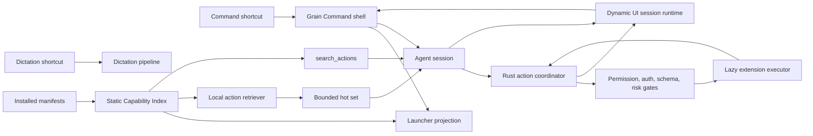

# Grain Extensions 2.0 — Agent, Launcher, and Dynamic UI Plan

**Status:** Approved architecture and implementation plan

**Date:** 2026-08-28

**Scope:** Extension discovery, Agent actions, launcher, and Dynamic UI

**Implementation state:** Planning only; current contracts remain in force until a phase explicitly migrates them

This plan replaces the product architecture in `docs/Extensions V1/PLAN.md`. V1 code and documentation remain useful as a migration baseline, evaluation harness, and record of implemented security controls. They must not be extended into a second permanent system.

The supplied design documents and prior research are inputs, not normative specifications. This document resolves their contradictions against the current Grain codebase and the latest product direction.

---

## 1. Outcome

Grain will have two primary invocation concepts:

1. **Dictation** — capture speech and insert text.
2. **Command** — open one Grain-owned command shell for everything else.

The Command shell combines two access paths without merging their behavior:

- **Launcher:** deterministic, manual discovery and opening of extension commands or views.
- **Agent:** natural-language action selection, execution, composition, follow-up, and results.

There is no permanent third “Extension Mode” and no third default shortcut. The existing Extension Mode shortcut becomes the Command shortcut after a compatibility migration. Per-extension shortcuts remain optional.

Extensions contribute capabilities to one or both access paths. Grain owns discovery, policy, lifecycle, execution mediation, and all Agent interaction surfaces.

---

## 2. Decisions frozen by this plan

### 2.1 Product kinds

V1 uses `searchable`, `standalone`, and `extending` as mutually exclusive kinds. That model is retired.

The active product kinds are:

- **Extend:** augments an existing Grain workflow or surface.
- **Standalone:** supplies commands, actions, or a view that can be opened independently.

`UI` is reserved as a possible future top-level kind, but is not a V2 launch kind. UI is currently a contribution/surface, not an extension identity.

Agent discoverability and launcher visibility are orthogonal contributions:

| Extension | Kind | Agent actions | Launcher commands/views |
|---|---|---:|---:|
| GitHub | Standalone | Yes | Optional |
| Spotify | Standalone | Yes | Yes |
| Color Picker | Standalone | No | Yes |
| Text post-processor | Extend | Optional | Optional |

Avoid “searchable” and “non-searchable” in new contracts: launcher entries are searchable too. Use **Agent-enabled** and **launcher-visible**.

The existing “extension shapes” documentation describes Settings placement shapes. Those shapes are not product kinds and should be renamed when that documentation is revised.

### 2.2 Discovery model

The Agent never receives the full action catalog. Every request receives:

- the user request and conversation context;
- a small, bounded directory of enabled Agent-capable extensions;
- a locally retrieved hot set of likely action schemas;
- an always-available `search_actions` meta-tool; and
- a small set of truly core Grain tools.

The hot set is a latency optimization, not an allowlist. If it misses, the Agent authors a focused `search_actions` query and can narrow by extension or namespace. Only then is an extra model round trip required.

### 2.3 Execution model

The Agent selects exact actions. An extension no longer receives the entire transcript and independently guesses which command was intended.

Grain validates the selected action, arguments, permissions, authentication state, current context, and risk immediately before execution. Manifest metadata never activates extension code.

### 2.4 UI model

Agent interactions and extension action interactions use the same Grain-owned Dynamic UI session runtime. Dynamic UI has two levels:

1. **Semantic interactions** for confirmations, choices, follow-up fields, progress, results, errors, and receipts.
2. **Strict rich views** composed from an allowlisted Grain component tree.

Extensions control structure and data. Grain controls rendering, layout rules, styling, accessibility, focus, animation, and security boundaries. Arbitrary HTML/CSS is not part of the new public Agent/Dynamic UI contract.

### 2.5 Risk model

Confirmation is a Rust policy decision. It is not controlled by prompt wording, a model decision, or an extension’s UI definition.

The V1 “auto-send” concept does not carry into Agent actions. A safe action may execute immediately; a risky action requires a host confirmation. Per-action and global policy may become stricter, never weaker than the host-classified risk.

### 2.6 Shortcut contract

The Command default inherits the existing Extension Mode chord: **Alt+Shift+Enter on Windows/Linux** and **Option+Shift+Enter on macOS**. The binding remains editable in normal Settings. Migration renames the action and preserves each user’s customized chord; it must not silently reset bindings or register a duplicate global shortcut. The current Dictation binding is unchanged.

---

## 3. Non-goals

- A third default shortcut or separate permanent Extension Mode.
- A second Agent dedicated only to extensions.
- A prompt containing every extension instruction or action schema.
- Settling QuickJS versus V8 versus Wasm before Agent actions can ship.
- Arbitrary extension HTML/CSS inside Agent confirmation or result surfaces.
- Long-lived workers for discovery, ranking, or metadata inspection.
- A hidden classifier deciding whether typed text means launcher search or an Agent request.
- Production implementation before the contracts and benchmarks in Phases 0 and 1 pass.

---

## 4. Target architecture



The Capability Index is the shared metadata plane. Agent retrieval, launcher search, Settings, and diagnostics use different projections of it. They do not create separate catalogs.

The extension host is the execution plane. It is activated only after Grain has an exact action or an explicit view-open request.

---

## 5. Current implementation audit

### 5.1 Reuse

| Existing component | Decision |
|---|---|
| `extension_host.rs` worker supervisor, per-extension identity/token, lazy connection, idle reaper | Keep as the first execution adapter. Do not wake it during discovery. |
| `host_api.rs` capability and privileged-operation broker | Keep and extend. It remains the security boundary. |
| Static extension index in `extension_host.rs` | Evolve into Capability Index V2. |
| `grain_llm_client.rs` tool specifications, tool calls, and conversation entries | Generalize for deferred extension tools and explicit provider capability checks. |
| Grain Space note tools | Migrate behind the generic action registry as the first built-in provider. |
| `ExtensionView` schema, budgets, validators, and stable event IDs | Reuse as the strict rich-view layer. |
| `extension_view.rs` cleanup and renderer window | Generalize into a producer-neutral Dynamic UI session manager. |
| Grain-owned workspace lifecycle and sleeping-window policy | Reuse for explicit rich-view entrypoints where permitted. |
| V1 recommendation evaluator and fixtures | Convert into action-retrieval and end-to-end routing evaluation infrastructure. |

### 5.2 Migrate or retire

| Existing component | Problem | Target |
|---|---|---|
| `ExtensionKind::Searchable` | Conflates identity and access path | `Extend` / `Standalone` plus Agent and launcher contributions |
| `recommend`, `needs`, and full-transcript hand-off | Routes to one extension, then asks it to interpret intent | Exact Agent action selection and typed arguments |
| `grain_action_session.rs` | Finite single-extension state machine | Generic Agent action coordinator plus Dynamic UI sessions |
| `ExtensionModeAction` and separate shortcut | Creates a third mental mode | Compatibility alias that migrates to Command |
| Recommendation pill chooser | Makes extension selection the primary decision | Transitional debugging UI only; remove after Agent parity |
| V1 auto-send settings | Attached to the old hand-off model | Host risk policy and optional stricter user policy |
| Extension-specific confirmation/result window | Tied to Extension Mode and one producer | Producer-neutral Dynamic UI session |
| Permanent privileged Grain Space tool path | Prevents one coherent action model | Built-in capability provider in the same registry |

### 5.3 Keep separate until deliberately migrated

The currently supported workspace/overlay web surfaces are an existing restricted runtime feature. They must not be presented as the new Dynamic UI contract or expanded opportunistically. A later security and compatibility ADR must decide whether to retain, further isolate, or replace them. New Agent surfaces use semantic interactions or allowlisted rich views.

---

## 6. Capability Index V2

### 6.1 Principles

- Built entirely from installed, validated manifests and host-owned state.
- Does not import, parse, or execute extension source code.
- Rebuilt incrementally on install, update, enable/disable, permission, auth, and locale changes.
- Stores normalized strings once and shares them across projections.
- Excludes disabled or incompatible extensions before retrieval.
- Records why an action is ineligible for diagnostics without exposing secrets to the model.

### 6.2 Conceptual records

Names below describe the contract. Phase 0 must settle serialization and backward-compatible field names before SDK edits.

```text
ExtensionDirectoryEntry
  extension_id
  display_name
  one_line_summary
  namespaces/domains
  enabled + platform compatibility

AgentActionRecord
  canonical_id                 # github.create_issue
  provider_extension_id
  title
  description
  when_to_use
  when_not_to_use?             # high-value negative boundary only
  aliases[]
  example_requests[]           # representative, bounded, diverse
  tags/domains[]
  input_schema                 # strict, bounded JSON Schema subset
  output_summary
  side_effect_class
  host_risk_floor
  required_capabilities[]
  auth_requirements[]
  context_requirements[]
  execution_entrypoint
  scoped_selection_guidance?   # bounded, retrieved only with action

LauncherEntryRecord
  canonical_id
  extension_id
  title + subtitle
  keywords[]
  icon reference
  open behavior                # action, semantic flow, or rich view
  required context/capabilities

KnowledgeSourceRecord
  canonical_id
  extension_id
  title + bounded description
  source type and freshness
  required capabilities/auth
  retrieval entrypoint or static index reference
```

### 6.3 Prompt safety

Manifest strings are untrusted data even when signed or installed intentionally.

- Enforce per-field and aggregate byte/token limits.
- Reject or normalize control characters, bidi overrides, invalid Unicode, and deceptive identifiers.
- Serialize directory and search results as clearly delimited data.
- Never place extension text above Grain’s system policy.
- Treat scoped selection guidance as advisory and action-local. It cannot redefine tools, authorize capabilities, suppress confirmation, or instruct the Agent to ignore policy.
- Treat tool results as untrusted data, not instructions.
- Record the manifest digest used for every invocation.

### 6.4 Stable tool names

The canonical action ID remains human-readable (`github.create_issue`). Provider-facing tool names use a deterministic safe encoding such as `ext__github__create_issue` and are mapped by Rust. Execution accepts only names exposed in the active Agent session and still performs an exact registry lookup.

---

## 7. Agent discovery and retrieval

### 7.1 Eligibility before ranking

Hard filters run before lexical or semantic scoring:

- extension enabled and compatible with the current platform;
- action declared and manifest version supported;
- required account/auth state available when known;
- required host capabilities granted or requestable;
- action context valid for the active app/document/selection;
- enterprise or user policy permits discovery;
- extension/action not quarantined.

An ineligible action must not enter the hot set. `search_actions` may return a concise unavailable match only when that helps the user repair auth or permissions; it must be marked non-callable.

### 7.2 Initial hot set

The first production baseline is a schema-aware, field-weighted lexical retriever with:

- exact canonical ID, provider name, title, alias, and namespace boosts;
- separate weights for description, examples, parameter names/descriptions, and tags;
- ASR-aware normalization without destructive stemming of identifiers;
- negative-boundary penalties only where explicitly declared;
- diversity across extensions and action intents;
- a small bounded result count set by benchmark, not intuition.

Existing embeddings may be evaluated as a second-stage or hybrid signal. Do not assume dense retrieval is better. Compare lexical, dense, and reciprocal-rank-fusion variants on the same frozen corpus.

### 7.3 `search_actions`

`search_actions` is always present and has a compact schema:

```text
query: required focused natural-language or capability query
extension: optional exact extension/namespace filter
limit: optional small bounded integer
```

It returns a bounded set of action definitions plus stable IDs and eligibility state. It does not run an action and does not start a worker.

When the Agent calls it:

1. Rust searches the static index.
2. Results are appended as a tool result.
3. The next model request exposes the newly retrieved action schemas.
4. The cumulative exposed set remains bounded; least-relevant unused schemas can be evicted.
5. The Agent may call an exposed action or refine search within a strict hop budget.

The executor rejects invented or undisclosed action names with a structured “discovery required” result. Discovery is not authorization; every execution check still follows.

### 7.4 Extension directory

The directory gives the Agent coarse routing knowledge without schemas: enabled extension name, one-line summary, and a few namespaces/domains. It is bounded by tokens and entries. Large installations use directory search rather than silent truncation.

### 7.5 Evaluation

The primary offline metric is **eligible action Recall@K**, including false exclusion. Ranking position and downstream selection accuracy are secondary. The suite must include:

- exact names and aliases;
- conversational paraphrases;
- ASR errors and missing punctuation;
- near-neighbor actions within one extension;
- near-neighbor actions across extensions;
- explicit extension names with ambiguous verbs;
- long requests containing incidental terms;
- requests requiring two or more actions;
- requests where no action should be called;
- unavailable actions caused by auth, platform, permission, or context;
- adversarial manifest text and malicious tool results.

Required comparisons:

- full-catalog oracle versus hot set;
- lexical versus dense versus hybrid;
- hot-set-only versus hot-set-plus-`search_actions`;
- one extension, 5 extensions, 30 extensions, and at least 100 actions;
- provider/model combinations Grain actually supports.

Do not set production thresholds until the frozen corpus and baseline results are checked in.

---

## 8. Agent tool loop

### 8.1 Provider capability gate

Current providers may silently operate without native tool calls. That behavior is unacceptable when an action is required.

At session start Grain must know whether the selected provider supports the required tool protocol. If not, Grain must either use a separately validated strict structured-action adapter or explain that extension actions are unavailable and offer a supported provider. It must never treat prose such as “done” as proof an action executed.

### 8.2 Generic registry

One Rust registry exposes built-in and extension actions through the same interface:

```text
describe(action_id, context) -> eligible definition or reason
prepare(action_id, arguments, context) -> validated prepared call
execute(prepared_call, cancellation) -> structured outcome
```

Built-in providers may execute in process. Third-party providers execute through the extension host. Both use the same schema validation, risk classification, receipts, cancellation, and result contract.

### 8.3 Prepared calls

Before confirmation Grain creates a prepared call containing:

- canonical action and extension IDs;
- normalized, schema-valid arguments;
- manifest and permission-policy digests;
- risk and side-effect classification;
- an idempotency key when the action supports it;
- relevant context snapshot identifiers, not unbounded raw context;
- expiry and revalidation rules.

Confirmation approves this exact prepared call. Rust rechecks auth, permission, manifest digest, context, and expiry immediately before execution. Material changes require a new confirmation.

### 8.4 Multi-action composition

- Use a bounded tool-hop and wall-time budget.
- Start with sequential execution. Parallel execution requires explicit purity/independence metadata and a later ADR.
- Feed structured, bounded results back to the Agent.
- Preserve provenance when output from one action becomes input to another.
- Ask for consent before crossing extension trust boundaries when sensitive data is involved.
- Show completed, failed, skipped, and unknown steps separately.
- Never retry a side-effecting action after an ambiguous timeout unless an idempotency contract makes the outcome safe.
- Support cancellation between actions and propagate cancellation to the active executor.

### 8.5 Result contract

Every execution returns one of:

- `succeeded` with bounded structured data and receipt;
- `failed` with stable error class and safe user message;
- `cancelled`;
- `unknown_outcome` for ambiguous side-effecting timeouts;
- `needs_interaction` with a semantic Dynamic UI request.

Raw extension exceptions and secrets are never sent directly to the model or UI.

### 8.6 Knowledge-to-action

Knowledge sources and actions share extension identity and policy infrastructure, but remain separate contribution types. Static knowledge metadata may be searched without activating code; dynamic or authenticated reads are explicit read actions. Retrieved knowledge carries source, freshness, extension, and authorization provenance. If the Agent turns knowledge from one provider into an action in another, the cross-extension data-flow policy applies before transfer.

---

## 9. Dynamic UI

### 9.1 Ownership

A Dynamic UI session is Grain-owned. Its producer may be the Agent, a built-in action, or an extension action. The producer can request state transitions; it cannot create windows, choose arbitrary CSS, capture global input, or bypass focus and cleanup policy.

### 9.2 Semantic interaction layer

The initial version should be an enum, not arbitrary component composition:

- `Progress`
- `ConfirmAction`
- `ChooseOne`
- `ChooseMany`
- `RequestText`
- `RequestFields`
- `TextResult`
- `StructuredResult`
- `Success`
- `Error`
- `ExecutionReceipt`

Every request has stable action IDs, accessibility labels, optional expiration, and a bounded data payload. Sensitive values are typed and redacted from logs.

### 9.3 Rich-view layer

The existing strict `ExtensionView` tree is the starting point. V2 must add only capabilities justified by reference extensions and retain:

- an allowlisted component catalog;
- structural depth/node/string/option budgets;
- validated stable event IDs;
- host-owned theme, spacing, focus, animation, and accessibility;
- incremental patches or host-owned data updates rather than unbounded tree replacement;
- deterministic cleanup when closed, completed, timed out, or cancelled.

Rich views are appropriate for extension-authored manual experiences and complex Agent follow-up. Ordinary confirmations and results use the semantic layer.

### 9.4 Session states

```text
opening -> listening/input -> reasoning -> interaction?
        -> executing -> interaction/result -> completed
                         \-> failed/cancelled/expired
```

A session may loop through interaction, reasoning, and execution. There is no static global “one Extension Mode session” owner. The host tracks session IDs, producer identity, active executor, window attachment, cancellation, and terminal cleanup.

### 9.5 Agent shell behavior

The Command shell opens in a deterministic launcher state. Typed text filters launcher entries locally. It also shows an explicit “Ask Grain” row/action; selecting that row sends the text to the Agent. Voice input goes to the Agent. This avoids a hidden classifier and accidental model calls while preserving one shortcut and one shell.

After Agent submission the same shell becomes the Dynamic UI session: listening, reasoning, confirmation, follow-up, progress, and result are state transitions rather than separate windows that must visually imitate one another.

Detailed visual design belongs to the UI 2.0 branch and requires real-application user approval. The architecture does not require a browser harness.

---

## 10. Launcher

- Index launcher entries from static manifests; do not start workers to search.
- Search names, subtitles, keywords, action titles, and bounded host-owned recency/frequency signals.
- Keep Agent retrieval and launcher ranking separate even though they share normalized records.
- Selecting a simple action enters the same prepare/risk/execute path as the Agent.
- Selecting a rich view activates only that view’s entrypoint.
- Manual-only extensions can omit Agent metadata entirely.
- Launcher history is host-owned, locally stored, bounded, and clearable.
- Icons use the existing standardized host asset pipeline; one test icon may be reused in fixtures, but production packages must deliver validated icons.

---

## 11. Runtime and lifecycle

### 11.1 Immediate runtime decision

Use the existing shared supervisor and isolated per-extension worker model as the first execution adapter. It already supplies lazy activation, identity-bound tokens, bounded calls, and idle cleanup. Replacing the engine is not required for the architecture above.

### 11.2 Activation rules

Activation occurs only for:

- an exact action selected for preparation/execution when code is actually needed;
- an explicit launcher rich-view open;
- an enabled background contribution covered by a future separate contract.

Index construction, Agent directory creation, local retrieval, and `search_actions` must be code-free.

### 11.3 Engine benchmark ADR

QuickJS, V8/Node, and Wasm can be benchmarked in parallel. The ADR must measure cold start, steady-state RAM, isolation, package compatibility, cancellation, crash containment, and maintenance cost using representative extensions. No migration occurs only because another runtime is theoretically smaller.

---

## 12. Security requirements

These are release gates, not cleanup work:

1. Rust remains the sole privileged-operation broker.
2. Extension identity, token, realm, and action ID are bound and checked on every call.
3. Manifest metadata cannot activate code.
4. Input schemas are validated in Rust before extension execution; outputs are size/type checked afterward.
5. Host risk floors cannot be weakened by manifests, prompts, model output, or user settings.
6. Confirmation displays the exact extension, action, material arguments, data destinations, and side effects.
7. Prepared calls are revalidated after confirmation to prevent time-of-check/time-of-use races.
8. Secrets are represented by opaque handles; they are not inserted into Agent context or Dynamic UI payloads.
9. Tool results and extension-authored text are untrusted prompt data with strict budgets.
10. Cross-extension composition retains provenance and applies data-flow consent/policy before passing sensitive output onward.
11. Transcript or conversation context is not given wholesale to an extension. It receives only validated action arguments and explicitly authorized context.
12. Timeouts distinguish safe failure from unknown side-effect outcome.
13. Install/update invalidates cached action definitions and in-flight prepared calls when their manifest digest changes.
14. All listeners, sessions, windows, workers, and cancellation handles are released at terminal state.
15. Audit records contain IDs, timing, policy decisions, and redacted argument summaries; never raw secrets or unrestricted transcripts.

Threat-model tests must cover prompt injection in manifests/results, forged action names, schema confusion, stale confirmations, confused-deputy calls, unauthorized cross-extension data flow, worker impersonation, oversized UI trees, replay, and cancellation races.

---

## 13. Performance and observability

Capture monotonic timestamps for:

- transcript/input finalized;
- eligibility and hot-set retrieval complete;
- first model request sent;
- first model response/action/search call received;
- fallback search complete;
- action prepared;
- confirmation shown and answered;
- worker requested, connected, and ready;
- privileged call started and completed;
- result rendered;
- session and worker destroyed.

Track distributions, not averages:

- eligible Recall@K and false-exclusion rate;
- fallback-search rate and search hops;
- wrong-action, no-action, and invented-action rates;
- confirmation accept/decline and corrected-argument rates;
- execution success/failure/unknown outcome;
- cold/warm worker latency;
- peak and steady-state RAM by installed and active extension count;
- session leaks and workers alive after idle deadline.

Exact budgets are Phase 1 outputs. The invariant is that installed-but-idle extensions add metadata memory, not runtime-engine memory.

---

## 14. Manifest and compatibility migration

Phase 0 must publish a versioned manifest proposal and fixtures before parser edits. Conceptually:

```yaml
kind: standalone # or extend

agent:
  summary: Work with GitHub repositories and issues.
  actions:
    - id: create_issue
      title: Create issue
      description: Create a new issue in a GitHub repository.
      whenToUse: The user wants a new issue, bug report, or tracked task.
      examples: [...]
      inputSchema: {...}
      risk: confirm
      entrypoint: actions.create_issue

launcher:
  commands:
    - id: open_issues
      title: Open Issues
      keywords: [bugs, tickets]
      entrypoint: views.issues
```

Compatibility rules:

- Existing V1 manifests continue to parse during a time-bounded migration window.
- `extending` maps mechanically to `extend` where semantics are unchanged.
- `standalone` maps to `standalone`.
- `searchable` does not auto-convert to a trusted Agent action. A migration tool can generate a reviewable draft, because V1 routes transcripts while V2 declares exact actions and schemas.
- `recommend`, `needs`, and V1 auto-send fields become deprecated warnings, then errors only after reference extensions and migration tooling exist.
- Old bindings migrate atomically: keep the user’s configured chord, rename its action to Command, and avoid creating a duplicate binding.
- Diagnostics must distinguish legacy sessions from V2 Agent actions during rollout.

---

## 15. Implementation phases

### Phase 0 — Contract freeze and legacy feature freeze

**Goal:** Remove ambiguity before production edits.

Work:

- Approve terminology, two-shortcut UX, conceptual manifest, action/result/error contracts, and risk classes.
- Write ADRs for provider tool support, Dynamic UI ownership, current workspace HTML compatibility, and manifest trust.
- Mark V1 Extension Mode maintenance-only; accept security and correctness fixes but no new features.
- Define compatibility window and rollback flags.
- Create representative manifests for GitHub, Spotify, Linear, Calendar, and a manual-only Color Picker.

Exit gate:

- Contracts and fixtures are reviewed; no unresolved naming or ownership contradiction blocks code.

### Phase 1 — Capability Index V2 and retrieval benchmark

**Goal:** Prove actions can be discovered with high recall without waking extensions or flooding the prompt.

Work:

- Implement a pure, code-free index core with Agent directory, action, and launcher projections.
- Adapt the V1 evaluation harness to action Recall@K and downstream fixtures.
- Implement field-aware lexical baseline and exact name/ID/namespace boosts.
- Benchmark existing dense retrieval and hybrid RRF against the same corpus.
- Add `search_actions` tests, unavailable-action diagnostics, memory measurements, and adversarial metadata tests.

Likely areas:

- `crates/grain-sdk/src/manifest.rs`
- a new low-level index/retrieval crate or `grain_*` Rust module outside `handy/`
- `src-tauri/src/extension_host.rs` index integration
- existing recommendation evaluation modules and fixtures

Exit gate:

- A frozen benchmark report establishes K, directory budget, false-exclusion rate, latency, and memory envelope. Metadata search never starts a worker.

### Phase 2 — Generic Agent action registry

**Goal:** Make Grain’s Agent use one deferred-tool architecture before third-party execution is enabled.

Work:

- Introduce registry `describe/prepare/execute` contracts and structured outcomes.
- Move Grain Space tools behind a built-in provider adapter.
- Add hot-set tool exposure and `search_actions` to the existing model loop.
- Make cumulative tool exposure and search hops bounded.
- Add explicit provider tool-capability gating and honest unsupported UX.
- Instrument retrieval and model/tool-loop timings.

Likely areas:

- `src-tauri/src/agent.rs`
- `src-tauri/src/grain_llm_client.rs`
- `src-tauri/src/grain_space/agent_tools.rs`
- new `grain_capability_*` modules

Exit gate:

- Grain Space actions pass existing behavior tests through the generic registry; fallback discovery is covered end to end; unsupported providers cannot report false success.

### Phase 3 — Third-party action execution and host risk policy

**Goal:** Execute one exact extension action safely through the current runtime.

Work:

- Map an Agent action record to a lazy execution entrypoint.
- Validate arguments and action exposure in Rust.
- Implement prepared calls, risk floor, confirmation, revalidation, receipts, idempotency metadata, cancellation, and unknown outcomes.
- Use semantic confirmation/result interactions rendered by the current strict host surface as transitional UI.
- Build one read action and one side-effecting action in reference extensions.

Exit gate:

- No transcript hand-off; no code activation during discovery; safe read action and confirmed write action pass security, cancellation, stale-confirmation, and cleanup tests.

### Phase 4 — Multi-action composition

**Goal:** Let the Agent complete bounded workflows across built-in and third-party providers.

Work:

- Add provenance-bearing structured results.
- Implement bounded sequential tool loops, partial failure, per-step receipts, and cancellation.
- Add cross-extension data-flow policy and consent UI.
- Test GitHub/Linear/Calendar-style two- and three-step workflows, including unavailable middle steps and ambiguous timeouts.

Exit gate:

- Multi-action workflows cannot bypass risk/permission boundaries and present truthful partial outcomes.

### Phase 5 — Producer-neutral Dynamic UI runtime

**Goal:** Replace Extension-Mode-specific view ownership with one session runtime.

Work:

- Define the semantic interaction protocol and session lifecycle.
- Generalize `extension_view.rs` and `ExtensionView` validation behind Agent/core/extension producers.
- Add focus, expiration, reconnect, cancellation, and terminal cleanup tests.
- Move Agent confirmations, follow-up, progress, and results into the runtime.
- Add patch/data-update support only after measuring full-tree update costs.

Exit gate:

- Agent and reference extensions use the same host runtime; session closure leaves no listeners, windows, workers, or state alive.

All frontend implementation in this and later UI phases must remain on `ui/grain-2.0` until the user explicitly approves a merge.

### Phase 6 — Unified Command shell and launcher

**Goal:** Deliver the two-shortcut product model.

Work:

- Build static launcher projection/search and manual-only extension support.
- Convert the Agent panel into Command shell states backed by Dynamic UI.
- Use explicit “Ask Grain” submission for typed text and Agent submission for voice.
- Migrate the Extension Mode binding to Command while preserving the user’s chord.
- Remove the default separate Agent/Extension Mode conflict without removing optional per-extension shortcuts.
- Perform real-Tauri visual review with the user; no browser harness.

Exit gate:

- Dictation and Command are the only default invocation concepts; launcher discovery is code-free; Agent transitions remain in one fluid window.

### Phase 7 — Rich public views

**Goal:** Support useful extension-authored UI without losing Grain ownership.

Work:

- Publish the allowlisted component and event SDK.
- Add only primitives demanded by reference extensions.
- Add efficient data binding/patches, accessibility conformance, localization, payload budgets, and lifecycle rules.
- Resolve the compatibility ADR for existing workspace/overlay HTML surfaces.

Exit gate:

- Complex reference views work within measured RAM and update budgets, and malformed/adversarial views cannot escape host constraints.

### Phase 8 — Runtime engine decision

**Goal:** Replatform only if measured benefit justifies compatibility and maintenance cost.

Work:

- Run the engine benchmark ADR against reference extensions.
- If another runtime wins materially, introduce it as an execution adapter and migrate incrementally.
- Otherwise record the decision and keep the existing host.

Exit gate:

- Evidence-backed ADR; no speculative rewrite.

### Phase 9 — Legacy removal

**Goal:** Delete the old single-extension route after V2 parity.

Work:

- Remove V1 recommendation chooser, transcript hand-off, auto-send, old action session, obsolete manifest fields, and compatibility aliases.
- Retain useful evaluation fixtures after renaming them for action discovery.
- Migrate diagnostics and documentation to V2 terminology.

Exit gate:

- No shipped flow depends on Extension Mode, `searchable`, recommendation pill selection, or V1 auto-send; rollback closes deliberately.

---

## 16. Rollout and rollback

- Put V2 index, Agent registry, third-party execution, Dynamic UI sessions, and Command shell behind separate host-owned feature flags.
- Dual-index manifests during migration, but never execute both V1 and V2 paths for one request.
- Persist schema versions with cached index records and discard mismatches.
- Keep legacy Extension Mode callable only for controlled parity testing until Phase 6 is approved.
- A phase can roll back to the previous coordinator without downgrading installed manifests; manifests remain declarative and versioned.
- Security fixes apply to both paths during coexistence.

---

## 17. Work that should start next

Start **Phase 0 followed by Phase 1**, not Dynamic UI polish and not a runtime rewrite.

The first implementation deliverable should be a pure Capability Index V2 plus a checked-in action-retrieval benchmark. It settles the schema every later layer consumes, proves the hot-set/fallback premise, reuses existing evaluation work, and adds no extension-code execution risk.

After that, move Grain Space tools through the generic Agent action registry. This validates deferred discovery and provider behavior with a trusted built-in provider before third-party execution expands the security boundary.

---

## 18. Primary prior art informing the plan

- [Ratel retrieval and search](https://docs.ratel.sh/retrieval-and-search): host prefilter plus Agent capability search, schema-aware BM25, and optional hybrid retrieval.
- [OpenAI Codex deferred tool search](https://github.com/openai/codex/blob/main/codex-rs/core/src/tools/handlers/tool_search_spec.rs): bounded deferred metadata search and source/namespace descriptions.
- [Raycast command lifecycle](https://developers.raycast.com/information/lifecycle) and [security model](https://developers.raycast.com/information/security): lazy command lifecycle and a narrow host API boundary.
- [Shopify Remote DOM](https://github.com/Shopify/remote-dom): extension-controlled composition over a host-controlled component allowlist.

These are architectural references, not contracts to copy wholesale. Grain’s low-RAM target, Rust capability boundary, local execution model, and two-shortcut UX remain decisive.
