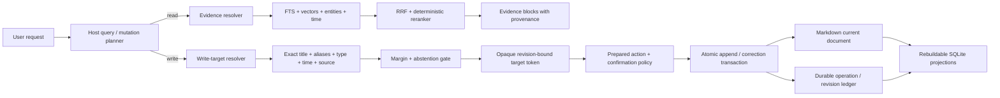

# Grain Space Memory System — Implementation Plan

**Status:** Proposed execution plan; implementation not started

**Branch:** `codex/grain-space-memory-experiment`

**Date:** 2026-09-04

**Scope:** Grain Space note creation, temporal retrieval, meetings/daily notes, and safe append/update behavior

**Supersedes:** The mutation and temporal-data portions of `KNOWLEDGE-ARCHITECTURE-PLAN.md`; its local-first storage and hybrid-retrieval direction remains valid

## 1. Outcome

Build a local-first memory system that lets a user speak naturally and reliably:

- remember a fact, thought, meeting, decision, or task without losing the original wording;
- find it later using vague wording, aliases, entities, and expressions such as “yesterday morning” or “last week”;
- append to the correct existing document without overwriting or silently rewriting prior content;
- distinguish historical Grain memory from current data that must be fetched from an external provider;
- abstain or ask for clarification when a write target is ambiguous;
- remain portable, inspectable, low-RAM, and usable without a model or network.

The target is **temporal document memory with safe append transactions**, not a general knowledge base and not a continuously running autonomous memory service.

## 2. Decisions

### 2.1 Keep

1. Markdown plus YAML frontmatter remains the durable, user-owned representation of the current document.
2. SQLite remains the local index and coordination store.
3. FTS5, optional local embeddings, derived entity links, reciprocal-rank fusion, and deterministic reranking remain the retrieval foundation.
4. The embedding engine remains lazy and disposable. There is no always-on memory process.
5. Frontend/backend separation remains strict: Tauri commands in, Tauri events out.
6. Live integrations remain authoritative for mutable external state. Grain Space is historical memory unless a stored record explicitly cites a fetched provider snapshot.

### 2.2 Change

1. Separate **document identity**, **memory blocks**, and **derived search facts**.
2. Represent event time separately from capture/ingestion time.
3. Replace agent-driven whole-body rewriting with host-controlled append, correction, and explicit block-edit operations.
4. Make every agent write resolve a target first and bind it to a revision, scope, operation, and expiry.
5. Route all Grain Space mutations through the common action executor and confirmation policy. Remove the direct agent write bypass.
6. Add deterministic time, document-type, entity, and source filters to the normal Agent retrieval path.
7. Add bounded retrieval broadening and explicit abstention instead of open-ended retries.

### 2.3 Do not add

- Neo4j, FalkorDB, PostgreSQL, or another server/runtime dependency.
- A background watcher, daemon, agent, or memory-consolidation loop.
- Full event sourcing for the application.
- Automatic storage of whole agent conversations or wholesale copies of connected applications.
- Silent LLM rewriting of user-authored note bodies.
- Cross-extension recommendation/chooser work, dynamic UI, or parallel agents in this project.
- A requirement that semantic models be present for correctness.

## 3. Evidence and rationale

The external systems converge on a few useful principles, but none should be copied wholesale.

| Source | Useful result | Grain decision |
|---|---|---|
| LongMemEval | Temporal reasoning, knowledge updates, abstention, and time-aware query expansion are distinct memory capabilities. Explicit temporal filtering improves retrieval. | Store event and ingestion time separately; compile natural-language time into host-owned filters; measure abstention. |
| Zep/Graphiti | Non-lossy source episodes, provenance, and bi-temporal facts make corrections and changing knowledge traceable. | Keep original blocks and provenance; allow derived facts to be superseded. Do not add its graph-server runtime. |
| Mem0 | Incremental `ADD`/`UPDATE`/`DELETE`/`NOOP` decisions avoid repeatedly replaying all memory. | Borrow explicit operation semantics for derived facts. Never let the model apply these operations directly to raw user documents. |
| A-MEM | Dynamic links and evolving derived attributes can improve later retrieval. | Evolve aliases, entities, summaries, and links as rebuildable metadata; do not rewrite source text. |
| Hindsight | Production memory benefits from semantic, lexical, graph, and temporal retrieval together, with evidence retained behind observations. | Grain already has most retrieval legs. Add temporal planning and provenance rather than replacing the stack. |
| EverMemOS | Raw episodes and higher-level scenes serve different retrieval needs. | Use source blocks plus derived document/meeting summaries; keep both linked. |
| HippoRAG | Graph traversal is valuable for multi-hop association. | Retain the lightweight derived SQLite adjacency layer and require benchmark evidence before expanding it. |
| Corrective RAG | A retrieval-quality check can trigger a bounded fallback strategy. | Use a deterministic attempt ladder with a hard limit and an abstain result. |
| MemGPT/Letta | Persistent memory should be explicit state outside the model context and modified through tools. | The host owns durable memory and mutation policy; the agent only proposes operations. |
| Microsoft event-sourcing guidance | Append-only operations, optimistic concurrency, idempotency, and projections improve auditability but full event sourcing is complex. | Use a small durable operation/revision ledger only for mutations; keep Markdown as the document system of record. |
| SQLite isolation | SQLite serializes writers and supports strong transactions, but application-level stale-target checks are still required. | Keep one-writer behavior and add revision comparison/idempotency at the mutation boundary. |

This research does **not** justify replacing Grain's current hybrid search. The largest correctness gap is the mutation model; the largest retrieval gap is explicit temporal/document planning in the normal Agent path.

## 4. Current implementation audit

### 4.1 What is sound

- `src-tauri/src/grain_space/vault.rs` keeps Markdown as the durable document and treats search structures as derived state.
- Writes use a temporary file and rename, and external edits are considered through a three-way merge path.
- `src-tauri/src/grain_space/recall.rs` combines FTS, optional BGE vectors, graph candidates, RRF, and a deterministic CPU reranker.
- The embedding runtime is optional and lifecycle-conscious.
- `src-tauri/src/action_exec.rs` already has prepared calls and confirmation-aware `save_note`/`append_to_note` actions.
- The Agent truth policy now distinguishes historical memory from live provider state.

### 4.2 Blocking correctness and security gaps

1. **Agent write-policy bypass.** `agent_tools.rs` exposes direct `save_note` and `append_to_note`, and `agent.rs` executes those core tools outside the common action executor. This bypasses the confirmation path already present in `action_exec.rs`.
2. **Unbound append target.** Append accepts a raw note ID and text. The selection is not bound to the document revision, vault, user/session scope, requested operation, or expiry.
3. **Whole-document mutation.** `mod.rs::append` rewrites the assembled body, while capture reconciliation can ask a model to merge an entire document. A body-shrink guard catches only large loss, not subtle edits or misplaced content.
4. **No idempotency.** A retried tool call can append the same content more than once.
5. **Coarse temporal schema.** A note has one timestamp, so the index cannot reliably distinguish “meeting last Tuesday” from “note saved today about last Tuesday.”
6. **Normal Agent filter loss.** The unified Agent search uses hybrid retrieval but does not expose deterministic time, entity, source, or type filters that older recall code partially supports.
7. **Document-only provenance.** Results cannot consistently trace a claim, decision, or append back to a stable source block.
8. **Ambiguity handling.** There is no dedicated high-precision write-target resolver with a margin/abstention contract.

### 4.3 Important non-blockers

- The existing global vault lock is conservative but acceptable for a local, low-write desktop application. Optimize only after measurement.
- SQLite `TRUNCATE` journaling is not itself a reason to move to WAL. Choose journal mode from measured concurrency and crash behavior.
- The entity graph is useful as a derived candidate source. It does not need to become canonical memory.
- Existing conflict files prevent complete silent loss, but append-specific conflict semantics still need to be safer and easier to reason about.

### 4.4 Blast radius

The graph reports a high structural blast radius across the Grain Space model, vault, recall, agent tools, executor, MCP, and host API. Implementation must therefore use narrow phases with independently passing compatibility gates. Do not combine schema, retrieval, and agent-tool migration in one diff.

## 5. Target architecture



There are three layers:

1. **Durable user content:** Markdown/frontmatter containing the current document and stable block markers for Grain-owned structured documents.
2. **Durable mutation metadata:** a small SQLite ledger containing revisions, idempotency records, and operation state. It must not duplicate raw sensitive content unnecessarily.
3. **Rebuildable projections:** document/block FTS, optional vectors, aliases, entities, links, temporal ranges, summaries, and ranking statistics.

If projections are deleted, Markdown and current document content survive and can be reindexed. If the mutation ledger is lost, content survives but revision history/idempotency guarantees may be reduced; startup must detect and safely reconstruct the latest revision from frontmatter/content hashes.

## 6. Data contracts

Names are descriptive, not mandatory Rust type names. Final types should match repository conventions.

### 6.1 Memory document

```text
MemoryDocument
  id: stable UUID
  schema_version: integer
  kind: note | daily | meeting | project_log
  title: string
  aliases: bounded list<string>
  collection: optional string
  created_at: UTC instant
  updated_at: UTC instant
  timezone: IANA timezone captured at creation
  revision: monotonic integer
  content_hash: cryptographic hash of canonical current content
  source: Grain | imported path | provider reference
  occurrence_id: optional stable meeting occurrence identifier
  series_id: optional recurring meeting identifier
  event_start: optional UTC instant
  event_end: optional UTC instant
  participants: bounded derived metadata
  existing fields: tldr, todos, reminder, pinned, question, entities
```

Requirements:

- Missing new fields must deserialize safely for existing notes.
- `created_at` and `updated_at` describe the document lifecycle; `event_start`/`event_end` describe the subject event.
- Date-only daily notes use a stable identity derived from `(local_date, timezone)`, not an inferred UTC date.
- `revision` changes exactly once for every committed content mutation.
- `content_hash` is calculated by the host from canonical serialized content.
- Aliases and participants are bounded, normalized projections; they are not permission-bearing identities.

### 6.2 Memory block

```text
MemoryBlock
  block_id: stable UUID
  document_id: UUID
  kind: raw_capture | append | transcript | decision | action | correction | body
  text: verbatim user/source text
  recorded_at: ingestion time
  event_start/event_end: optional subject time
  source_ref: optional provider/file/selection reference
  speaker: optional display metadata
  supersedes_block_id: optional UUID
  sequence: monotonic within document
```

Rules:

- Raw capture/selection text is preserved verbatim after basic encoding normalization.
- A correction adds a new block that supersedes an earlier assertion; it does not erase source history from the ledger/projections.
- User-facing Markdown remains readable without Grain. Stable markers may be HTML comments, but the exact encoding must be fixture-tested before implementation.
- Tiny adjacent blocks may share one vector chunk to avoid excessive RAM/disk cost. FTS and provenance must still address the source blocks.
- Imported/foreign Markdown is read-only for agent mutation until explicitly adopted into the structured Grain format.

### 6.3 Derived fact/link

This is optional until the core phases pass evaluation.

```text
DerivedFact
  id
  subject / predicate / object
  source_block_id
  valid_from / valid_to
  observed_at
  supersedes_fact_id
  confidence
```

Derived facts and links are projections. Deleting and rebuilding them must not change the user's document.

### 6.4 Mutation operation

```text
MemoryOperation
  operation_id
  idempotency_key
  document_id
  base_revision
  committed_revision
  operation_kind
  proposed_content_hash
  state: prepared | committed | rejected | stale | failed
  created_at / completed_at
  error_code
```

Do not store raw appended text in the ledger when the document/block already contains it. A keyed hash is sufficient for deduplication. Deletion must remove or cryptographically sever personal content rather than preserving it forever in an immutable log.

## 7. Retrieval architecture

### 7.1 Host-owned query plan

The model may propose intent and phrases, but Rust validates and executes a bounded structure:

```text
MemoryQueryPlan
  intent: evidence | document_target | meeting | daily_note
  query: bounded text
  document_kinds: bounded enum set
  time_expression: optional original phrase
  event_range: optional [start, end)
  recorded_range: optional [start, end)
  entities: bounded normalized strings
  aliases: bounded strings
  sources: bounded enum/value set
  collections: bounded strings
  attempt: 0..MAX_ATTEMPTS
```

The host, not prompt text, determines which fields become SQL predicates. Invalid or excessive fields fail validation.

### 7.2 Temporal interpretation

Implement a small deterministic Rust temporal layer for the high-value phrases actually used by Grain:

- today, yesterday, tomorrow;
- this/last/next week and month;
- weekday references such as last Tuesday;
- morning, afternoon, evening, tonight;
- explicit ISO and locale dates already supported by the application;
- date ranges and “between X and Y.”

Requirements:

- Always resolve against an explicit `now` and IANA timezone supplied by the caller; tests must never depend on wall-clock time.
- Use half-open intervals `[start, end)`.
- Handle daylight-saving transitions and local-midnight boundaries.
- Prefer `event_range` for meetings/subject time. Use `recorded_range` only when the request refers to capture/save time or event time is absent.
- If parsing is uncertain, keep the phrase for lexical/semantic retrieval but do not invent a hard filter.
- Do not introduce a Duckling service or equivalent runtime. Its semantics are a reference, not a dependency.

### 7.3 Evidence resolver

Candidate sources:

1. exact document ID/title/alias matches;
2. FTS5 over documents and blocks;
3. optional local vector similarity over bounded document/block chunks;
4. derived entity adjacency for multi-hop association;
5. temporal overlap and proximity;
6. source/collection/type filters.

Fuse candidates with the current RRF pipeline and deterministic reranker. Add features only when they have evaluation coverage:

- exact alias/title match;
- time-range overlap/proximity;
- document-kind match;
- source authority/freshness where applicable;
- block/document agreement;
- current lexical, semantic, graph, and recency signals.

Results must carry document ID, block ID(s), event/recorded time, source, and a bounded excerpt. The answer layer must be able to cite the exact supporting block.

### 7.4 Write-target resolver

Write selection optimizes for precision rather than recall. It is a separate API and scorer from evidence search.

1. Apply explicit scope/type/time/source constraints first.
2. Prefer exact title/alias and stable occurrence identities.
3. Retrieve a small candidate set.
4. Calculate an interpretable match score and top-one/top-two margin.
5. Return one of:
   - `resolved`: strong unique target;
   - `ambiguous`: bounded choices and reasons;
   - `not_found`: offer create/clarify;
   - `unsafe`: invalid scope, stale index, or unavailable authority.

Do not expose a raw note ID to the model as write authority. A resolved result creates an opaque target token.

### 7.5 Bounded retry controller

Maximum four host-controlled attempts:

1. strict structured constraints and exact aliases;
2. lexical/semantic paraphrase expansion;
3. cautious time-window expansion and entity links;
4. if the question asks for mutable external state, use a live provider; otherwise abstain.

Each attempt records reason codes and candidate counts, not note contents. The model cannot recursively call search without consuming the same budget. “Nothing found” is valid after the budget is exhausted.

## 8. Safe mutation protocol

### 8.1 Target token

An opaque, authenticated token binds:

- vault identity and backend/session scope;
- document ID;
- base revision and content hash;
- allowed operation (`append`, `correct`, or explicit block edit);
- optional section/block placement;
- issued and expiry time;
- nonce.

Use an existing application secret facility if suitable. Otherwise keep tokens process-local and short-lived for V1; do not persist a new reusable secret merely for convenience. Reject tampering, replay outside the allowed idempotency contract, cross-vault use, wrong operation, and expiry.

### 8.2 Append flow

1. Agent calls `resolve_memory_target` with a natural description and structured constraints.
2. Host returns match reasons and preview plus a target token, or ambiguity/not-found.
3. Agent proposes append text and optional placement using the token and a caller-generated idempotency key.
4. Common action executor creates a prepared call.
5. Confirmation policy shows the exact target, current identifying context, and exact appended text. Any future auto-send policy remains explicit and independently configurable.
6. Commit acquires the vault write lock and validates token, scope, revision, and idempotency.
7. If unchanged, append a new stable block and atomically write the Markdown document.
8. If the document changed:
   - a pure append may be rebased only when stable placement still resolves and no existing block conflicts;
   - if target meaning, placement, or preview materially changed, return `stale` and require re-resolution/reconfirmation;
   - never overwrite an external edit.
9. Commit the operation/revision record and refresh projections. If projection refresh fails, content remains committed and the index is marked for deterministic rebuild.
10. A repeated idempotency key with the same content returns the original success. The same key with different content fails closed.

### 8.3 Corrections and edits

- `correct_memory` creates a correction block linked to the superseded block/fact.
- An explicit edit must identify a stable block and expected revision; it is never an unrestricted agent-supplied replacement body.
- Do not introduce the unrestricted `update_note(id, body)` contract proposed by the older MCP plan. If any equivalent document-replacement path exists or is added, restrict it to explicit manual editing with revision checks; it must not be agent-writable.
- Manual UI editing can retain document-level editing, but it must use the same revision and conflict machinery.

### 8.4 Creation

1. Preserve the original capture as a raw block.
2. A bounded extraction step may propose title, type, aliases, entities, event time, participants, decisions, and tasks.
3. Rust validates sizes, enum values, timestamps, identifiers, and path-safe serialization.
4. Derived fields never replace raw content.
5. If extraction/modeling is unavailable, create a valid searchable document from deterministic defaults.

## 9. Meetings and daily notes

### 9.1 Meeting memory

First-class fields:

- stable occurrence ID and optional recurring series ID;
- scheduled and actual start/end, timezone, provider reference;
- bounded participant display aliases;
- transcript blocks with speaker and relative/absolute timestamps when available;
- decisions, actions, questions, and corrections linked to source blocks.

“The authentication issue from last week's Grain meeting” should resolve through document kind + temporal range + entity/topic evidence, then cite the relevant source block. A later correction should supersede the derived claim while retaining the original record.

### 9.2 Daily notes

- Identity is one document per `(local_date, timezone)`.
- Appends use stable sections/blocks and the safe mutation protocol.
- Crossing midnight or changing timezone must not append to a different daily note silently.
- “Add this to today's note” may resolve deterministically without semantic search, but still receives a revision-bound target token.

## 10. Security and privacy invariants

These are release blockers.

1. Treat note bodies, provider results, imported Markdown, titles, aliases, and extracted metadata as untrusted data—not instructions.
2. Never concatenate retrieved content into privileged tool-policy/system instructions.
3. Enforce vault path containment after canonicalization and defend against symlink/reparse-point escapes on every file operation.
4. Tokens are scoped, authenticated or process-opaque, short-lived, operation-specific, and revision-bound.
5. All strings, candidate sets, blocks, aliases, entities, and model outputs have hard size/count limits before allocation or persistence.
6. Logs contain operation IDs, hashes, reason codes, durations, and counts—not raw note/provider content, tokens, credentials, or OAuth data.
7. External provider identifiers are data references, never implicit authorization. Live provider writes use that provider's own confirmation and auth policy.
8. Deleting content removes it from Markdown, projections, conflict artifacts under Grain control, caches, and raw-content-bearing operation data.
9. Idempotency prevents duplicate writes after retries, crashes, or repeated agent calls.
10. A stale, ambiguous, cross-vault, tampered, or malformed write fails closed.
11. Imported documents are not agent-writable until explicitly adopted.
12. Model absence or failure must reduce enrichment, not corrupt or block basic creation/search/append.

## 11. Performance and resource budgets

Establish measured baselines in Phase 0; do not invent thresholds after implementation. At minimum record:

- cold and warm search latency at 100, 1,000, and 10,000 representative documents;
- peak RSS with embeddings disabled and enabled;
- index size per document/block;
- import/rebuild time;
- append latency and lock duration;
- idle CPU and memory after the embedding engine is released.

Guardrails:

- no idle worker solely for memory;
- no network/server dependency for local correctness;
- bounded retrieval candidates and prompt context;
- batch vector generation and avoid one vector per trivial block;
- do not retain full document bodies in multiple in-memory caches;
- release model/session/listener resources when their operation ends;
- preserve correctness before changing lock granularity or journal mode.

## 12. Evaluation corpus and acceptance metrics

Phase 0 must create a versioned, privacy-safe corpus before behavior changes. Include 5–6 realistic domains and at least 20–30 documents per difficult cluster, not only distinct toy notes.

Required cases:

- near-duplicate authentication/project issue notes;
- recurring meetings with similar titles across weeks;
- a note saved today about an event last week;
- daily notes around midnight, DST, and timezone changes;
- aliases, abbreviations, misspellings, and paraphrases;
- updates/corrections where both old and current knowledge exist;
- no-answer and insufficient-evidence questions;
- provider snapshot versus live mutable state;
- prompt-injection text inside notes;
- large notes, empty notes, Unicode, and malformed/imported frontmatter;
- concurrent Obsidian/manual edits and duplicate retries.

Track:

| Capability | Metric |
|---|---|
| Evidence retrieval | Recall@K, MRR/nDCG, source-block recall |
| Write target | correct-target precision, ambiguous-target recall, wrong-target rate |
| Temporal | interval parse accuracy, event-time retrieval accuracy |
| Abstention | no-answer precision/recall, unsupported-answer rate |
| Mutation | original-text preservation, duplicate-append rate, stale-write rejection |
| Reliability | crash-recovery correctness, projection-rebuild parity |
| Resources | latency distributions, peak RSS, idle RSS/CPU, index size |

Wrong-target writes and silent source-text loss are zero-tolerance failures in the acceptance corpus. A model-backed improvement cannot compensate for a regression when models are disabled.

## 13. Phased implementation

Each phase is one reviewable commit unless a phase explicitly requires two atomic commits. All phase gates must pass before continuing.

### Phase 0 — Freeze contracts, corpus, and baselines

Deliverables:

- Architecture decision record linking this plan and declaring Markdown/current snapshot + durable mutation ledger + rebuildable projections.
- Versioned fixtures for legacy notes, structured notes, meetings, daily notes, external edits, conflicts, and unsafe paths.
- Retrieval/mutation evaluation harness using deterministic `now` and timezone.
- Current baseline metrics for lexical-only, hybrid-without-model, and hybrid-with-model when locally available.
- Record existing failing tests separately; do not normalize new failures as baseline.

Gate:

- Corpus includes all adversarial categories above.
- Baseline command output and environment are recorded reproducibly.
- No production behavior change.

### Phase 1 — Unify Grain Space tool policy

Deliverables:

- Register Grain Space reads and writes in the common capability/action registry.
- Route Agent, Recall, host API, and MCP mutations through one executor/policy implementation.
- Remove the direct `agent_tools` write execution path.
- Preserve read result source metadata/chips during unification.
- Define a versioned tool schema and stable machine-readable error codes.
- Until target tokens exist, all agent append/save operations require explicit confirmation and the existing safe writer.

Gate:

- No code path from an agent or MCP can directly mutate a note outside the executor.
- Contract tests prove confirmation cannot be bypassed with alternate tool names or malformed calls.
- Existing read behavior and model-disabled search remain green.

Major checkpoint A: perform a security review of all mutation entry points before Phase 2.

### Phase 2 — Schema V3 and Markdown codec

Deliverables:

- Add document kind, schema version, created/updated/event timestamps, timezone, revision/hash, aliases, occurrence/series IDs, and safe defaults.
- Specify and implement readable stable block encoding for Grain-owned documents.
- Keep legacy Markdown readable without eagerly rewriting it.
- Explicit adoption path for imported/foreign documents.
- Codec/property tests for YAML, Unicode, malformed fields, unknown future fields, and round trips.

Gate:

- Byte-sensitive fixtures show no unintended body changes.
- Legacy documents load and search correctly.
- New documents remain readable Markdown outside Grain.
- Reindex from Markdown produces identical document/block identities.

### Phase 3 — Transactional mutation engine

Deliverables:

- Durable revision/idempotency operation tables with transactional APIs.
- Target-token issue/validation primitives.
- Stable append/correction/block-edit operations with revision comparison.
- Append-specific safe rebase for non-conflicting external edits.
- Crash recovery and projection-dirty/rebuild behavior.
- Retire agent-accessible whole-body reconciliation and unrestricted update operations.

Gate:

- Parallel/retried append tests produce exactly one block.
- Stale/tampered/cross-vault/wrong-operation/expired tokens fail closed.
- Manual external changes are preserved.
- Injected failures at every file/ledger/index boundary recover to a valid state.
- Deletion tests prove raw content does not remain in Grain-controlled projections/logs/conflict artifacts.

Major checkpoint B: correctness, concurrency, privacy, path-safety, and crash-consistency audit. Do not proceed with unresolved high/critical findings.

### Phase 4 — Temporal planner and Agent search filters

Deliverables:

- Deterministic time parser and interval representation with explicit `now`/timezone.
- Add document kind, event/recorded range, entity, source, and collection filters to normal Agent search.
- Bounded retry controller and structured reason codes.
- Preserve graceful semantic-model fallback.

Gate:

- Golden temporal suite passes across DST, locale-supported dates, midnight, recurring meetings, and absent event time.
- Agent, Recall, MCP, and host API search semantics are consistent.
- Retry count and candidate/context sizes are bounded by tests.

### Phase 5 — Block-level evidence and write-target resolution

Deliverables:

- Block FTS/provenance projection and bounded vector chunking.
- Dedicated write-target resolver and calibrated margin/abstention result.
- Exact alias/title/type/time/source features in deterministic reranking.
- Evidence results cite source blocks.
- UI/confirmation payload includes exact document, context, and proposed text; visual redesign is out of scope.

Gate:

- Corpus metrics meet or exceed Phase 0 evidence baseline.
- Wrong-target rate is zero on the acceptance corpus.
- Ambiguous cases abstain or offer bounded choices.
- Resource budgets show no unjustified idle or index/RAM growth.

### Phase 6 — First-class meetings and daily notes

Deliverables:

- Deterministic daily identity.
- Meeting occurrence/series identity and event-time ingestion.
- Transcript, decision, action, question, and correction block derivation with provenance.
- Safe natural-language append flows for meeting/project/daily targets.

Gate:

- End-to-end tests cover create → retrieve → resolve → confirm → append → retrieve.
- Recurring-meeting and timezone ambiguity cases never write to the wrong occurrence.
- A correction returns the current claim and preserves access to its historical evidence.

Major checkpoint C: full product-path audit with models enabled and disabled.

### Phase 7 — Optional derived-memory evolution

Start only if Phase 6 evaluation identifies a measured retrieval gap.

Possible deliverables:

- derived fact `ADD`/`UPDATE`/`DELETE`/`NOOP` classification;
- fact validity intervals and supersession;
- evolving aliases/summaries/entity links;
- stronger graph traversal for measured multi-hop failures.

Gate:

- Feature-flagged and fully rebuildable from source blocks.
- Demonstrates statistically meaningful improvement on a held-out corpus.
- Does not increase unsupported answers, wrong targets, idle resources, or model-required correctness.
- If the gate fails, remove or leave disabled; do not keep complexity without evidence.

### Phase 8 — Contract cleanup and compatibility

Deliverables:

- Remove obsolete raw-ID mutation contracts from Agent, MCP, host API, generated bindings, and docs.
- Clean schema/version errors for stale clients.
- Because the extension surface is not public, prefer a clean documented contract break over permanent compatibility shims.
- Update architecture and extension documentation to identify Grain Space as historical memory and providers as live authority.

Gate:

- One canonical implementation per operation.
- Generated contracts match Rust and TypeScript.
- Repository-wide search finds no bypass or deprecated unrestricted update path.

### Phase 9 — Final qualification

Deliverables:

- Complete unit, integration, end-to-end, adversarial security, crash, and resource runs.
- Fresh-vault, legacy-vault, corrupted-index, vault-switch, and model-unavailable tests.
- Independent diff review using code graph change/review context and blast radius.
- Residual-risk and rollback document.

Gate:

- No unresolved critical/high security or data-loss defects.
- No wrong-target or duplicate append in the acceptance corpus.
- All required checks pass from a clean checkout.
- Plan/docs and actual contracts agree.

## 14. Required test matrix

### Unit

- schema defaults/version parsing/canonical hashes;
- Markdown/block codec and adversarial frontmatter;
- time expressions with injected clock/timezone;
- target scoring, threshold, and top-two margin;
- token tampering, scope, operation, expiry, and revision;
- idempotency same-key/same-content and same-key/different-content;
- block placement, correction, supersession, and deletion;
- size/count/allocation limits.

### Integration

- legacy/new Markdown round trip and full index rebuild;
- concurrent manual edit between resolve and commit;
- crash/failure injection before and after file rename, ledger commit, and index refresh;
- projection deletion and reconstruction;
- vault switch/cross-vault token rejection;
- Agent/Recall/MCP/host API policy parity;
- models unavailable, corrupt, unloaded, and slow;
- conflict artifact cleanup and privacy deletion.

### End to end

- vague capture → structured creation → later temporal recall;
- two nearly identical notes → ambiguous append → clarification → correct commit;
- meeting transcript → derived decision → correction → current and historical retrieval;
- daily note around midnight/timezone change;
- provider-current-data request uses live provider rather than stale memory;
- prompt injection in retrieved text cannot invoke tools or alter policy;
- duplicate transport/tool retry commits once.

### Non-functional

- benchmark 100/1,000/10,000 document vaults;
- memory before/after search and after engine disposal;
- repeated searches/appends for listener/task/model leaks;
- index-size growth under many small blocks;
- formatter, TypeScript typecheck/lint/tests/build, Rust fmt/clippy/check/tests, and contract generation/parity checks appropriate to touched code.

## 15. Rollback and compatibility strategy

- Before schema-writing phases, create fixture-level backups in tests; production code must never create broad uncontrolled backups.
- New frontmatter fields are additive until Phase 8.
- A phase may be reverted independently while preserving readable Markdown.
- Projection schema changes use explicit versions and deterministic rebuild, not fragile in-place assumptions.
- Ledger migrations must be transactional and idempotent.
- If a release cannot understand a newer structured block version, it must preserve the body and fail mutation safely rather than rewrite it.
- Feature flags are allowed for model-backed enrichment and optional derived facts, not for core write safety.

## 16. Execution-agent operating protocol

This section is mandatory instruction for the implementation agent. `AGENTS.md` and this plan are the authoritative constraints.

### 16.1 Before editing

1. Confirm the current branch is `codex/grain-space-memory-experiment`, its base is current `origin/main`, and record `git status`.
2. Preserve all pre-existing user changes. In particular, do not stage or normalize unrelated generated-binding whitespace.
3. Select exactly one incomplete phase.
4. Use the code-review graph first: minimal context, change detection/review context where applicable, and impact radius before raw search.
5. Read the implementations and tests directly involved; do not infer contracts from filenames or this plan alone.
6. State the intended diff, invariants, tests, and rollback before editing.

### 16.2 While implementing

- Implement the smallest coherent phase. Do not opportunistically refactor adjacent systems.
- Never add Grain features inside `src-tauri/src/handy/`; only marked hooks are permitted there.
- Keep all frontend/backend communication on Tauri commands/events.
- Prefer simple synchronous/local primitives unless measurement proves a background engine is required.
- Bound inputs, allocations, retrieval, prompts, retries, and stored metadata.
- Keep model output advisory and validated. Deterministic host code owns permissions, scope, paths, time intervals, revisions, and commits.
- Do not weaken validation, confirmation, tests, or error handling to make a phase pass.
- Do not replace failing assertions with broader/looser expectations unless the specification changed and the plan/docs explain why.
- Use `apply_patch` for source edits and repository-standard tools for generated output/formatting.
- Do not perform destructive Git operations or overwrite unrelated work.

### 16.3 Per-phase verification loop

For every phase:

1. Run targeted unit/integration tests while developing.
2. Run formatting, lint/type checks, contract parity, and the broadest practical affected test suite.
3. Inspect the complete phase diff, not only files intentionally edited.
4. Use graph change/review context to check callers, alternate entry points, and affected flows.
5. Perform a correctness review focused on error paths, concurrency, stale state, partial failure, cleanup, and backward readability.
6. Perform a security/privacy review focused on path containment, untrusted content, authorization/confirmation bypass, replay, denial-of-service bounds, secret/content logging, and deletion.
7. Add a regression test for every defect found in review, then fix it and rerun the relevant suite.
8. Record exact commands, pass/fail results, skipped checks, environment constraints, and measured budgets. Never report a check as passing if it was not executed.
9. Commit only the phase's files with a clean conventional message and push. Do not include AI attribution or change Git identity.

Mandatory deeper reviews occur after Phases 1, 3, and 6, followed by the independent final qualification in Phase 9.

### 16.4 Stop conditions

Stop and report a blocker rather than improvising when:

- the required change would modify Handy-owned backend code beyond a marked hook;
- user data could be migrated or rewritten without a reversible, fixture-proven path;
- tests expose a contradiction between durable Markdown and ledger state not covered here;
- the change needs a new server, background process, credential, external paid service, or public contract decision;
- an unrelated dirty change overlaps required lines and cannot be safely preserved;
- a security invariant cannot be met within the selected phase.

Ordinary compile failures, difficult tests, or discovered in-scope bugs are not stop conditions. Diagnose and resolve them.

### 16.5 Phase handoff format

At the end of each phase report only evidence:

```text
Phase:
Outcome:
Files/contracts changed:
Invariants established:
Tests/checks run and results:
Security review findings and fixes:
Performance/RAM measurements:
Known residual risks:
Commit and pushed branch:
Next phase:
```

### 16.6 Final self-review

Before declaring implementation complete:

- compare every phase deliverable/gate with the actual diff and tests;
- enumerate every mutation entry point and prove it reaches the same policy/executor;
- demonstrate model-disabled create/search/append;
- run the clean-checkout qualification suite;
- run the adversarial corpus and publish raw metric summaries;
- verify no raw secrets/content/tokens appear in logs or fixtures;
- verify resource cleanup and idle behavior;
- identify residual risk honestly. Do not label the system “production grade” solely from self-review.

## 17. Independent assessment rubric for the execution model

After implementation, a separate reviewer will assess the work from the repository and test evidence, not from the execution agent's narrative.

| Category | Weight | Evidence |
|---|---:|---|
| Correctness and data integrity | 25 | Invariants, failure injection, append preservation, temporal behavior |
| Tests and evaluation quality | 20 | Coverage of gates, adversarial corpus, meaningful assertions, reproducibility |
| Security and privacy | 20 | No bypasses, scoped tokens, path safety, bounded untrusted data, deletion/log hygiene |
| Architecture fit | 15 | Markdown ownership, one mutation path, derived projections, Handy/Tauri boundaries |
| Efficiency and lifecycle | 10 | Measured RAM/latency/index cost, no unnecessary engines or leaked resources |
| Change discipline | 10 | Phase-sized diffs, preserved user work, clean contracts/docs/commits |

Automatic rejection conditions:

- silent user-data loss or wrong-target write;
- a remaining agent/MCP/host mutation bypass;
- hidden, skipped, or falsified failing checks;
- tests weakened to accept incorrect behavior;
- credentials, tokens, or private note content logged or committed;
- Grain features placed in Handy-owned code without an allowed hook;
- unrelated destructive changes or altered Git identity;
- model/network availability required for basic correctness.

The model is suitable for continued autonomous implementation only if it clears every automatic-rejection condition, resolves all high/critical review findings, and scores at least 85/100 with reproducible evidence.

## 18. Primary references

- [LongMemEval: Benchmarking Chat Assistants on Long-Term Interactive Memory](https://arxiv.org/abs/2410.10813)
- [Mem0: Building Production-Ready AI Agents with Scalable Long-Term Memory](https://arxiv.org/abs/2504.19413)
- [A-MEM: Agentic Memory for LLM Agents](https://arxiv.org/abs/2502.12110)
- [Zep/Graphiti temporal knowledge graph](https://arxiv.org/abs/2501.13956)
- [Graphiti reference implementation](https://github.com/getzep/graphiti)
- [Hindsight reference implementation](https://github.com/vectorize-io/hindsight)
- [EverMemOS](https://arxiv.org/abs/2601.02163)
- [HippoRAG](https://arxiv.org/abs/2405.14831)
- [Corrective Retrieval Augmented Generation](https://arxiv.org/abs/2401.15884)
- [MemGPT](https://arxiv.org/abs/2310.08560)
- [LoCoMo](https://arxiv.org/abs/2402.17753)
- [Duckling reference temporal parser](https://github.com/facebook/duckling)
- [Microsoft event-sourcing guidance](https://learn.microsoft.com/azure/architecture/patterns/event-sourcing)
- [SQLite isolation](https://www.sqlite.org/isolation.html)
- [Anthropic: Building effective agents](https://www.anthropic.com/research/building-effective-agents)
- [Anthropic: Demystifying evals for AI agents](https://www.anthropic.com/engineering/demystifying-evals-for-ai-agents)
- [SWE-agent: Agent-Computer Interfaces Enable Automated Software Engineering](https://arxiv.org/abs/2405.15793)
- [OpenAI: Harness engineering](https://openai.com/index/harness-engineering/)
- [SWE-bench Verified](https://openai.com/index/introducing-swe-bench-verified/)

## 19. Final execution directive

**Execution agent:** implement Phases 0–9 in order on `codex/grain-space-memory-experiment`. Treat every decision, invariant, phase gate, test requirement, security requirement, resource constraint, stop condition, and operating rule in this document and `AGENTS.md` as binding. Work autonomously through successive phases; do not pause merely to request approval after a successful phase. Pause only for a stop condition in §16.4 or a genuinely product-changing choice not resolved here.

For each phase, first understand the existing code and blast radius, then make the smallest correct change, run the full per-phase verification loop, repair every issue found by self-review, commit only that phase, and push it. Never substitute a plausible narrative for command output or test evidence. Never trade away deterministic/model-disabled correctness, user-content preservation, confirmation policy, security, privacy, or low idle resource use to finish faster.

After Phase 9, do one fresh final review from the complete diff and repository state. Re-run qualification from a clean checkout, report all residual risks and skipped checks, and provide the evidence needed for an independent reviewer to apply §17. Do not score yourself, declare yourself production-grade, hide failures, or proceed past an unresolved high/critical finding.
