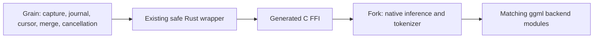

# transcribe.cpp fork and reproducible library migration

Status: researched plan and local candidate extraction, 2026-09-26. `native/transcribe.cpp/` now holds an independent Git checkout of the verified 0.2.3 source with the audited existing Grain patch. Grain's runtime dependency has not switched. Compatibility/parity gates precede that switch; an upstream upgrade is a separate milestone.

## Recommendation

Maintain a small source fork of [handy-computer/transcribe.cpp](https://github.com/handy-computer/transcribe.cpp), including its native library, generated Rust FFI, and existing safe Rust wrapper. Consume both Rust packages from the same full Git commit. Cargo already builds this library through CMake; a fork can be consumed in exactly the same way. Publishing to crates.io or distributing prebuilt native archives is optional, not a prerequisite.

Vendoring is a standard dependency-management practice. The current implementation already separates Grain's orchestration from native inference. A dedicated fork improves ownership, patch review, independent testing, and update history. Reliability comes from an explicit contract, immutable inputs, and behavioral/package checks, rather than from the repository location itself.

## Workspace layout requested by the maintainer

```text
grain/                         Grain Git repository
  native/transcribe.cpp/       independent source-fork Git repository
    .git/                      native history, commits, remotes
    Cargo.toml                 sys package + upstream Rust workspace
    bindings/rust/transcribe-cpp/
  docs/TRANSCRIBE-CPP-FORK-PLAN.md
```

Grain ignores `/native/transcribe.cpp/`, as it already does for other co-located repositories. This is an independent checkout, not a submodule or a directory whose files are committed into Grain. Native commits belong to that repository; Grain integration/lock/packaging commits belong to Grain. Agents can read both trees in one workspace and must read the instructions for the repository they modify.

Co-location is a development convenience. Production/CI still builds the full SHA recorded in Grain's Git dependency and lockfile, not whatever is present in this ignored folder. Native edits require their own commit, checks, remote push, and deliberate paired pin update. Local path overrides, if needed for development, must be temporary, explicit, and rejected by release checks.

A fresh Grain clone will not contain the ignored native checkout. Before cutover, add a small tracked bootstrap command that clones the canonical fork and checks out the pinned SHA. It must verify an existing checkout's repository/revision, preserve dirty work, and fail with actionable guidance rather than resetting or pulling automatically. It must not be an application startup/download path. Builds themselves continue to work without this checkout because Cargo fetches the pinned dependency.

The local candidate is committed at `f49dcda13a5a4c116ecaf31758aacea937480cea` on branch `codex/grain-0.2.3`, with remote `upstream` for the original project. Its production GitHub fork/`origin` remains to be established: GitHub CLI is not authenticated in this session. It is not yet a released dependency; runtime identity, expanded semantic tests, real-model/resource/backend/package parity, and bootstrap remain staged work.

## Consensus: is this worth the effort?

**Yes, for Grain's ongoing native Flow development, with a staged cutover.** There is already a real decoder policy patch and a sequence detokenization API to maintain. A source fork gives those changes native tests, original upstream history, and one reviewable release unit. The observed 0.2.4 helper/error changes demonstrate that this maintenance obligation exists already; vendoring does not avoid it. The benefit is concentrating and enforcing the obligation, while keeping Grain's call sites stable.

The cost is a second repository's CI/release work, paired source pins, bootstrap, and platform verification. Co-location reduces navigation cost but adds no correctness guarantee by itself. Keep this cost bounded: existing Cargo/CMake packaging, existing safe wrapper, one small patch series, shared test fixtures, and an immutable source release. Do not add a new service, wrapper hierarchy, binary download infrastructure, or independent ggml fork. No RAM/performance improvement is claimed simply from moving the code.

Proceed only if extraction proves parity and the repeatable upgrade gates work. Do not pay for all packaging options at once: Git source dependencies are sufficient initially. If the required APIs become upstream-equivalent, remove the patches or retire the fork after semantic verification. If maintaining fork releases becomes more work than the small patch's value, the documented pinned-vendor approach remains a valid fallback.

The current patch is more than a 100–200-line exposure shim: the added native decoder alone is 177 lines, with additional model dispatch, headers, detokenization, Rust adaptation, generated bindings, and tooling. Budget maintenance around a small patch series and semantic tests, not an assumed line count. A fork concentrates compatibility work but cannot remove upstream changes or integration regressions.

## Verified baseline and provenance

- Grain pins `transcribe-cpp = "=0.2.3"` in `src-tauri/Cargo.toml`; `[patch.crates-io]` selects the two vendor directories. The wrapper selects the matching sibling sys crate.
- Upstream `v0.2.3` resolves to `63a44d9239d610b3908e8a66b384924cd4a77217`. Both vendored `.cargo_vcs_info.json` files agree.
- The independently checked Handy snapshot `8f9cf53cd1410cda26beea39ff802ac306e39585` requests and locks both packages at 0.2.3. This is an observed immutable snapshot, not a permanent claim about `main`.
- Upstream released [v0.2.4](https://github.com/handy-computer/transcribe.cpp/releases/tag/v0.2.4) on 2026-09-25. Its tag resolves to `4807edaf210d0d7e8a6f7fb2a44b65966a2797f0`.
- Downloaded official 0.2.3 crate archives were hashed and compared to local vendor files in memory, normalizing CRLF only. Neither archive had missing local files. No app/model tests were rerun for this planning task.

| Official archive | Verified SHA-256 |
| --- | --- |
| `transcribe-cpp-0.2.3.crate` | `b405c121ef674311b9e8eba83e45d859663da681952c7b95b730792ffde358e7` |
| `transcribe-cpp-sys-0.2.3.crate` | `00e81030804f0ce2dd83761ba18e90e0c0c0c2794d68ca008e24245ed6d2702e` |
| `transcribe-cpp-sys-0.2.4.crate` | `1c6946c7bf90046fc51e5bc25373a4f6270ca10fdcf4f35b1174075e43c535b5` |

**Provenance defect corrected:** the two previously recorded 0.2.3 archive hashes in `vendor/TRANSCRIBE-CPP.md` differed from the official archives and crates.io records. This task corrects the record. The commit attribution is correct; the checksum mismatch alone does not establish a code defect.

The functional 0.2.3 divergence was independently verified in these paths:

| Layer | Paths relative to their vendored package |
| --- | --- |
| Safe wrapper | `src/error.rs`, `src/family.rs`, `src/lib.rs`, `src/model.rs` |
| Native public API | `include/transcribe.h`, `include/transcribe/parakeet.h` |
| Native implementation | `src/transcribe.cpp`, `src/arch/parakeet/decoder.cpp`, `decoder.h`, `model.cpp` |
| Generated ABI | `bindings/rust/sys/src/transcribe_sys.rs`, `include/transcribe.abihash` |
| Packaging/tooling | Cargo manifests/lock metadata, restored `bindings/rust/xtask`, FluidAudio license and notice |

Use this inventory as an allowed patch surface, accounting separately for generation and packaging. The native build scripts themselves match the pristine 0.2.3 sys crate. Reconstruct fork sources from upstream repository layout; do not commit normalized published-crate manifests over upstream manifests.

## Adjacent-release audit: what the fork must survive

Reviewed tag comparisons, relevant commit patches, and direct versions of the touched source files. GitHub's compare file list reached its 300-file cap for 0.2.4; important conclusions were checked against direct source files and complete published sys archives instead of treating that list as complete.

| Transition/change | Observed behavior or implementation change | Fork design/verification consequence |
| --- | --- | --- |
| 0.2.2 → 0.2.3: [Parakeet tail fix](https://github.com/handy-computer/transcribe.cpp/commit/63baefe62f2325e769069c0ac41e7238b45fcd53) | Buffered native streaming finalization incorporates retained right context and ragged tails; timestamps are clamped to real input duration. | Preserve upstream native streaming. Test it separately from Grain's stateless Flow windows, whose tail and timestamp policies are different. |
| 0.2.2 → 0.2.3: [scratch release](https://github.com/handy-computer/transcribe.cpp/commit/9aa6599f5fbbdfb6dfab4b409989c89769b71c5e) | Session scratch ownership/cleanup moved into common release logic; Parakeet clears references into released compute state. | Keep the custom run inside upstream cleanup paths. Test success, abort, and failure followed by another run; watch retained scratch/RAM after stop. |
| 0.2.2 → 0.2.3: [prebuilt linking](https://github.com/handy-computer/transcribe.cpp/commit/c6a32a76585e144a301a07d7eb66464523697d12) | `TRANSCRIBE_DIR` bypasses source compilation and uses an installed link manifest; Cargo backend features do not configure that prebuilt library. | Official Grain builds must reject unexpected overrides. Validate identity, ABI, and actual backend posture before allowing a deliberate prebuilt path. |
| 0.2.2 → 0.2.3: Windows build fixes | Removed output-directory change tracking that caused rebuild loops; corrected static Vulkan linkage to `vulkan-1`. | Carry upstream build scripts/install manifests intact; verify Windows source builds and static/shared link smoke tests. |
| 0.2.3 → 0.2.4: [Parakeet memory reduction](https://github.com/handy-computer/transcribe.cpp/commit/139869c291adca73e44dc237fb66305d90b2c367) | Encoder enables direct conv0; common conformer code changes attention-mask construction and scratch shape, including per-head flash-mask construction. | Keep encoder/conformer/ggml upstream-owned. Recheck token outputs, frame geometry, CPU/Vulkan/Metal support, and peak/retained memory even when public APIs are unchanged. |
| 0.2.3 → 0.2.4: [error propagation](https://github.com/handy-computer/transcribe.cpp/commit/96b7c9c17efb1e2ed97c607e735f1e69736240f8) | Predictor compute can return `nullptr`; `joint_step` changes from `void` to `bool`. Native callers propagate backend failure; allocation errors are classified more accurately. | The custom Fluid decoder must check these results when ported. Ignoring a newly returned `bool` can still compile: patch application and compilation alone are insufficient. Add fault-path tests and preserve error classification. |
| 0.2.3 → 0.2.4: [ggml updates](https://github.com/handy-computer/transcribe.cpp/commit/fdd50d8b1d571aab96c15d6d44ef1b98fb34a2a1) | ggml moves through 0.25.1 to 0.25.3; complete sys archive comparison finds 502 changed/added/removed paths, 443 under ggml. | Ship matching native core and backend modules from one build. Exercise actual selected devices and CPU fallback; benchmark rather than assuming lower RAM or identical numerics. |
| 0.2.3 → 0.2.4: decode-budget/default-policy changes | Other model families receive decode-budget fixes; SenseVoice default ITN and Canary punctuation/casing defaults change. | Ordinary Batch smoke coverage must include affected families. Do not overwrite their upstream behavior with a broad model.cpp replacement or impose PKFW's fixed token cap on ordinary decoding. |

In directly compared 0.2.3/0.2.4 sources, the safe wrapper's `model.rs`, `family.rs`, and `version.rs`, sys build script/generated binding, Parakeet public extension header, install CMake file, and semantic ABI digest are unchanged. `transcribe.cpp` is also unchanged. The main public header changes version/documentation. The requested detokenize/PKFW additions are still absent from those upstream files.

**Implication:** the external surface is comparatively stable across this observed release, while internal decoder dependencies and backend implementation change. Keep public calls stable, adapt internals narrowly, and make semantic/failure/resource checks the upgrade gate. Unreleased future versions cannot be guaranteed; every new release needs the same audit.

## Boundary and contract



Grain retains `tdt_flow.rs`, `rolling.rs`, `grain_audio_journal.rs`, `crates/grain-tdt`, catalog allowlists, replay, post-processing, and one serial model/session lease. The fork exposes native operations, with no Grain worker, queue, timeline, microphone capture, service, or persistent Flow handle.

Preserve the present split: v2 runs ordinary native inference on bounded, pause-aware windows; v3 uses `ParakeetTdtWindowOptions`/`PKFW`. Both render merged native token IDs using sequence-level `Model::detokenize`. The current constructor requires PKFW for both variants; changing that requirement is a separate behavioral change.

Keep existing safe Rust APIs rather than adding another wrapper layer in Grain. Freeze these semantics in tests:

- Detokenization uses a complete ID sequence, caller-owned two-pass buffer, UTF-8 byte counts, no implicit NUL, and explicit invalid-input/error handling. Byte-fallback Unicode must survive token boundaries.
- PKFW carries start/end decoder frames, absolute timestamp offset, and final-tail policy. Preserve half-open boundaries, integer widths, overflow validation, and current model/head/blank/duration-bin gates.
- Preserve FluidAudio predictor initialization, duration bins, symbol/token limits, repeated zero-duration handling, projection reuse, emission gate, and final-tail drain. Ordinary run/stream defaults remain upstream-owned.
- Use the existing typed, size-aware extension mechanism. Additive fields or a distinct extension kind/version handle future semantic changes; do not silently redefine existing PKFW behavior.

Add a minimal native fork-contract query checked by the safe wrapper before model use. It should expose a contract revision, patch identity, and runtime semantic ABI digest; compare to compiled expectations and validate relevant native struct sizes/alignments. Keep this allocation-free and synchronous. Identity must work from source archives without `.git`.

The existing version gate compares only upstream base version; `header_hash()` reports the bindings' compiled digest. Neither proves that the loaded 0.2.3 DLL contains our patch. `version_commit()` can return `unknown` from source archives. Keep the exact Git revision and artifact hashes in build/release provenance; do not attempt to embed a commit's own SHA into committed source.

Prefer new local helper files only when they avoid duplicating upstream decoder internals or expanding private interfaces. Do not split the function merely to reduce visible diff size. Keep the minimal opt-in dispatch hooks near their upstream call sites, with an inventory of private helper assumptions to recheck each upgrade.

## Implementation stages and gates

### 1. Freeze and correct the baseline

1. Correct `vendor/TRANSCRIBE-CPP.md` hashes and record verified patch inventory, source commit, ABI digest, FluidAudio reference commit, and backend feature matrix.
2. Capture old-vendor baseline with exact model hashes, audio fixtures, backend/device, thread count, token IDs/timestamps, final text, compute/stop latency, peak RAM/VRAM, and retained memory after stop. Use local approved fixtures; preserve private audio/transcripts locally.
3. Include short/long v2, multilingual/byte-fallback v3, overlap seams, fast speech, silence, and repeated-tail fixtures. Distinguish Batch disagreement from accuracy against ground truth.
4. Recheck the latest immutable Handy snapshot before implementation, using the upstream runbook when assessing Handy changes. Keep initial extraction based on Grain's verified 0.2.3 sources regardless of a newer dependency suggestion.

Gate: independently reproducible source provenance and behavior evidence; no upgrade hidden inside extraction.

### 2. Build the maintained fork

1. Fork upstream under the intended Grain maintainer account; start a working branch at verified `v0.2.3`. Preserve the repository's root sys package and `bindings/rust/transcribe-cpp` wrapper layout, package names, `links` names, features, and source-build machinery.
2. Port only verified differences to original source locations. Keep separate reviewable commits for detokenization, opt-in decoder/extension, generated bindings/xtask portability, notices/packaging, and contract/tests. Preserve MIT attribution and FluidAudio Apache-2.0 notice/license in shipped source packages.
3. Regenerate bindings and semantic digest with pinned generator inputs. Verify package contents; distinguish tests/tooling missing from published crates from native behavior changes.
4. Add decoder decision tests (scripted emissions/durations and bounds), Unicode/buffer tests, model-gate rejection, helper failure propagation, cancellation, cleanup, and ordinary run/stream tests.
5. Build a source archive without `.git`, a standalone downstream Cargo consumer, and each supported native linkage/backend configuration.

Gate: the current 0.2.3 patch is behaviorally preserved and can be consumed independently. Do not publish a fork tag with unvalidated parity.

### 3. Pin Grain to the fork atomically

Use `[patch.crates-io]` for both packages in `src-tauri/Cargo.toml`, preserving its exact-version and per-target feature declarations. Illustrative configuration; fill in the actual tested URL and full SHA:

```toml
[patch.crates-io]
transcribe-cpp = { git = "<fork URL>", rev = "<full tested commit SHA>" }
transcribe-cpp-sys = { git = "<same fork URL>", rev = "<same full SHA>" }
```

Keep upstream package versions at 0.2.3 for the first Git-based fork release; identify the fork separately by full source SHA, contract revision, and an immutable tag such as `grain-v0.2.3-1`. Grain resolves by SHA, not by moving branch/tag. This preserves current exact-version requirements. If publishing registry packages later, choose distinct names/versions and explicitly adapt version compatibility; published path dependencies otherwise normalize back to registry dependencies.

Update `scripts/flow-audit/Cargo.toml` from its vendor path to the versioned dependency plus identical paired Git patches. Regenerate both `src-tauri/Cargo.lock` and `scripts/flow-audit/Cargo.lock` deliberately. Root `Cargo.toml` excludes the app, and the audit has its own workspace: a patch at the Grain workspace root does not cover either. Patches are not transitive.

Add a CI dependency check over Cargo metadata/locks for both workspaces: exactly one wrapper/sys pair, same canonical Git URL and full resolved SHA, no unintended registry/path copy, expected features/versions. Build with locked dependencies and cache native output by source revision, target, toolchain, and relevant CMake/backend options.

Preserve `DEP_TRANSCRIBE_CPP_RUNTIME_DIR`/`MODULE_DIR` forwarding and `src-tauri/build.rs` staging. Preserve Windows x86_64/Linux shared dynamic-backend builds, macOS static Metal, and Windows ARM64 static CPU posture. Reject unexpected `TRANSCRIBE_DIR` in official source builds; record/restrict native build override flags. Test Nix's `cargoLock` Git fetching and offline build, rather than assuming `allowBuiltinFetchGit` is sufficient.

Gate: paired pinned source resolution, correct native outputs/features, and Grain/audit builds pass. Keep old vendor directories until parity/package verification completes.

### 4. Prove application and package parity; retire vendoring

Run the validation matrix below using the fork and old vendor baseline. Verify the actual installed application loads the bundled patched library and matching backend modules. Check exports/loader paths, runtime contract/digest, and CPU/backend discovery with sanitized environment; source resolution alone does not prove runtime DLL selection.

Inspect installer/DEB/RPM/AppImage contents as applicable; compare staged native file hashes to packaged/installed files. On static builds validate runtime contract and binary linkage through the real application. Wrong/missing contract must fail clearly; never silently substitute unpatched inference.

Only after these gates pass, remove the two vendor trees, move the remaining provenance contract to `docs/TRANSCRIBE-CPP-FORK.md`, and update references in the upstream runbook/divergence policy and Flow documentation. Do not modify Handy-owned runtime logic for this extraction. Publish an immutable fork release tag and keep Grain's tested SHA pin.

Gate: no behavior/resource regression, package provenance confirmed, and rollback tested by restoring the paired known-good manifests/locks. Keep old sources recoverable in Git and record the pre-migration commit.

### 5. Upgrade independently to 0.2.4 and later

1. Create an unpublished update branch from the new verified upstream tag. Reapply the small patch series; preserve published fork history/tags.
2. Generate a full diff and patch-overlap report, including private helpers, encoder/conformer, scheduler lifetime, errors, tokenizer, bindings, build scripts, and ggml/backend changes. Do not rely on release titles or a capped GitHub compare list.
3. For 0.2.4 specifically, update the custom decoder for predictor/joint failure handling. Verify all custom allocation/compute paths classify errors consistently with upstream. Retain new upstream encoder/memory improvements, then measure their actual effect.
4. Run semantic, application, backend, memory, and packaging gates. Review changes to ordinary model defaults separately. Regenerate bindings even if the upstream digest is unchanged when our combined API changed.
5. Record evidence and release a new immutable tag/commit; change Grain's paired pins/locks in a separate commit. Never auto-merge an upstream bump into a released dependency.

When upstream exposes equivalent APIs, remove fork patches only after parity tests prove detokenization, model gating, decoder/tail/timestamp semantics, errors, and resource behavior match. An upstream proposal can be prepared independently; submission is a separate explicitly authorized action.

## Validation matrix and execution commands

The local candidate passed a Windows MSVC static CPU library/CLI build, all 37 enabled native CTest cases, the wrapper's PKFW materialization unit test, wrapper all-targets Clippy with warnings denied, Rust/C++ formatting, and bindgen `--check` using `libclang==18.1.1`. Fifteen carried source/binding/notice files were compared to the vendor baseline; native sources were compared through the pinned canonical formatter. Rust checks linked the candidate's deliberately installed native prefix via `TRANSCRIBE_DIR`. These checks establish extraction/build consistency, not real-model accuracy, GPU/platform/package parity, or completion of the new runtime identity contract.

| Gate | Required evidence |
| --- | --- |
| Provenance/contract | Correct archive hashes, patch inventory, paired Cargo sources/features, regenerated ABI, runtime identity, no-.git source build |
| Native correctness | Scripted decoder decisions, Unicode/buffer edge cases, incompatible-model rejection, helper/encoder failure propagation, abort/reset/reuse, ordinary Batch/stream behavior |
| App parity | Same fixture/model/backend comparisons for v2 ordinary windows and v3 PKFW, seam/tail/timestamp checks, production journal append/replay |
| Resources | Bounded input/scratch, one inference lease, worker/session/journal release on all terminal paths; repeated sessions and long recordings; CPU/GPU peak and retained memory plus latency |
| Distribution | Windows x64/Vulkan and CPU fallback; Linux dynamic backends/package paths; macOS Metal static; Windows ARM64 static CPU; packaged runtime identity and actual backend availability |
| Integration | Grain/audit checks/tests, workspace tests, type/build checks, Nix offline build, applicable upstream boundary/policy checks |

Start with these commands after configuring the documented native toolchain. Prefix with RTK where installed; RTK was absent in the investigation shell. These are future implementation checks, not evidence of tests run in this task.

```text
cargo run --manifest-path <fork>/bindings/rust/xtask/Cargo.toml -- bindgen --check
cargo test --manifest-path <fork>/bindings/rust/transcribe-cpp/Cargo.toml --locked --no-default-features
cargo clippy --manifest-path <fork>/bindings/rust/transcribe-cpp/Cargo.toml --locked --all-targets --no-default-features -- -D warnings
cargo check --manifest-path src-tauri/Cargo.toml --locked --lib
cargo test --manifest-path src-tauri/Cargo.toml --locked --lib
cargo test --manifest-path scripts/flow-audit/Cargo.toml --locked
cargo clippy --manifest-path scripts/flow-audit/Cargo.toml --locked --all-targets -- -D warnings
cargo test -p grain-tdt --locked
bun run build
python Upstream/policy_check.py
python Upstream/ratchet.py
```

Run CMake/CTest and real-model backend tests from the fork's complete source, including matching static/shared configurations. Use the existing audit and opt-in production journal test instructions in `scripts/flow-audit/README.md`; retain v3 coverage as well as v2. Compare deterministic traces exactly on the same backend; do not demand bit-identical CPU/GPU numerics. Real-model/resource gates must fail or explicitly report missing fixtures/devices instead of treating skipped tests as validation.

For Windows builds, follow `BUILD.md` and `Upstream/UPSTREAM.md` toolchain/path guidance. Use a separate short target directory while Grain is running; do not kill the user's app. Record unsupported/unvalidated targets explicitly. Verify installed Grain manually through the real application; no browser harness or computer automation.

## Maintenance rules and completion criteria

- Maintain a versioned patch inventory with upstream base, fork release/SHA, ABI/contract revision, model/backend evidence, and known limits. Keep tests around decisions most likely to drift, not tests duplicating implementation.
- Every upgrade reviews private decoder helper contracts even when C/Rust public APIs and ABI digest are unchanged. Keep shared encoder/ggml/build logic upstream-owned.
- CI gates source pairing, bindgen, decoder semantics/failures, resource lifetime, and package identity. A small diff or conflict-free application is not a passing gate.
- Keep rollback as an atomic source/version/lock change, with the previous native package/artifacts available. No runtime dependency download is required for end users; installers include the compiled code and any shared backend libraries.
- Completion means a tested, independently consumable fork; paired immutable Grain/audit dependencies; no duplicated vendor source; preserved Flow/Batch behavior and resource bounds; validated supported packages; documented upgrade/rollback evidence.

This plan was checked against repository code, official crate payloads, upstream tag/commit sources, and a design review. Graph tools became available later in the session; their vendor/native coverage was insufficient for this provenance/version audit. Preserve the pre-existing `src-tauri/Cargo.toml` working-tree change when implementing.
